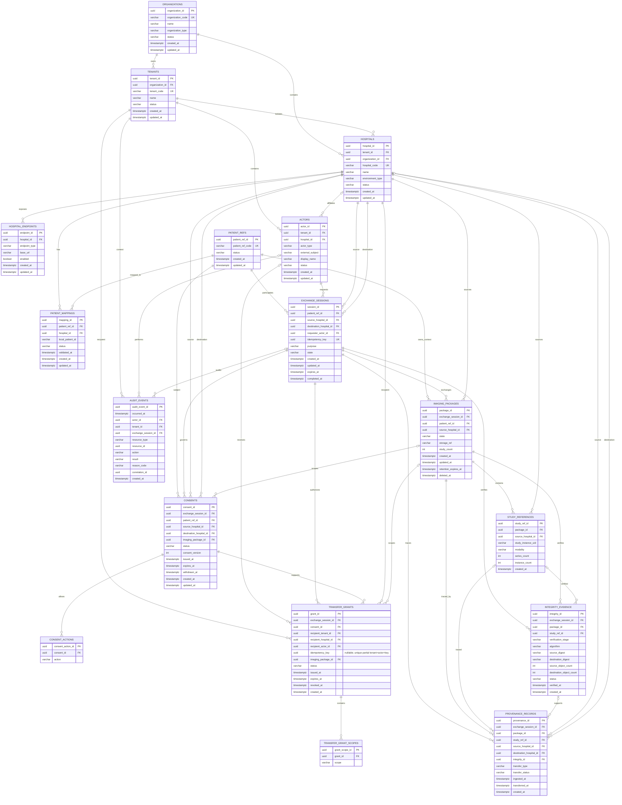
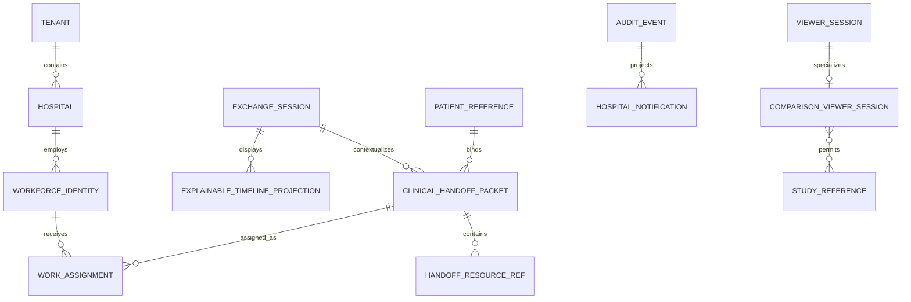
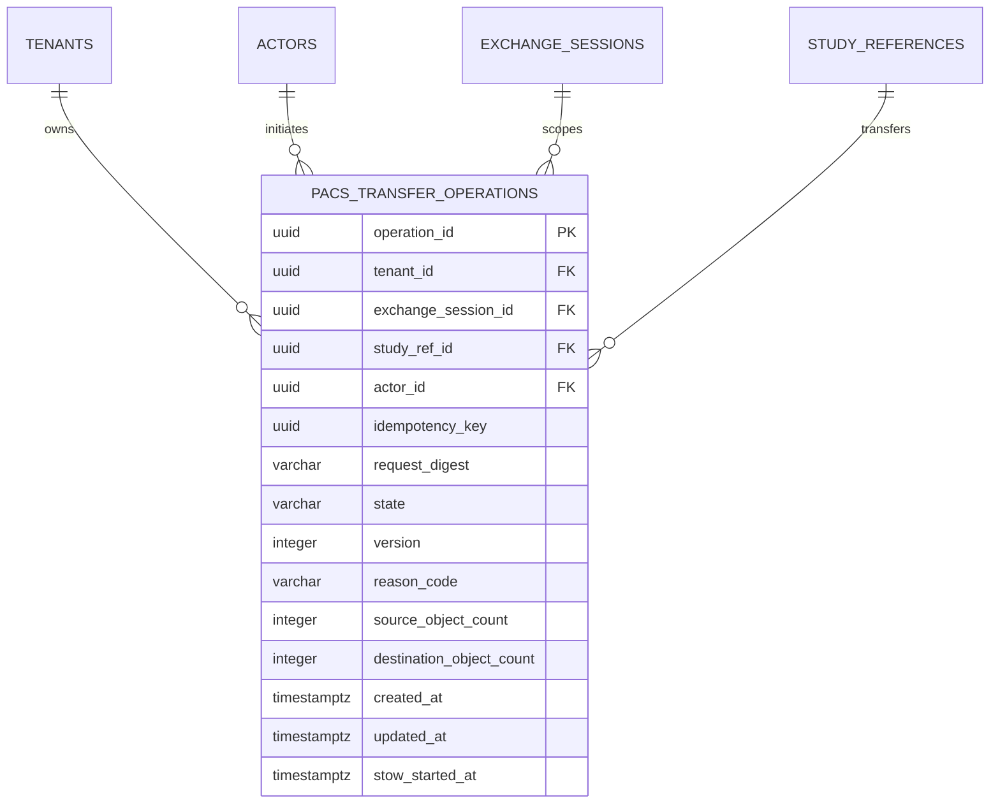
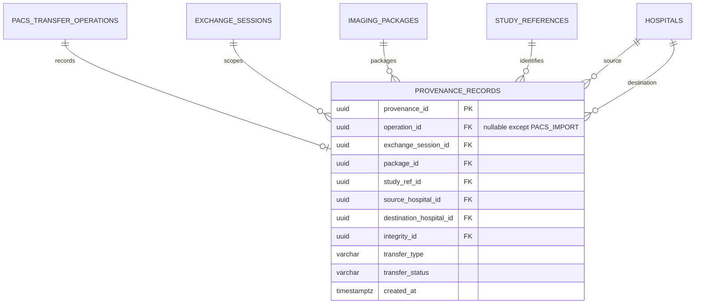

# MediQ Entity Relationship Diagram

**Project:** MediQ
**Product:** Patient-Controlled Medical Imaging Mobility SaaS
**Document:** `ERD.md`
**Version:** v1.4 Durable PACS Transfer Operation Amendment
**Current Phase:** Capstone Technical MVP
**Primary Scope:** CAPSTONE-P0
**Target RDBMS:** PostgreSQL
**Status:** Approved Baseline

---

# 1. Purpose

본 문서는 `DATA-MODEL.md`에서 확정한 MediQ P0 Data Model을 **Entity Relationship Diagram으로 고정**한다.

본 문서에서는:

```text
18개 Table
PK
FK
Cardinality
Nullable Relationship
Ownership
Evidence Relationship
```

을 명확히 표현한다.

새로운 Entity 또는 Product Domain을 추가하지 않는다.

---

# 2. Normative Inputs

```text
PROJECT-CHARTER.md
        ↓
CAPSTONE-MVP-BOUNDARY.md
        ↓
PRODUCT-BASELINE.md
        ↓
REQUIREMENTS.md
        ↓
SECURITY-REQUIREMENTS.md
        ↓
DOMAIN-MODEL.md
        ↓
SYSTEM-ARCHITECTURE.md
        ↓
DATA-FLOW.md
        ↓
DATA-MODEL.md
        ↓
ERD.md
```

`DATA-MODEL.md`가 Column·Constraint의 기준이며 본 문서는 그 관계를 시각적으로 표현한다.

---

# 3. Fixed P0 Entity List

ERD에 포함되는 Table은 정확히 다음 17개다.

```text
01 organizations
02 tenants
03 hospitals
04 hospital_endpoints
05 actors

06 patient_refs
07 patient_mappings

08 exchange_sessions

09 consents
10 consent_actions

11 transfer_grants
12 transfer_grant_scopes

13 imaging_packages
14 study_references

15 integrity_evidence
16 provenance_records
17 audit_events
```

다음 Entity는 현재 추가하지 않는다.

```text
devices
secure_medical_capsules
wrapped_keys
hospital_connectors
identity_providers
billing
FHIR resources
AI inference
```

이들은 P1 또는 Productionization 대상이다.

---

# 4. High-Level ERD

```text
ORGANIZATION / TENANT
        │
        ▼
     HOSPITAL
        │
        ├─────────────┐
        │             │
        ▼             ▼
PatientMapping   HospitalEndpoint
        │
        ▼
 PatientReference
        │
        ▼
 ExchangeSession
    /       |        \
   /        |         \
  ▼         ▼          ▼
Consent    Grant    ImagingPackage
  │          │           │
  ▼          ▼           ▼
Actions    Scopes    StudyReference
                         │
                         ▼
                  IntegrityEvidence
                         │
                         ▼
                  ProvenanceRecord

ExchangeSession
      │
      └──────────────► AuditEvent
```

---

# 5. Full Mermaid ERD



---

# 6. Cardinality Legend

```text
||  = exactly one

o|  = zero or one

|{  = one or more

o{  = zero or more
```

예:

```text
PATIENT_REFS ||--o{ PATIENT_MAPPINGS
```

의 의미:

> 하나의 `PatientReference`는 0개 이상의 `PatientMapping`을 가질 수 있고, 각 `PatientMapping`은 반드시 하나의 `PatientReference`를 가진다.

---

# 7. Organization / Tenant Relationships

## REL-001

```text
organizations
1
│
└──── N
     tenants
```

FK:

```text
tenants.organization_id
→ organizations.organization_id
```

---

## REL-002

```text
organizations
1
│
└──── N
     hospitals
```

FK:

```text
hospitals.organization_id
→ organizations.organization_id
```

이 단일 FK는 Organization 존재를 확인한다. Hospital과 Tenant의 소유 Organization 일치는 REL-003의 복합 FK로 강제한다.

---

## REL-003

```text
tenants
1
│
└──── N
     hospitals
```

FK:

```text
hospitals.tenant_id
→ tenants.tenant_id
```

Tenant는 Hospital의 SaaS Isolation Boundary다.

Hospital이 별도의 Tenant 소속 Organization을 가리키지 못하도록 다음 owner-pair key를 적용한다.

```text
UNIQUE tenants(tenant_id, organization_id)
FK hospitals(tenant_id, organization_id)
  → tenants(tenant_id, organization_id)
ON DELETE RESTRICT
```

---

# 8. Hospital Relationships

## REL-004 — Endpoint

```text
Hospital
1
│
└──── N
HospitalEndpoint
```

FK:

```text
hospital_endpoints.hospital_id
→ hospitals.hospital_id
```

Unique:

```text
(hospital_id, endpoint_type)
```

---

## REL-005 — Actor

```text
Tenant
1
│
└──── N
Actor
```

FK:

```text
actors.tenant_id
→ tenants.tenant_id
```

Actor의 `hospital_id`는 Nullable이다.

따라서 Service 또는 Tenant-level Actor는 특정 Hospital에 속하지 않을 수 있다.

`hospital_id`가 지정된 Actor는 같은 Tenant의 Hospital만 참조할 수 있다.

```text
UNIQUE hospitals(tenant_id, hospital_id)
FK actors(tenant_id, hospital_id)
  → hospitals(tenant_id, hospital_id)
ON DELETE RESTRICT
```

PostgreSQL의 기본 `MATCH SIMPLE` 동작에서 `hospital_id`가 NULL이면 복합 FK 검사는 생략되므로 Tenant-level Actor를 유지한다. 이 구조 제약은 Runtime Authorization 또는 Tenant RLS를 대체하지 않는다.

---

# 9. Patient Identity Relationships

## REL-006

```text
PatientReference
1
│
└──── N
PatientMapping
```

FK:

```text
patient_mappings.patient_ref_id
→ patient_refs.patient_ref_id
```

---

## REL-007

```text
Hospital
1
│
└──── N
PatientMapping
```

FK:

```text
patient_mappings.hospital_id
→ hospitals.hospital_id
```

---

# 10. Patient Mapping Logical Model

```text
                  patient_refs

                 MQ-TEST-0001
                       │
          ┌────────────┴────────────┐
          │                         │
          ▼                         ▼

 patient_mappings            patient_mappings

 Hospital A                  Hospital B
 TEST-A-001                  TEST-B-982
```

따라서 다음 구조는 허용하지 않는다.

```text
Hospital Local Patient ID
=
patient_refs PK
```

---

# 11. Exchange Session Relationships

`exchange_sessions`는 P0 Business Workflow의 중심이다.

```text
                PatientReference
                       │
                       ▼
                ExchangeSession
                /      |       \
               /       |        \
              ▼        ▼         ▼
          Consent    Grant   ImagingPackage
```

---

# 12. Exchange Session Parent Relationships

`exchange_sessions`는 반드시 다음을 참조한다.

```text
patient_ref_id
→ patient_refs
```

```text
source_hospital_id
→ hospitals
```

```text
destination_hospital_id
→ hospitals
```

```text
requester_actor_id
→ actors
```

Cardinality:

```text
PatientReference
1 ───── N ExchangeSession
```

```text
Hospital
1 ───── N Source ExchangeSession
```

```text
Hospital
1 ───── N Destination ExchangeSession
```

```text
Actor
1 ───── N Requested ExchangeSession
```

---

# 13. Source / Destination Role

동일 `hospitals` Table을 두 FK Role로 사용한다.

```text
exchange_sessions.source_hospital_id
        │
        └──► hospitals.hospital_id
```

```text
exchange_sessions.destination_hospital_id
        │
        └──► hospitals.hospital_id
```

P0 Constraint:

```text
source_hospital_id
!=
destination_hospital_id
```

---

# 14. Consent Relationships

```text
ExchangeSession
1
│
└──── N
Consent
```

FK:

```text
consents.exchange_session_id
→ exchange_sessions.session_id
```

Consent는 추가로 다음 Context를 참조한다.

```text
patient_ref_id
source_hospital_id
destination_hospital_id
imaging_package_id (nullable)
```

---

# 15. Consent Actions

```text
Consent
1
│
└──── N
ConsentAction
```

FK:

```text
consent_actions.consent_id
→ consents.consent_id
```

예:

```text
Consent C-001
 ├─ VIEW
 └─ PACS_IMPORT
```

Unique:

```text
(consent_id, action)
```

---

# 16. Consent Version Relationship

동일 Exchange Session에는 여러 버전의 Consent History가 존재할 수 있다.

```text
ExchangeSession
   │
   ├─ Consent v1
   │     WITHDRAWN
   │
   └─ Consent v2
         ACTIVE
```

Unique:

```text
(exchange_session_id, consent_version)
```

권장 Partial Unique:

```text
UNIQUE(exchange_session_id)
WHERE status = 'ACTIVE'
```

즉 하나의 Session에는 동시에 하나의 Active Consent만 허용한다.

---

# 17. Transfer Grant Relationships

```text
ExchangeSession
1
│
└──── N
TransferGrant
```

또한:

```text
Consent
1
│
└──── N
TransferGrant
```

FK:

```text
transfer_grants.exchange_session_id
→ exchange_sessions.session_id
```

```text
transfer_grants.consent_id
→ consents.consent_id
```

GRT-003 issue API는 `recipient_actor_id`, `imaging_package_id`, `idempotency_key`를 구체적으로 설정한다. 기존 내부 Grant 행의 actor/package는 레거시 nullable 정책을 유지하고, 키도 NULL일 수 있다. 멱등성 Unique는 키가 존재하는 행에만 적용된다.

---

# 18. Grant Recipient Relationships

Grant는 다음 Recipient Context를 참조한다.

```text
recipient_tenant_id
→ tenants
```

```text
recipient_hospital_id
→ hospitals
```

Optional:

```text
recipient_actor_id
→ actors
```

따라서 Grant는 특정 User가 아닌 Hospital/Tenant 단위로도 발급 가능한 구조를 유지한다.

---

# 19. Grant Scope Relationship

```text
TransferGrant
1
│
└──── N
TransferGrantScope
```

FK:

```text
transfer_grant_scopes.grant_id
→ transfer_grants.grant_id
```

예:

```text
Grant G-001
 ├─ study:view
 └─ study:pacs-transfer
```

Unique:

```text
(grant_id, scope)
```

---

# 20. Consent vs Grant Relationship

구조:

```text
ExchangeSession
      │
      ▼
Consent
      │
      ▼
TransferGrant
      │
      ▼
GrantScopes
```

핵심 Application Invariant:

```text
Grant Scope
⊆
Consent Allowed Actions
```

예:

```text
Consent
VIEW

Grant
VIEW + DOWNLOAD

→ INVALID
```

---

# 21. Imaging Package Relationship

```text
ExchangeSession
1
│
└──── N
ImagingPackage
```

FK:

```text
imaging_packages.exchange_session_id
→ exchange_sessions.session_id
```

또한:

```text
imaging_packages.patient_ref_id
→ patient_refs.patient_ref_id
```

```text
imaging_packages.source_hospital_id
→ hospitals.hospital_id
```

---

# 22. ImagingPackage Invariant

반드시 다음이 성립해야 한다.

```text
imaging_packages.patient_ref_id
=
exchange_sessions.patient_ref_id
```

그리고:

```text
imaging_packages.source_hospital_id
=
exchange_sessions.source_hospital_id
```

이 규칙은 Application Layer에서 강제한다.

---

# 23. Study Reference Relationship

```text
ImagingPackage
1
│
└──── N
StudyReference
```

FK:

```text
study_references.package_id
→ imaging_packages.package_id
```

Study는 Source Hospital도 참조한다.

```text
study_references.source_hospital_id
→ hospitals.hospital_id
```

Unique:

```text
(package_id, study_instance_uid)
```

---

# 24. DICOM Identity Boundary

```text
StudyInstanceUID
```

는 Resource Reference다.

다음은 성립하지 않는다.

```text
StudyInstanceUID
=
Authorization Credential
```

UID를 알고 있다는 것만으로 의료영상 접근권한을 얻을 수 없다.

---

# 25. Integrity Evidence Relationship

```text
ExchangeSession
1
│
└──── N
IntegrityEvidence
```

```text
ImagingPackage
1
│
└──── N
IntegrityEvidence
```

Optional:

```text
StudyReference
0..1
│
└──── N
IntegrityEvidence
```

FK:

```text
integrity_evidence.exchange_session_id
→ exchange_sessions.session_id
```

```text
integrity_evidence.package_id
→ imaging_packages.package_id
```

```text
integrity_evidence.study_ref_id
→ study_references.study_ref_id
```

```text
integrity_evidence.operation_id
→ pacs_transfer_operations.operation_id
```

The nullable operation FK is `ON DELETE RESTRICT`. A partial unique index on `(operation_id, verification_stage)` allows at most one evidence row per operation stage. For `SOURCE_CAPTURE`, database checks enforce operation/Study binding, fixed algorithm/digest shape, positive source count, `PENDING` status, and no destination or verification result.

---

# 26. Integrity Example

```text
ImagingPackage
      │
      ├─ Source Evidence
      │
      └─ Destination Evidence
               │
               ▼
            Compare
               │
         ┌─────┴─────┐
         ▼           ▼
     VERIFIED      FAILED
```

P0 Invariant:

```text
FAILED
→ Transfer cannot be COMPLETED
```

---

# 27. Provenance Relationship

`provenance_records`는 데이터 이동 증적이다.

```text
ExchangeSession
      │
      ▼
ImagingPackage
      │
      ▼
StudyReference
      │
      ▼
ProvenanceRecord
```

주요 FK:

```text
exchange_session_id
package_id
study_ref_id
source_hospital_id
destination_hospital_id
integrity_id
```

---

# 28. Provenance Flow

```text
Hospital A
   │
   ▼
Study
   │
   ▼
ImagingPackage
   │
   ▼
ExchangeSession
   │
   ▼
Hospital B
```

위 경로를:

```text
provenance_records
```

가 증명한다.

---

# 29. Provenance Source / Destination

Source:

```text
provenance_records.source_hospital_id
→ hospitals.hospital_id
```

Destination:

```text
provenance_records.destination_hospital_id
→ hospitals.hospital_id
```

Destination은 일부 `VIEW` 또는 `DOWNLOAD` Flow에서는 nullable일 수 있다.

PACS_IMPORT에서는 Destination Hospital이 필수다.

---

# 30. Provenance / Integrity Relationship

Optional FK:

```text
provenance_records.integrity_id
→ integrity_evidence.integrity_id
```

따라서:

```text
Provenance
→ Integrity Evidence
```

를 추적할 수 있다.

PACS Import 완료 시 가능한 경우 Integrity Evidence를 연결한다.

---

# 31. Audit Relationship

Audit는 특정 Aggregate의 단순 Child가 아니라 시스템 전반의 Evidence다.

주요 FK:

```text
audit_events.actor_id
→ actors.actor_id
```

```text
audit_events.tenant_id
→ tenants.tenant_id
```

```text
audit_events.exchange_session_id
→ exchange_sessions.session_id
```

각 FK는 Event 종류에 따라 Nullable일 수 있다.

---

# 32. Audit Resource Reference

Audit는 다양한 Resource를 기록하기 위해 다음 Generic Reference를 사용한다.

```text
resource_type

resource_id
```

예:

```text
resource_type = EXCHANGE_SESSION

resource_id = <session UUID>
```

또는:

```text
resource_type = TRANSFER_GRANT

resource_id = <grant UUID>
```

P0에서는 별도 `audit_resources` Table을 추가하지 않는다.

---

# 33. Audit vs Provenance

```text
AUDIT
=
WHO / WHEN / WHAT / RESULT
```

예:

```text
Actor B
15:00
PACS_TRANSFER
ALLOW
```

반면:

```text
PROVENANCE
=
DATA FROM / THROUGH / TO
```

예:

```text
Hospital A
→ MediQ
→ Hospital B
```

두 Table은 통합하지 않는다.

---

# 34. Complete FK Mapping

| Child Table           | FK                      | Parent Table       | Parent Key      |
| --------------------- | ----------------------- | ------------------ | --------------- |
| tenants               | organization_id         | organizations      | organization_id |
| hospitals             | tenant_id               | tenants            | tenant_id       |
| hospitals             | organization_id         | organizations      | organization_id |
| hospital_endpoints    | hospital_id             | hospitals          | hospital_id     |
| actors                | tenant_id               | tenants            | tenant_id       |
| actors                | hospital_id             | hospitals          | hospital_id     |
| patient_mappings      | patient_ref_id          | patient_refs       | patient_ref_id  |
| patient_mappings      | hospital_id             | hospitals          | hospital_id     |
| exchange_sessions     | patient_ref_id          | patient_refs       | patient_ref_id  |
| exchange_sessions     | source_hospital_id      | hospitals          | hospital_id     |
| exchange_sessions     | destination_hospital_id | hospitals          | hospital_id     |
| exchange_sessions     | requester_actor_id      | actors             | actor_id        |
| consents              | exchange_session_id     | exchange_sessions  | session_id      |
| consents              | patient_ref_id          | patient_refs       | patient_ref_id  |
| consents              | source_hospital_id      | hospitals          | hospital_id     |
| consents              | destination_hospital_id | hospitals          | hospital_id     |
| consents              | imaging_package_id      | imaging_packages   | package_id      |
| consent_actions       | consent_id              | consents           | consent_id      |
| transfer_grants       | exchange_session_id     | exchange_sessions  | session_id      |
| transfer_grants       | consent_id              | consents           | consent_id      |
| transfer_grants       | recipient_tenant_id     | tenants            | tenant_id       |
| transfer_grants       | recipient_hospital_id   | hospitals          | hospital_id     |
| transfer_grants       | recipient_actor_id      | actors             | actor_id        |
| transfer_grants       | imaging_package_id      | imaging_packages   | package_id      |
| transfer_grant_scopes | grant_id                | transfer_grants    | grant_id        |
| imaging_packages      | exchange_session_id     | exchange_sessions  | session_id      |
| imaging_packages      | patient_ref_id          | patient_refs       | patient_ref_id  |
| imaging_packages      | source_hospital_id      | hospitals          | hospital_id     |
| study_references      | package_id              | imaging_packages   | package_id      |
| study_references      | source_hospital_id      | hospitals          | hospital_id     |
| integrity_evidence    | exchange_session_id     | exchange_sessions  | session_id      |
| integrity_evidence    | package_id              | imaging_packages   | package_id      |
| integrity_evidence    | study_ref_id            | study_references   | study_ref_id    |
| provenance_records    | exchange_session_id     | exchange_sessions  | session_id      |
| provenance_records    | package_id              | imaging_packages   | package_id      |
| provenance_records    | study_ref_id            | study_references   | study_ref_id    |
| provenance_records    | source_hospital_id      | hospitals          | hospital_id     |
| provenance_records    | destination_hospital_id | hospitals          | hospital_id     |
| provenance_records    | integrity_id            | integrity_evidence | integrity_id    |
| audit_events          | actor_id                | actors             | actor_id        |
| audit_events          | tenant_id               | tenants            | tenant_id       |
| audit_events          | exchange_session_id     | exchange_sessions  | session_id      |

---

# 35. Nullable FK Matrix

다음 FK는 Nullable을 허용한다.

| Table              | FK                      | Nullable | Reason                      |
| ------------------ | ----------------------- | -------: | --------------------------- |
| actors             | hospital_id             |      YES | Tenant/Service Actor 가능     |
| consents           | imaging_package_id      |      YES | Package 확정 전 동의 가능          |
| transfer_grants    | recipient_actor_id      |      YES | Hospital/Tenant 단위 Grant 가능 |
| transfer_grants    | imaging_package_id      |      YES | Resource binding timing 허용  |
| integrity_evidence | study_ref_id            |      YES | Package-level 검증 가능         |
| provenance_records | study_ref_id            |      YES | Package-level Provenance 가능 |
| provenance_records | destination_hospital_id |      YES | VIEW/DOWNLOAD의 경우           |
| provenance_records | integrity_id            |      YES | Integrity 적용 전/비적용 Flow     |
| audit_events       | actor_id                |      YES | System-generated Event 가능   |
| audit_events       | tenant_id               |      YES | System Event 가능             |
| audit_events       | exchange_session_id     |      YES | Session 생성 이전 Event 가능      |

나머지 핵심 FK는 `NOT NULL`을 기본으로 한다.

---

# 36. Critical Unique Constraints

```text
organizations
organization_code
UNIQUE
```

```text
tenants
tenant_code
UNIQUE
```

```text
hospitals
hospital_code
UNIQUE
```

```text
hospital_endpoints
(hospital_id, endpoint_type)
UNIQUE
```

```text
actors
(tenant_id, external_subject)
UNIQUE
```

```text
patient_refs
patient_ref_code
UNIQUE
```

```text
patient_mappings
(hospital_id, local_patient_id)
UNIQUE
```

```text
patient_mappings
(patient_ref_id, hospital_id)
UNIQUE
```

```text
consents
(exchange_session_id, consent_version)
UNIQUE
```

```text
consent_actions
(consent_id, action)
UNIQUE
```

```text
transfer_grant_scopes
(grant_id, scope)
UNIQUE
```

```text
study_references
(package_id, study_instance_uid)
UNIQUE
```

---

# 37. Key Domain Consistency Rules

ERD 관계만으로 완전히 표현할 수 없는 Business Invariant는 다음과 같다.

## ERD-INV-001

```text
Session.patient_ref
=
Package.patient_ref
```

## ERD-INV-002

```text
Session.source_hospital
=
Package.source_hospital
```

## ERD-INV-003

```text
Grant.session
=
Consent.session
```

## ERD-INV-004

```text
Grant.scope
⊆
Consent.allowed_actions
```

## ERD-INV-005

```text
Session.destination_hospital
=
Consent.destination_hospital
=
Grant.recipient_hospital
```

PACS Import에서는:

```text
=
Actual STOW-RS Target
```

까지 일치해야 한다.

---

# 38. Patient Mapping Invariant

PACS Import 이전:

```text
PatientReference
      ↓
PatientMapping
      ↓
Destination Hospital
```

Mapping Status:

```text
VALID
```

이어야 한다.

```text
UNVERIFIED
AMBIGUOUS
REVOKED
```

이면:

```text
PACS_IMPORT DENY
```

한다.

---

# 39. Consent / Grant ERD Invariant

```text
ExchangeSession
      │
      ▼
Consent ACTIVE
      │
      ▼
TransferGrant ACTIVE
      │
      ▼
Grant Scope
```

다음은 허용하지 않는다.

```text
No Consent
→ Active Grant
```

또는:

```text
Consent WITHDRAWN
→ New Grant
```

---

# 40. Access Scope Mapping

```text
consent_actions.action = VIEW
              ↓
transfer_grant_scopes.scope = study:view
```

```text
DOWNLOAD
↓
study:download
```

```text
PACS_IMPORT
↓
study:pacs-transfer
```

P1:

```text
MOBILE_EXPORT
↓
study:mobile-export
```

---

# 41. Viewer Data Path

Viewer에 필요한 주요 ER 관계:

```text
Actor
  ↓
Tenant
  ↓
ExchangeSession
  ↓
Consent
  ↓
TransferGrant
  ↓
GrantScope = study:view
  ↓
ImagingPackage
  ↓
StudyReference
```

모든 조건이 유효한 경우 Imaging Plane 접근을 허용한다.

---

# 42. Download Data Path

```text
Actor
  ↓
ExchangeSession
  ↓
Consent
  ↓
TransferGrant
  ↓
study:download
  ↓
ImagingPackage
  ↓
StudyReference
```

```text
study:view
```

만 존재하는 경우 Download할 수 없다.

---

# 43. PACS Import Data Path

가장 엄격한 관계:

```text
Actor
   ↓
ExchangeSession
   ↓
Consent
   ↓
TransferGrant
   ↓
study:pacs-transfer
   ↓
Destination Hospital
   ↓
PatientMapping = VALID
   ↓
ImagingPackage
   ↓
StudyReference
   ↓
IntegrityEvidence
   ↓
ProvenanceRecord
   ↓
AuditEvent
```

---

# 44. PACS Import Relationship Validation

전송 시 다음 관계를 검증한다.

```text
ExchangeSession.patient_ref_id
=
PatientMapping.patient_ref_id
```

```text
ExchangeSession.destination_hospital_id
=
PatientMapping.hospital_id
```

```text
ExchangeSession.destination_hospital_id
=
TransferGrant.recipient_hospital_id
```

```text
ExchangeSession.destination_hospital_id
=
Consent.destination_hospital_id
```

---

# 45. Integrity / Provenance Completion Rule

PACS Import 성공:

```text
STOW-RS SUCCESS
+
Destination Study Exists
+
Integrity VERIFIED
+
Provenance COMPLETED
```

이어야 한다.

다음은 금지한다.

```text
Integrity FAILED
+
Provenance COMPLETED
```

---

# 46. Audit Evidence Relationship

주요 Aggregate:

```text
ExchangeSession
Consent
TransferGrant
ImagingPackage
Transfer
```

의 변경·접근 결과는 `audit_events`로 추적한다.

Audit는 Generic `resource_type/resource_id`를 사용할 수 있으므로 각 Resource마다 별도 Audit FK Table을 만들지 않는다.

---

# 47. Delete Relationship Policy

기본 FK Delete:

```text
ON DELETE RESTRICT
```

를 사용한다.

특히:

```text
exchange_sessions
consents
transfer_grants
integrity_evidence
provenance_records
audit_events
```

관계는 Hard Delete보다 Evidence 보존을 우선한다.

---

# 48. No Evidence Cascade Rule

다음 구조를 허용하지 않는다.

```text
Delete ExchangeSession
        ↓
CASCADE
        ↓
Audit Deleted
Provenance Deleted
Integrity Deleted
```

Security / Traceability Evidence의 자동 Cascade Delete를 기본적으로 금지한다.

---

# 49. Soft Lifecycle Model

Hard Delete 대신:

```text
status
revoked_at
withdrawn_at
deleted_at
completed_at
```

등을 사용한다.

예:

```text
Consent
ACTIVE
→ WITHDRAWN
```

```text
Grant
ACTIVE
→ REVOKED
```

```text
ImagingPackage
RETENTION_PENDING
→ DELETED
```

---

# 50. Evidence Layer

ERD를 업무 Data와 Evidence Data로 나누면:

```text
BUSINESS / CONTROL
──────────────────
organizations
tenants
hospitals
actors
patient_refs
patient_mappings
exchange_sessions
consents
consent_actions
transfer_grants
transfer_grant_scopes
imaging_packages
study_references
```

Evidence:

```text
SECURITY / TRACEABILITY
───────────────────────
integrity_evidence
provenance_records
audit_events
```

`hospital_endpoints`는 Infrastructure/Integration Metadata에 해당한다.

---

# 51. Table Layer View

```text
┌──────────────────────────────────────┐
│ ORGANIZATION / TENANT                │
│                                      │
│ organizations                        │
│ tenants                              │
│ hospitals                            │
│ hospital_endpoints                   │
│ actors                               │
└──────────────────────────────────────┘
                  │
                  ▼
┌──────────────────────────────────────┐
│ PATIENT IDENTITY                     │
│                                      │
│ patient_refs                         │
│ patient_mappings                     │
└──────────────────────────────────────┘
                  │
                  ▼
┌──────────────────────────────────────┐
│ EXCHANGE CONTROL                     │
│                                      │
│ exchange_sessions                    │
│ consents                             │
│ consent_actions                      │
│ transfer_grants                      │
│ transfer_grant_scopes                │
└──────────────────────────────────────┘
                  │
                  ▼
┌──────────────────────────────────────┐
│ IMAGING METADATA                     │
│                                      │
│ imaging_packages                     │
│ study_references                     │
└──────────────────────────────────────┘
                  │
                  ▼
┌──────────────────────────────────────┐
│ EVIDENCE                             │
│                                      │
│ integrity_evidence                   │
│ provenance_records                   │
│ audit_events                         │
└──────────────────────────────────────┘
```

---

# 52. ERD Boundary — DICOM Binary

ERD에는:

```text
DICOM_FILE
DICOM_BINARY
IMAGE_BLOB
```

Table을 추가하지 않는다.

실제 의료영상 Payload는:

```text
Hospital A Orthanc

or

Temporary Imaging Storage
```

에 위치한다.

관계형 DB에는:

```text
ImagingPackage
StudyReference
storage_ref
```

등 Reference만 저장한다.

---

# 53. ERD Boundary — Authentication Secrets

다음 Table도 현재 만들지 않는다.

```text
passwords
private_keys
access_tokens
DEKs
KEKs
```

Authentication 및 Secret Material은 별도 Security Mechanism으로 처리한다.

---

# 54. P1 Boundary

P1에서는 향후 다음 Table을 추가할 수 있다.

```text
devices

secure_medical_capsules

wrapped_keys

mobile_exports
```

하지만 현재 P0 ERD에는 포함하지 않는다.

---

# 55. Productionization Boundary

Productionization에서 후보:

```text
identity_providers

hospital_connectors

retention_policies

legal_consent_evidence

key_references
```

역시 현재 ERD에는 포함하지 않는다.

---

# 56. ERD Implementation Rules

DDL 작성 시 다음을 준수한다.

```text
PK:
UUID
```

```text
FK:
Explicit Constraint
```

```text
Delete:
RESTRICT by default
```

```text
Status:
VARCHAR + CHECK
```

```text
Timestamp:
TIMESTAMPTZ
```

```text
DICOM Binary:
Do not store as relational BLOB
```

---

# 57. ERD Validation Checklist

```text
Exactly 17 P0 tables?
YES

New Entity introduced?
NO

All PKs defined?
YES

All functional FKs represented?
YES

PatientReference separated from local ID?
YES

ExchangeSession is workflow root?
YES

Consent separated from Grant?
YES

Grant Scope normalized?
YES

Imaging metadata separated from binary?
YES

Integrity represented?
YES

Provenance represented?
YES

Audit represented?
YES

Source/Destination Hospital separated by role?
YES

Nullable relationships identified?
YES

Evidence cascade deletion prevented?
YES
```

---

# 58. ERD Gate

```text
GATE-ERD-01
Organization / Tenant
PASS

GATE-ERD-02
Hospital / Endpoint
PASS

GATE-ERD-03
Actor
PASS

GATE-ERD-04
Patient Reference
PASS

GATE-ERD-05
Patient Mapping
PASS

GATE-ERD-06
Exchange Session
PASS

GATE-ERD-07
Consent
PASS

GATE-ERD-08
Consent Action
PASS

GATE-ERD-09
Transfer Grant
PASS

GATE-ERD-10
Grant Scope
PASS

GATE-ERD-11
Imaging Package
PASS

GATE-ERD-12
Study Reference
PASS

GATE-ERD-13
Integrity Evidence
PASS

GATE-ERD-14
Provenance
PASS

GATE-ERD-15
Audit
PASS

GATE-ERD-16
Cardinality
PASS

GATE-ERD-17
FK Mapping
PASS
```

---

# 59. ERD Baseline Decision

```text
PROJECT:
MediQ

ERD VERSION:
v1.1 Viewer Architecture Amendment

P0 TABLE COUNT:
17

NEW TABLES INTRODUCED:
0

CORE WORKFLOW ROOT:
exchange_sessions

PATIENT IDENTITY:
patient_refs
+
patient_mappings

CONSENT:
consents
+
consent_actions

EXECUTION AUTHORITY:
transfer_grants
+
transfer_grant_scopes

IMAGING METADATA:
imaging_packages
+
study_references

INTEGRITY EVIDENCE:
integrity_evidence

DATA MOVEMENT EVIDENCE:
provenance_records

ACTIVITY / SECURITY EVIDENCE:
audit_events

DICOM BINARY:
OUTSIDE RELATIONAL DATABASE

PRIMARY KEY:
UUID

FK DELETE:
RESTRICT BY DEFAULT

P1 ENTITIES:
DEFERRED

PRODUCTION ENTITIES:
DEFERRED

ERD STATUS:
APPROVED BASELINE
```

---

# 60. Next Document

ERD 승인 후 다음 공식 산출물은:

```text
OPENAPI.yaml
```

이다.

다음 단계에서는 ERD에 새 Entity를 추가하지 않고:

```text
Domain Action
        ↓
HTTP Resource
        ↓
Endpoint
        ↓
Request DTO
        ↓
Authorization Scope
        ↓
Response DTO
        ↓
Database Entity
```

로 변환한다.

최소 API 그룹:

```text
/hospitals

/patients
/patient-mappings

/exchange-sessions

/consents

/grants

/imaging-packages
/studies

/viewer

/downloads

/pacs-transfers

/provenance

/audit-events
```

단, Table마다 CRUD API를 자동 생성하는 방식은 사용하지 않는다.

API는 **Database 중심이 아니라 MediQ Domain Action 중심**으로 설계한다.

---

# FINAL ERD POLICY

> **MediQ P0 ERD는 `DATA-MODEL.md`에서 승인된 현재 18개 Table을 사용하며, 추가 Entity는 recommendation-first 결정과 승인된 Ticket 없이 만들지 않는다.**

> **`PatientReference → PatientMapping → ExchangeSession → Consent → TransferGrant → ImagingPackage → Integrity/Provenance/Audit` 관계를 중심으로 구성하고, Source/Destination Hospital 및 Tenant 관계를 명시적으로 유지한다.**

> **DICOM Binary는 PostgreSQL Entity가 아니며 ImagingPackage와 StudyReference는 의료영상 Payload의 Metadata Reference 역할만 수행한다.**

> **PK/FK/UNIQUE/CHECK는 구조적 무결성을 담당하고, Consent/Grant 범위·Tenant·Patient Mapping·PACS Destination·Integrity Completion과 같은 교차 Entity 불변조건은 Application Layer와 Acceptance Test에서 검증한다.**

---

# Viewer Relationship Amendment — 2026-09-15

P0 ERD의 승인된 현재 18개 Table은 변경하지 않는다. ViewerSession과 TemporaryImagingObject는 현 단계에서 논리적/runtime 관계로 표시한다.

```text
Actor
  │
  ├─ HOSPITAL_USER
  └─ PATIENT
        │
        ▼
ExchangeSession ── ConsentArtifact
        │
        ▼
TransferGrant [study:view]
        │
        ▼
ViewerSession (runtime / short-lived)
        │
        ├── PatientReference
        ├── SourceHospital
        └── StudyReference
                │
                ▼
        WADO-RS On-Demand Retrieval
                │
                ▼
  TemporaryImagingObject (ephemeral, non-DB binary)
                │
                ▼
            AuditEvent
```

ViewerSession ID, Study UID 또는 Temporary storage reference는 단독으로 권한을 부여하지 않는다. P1 `MobileVault`와 `SecureMedicalCapsule`은 별도 extension model이며 현재 P0 18-table ERD에 추가하지 않는다.

**공통 기준:** Hospital PACS가 Source of Record이고 MediQ Cloud는 Permanent PACS/장기 Archive가 아니다. P0 Viewer 데이터는 Source PACS에서 온디맨드로 조회한다.

---

# P1 Mobile Security Relationship Amendment — 2026-09-15

다음은 P1 논리 관계이며 P0 승인 18개 Table 또는 현재 Migration을 변경하지 않는다.

```text
PatientReference
      │
      └── MobileDevice
            ├── platform
            ├── key_security_level
            ├── attestation_status
            └── status
                  │
ExchangeSession ──┼── ConsentArtifact
      │           │
      └── TransferGrant [study:mobile-export]
                  │
                  ▼
          SecureMedicalCapsule
            ├── StudyReference
            ├── SourceHospital
            ├── offline_expires_at
            └── crypto_suite_version
                  │
                  ├── WrappedKey [one or more versioned slots]
                  └── MobileExport
                           │
                           ▼
                       AuditEvent
```

Cardinality와 제약 원칙:

- PatientReference는 여러 Device를 등록할 수 있으나 `ACTIVE` Device만 신규 Capsule 대상이 된다.
- Capsule은 정확히 한 대상 Device에 Bound되며 다른 Device에서 복호화할 수 없다.
- Capsule은 하나 이상의 versioned WrappedKey Slot을 가질 수 있으나 각 Slot은 동일 DEK의 승인된 Wrap만 표현한다.
- MobileExport는 현재 유효한 Consent와 `study:mobile-export` Grant를 참조해야 한다.
- 분실 기기 Reissue는 새 MobileExport로 기록하고 `reissue_of`로 원 발급 증적을 연결한다.
- DICOM Binary와 Device Private Key는 MediQ RDBMS Entity가 아니다.

---

# Synthetic Health Data Preview ERD Boundary — 2026-09-26

Preview 논리 객체는 P0/P1 PostgreSQL ERD에 신규 Persistent Entity를 추가하지 않는다.

```text
PatientReference [TEST-*]
        │
        │ runtime/session binding only
        ▼
HealthDataPreviewSession [non-persistent or test fixture]
        ├── MockHealthDataConsent
        ├── SyntheticHealthRecord
        └── SyntheticHealthDataProvenance

Persistent PostgreSQL Table: NONE
Real Provider Relationship: NONE
```

`HealthDataPreviewSession`은 실제 Consent, TransferGrant, ExchangeSession, ImagingPackage, ViewerSession 또는 MobileCapsule과 FK 관계를 만들지 않는다. 실제 건강정보 연계 ERD는 Productionization 승인과 Migration 계획이 있을 때 별도로 정의한다.

# Hospital Clinical Workflow P1 Relationship Amendment — 2026-09-27

다음은 구현 전 Logical Relationship이며 실제 FK/Migration 승인이 아니다.



Relationship rules:

1. `WORK_ASSIGNMENT → WORKFORCE_IDENTITY` 관계는 같은 Tenant/Hospital 범위를 강제한다.
2. `HANDOFF_RESOURCE_REF`는 Resource 접근권한 FK가 아니라 재인가에 필요한 참조다.
3. `COMPARISON_VIEWER_SESSION`의 Study 관계는 생성 시점의 허용 집합이며 각 조회에서 재검증한다.
4. `HOSPITAL_NOTIFICATION`과 `EXPLAINABLE_TIMELINE_PROJECTION` 삭제는 `AUDIT_EVENT` 또는 `PROVENANCE_RECORD`를 삭제하지 않는다.
5. 판독문·의뢰서 Entity와 Binary/Payload 관계는 이 P1 ERD에 추가하지 않는다.
6. P0 Aggregate와 FK를 변경하는 실제 Migration은 별도 구현 Ticket과 Rollback Plan을 요구한다.

---

# P0 Durable PACS Transfer Operation ERD Amendment — 2026-10-01

`MEDIQ-PACS-007` adds `pacs_transfer_operations` as the 18th P0 product table. This amendment is part of the current approved schema; prior 17-table counts in dated implementation records remain historical snapshots.



Unique constraints enforce one operation per `(exchange_session_id, study_ref_id)` and one `(tenant_id, actor_id, idempotency_key)`. All four parent FKs use restrictive deletion. Audit references an operation through the existing metadata `resource_type/resource_id` fields without a direct FK; no DICOM/Payload entity or PACS credential relationship is added. Runtime SELECT/INSERT/UPDATE is column-scoped and Tenant RLS is enabled + forced. The table does not imply a transfer endpoint or permission.

---

# P0 Operation-bound Pending Provenance ERD Amendment — 2026-10-01

`PROV-001-DEC-001` binds `PACS_IMPORT` Provenance to the durable operation without adding a new product table.



`operation_id` is uniquely indexed when non-null. A PACS_IMPORT row requires both operation and destination; exact tenant-scoped writer privileges are limited to SELECT/INSERT. Initial status is `PENDING` only; no transfer outcome or Integrity verification is implied.
