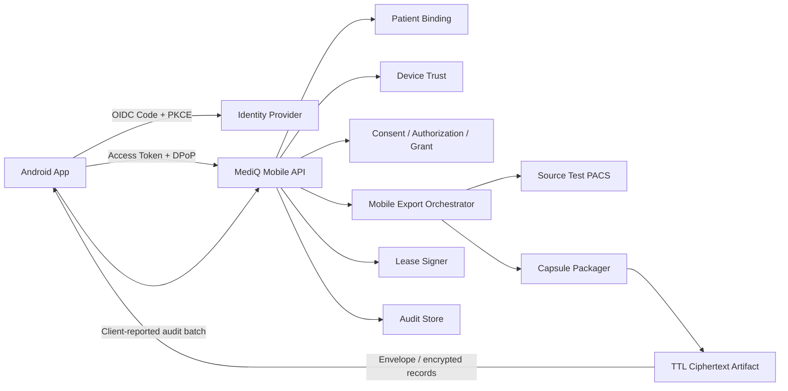

# MediQ Mobile Secure Vault — Mobile API Contract

**Project:** MediQ  
**Document:** `MOBILE-API-CONTRACT.md`  
**Version:** v1.1 Synthetic Health Data Preview Boundary  
**Baseline Date:** 2026-09-20  
**Scope:** CAPSTONE-P1 / Android-first Mobile Secure Vault / Synthetic·Test·De-identified DICOM  
**Status:** APPROVED P1 API CONTRACT BASELINE — DOCUMENTED / PROPOSED, NOT IMPLEMENTED / NOT TESTED  
**Core API Dependency:** `OPENAPI.yaml` v1.1.0 — DOCUMENTED, NOT IMPLEMENTED / NOT TESTED  
**Capsule Dependency:** `SECURE-MEDICAL-CAPSULE-FORMAT.md` v1.0

이 문서의 `MUST`, `MUST NOT`, `SHOULD`, `MAY`는 Backend와 Android 구현 사이의 상호운용 계약 용어다. 문서 승인은 API 구현, DB Migration, 운영 IAM 설정 또는 보안시험 완료를 의미하지 않는다.

> **Health Data Preview Boundary:** `SYNTHETIC-HEALTH-DATA-PREVIEW.md`의 최초 P1 Prototype은 App Asset 또는 Test-only Fixture를 사용하는 Mock Flow이며, 본 계약에 건강정보 고속도로 또는 Health Data Endpoint를 추가하지 않는다. 실제 Provider/API는 Productionization 승인과 별도 OpenAPI 변경 전까지 존재하지 않는 것으로 취급한다.

---

# 1. Executive Summary

MediQ Mobile API는 환자 인증, PatientReference 결합, Android Device Trust, `study:mobile-export` Grant, Secure Medical Capsule 다운로드, Offline Lease, Device Revocation과 Mobile Audit을 연결하는 CAPSTONE-P1 계약이다.

핵심 결정은 다음과 같다.

- 기존 서버 Base URL `https://localhost:8443/api/v1`과 P0 Security Context를 재사용한다.
- Mobile Export는 별도 CRUD가 아니라 기존 Exchange 업무의 `mobile-export` Action으로 모델링한다.
- Device Registration 전에는 사용자 Access Token과 Attestation Challenge를 사용한다.
- Device 등록 후 민감 API는 사용자 Token 외에 RFC 9449 DPoP 기반 Device Proof를 요구하는 Profile을 선택하되 IAM/SDK Validation Gate를 둔다.
- `study:mobile-export`는 OAuth Scope가 아니라 Consent/Authorization으로 발급되는 업무 Transfer Grant Scope다.
- Capsule 다운로드에는 짧은 수명의 DPoP-bound Download Session Token을 별도로 발급한다.
- Manifest API는 JSON으로 재작성한 정보를 주지 않고 서명 검증에 필요한 Capsule Envelope exact bytes를 전달한다.
- Chunk API는 Capsule File의 exact encrypted Record bytes를 전달하며, 강한 ETag와 `If-Range`로 재개한다.
- Offline Lease는 Capsule 파일과 분리된 COSE Signed Policy Evidence다.
- 새 Device Reissue는 기존 DEK/Wrap Slot을 이전하지 않고 Source PACS에서 새 Capsule을 만든다.
- Server Capsule 삭제, Local Vault 삭제, Access Revocation을 서로 다른 업무로 취급한다.
- 기존 `docs/OPENAPI.yaml`은 변경하지 않고 후속 Ticket에서 `docs/OPENAPI-MOBILE.yaml`을 별도 생성한다.

첨부 Highpass 프롬프트의 Mobile P0 분류와 Mobile→병원 재전송 전제는 MediQ 기준을 대체하지 않는다. MediQ Mobile은 CAPSTONE-P1이고, Mobile Capsule의 병원 직접 Upload는 현재 범위 밖이다.

---

# 2. Project Context

```text
Hospital A Test PACS (Source of Record)
        │ WADO-RS
        ▼
MediQ Backend
  ├── Authentication / Patient Binding
  ├── Consent / Authorization / study:mobile-export Grant
  ├── Device Trust / Attestation
  ├── Capsule Packaging
  ├── Download Session
  ├── Offline Lease
  ├── Revocation
  └── Audit
        │ ciphertext-only
        ▼
Android Mobile Secure Vault
  ├── Attested Device Proof Key
  ├── Attested HPKE Wrap Key
  ├── Encrypted Capsule
  ├── Signed Offline Lease
  └── Local DICOM Viewer
```

Hospital PACS는 의료영상의 Source of Record다. MediQ Cloud의 Capsule Artifact는 환자 Device 전달을 위한 TTL 기반 임시 산출물이며 Permanent PACS나 환자 장기 Backup이 아니다.

---

# 3. Existing P0 API Baseline

## 3.1 Repository evidence

| 대상 | 상태 | 근거 |
|---|---|---|
| `docs/OPENAPI.yaml` | DOCUMENTED | OpenAPI 3.1.0, API version 1.1.0 |
| P0 API implementation | NOT IMPLEMENTED | `services/api`에 README만 존재 |
| P0 API tests | NOT RUN | 실행 가능한 Contract/Integration Test 없음 |
| Mobile API | NOT PRESENT | Device/Capsule/Lease path 없음 |
| Mobile DB schema | PROPOSED | Logical Data Amendment만 존재 |
| Android client | NOT IMPLEMENTED | Native project 없음 |

## 3.2 재사용 가능한 계약

| Existing contract | Mobile 사용 | 제한 |
|---|---|---|
| Global `bearerAuth` | 사용자 Online Authentication | Device Binding을 단독 제공하지 않음 |
| `X-Correlation-ID` | 모든 Mobile 요청/응답 | Client 값은 검증 후 사용 |
| `ErrorResponse` | 공통 오류 Envelope | Mobile Error Code 추가 필요 |
| Exchange Session | Mobile Export의 업무 Context | Patient용 Session discovery는 별도 GAP |
| `/exchange-sessions/{sessionId}/studies` | Session 내 Study 선택 | 범용 Patient Study 목록 API가 아님 |
| Consent request/approve/withdraw | 기존 Consent Lifecycle | Mobile Export Consent 의미를 자동 대체하지 않음 |
| Grant issue/revoke | Scoped Grant Lifecycle | 현재 `GrantScope`에 `study:mobile-export` 없음 |
| View Action/Viewer Session | 미지원 Device의 Cloud Viewer Fallback | Local Capsule Viewer와 별개 |
| Exchange Audit GET | Server Audit 조회 | Client Event Ingestion 기능이 아님 |

## 3.3 확인된 P0 Contract Gap

현재 `GrantScope`는 `study:view`, `study:download`, `study:pacs-transfer`만 정의한다. `study:mobile-export`는 Requirements와 Security 문서에는 있으나 OpenAPI에는 없다. Mobile OpenAPI 구현 전 Core Grant Contract Amendment가 필요하다.

다음은 재사용할 수 없다.

- `study:download`를 Mobile Export 권한으로 해석
- P0 Download Action으로 Device-bound Capsule 발급
- Viewer Session을 Offline Lease로 사용
- Exchange Audit 조회 Endpoint로 Mobile Event 업로드

---

# 4. Mobile API Scope

## 4.1 P1 포함

1. Attestation Challenge
2. Device Registration
3. Device Reassessment
4. Device Security Status
5. Mobile Export Request/Status
6. Capsule Download Session
7. Capsule Envelope/Manifest Retrieval
8. Capsule Chunk Download
9. Storage Acknowledgement
10. Offline Lease Issue/Renewal
11. Device Revocation
12. Server Capsule Deletion
13. Capsule Reissue
14. Mobile Audit Batch

## 4.2 제외

- Mobile Capsule의 병원 직접 Upload
- Mobile→PACS STOW-RS
- 실제 환자/운영 PACS
- Cloud Key Escrow와 Cross-device DEK 이전
- Permanent Cloud Capsule Archive
- Fleet Administration Portal
- iOS Native Vault
- PQC/Hybrid 활성화

---

# 5. API Design Principles

1. **Action-oriented:** 의료영상 업무를 DB CRUD로 노출하지 않는다.
2. **Reuse authenticated identity:** Mobile 전용 사용자 계정을 만들지 않는다.
3. **Server-authoritative:** Patient, Tenant, Device, Grant, Capsule 소유권은 Request Body가 아니라 서버 Context로 판단한다.
4. **Two-key roles:** API Proof Key와 Capsule HPKE Wrap Key를 분리한다.
5. **Consent ≠ Authorization ≠ Grant ≠ Lease:** 각 Evidence를 별도로 검증한다.
6. **Deny by default:** 미확정·미지원·만료·불일치 상태는 Fail Closed한다.
7. **Opaque identifiers:** ID는 조회 Key이지 권한이 아니다.
8. **Immutable content:** 발급된 Capsule Version의 Envelope와 Chunk는 변경하지 않는다.
9. **Idempotent commands:** Response 유실 후 재시도가 중복 업무를 만들지 않는다.
10. **Auditable:** 서버 관찰 Event와 Client 보고 Event를 구분한다.
11. **No sensitive diagnostics:** PHI, Token, Key, Attestation Chain, DICOM Payload를 오류/로그에 넣지 않는다.
12. **Contract-first:** OpenAPI lint, generated client, mock, negative contract test가 구현 Gate다.

---

# 6. Mobile API Architecture



## 6.1 Backend module mapping

| API group | Domain/service dependency |
|---|---|
| Device | Patient Identity, Device Trust, Attestation Verifier |
| Export | Exchange Session, Consent, Authorization, Grant, DICOM Gateway |
| Capsule | Packaging Worker, Temporary Artifact Store, Download Authorization |
| Lease | Consent/Grant/Device revalidation, Lease Signer |
| Revocation | Device lifecycle, token/session revocation, Audit |
| Audit | Auth Context enrichment, deduplication, append-only audit service |

## 6.2 Transaction and outbox boundary

실제 Database Schema/Migration은 미정이지만 구현 시 다음 원자성을 보장해야 한다.

| Command | 동일 Transaction에 포함 | Transaction 이후 |
|---|---|---|
| Device Registration | Challenge consume, Key thumbprint uniqueness, Device decision, Idempotency result | Audit/notification via outbox |
| Mobile Export | Idempotency, authorization snapshot reference, Operation `REQUESTED` 생성 | Packaging job dispatch via outbox |
| Download Session | Capsule/device/grant 재검증 결과, scoped session/jti metadata | Token 발급과 audit response |
| Lease Issue/Renew | Lease version, policy/security epoch, previous version relation, signed proof hash/reference, idempotency | Audit via outbox; signing/DB 중 하나라도 실패하면 Proof 반환 금지 |
| Device Revocation | Device status, 신규 session/lease 차단 epoch, token/session revoke marker | Audit and propagation via outbox |
| Capsule Delete | Deletion operation, 신규 download 차단, artifact reference 상태 | Blob purge worker and purge evidence |
| Reissue | Current authorization snapshot, new operation, reissue relation | Source PACS packaging job via outbox |
| Audit Batch | unique `(device_id, client_event_id)`, accepted/duplicate receipt | 분석/alert pipeline |

DB Commit과 Queue Publish 사이의 유실을 피하기 위해 Transactional Outbox 또는 동등한 검증된 패턴을 사용한다. PostgreSQL에 DICOM Binary, 평문 DEK, Device Private Key 또는 raw Attestation Chain을 장기 저장하지 않는다.

---

# 7. Versioning

## 7.1 API base

기존 Server URL이 `/api/v1`을 포함하므로 이 문서의 Path는 `/api/v1`을 반복하지 않는다.

```text
Server: https://localhost:8443/api/v1
Path:   /mobile/devices
Wire:   https://localhost:8443/api/v1/mobile/devices
```

## 7.2 독립 Version 축

| Version | 위치 | 의미 |
|---|---|---|
| API Contract | OpenAPI `info.version` | HTTP Schema/Behavior |
| Capsule Format | Header `format_major/minor` | File Layout |
| Content Crypto Suite | Header/Manifest | Payload Encryption/Signature |
| Wrap Profile | Recipient Slot | Device DEK Wrap |
| Lease Policy Version | Lease Proof | Offline access policy |
| Attestation Policy Version | Device Status | Admission policy |

API Version이 같아도 Capsule/Crypto/Lease Version은 다를 수 있다. Client가 지원하지 않는 Major/Critical Version을 서버나 앱이 임의로 하향하지 않는다.

## 7.3 Compatibility

- Additive optional response field: API Minor/Patch 가능
- Required field 또는 의미 변경: API Major 필요
- Enum 추가: Client는 unknown 처리 후 Fail Closed가 필요한 보안 Enum과 UI fallback 가능한 표시 Enum을 구분한다.
- Capsule Major 변경: 지원 Capability 교환 후 새 Capsule 발급
- HTTP Path version과 Capsule version을 연결해서 추정하지 않는다.

---

# 8. Authentication and Device Proof

## 8.1 User authentication

- Native App은 System Browser 기반 Authorization Code Flow를 사용한다.
- PKCE `S256`을 필수로 한다.
- Implicit Flow와 Resource Owner Password Grant를 사용하지 않는다.
- Access Token은 `iss`, `aud`, `exp`, `nbf`, `jti`, scope/authority를 검증한다.
- ID Token은 API Authorization Token으로 사용하지 않는다.

## 8.2 Device key separation

| Key | Algorithm/profile | 목적 | Private export |
|---|---|---|---|
| Device Proof Key | P-256 ECDSA / DPoP | API request sender constraint | 금지 |
| Device Wrap Key | P-256 ECDH / HPKE Profile | Capsule DEK unwrap | 금지 |

한 Key를 서명과 ECDH에 겸용하지 않는다. 두 Public Key는 같은 Device Registration과 Attestation Evidence에 결합한다.

## 8.3 DPoP profile

등록 후 민감 API는 RFC 9449 DPoP-bound Access Token을 요구하는 Profile을 선택한다.

DPoP Proof는 최소 다음을 검증한다.

- `typ=dpop+jwt`
- 승인된 asymmetric `alg`; `none`과 symmetric algorithm 금지
- Public JWK thumbprint가 Access Token `cnf.jkt` 및 등록 Device Proof Key와 일치
- `jti` uniqueness/replay cache
- `htm` exact method
- `htu` query/fragment 제외 exact target URI
- `iat` 허용 시간창
- `ath` access token hash
- 서버가 요구한 `nonce`

DPoP는 사용자 인증, Patient Binding, Device Attestation 또는 Grant를 대체하지 않는다. IAM/Android SDK 상호운용 시험 전 상태는 `SELECTED WITH VALIDATION GATE`다.

## 8.4 Registration bootstrap

아직 등록되지 않은 Device는 DPoP-bound Token이 없으므로 다음 조합을 사용한다.

```text
Authenticated User Access Token
+ server challenge
+ Android Key Attestation bound to challenge
+ proof of possession of Device Proof Key
+ separate Play Integrity evidence when policy requires
= registration assessment
```

---

# 9. Common Headers and Transport

| Header | 방향 | 규칙 |
|---|---|---|
| `Authorization` | Request | Bootstrap은 `Bearer`, 등록 후 민감 API는 `DPoP` Profile |
| `DPoP` | Request | RFC 9449 Proof JWT |
| `X-Correlation-ID` | Both | UUID; 없으면 서버 생성 |
| `Idempotency-Key` | Command request | UUID v4 권장; Command API에서 필수 |
| `ETag` | Capsule response | Strong validator, Capsule Content Version에 고정 |
| `If-Match` | Mutating request | 알려진 상태/Version에 대한 optimistic guard |
| `Range` | Chunk request | `bytes` 단위 |
| `If-Range` | Resume request | Strong ETag 사용 |
| `Retry-After` | 202/429/503 | 초 단위 또는 HTTP date |
| `Cache-Control` | Sensitive response | `no-store, private` |

TLS는 필수다. Token, DPoP Proof, Download Token 또는 Lease Proof를 URL Query에 넣지 않는다.

---

# 10. Device Registration API

## 10.1 Registration challenge

```http
POST /mobile/attestation-challenges
Authorization: Bearer <user-access-token>
Idempotency-Key: <uuid>
Content-Type: application/json
```

Request:

```json
{
  "purpose": "DEVICE_REGISTRATION",
  "platform": "ANDROID",
  "appInstanceId": "8a1492f8-e754-4db7-a811-0de76ab07a91",
  "supportedAttestationTypes": ["ANDROID_KEY_ATTESTATION", "PLAY_INTEGRITY_STANDARD"]
}
```

Response `201 Created`:

```json
{
  "challengeId": "768913c0-a1bb-4971-a3cc-40e75caaf29c",
  "challenge": "BASE64URL_32_BYTE_RANDOM_VALUE",
  "purpose": "DEVICE_REGISTRATION",
  "expiresAt": "2026-09-20T10:05:00Z",
  "attestationPolicyVersion": 1,
  "requiredEvidence": ["ANDROID_KEY_ATTESTATION", "PLAY_INTEGRITY_STANDARD"]
}
```

Challenge는 최소 32 random bytes, 사용자·Patient Context·Purpose·App Instance에 결합하고 최대 5분, 1회 사용이다.

## 10.2 Register device

```http
POST /mobile/devices
Authorization: Bearer <user-access-token>
Idempotency-Key: <uuid>
Content-Type: application/json
```

Request 필수 필드:

| Field | Type | 제한 |
|---|---|---|
| `challengeId` | UUID | unused, unexpired |
| `platform` | enum | v1 `ANDROID` |
| `osVersion` | string | 1–64 |
| `securityPatchLevel` | date | Android reported, not self-trusted |
| `appVersion` | string | 1–64 |
| `proofPublicKeySpki` | base64url | P-256 SPKI DER |
| `wrapPublicKeySpki` | base64url | P-256 SPKI DER |
| `proofKeyAttestationChain` | array | Proof Key용 DER certificates, bounded count/size |
| `wrapKeyAttestationChain` | array | Wrap Key용 DER certificates, bounded count/size |
| `playIntegrityToken` | string | policy requires; max size defined in OpenAPI |
| `proofOfPossession` | JWS | challenge and both key thumbprints signed by Proof Key |

서버는 Actor/Patient ID를 Body에서 받지 않는다. 두 Attestation Chain 각각의 Challenge와 Key Purpose를 검증하고, Play Integrity `requestHash`는 Challenge ID와 두 Public Key Thumbprint에 결합한다. Key Attestation과 Play Integrity는 서로 다른 Evidence로 검증한다.

Response:

- `201 Created`: 새 `MobileDevice` 생성
- `200 OK`: 동일 Idempotency 요청의 기존 결과
- `409 Conflict`: 같은 Key/Device가 다른 Patient Binding 또는 incompatible state
- `422 Unprocessable Content`: Evidence syntactically valid but policy validation failed

```json
{
  "deviceId": "2e56895f-f0dc-47af-846b-37e7e44c2f1e",
  "registrationStatus": "ACTIVE",
  "attestationStatus": "VERIFIED",
  "securityLevel": "STRONGBOX",
  "localStorageAllowed": true,
  "cloudViewerAllowed": true,
  "attestationPolicyVersion": 1,
  "registeredAt": "2026-09-20T10:02:00Z",
  "reassessmentRequiredAt": "2026-10-20T10:02:00Z"
}
```

Domain Status는 `PENDING | ACTIVE | REVOKED | LOST | RETIRED`만 사용한다. `UNREGISTERED`와 `REGISTRATION_FAILED`는 Client 상태다.

---

# 11. Device Attestation API

## 11.1 Reassessment challenge

```http
POST /mobile/devices/{deviceId}/attestation-challenges
Authorization: DPoP <access-token>
DPoP: <proof>
Idempotency-Key: <uuid>
```

`purpose=DEVICE_REASSESSMENT`를 서버가 고정한다. 호출 Device와 `{deviceId}`가 일치해야 한다.

## 11.2 Submit reassessment

```http
POST /mobile/devices/{deviceId}/attestations
Authorization: DPoP <access-token>
DPoP: <proof>
Idempotency-Key: <uuid>
```

Request는 `challengeId`, fresh Key Attestation 또는 App/Device Integrity Evidence, App/OS Version을 포함한다. 서버는 다음을 분리 기록한다.

- Key Attestation result
- Key Security Level
- Boot/OS/App Integrity result
- Evidence freshness
- 최종 Device Security Decision

성공 응답 `200 OK`의 `securityDecision`은 `VERIFIED | LIMITED | UNSUPPORTED | COMPROMISED | REASSESSMENT_REQUIRED`다. 이 값은 UI/Policy Decision이며 `MobileDevice.status`와 별개다.

Attestation 성공을 영구 신뢰로 표현하지 않는다. Evidence TTL, App Update, OS Update, Key invalidation 또는 보안 Event가 재평가를 유발한다.

---

# 12. Device Security Status API

```http
GET /mobile/devices/{deviceId}/security-status
Authorization: DPoP <access-token>
DPoP: <proof>
```

Response `200 OK`:

```json
{
  "deviceId": "2e56895f-f0dc-47af-846b-37e7e44c2f1e",
  "deviceStatus": "ACTIVE",
  "securityDecision": "VERIFIED",
  "keySecurityLevel": "STRONGBOX",
  "attestationStatus": "VERIFIED",
  "lastVerifiedAt": "2026-09-20T10:02:00Z",
  "reassessmentRequired": false,
  "localStorageAllowed": true,
  "cloudViewerAllowed": true,
  "attestationPolicyVersion": 1,
  "reasonCode": null
}
```

다른 Patient의 Device 존재를 노출하지 않는다. 호출자가 볼 수 없으면 `404 RESOURCE_NOT_FOUND_OR_NOT_VISIBLE`을 반환한다.

---

# 13. Mobile Export API

## 13.1 Request export

기존 Exchange Action Convention을 재사용한다.

```http
POST /exchange-sessions/{sessionId}/actions/mobile-export
Authorization: DPoP <access-token>
DPoP: <proof>
Idempotency-Key: <uuid>
Content-Type: application/json
```

Request:

```json
{
  "grantId": "252450f7-5c95-4486-b327-d73268320325",
  "studyRefId": "cf186990-63b2-4633-a25f-88c773db7ca4",
  "deviceId": "2e56895f-f0dc-47af-846b-37e7e44c2f1e",
  "supportedCapsuleFormatMajors": [1],
  "supportedContentSuiteIds": [65537],
  "supportedWrapProfileIds": [65537],
  "availableStorageBytes": 2147483648
}
```

서버 검증:

```text
Authenticated Patient
+ verified PatientReference binding
+ Exchange ownership/visibility
+ ACTIVE Consent
+ current Authorization decision
+ ACTIVE Grant with exact study:mobile-export scope
+ Grant patient/study/device/action/expiry binding
+ Device ACTIVE
+ Security VERIFIED
+ StrongBox or policy-approved TEE
+ supported Capsule/Crypto/Wrap capability
+ Source PACS availability
+ size/storage policy
= export authorized
```

`availableStorageBytes`는 Preflight 힌트이며 Authorization 근거가 아니다.

Response `202 Accepted`:

```json
{
  "operationId": "30635706-e519-4482-b785-ce72a9eb90fd",
  "sessionId": "188e0fae-f3c2-46da-8d88-eb1ca7bd1efe",
  "status": "REQUESTED",
  "createdAt": "2026-09-20T10:10:00Z",
  "statusUrl": "/mobile-export-operations/30635706-e519-4482-b785-ce72a9eb90fd"
}
```

Response Header에 `Location`과 적절한 `Retry-After`를 포함한다. `202`는 Capsule 생성 완료가 아니다.

## 13.2 Export operation states

| State | 의미 |
|---|---|
| `REQUESTED` | Command accepted |
| `AUTHORIZED` | 모든 정책 검증 통과 |
| `PACKAGING` | PACS retrieve, validation, encryption 진행 |
| `AVAILABLE` | Immutable Capsule Artifact와 Envelope 준비 |
| `FAILED` | 복구 불가 실패 또는 정책 거부 |
| `EXPIRED` | 다운로드 가능기간 만료/Artifact purge |
| `CANCELLED` | 허용된 취소 처리 |

이 상태는 `SecureMedicalCapsule.status`와 Download Client State가 아니다.

---

# 14. Mobile Export Status API

```http
GET /mobile-export-operations/{operationId}
Authorization: DPoP <access-token>
DPoP: <proof>
```

Response:

```json
{
  "operationId": "30635706-e519-4482-b785-ce72a9eb90fd",
  "status": "AVAILABLE",
  "capsuleId": "66d10ac1-d4ea-4f3d-8c15-e1ac5c237332",
  "createdAt": "2026-09-20T10:10:00Z",
  "updatedAt": "2026-09-20T10:12:30Z",
  "artifactExpiresAt": "2026-09-21T10:12:30Z",
  "failureCode": null,
  "links": {
    "downloadSession": "/mobile-capsules/66d10ac1-d4ea-4f3d-8c15-e1ac5c237332/download-sessions",
    "leaseIssuance": "/mobile-capsules/66d10ac1-d4ea-4f3d-8c15-e1ac5c237332/lease-issuances"
  }
}
```

서버가 실제 byte progress를 신뢰성 있게 측정하지 못하면 percentage를 반환하지 않는다. 상태와 시각만 제공한다.

---

# 15. Capsule Download Session API

## 15.1 Create session

```http
POST /mobile-capsules/{capsuleId}/download-sessions
Authorization: DPoP <user-access-token>
DPoP: <proof>
Idempotency-Key: <uuid>
```

서버는 Patient, Device, Capsule, Grant, Export Operation, Artifact TTL, Security Decision을 다시 검증한다.

Response `201 Created`:

```json
{
  "downloadSessionId": "02a51fa4-55b4-4cb5-bbf4-9bab12681867",
  "capsuleId": "66d10ac1-d4ea-4f3d-8c15-e1ac5c237332",
  "accessToken": "SHORT_LIVED_DPOP_BOUND_TOKEN",
  "tokenType": "DPoP",
  "expiresAt": "2026-09-20T10:25:00Z",
  "etag": "\"mqc-66d10ac1-v1-7fb4...\"",
  "manifestUrl": "/mobile-capsules/66d10ac1-d4ea-4f3d-8c15-e1ac5c237332/manifest",
  "chunkUrlTemplate": "/mobile-capsules/66d10ac1-d4ea-4f3d-8c15-e1ac5c237332/chunks/{globalSequence}"
}
```

## 15.2 Token profile

- Audience: MediQ Mobile Capsule Resource Server
- Lifetime: 최대 10분
- Sender constraint: 등록 Device Proof Key의 `cnf.jkt`
- Scope: 해당 Capsule의 Manifest/Chunk Read만
- Claims: `sub`, `jti`, `device_id`, `capsule_id`, `download_session_id`, `grant_id/ref`, `exp`
- 다른 Capsule, Lease, Export, Device API에 사용 금지

하나의 Single-use Token을 모든 Chunk에 반복 사용하는 모순을 피하기 위해, 짧은 수명의 DPoP-bound Session Token을 사용한다. 각 HTTP 요청의 DPoP `jti`는 별도로 Replay 방지한다. Token 만료 시 이 API를 다시 호출하며, 기존 검증 Chunk는 ETag가 같을 때만 재사용한다.

---

# 16. Capsule Manifest API

```http
GET /mobile-capsules/{capsuleId}/manifest
Authorization: DPoP <download-session-token>
DPoP: <proof>
```

Response `200 OK`:

```text
Content-Type: application/vnd.mediq.secure-medical-capsule-envelope
Content-Length: <payload_offset>
ETag: "strong-capsule-version-etag"
Cache-Control: no-store, private
X-MediQ-Capsule-Format: 1.0
X-MediQ-Content-Version: 1

Body = exact bytes [0, payload_offset)
     = Fixed Header
       || Public Manifest CBOR
       || COSE_Sign1
       || Recipient Set CBOR
```

JSON으로 변환한 Manifest는 서명된 bytes를 대체하지 않는다. Android는 exact bytes로 Header Bounds, Deterministic CBOR, COSE Signature, Device Recipient Slot, Record Directory와 ETag를 검증한다.

Protected Manifest는 `global_sequence=0`인 encrypted Record이므로 Chunk API로 받는다.

`If-None-Match`가 현재 strong ETag와 같으면 `304 Not Modified`를 반환할 수 있다. 304 Body를 Capsule 검증 자료로 사용하지 않고 기존 검증 Envelope를 재사용한다.

---

# 17. Capsule Chunk Download API

```http
GET /mobile-capsules/{capsuleId}/chunks/{globalSequence}
Authorization: DPoP <download-session-token>
DPoP: <proof>
```

중단된 단일 Record의 byte resume가 필요한 경우에만 다음을 추가한다.

```http
Range: bytes=<next-offset>-
If-Range: "strong-capsule-version-etag"
```

Path Parameter:

- `globalSequence`: `0..65534` P1 Profile
- `0`: Protected Manifest Record
- `1..N`: DICOM Data Record

Response는 Capsule File에 저장되는 exact Record다.

```text
Content-Type: application/vnd.mediq.secure-medical-capsule-record
ETag: "same-strong-capsule-version-etag"
Accept-Ranges: bytes
Content-Length: <record-length or range-length>
Content-Range: bytes <start>-<end>/<record-length>   # 206 only
Cache-Control: no-store, private
X-MediQ-Global-Sequence: <sequence>

Body = 32-byte record header || ciphertext || 16-byte tag
```

- 전체 Record는 `200 OK`, 유효 Range는 `206 Partial Content`다.
- 잘못된 Range는 `416 Range Not Satisfiable`이다.
- `If-Range`가 일치하지 않아 `200`과 새 ETag가 반환되면 Client는 기존 Staging을 혼합하지 않고 Capsule Download를 Reset한다.
- Header의 Signed SHA-256과 AES-GCM Tag를 모두 검증해야 한다.
- Partial HTTP Fragment는 검증 완료 Chunk로 표시하지 않는다.
- 서버는 Download 중에도 Device/Grant/Artifact 상태를 확인하고 철회 상태에서 새 Record 전달을 거부한다.

---

# 18. Partial Download & Retry

```text
Create Download Session
→ Fetch/verify Envelope
→ Derive required record list
→ Download missing record
→ verify signed SHA-256
→ save encrypted staging record
→ renew Download Session Token if needed
→ all records present
→ HPKE unwrap + GCM/object verification
→ obtain/verify Offline Lease
→ atomic local commit
→ storage acknowledgement
```

| 상황 | Retry | 기존 Record 재사용 |
|---|---|---|
| Timeout/connection reset | 최대 5회 backoff | 같은 Capsule ID/Content Version/ETag일 때만 |
| Download token expired | 새 Session 발급 | ETag 같으면 가능 |
| User token expired | OIDC refresh/reauth 후 새 Session | ETag 같으면 가능 |
| Hash mismatch | 1회 fresh fetch | 해당 Record 폐기 |
| 반복 Hash/Tag failure | 자동 반복 중단 | Capsule 격리 |
| Grant/Device revoked | 불가 | Commit 금지 |
| Manifest/ETag changed | 새 Capsule download | 기존 Staging reset |
| Artifact expired/purged | Reissue 필요 | 불가 |

Default Backoff는 1, 2, 4, 8, 16초 Full Jitter이며 30초를 넘지 않는다. `Retry-After`가 더 길면 서버 값을 존중한다.

---

# 19. Capsule Key / Wrap Slot Delivery

별도 `GET /keys` Endpoint를 만들지 않는다. Wrap Slot은 Capsule Envelope의 서명된 Recipient Set에 포함한다.

필수 검증:

- Recipient Set Capsule ID가 Header와 일치
- Device Binding Hash가 현재 등록 Device와 일치
- Recipient Public Key Thumbprint가 Attested Wrap Key와 일치
- Wrap Profile이 Client Allowlist에 존재
- Slot `not_after` 유효
- Envelope Signature 유효
- HPKE Decapsulation 성공

평문 DEK, Device Private Key, KEK 또는 복구용 Key를 API Response로 반환하지 않는다. 새 Device는 기존 Recipient Slot을 요청할 수 없으며 Reissue API를 사용한다.

---

# 20. Storage Acknowledgement API

```http
POST /mobile-capsules/{capsuleId}/storage-acknowledgements
Authorization: DPoP <user-access-token>
DPoP: <proof>
Idempotency-Key: <uuid>
```

Request:

```json
{
  "contentVersion": 1,
  "etag": "\"mqc-66d10ac1-v1-7fb4...\"",
  "result": "COMMITTED",
  "verifiedRecordCount": 145,
  "verifiedAt": "2026-09-20T10:28:00Z",
  "clientEventId": "b32b0293-faf0-4fe0-b877-bfa172116e2f"
}
```

허용 `result`:

- `COMMITTED`
- `INTEGRITY_FAILED`
- `STORAGE_FAILED`
- `CANCELLED`

Client의 `COMMITTED` 보고는 서버가 실제 Local File 존재나 이후 사용자 열람을 완전 증명한다는 의미가 아니다. 서버는 `CLIENT_REPORTED` Source로 Audit한다. Integrity 실패 시 Download Session을 폐기하고 Security Event를 생성할 수 있다.

---

# 21. Offline Lease Issue API

```http
POST /mobile-capsules/{capsuleId}/lease-issuances
Authorization: DPoP <user-access-token>
DPoP: <proof>
Idempotency-Key: <uuid>
Content-Type: application/json
```

Request:

```json
{
  "deviceId": "2e56895f-f0dc-47af-846b-37e7e44c2f1e",
  "grantId": "252450f7-5c95-4486-b327-d73268320325",
  "requestedDurationSeconds": 2592000
}
```

서버가 Duration을 정책 최대 30일 이하로 제한한다. Capsule Artifact TTL과 Offline Lease 기간은 서로 다르다.

Response `201 Created`:

```json
{
  "leaseId": "1262f379-c83e-469e-b20d-ad4ecf420967",
  "capsuleId": "66d10ac1-d4ea-4f3d-8c15-e1ac5c237332",
  "deviceId": "2e56895f-f0dc-47af-846b-37e7e44c2f1e",
  "status": "ACTIVE",
  "leaseVersion": 1,
  "policyVersion": 1,
  "issuedAt": "2026-09-20T10:20:00Z",
  "notBefore": "2026-09-20T10:20:00Z",
  "expiresAt": "2026-10-20T10:20:00Z",
  "proofFormat": "COSE_SIGN1",
  "leaseProof": "BASE64URL_COSE_SIGN1"
}
```

## 21.1 Signed lease payload

Lease Proof는 detached가 아닌 COSE_Sign1 payload에 다음 Deterministic CBOR를 포함한다.

```cddl
offline-lease-claims = [
  "MediQ-OfflineLease-v1",
  lease_id: bstr .size 16,
  capsule_id: bstr .size 16,
  device_binding_hash: bstr .size 32,
  patient_reference_id: bstr,
  grant_id: bstr .size 16,
  issued_at: uint,
  not_before: uint,
  expires_at: uint,
  policy_version: uint,
  lease_version: uint,
  security_epoch: uint
]
```

서명은 승인된 Lease Signing Key와 `kid` Registry를 사용한다. Lease ID, Capsule ID 또는 JSON Field만 신뢰하지 않고 COSE Payload exact bytes를 검증한다.

---

# 22. Offline Lease Renewal API

```http
POST /mobile-leases/{leaseId}/renewals
Authorization: DPoP <user-access-token>
DPoP: <proof>
Idempotency-Key: <uuid>
If-Match: "lease-version-1"
```

Request:

```json
{
  "requestedDurationSeconds": 2592000,
  "currentLeaseVersion": 1
}
```

검증 대상:

- Authenticated Patient/Patient Binding
- Device ACTIVE and Security VERIFIED
- Capsule ACTIVE and same Device Binding
- Consent/Authorization current
- `study:mobile-export` Grant current
- 기존 Lease Ownership/Version
- Secure Time/Policy Epoch

성공은 새 Immutable Lease Proof와 `leaseVersion+1`을 반환한다. 기존 Proof는 새 Version이 적용된 이후 로컬에서 Superseded로 표시한다.

| 결과 | HTTP | Code |
|---|---:|---|
| Renewed | 201 | `LEASE_RENEWED` |
| Version race | 412 | `LEASE_VERSION_MISMATCH` |
| Reauth needed | 401 | `REAUTHENTICATION_REQUIRED` |
| Device revoked | 403 | `DEVICE_REVOKED` |
| Grant invalid | 403 | `GRANT_REVOKED` 또는 `GRANT_EXPIRED` |
| Capsule unavailable | 410 | `CAPSULE_UNAVAILABLE` |

갱신 실패가 아직 만료되지 않은 기존 Lease를 소급 무효화하는지는 서버 결과의 `effectiveLocalAccess`로 명시한다. Device/Grant Revoke를 확인한 경우 `DENY_NOW_ON_SYNC`, 단순 네트워크 실패는 기존 Lease 만료까지 `UNCHANGED`다.

---

# 23. Device Revocation API

```http
POST /mobile/devices/{deviceId}/revocations
Authorization: Bearer or DPoP <user-access-token>
Idempotency-Key: <uuid>
```

분실한 대상 Device의 Proof를 요구해서는 안 된다. 대신 현재 사용자에 대한 최근 재인증, Patient Ownership과 위험 기반 확인을 요구한다.

Request:

```json
{
  "reason": "LOST",
  "confirmation": true
}
```

허용 Reason: `LOST | STOLEN | RETIRED | SUSPECTED_COMPROMISE | USER_REQUEST`.

Response `200 OK`:

```json
{
  "deviceId": "2e56895f-f0dc-47af-846b-37e7e44c2f1e",
  "deviceStatus": "LOST",
  "serverAccessRevoked": true,
  "newExportAllowed": false,
  "newDownloadSessionAllowed": false,
  "leaseRenewalAllowed": false,
  "offlineDeletionStatus": "UNKNOWN",
  "revokedAt": "2026-09-20T11:00:00Z"
}
```

```text
Server access revoked
≠ Offline device received revocation
≠ Local ciphertext deleted
≠ Local key destroyed
```

중복 철회는 현재 결과를 `200`으로 반환한다. 이미 `RETIRED`인 Device를 `ACTIVE`로 되돌리는 API는 제공하지 않는다.

---

# 24. Capsule Deletion API

```http
DELETE /mobile-capsules/{capsuleId}
Authorization: DPoP <user-access-token>
DPoP: <proof>
Idempotency-Key: <uuid>
```

이 API의 의미는 다음으로 제한한다.

- Server Temporary Capsule Artifact purge 요청
- 새 Download Session 발급 차단
- 기존 Download Session 폐기
- Server Capsule Metadata 상태 전환과 Audit

이 API가 하지 않는 일:

- Source PACS 원본 삭제
- Offline Device의 Local File 원격 삭제 완료 보장
- Consent/Grant 철회 자동 수행
- 이미 발급된 Offline Lease의 즉시 Offline 적용 보장

Response `202 Accepted`는 `SERVER_DELETION_REQUESTED`이며, 실제 purge 완료 전 `DELETED`라고 표시하지 않는다. 완료 조회 방식은 Export Operation 또는 별도 Deletion Operation을 후속 OpenAPI에서 선택한다.

Local 삭제는 Android가 Key/Ciphertext/Index를 제거한 뒤 Mobile Audit 또는 Storage Acknowledgement Event로 보고한다.

---

# 25. Capsule Reissue API

```http
POST /mobile-capsules/{capsuleId}/reissues
Authorization: DPoP <user-access-token>
DPoP: <proof>
Idempotency-Key: <uuid>
```

Request:

```json
{
  "reason": "NEW_DEVICE",
  "targetDeviceId": "5955055d-8968-4ed4-8718-27cb58d57b3f"
}
```

허용 Reason: `NEW_DEVICE | CAPSULE_EXPIRED | KEY_ROTATION | CORRUPTED_CAPSULE | POLICY_CHANGE`.

모든 Reissue는 다음을 수행한다.

1. 현재 Patient Identity 재검증
2. Consent, Authorization, `study:mobile-export` Grant 재검증
3. Target Device ACTIVE/VERIFIED 확인
4. Source PACS 재조회
5. 새 Capsule ID, 새 DEK, 새 Nonce Prefix 생성
6. Target Device Wrap Key용 새 Recipient Set 생성
7. 새 Offline Lease 별도 발급

기존 DEK Rewrap, Cross-device Slot 추가, 기존 Ciphertext의 무조건 재사용을 하지 않는다.

Response `202 Accepted`는 새 `operationId`와 `statusUrl`을 반환한다. 새 Capsule이 준비되기 전 기존 Capsule을 `AVAILABLE`로 가장하지 않는다.

---

# 26. Mobile Audit Event API

```http
POST /mobile/audit-events
Authorization: DPoP <user-access-token>
DPoP: <proof>
Idempotency-Key: <uuid>
Content-Type: application/json
```

Batch 제한:

- 1–100 events
- 전체 Request 최대 256 KiB
- Event별 `clientEventId` UUID와 Device-local monotonic `sequence`
- 서버 Dedup 보존 최소 30일

Request:

```json
{
  "deviceId": "2e56895f-f0dc-47af-846b-37e7e44c2f1e",
  "events": [
    {
      "clientEventId": "03b3e975-d9e8-4b5d-a0f4-4d406c532b3c",
      "sequence": 1042,
      "eventType": "VIEWER_OPENED",
      "capsuleId": "66d10ac1-d4ea-4f3d-8c15-e1ac5c237332",
      "occurredAt": "2026-09-20T10:30:00Z",
      "result": "SUCCESS",
      "reasonCode": null
    }
  ]
}
```

허용 Client Event 후보:

- `CAPSULE_COMMITTED`
- `CAPSULE_INTEGRITY_FAILED`
- `VAULT_UNLOCK_SUCCEEDED`
- `VAULT_UNLOCK_FAILED`
- `VIEWER_OPENED`
- `VIEWER_CLOSED`
- `BACKGROUND_PRIVACY_LOCKED`
- `LEASE_LOCAL_EXPIRED`
- `LOCAL_REVOCATION_APPLIED`
- `CAPSULE_LOCAL_DELETED`

서버는 Actor, Patient, Device Binding을 인증 Context로 보강한다. Client가 보낸 사용자/Tenant 값을 받거나 신뢰하지 않는다.

Response `202 Accepted`:

```json
{
  "accepted": ["03b3e975-d9e8-4b5d-a0f4-4d406c532b3c"],
  "duplicates": [],
  "rejected": [],
  "acknowledgedThroughSequence": 1042
}
```

Client Event는 `source=CLIENT_REPORTED`로 저장한다. 서버가 직접 관찰한 Export, Download, Lease, Revocation Event와 혼동하지 않는다.

---

# 27. Audit Synchronization

```text
Offline Event
→ encrypted app-private queue
→ ordered device sequence
→ network restored
→ batch upload
→ per-event accepted/duplicate/rejected
→ acknowledgedThroughSequence
→ local queue compaction
```

- Response 유실 시 같은 `clientEventId`로 재전송한다.
- Batch 순서가 바뀌어도 Dedup은 Event ID로 수행한다.
- Sequence Gap은 Detection Signal이지 서버가 Event를 발명하는 근거가 아니다.
- Device clock은 참고값이며 Server Received Time을 별도로 기록한다.
- Queue 손상/유실은 Audit Gap Event로 기록하되 실제 행위를 완전 복구했다고 주장하지 않는다.
- Audit 실패가 이미 유효한 Offline Lease를 자동 연장하지 않는다.

---

# 28. Idempotency

Command API는 `Idempotency-Key`를 필수로 한다.

Server key space:

```text
authenticated subject
+ patient binding
+ calling device when available
+ HTTP method
+ canonical path
+ idempotency key
```

Request Body SHA-256를 저장해 같은 Key의 의미 변경을 탐지한다.

| 상황 | 결과 |
|---|---|
| 같은 Key + 같은 Body + 완료 | 원래 상태/Response 재반환 |
| 같은 Key + 같은 Body + 처리 중 | 같은 Operation 반환 |
| 같은 Key + 다른 Body | `409 IDEMPOTENCY_KEY_REUSED` |
| Response 유실 후 Retry | 새 Resource 생성 금지 |

일반 Command Dedup 보존은 최소 24시간이다. Revocation은 Resource State 자체가 영구 Idempotency를 제공한다. Audit는 `clientEventId`를 최소 30일 Dedup한다.

GET, Range GET에는 Idempotency-Key가 필요하지 않다.

---

# 29. Error Contract

기존 `ErrorResponse`를 재사용한다.

```json
{
  "code": "DEVICE_REVOKED",
  "message": "등록된 기기에서 이 작업을 수행할 수 없습니다.",
  "correlationId": "d6de3ca3-c459-4ee4-97ab-43d545653314",
  "details": {
    "retryable": false
  }
}
```

`details`에는 PHI, raw Token, Key, Attestation Chain, DICOM UID/Payload 또는 내부 Stack Trace를 넣지 않는다.

## 29.1 HTTP mapping

| HTTP | 용도 | 대표 Code |
|---:|---|---|
| 400 | Schema/parameter invalid | `INVALID_REQUEST` |
| 401 | Login/DPoP/reauth required | `AUTH_REQUIRED`, `DPOP_PROOF_INVALID`, `REAUTHENTICATION_REQUIRED` |
| 403 | 존재를 이미 아는 Resource의 정책 거부 | `DEVICE_REVOKED`, `GRANT_SCOPE_DENIED`, `EXPORT_DENIED` |
| 404 | 없음 또는 호출자에게 비가시 | `RESOURCE_NOT_FOUND_OR_NOT_VISIBLE` |
| 409 | State/Idempotency conflict | `INVALID_RESOURCE_STATE`, `IDEMPOTENCY_KEY_REUSED` |
| 410 | Artifact/Lease 대상 영구 사용불가 | `CAPSULE_UNAVAILABLE` |
| 412 | ETag/Version precondition 실패 | `VERSION_MISMATCH` |
| 416 | Range invalid | `RANGE_NOT_SATISFIABLE` |
| 422 | Evidence/Capability 정책 검증 실패 | `DEVICE_ATTESTATION_FAILED`, `UNSUPPORTED_CRYPTO_SUITE` |
| 429 | Rate limit | `RATE_LIMITED` |
| 502/503 | PACS/temporary infrastructure failure | `DICOMWEB_FAILURE`, `SERVICE_UNAVAILABLE` |

## 29.2 Required Mobile codes

```text
AUTH_REQUIRED
DPOP_PROOF_REQUIRED
DPOP_PROOF_INVALID
REAUTHENTICATION_REQUIRED
PATIENT_IDENTITY_UNVERIFIED
DEVICE_UNREGISTERED
DEVICE_ATTESTATION_FAILED
DEVICE_UNSUPPORTED
DEVICE_REASSESSMENT_REQUIRED
DEVICE_REVOKED
CONSENT_REQUIRED
CONSENT_WITHDRAWN
GRANT_REQUIRED
GRANT_EXPIRED
GRANT_REVOKED
GRANT_SCOPE_DENIED
EXPORT_DENIED
CAPSULE_NOT_READY
CAPSULE_UNAVAILABLE
CAPSULE_INTEGRITY_FAILED
UNSUPPORTED_CAPSULE_FORMAT
UNSUPPORTED_CRYPTO_SUITE
UNSUPPORTED_WRAP_PROFILE
DOWNLOAD_SESSION_EXPIRED
LEASE_EXPIRED
LEASE_VERSION_MISMATCH
LEASE_RENEWAL_DENIED
IDEMPOTENCY_KEY_REUSED
RANGE_NOT_SATISFIABLE
RATE_LIMITED
```

Cross-patient, cross-tenant 또는 Resource enumeration 위험이 있으면 403 대신 404를 사용한다.

---

# 30. OpenAPI Schema

후속 `OPENAPI-MOBILE.yaml`은 `additionalProperties: false`, 명시적 `required`, length/range, enum, format을 사용한다.

## 30.1 Required schemas

| Schema | 핵심 필드 |
|---|---|
| `AttestationChallengeRequest` | purpose, platform, appInstanceId, supportedAttestationTypes |
| `AttestationChallenge` | challengeId, challenge, expiresAt, policyVersion, requiredEvidence |
| `DeviceRegistrationRequest` | challengeId, proof/wrap keys, attestation chain, integrity token, proofOfPossession |
| `MobileDevice` | deviceId, domain status, attestation status, security level, policy times |
| `DeviceAttestationRequest` | challengeId, evidence, app/os metadata |
| `DeviceSecurityStatus` | status, decision, level, local/cloud allowance, reason |
| `MobileExportRequest` | grantId, studyRefId, deviceId, capability arrays, storage bytes |
| `MobileExportOperation` | operationId, status, capsuleId nullable, times, failureCode, links |
| `CapsuleDownloadSession` | sessionId, short token, expiry, ETag, URLs |
| `CapsuleEnvelope` | binary media type, not JSON |
| `CapsuleRecord` | binary media type, not JSON |
| `StorageAcknowledgement` | version, ETag, result, count, time, event ID |
| `OfflineLease` | IDs, status/version, times, proofFormat, leaseProof |
| `LeaseRenewalRequest` | duration, currentVersion |
| `DeviceRevocationRequest` | reason, confirmation |
| `CapsuleReissueRequest` | reason, targetDeviceId |
| `MobileAuditBatch` | deviceId, 1–100 events |
| `MobileAuditReceipt` | accepted, duplicates, rejected, acknowledged sequence |
| `ErrorResponse` | existing core schema reference |

## 30.2 Common constraints

- UUID examples are synthetic.
- DICOM UID는 이 계약에서 Body에 직접 노출하지 않고 `studyRefId`를 사용한다.
- Base64url은 padding 없는 URL-safe alphabet으로 정의한다.
- Binary Payload는 JSON Base64로 포장하지 않는다.
- `nullable` 대신 OpenAPI 3.1 JSON Schema union 또는 optional field를 명시적으로 사용한다.
- Date-time은 RFC 3339 UTC `Z`를 사용한다.
- Epoch inside signed CBOR는 unsigned Unix seconds다.

---

# 31. OpenAPI Organization

## 31.1 비교

| 방식 | 장점 | 위험 |
|---|---|---|
| 기존 `OPENAPI.yaml`에 즉시 병합 | 한 파일, 단일 SDK | 미구현 P1이 P0 기준선을 오염, 큰 변경, Mobile Release 독립성 부족 |
| Mobile OpenAPI 분리 | P0 보존, Android SDK 독립 생성, P1 Gate 명확 | Shared Schema 관리와 Bundle CI 필요 |

## 31.2 결정

**Option B — Mobile OpenAPI 분리**를 선택한다.

후속 구조:

```text
docs/
  OPENAPI.yaml                 # Existing P0 Core, unchanged in this phase
  OPENAPI-MOBILE.yaml          # Future P1 Mobile contract
```

- Mobile 파일은 Server Base `/api/v1`을 공유한다.
- Core `ErrorResponse`, `CorrelationId`, UUID 및 Authentication semantics를 external `$ref` 또는 CI bundling으로 재사용한다.
- `study:mobile-export` Grant Scope는 Core Amendment와 Mobile Specification에서 동시에 검증한다.
- 공통 Schema 파일 추출은 두 Specification의 Bundling/Generator 검증 후 별도 변경으로 수행한다.
- 이번 단계에서는 `OPENAPI-MOBILE.yaml`을 생성하지 않는다.

---

# 32. Mobile State Model Integration

| Previous | Trigger/API | Success | Failure | UI/Audit |
|---|---|---|---|---|
| `UNREGISTERED` | Challenge + `POST /mobile/devices` | Device `ACTIVE`, Security `VERIFIED` 후보 | `REGISTRATION_FAILED`/Cloud Viewer | MOB-03/04, `DEVICE_ADMISSION_*` |
| `REASSESSMENT_REQUIRED` | Attestation APIs | `VERIFIED` | `LIMITED/UNSUPPORTED/COMPROMISED` | Lock/Cloud Viewer |
| Study Detail | Mobile Export Action | Operation `REQUESTED` | Denied | MOB-07, `MOBILE_EXPORT_*` |
| Operation `AVAILABLE` | Download Session | `DOWNLOADING` | Auth/Grant/Device error | MOB-08 |
| `PARTIALLY_DOWNLOADED` | Chunk GET | `DOWNLOADING`/resume | Reset/quarantine | `CAPSULE_DOWNLOAD_*` |
| `VERIFYING` | Local full verification | `READY_TO_COMMIT` | Capsule quarantined | `CAPSULE_INTEGRITY_*` |
| `READY_TO_COMMIT` | Local atomic commit + ack | Capsule `ACTIVE` | cleanup/recovery | MOB-09 |
| Lease `NOT_ISSUED` | Lease issue | `ACTIVE` | deny | MOB-09/11 |
| `RENEWING` | Lease renewal | `ACTIVE` new version | `RENEWAL_DENIED` | MOB-11 |
| Device `ACTIVE` | Revocation | `LOST/REVOKED/RETIRED` | unchanged | MOB-13 |
| New Device `VERIFIED` | Reissue | new Operation `REQUESTED` | denied | MOB-14 |

Client Workflow 상태를 Server Domain Enum으로 자동 저장하지 않는다.

---

# 33. Capsule Format Integration

| Capsule element | API 전달 방식 | 변경성 |
|---|---|---|
| Fixed Header | Manifest Endpoint exact bytes | Capsule Version 동안 Immutable |
| Public Manifest | Manifest Endpoint exact bytes | Immutable |
| COSE Signature | Manifest Endpoint exact bytes | Immutable |
| Recipient Set/Wrap Slots | Manifest Endpoint exact bytes | P1 Immutable |
| Protected Manifest Record | Chunk sequence 0 | Immutable encrypted record |
| DICOM Records | Chunk sequence 1..N | Immutable encrypted records |
| Offline Lease | Lease API JSON + COSE proof | Capsule과 분리, renewal versioned |
| Download Session | API authorization | 짧은 수명, Capsule 내용 아님 |

## 33.1 Conflict handling

| 상황 | Server/Client 처리 |
|---|---|
| Manifest Major unsupported | `UNSUPPORTED_CAPSULE_FORMAT`, commit 금지 |
| Content Suite unsupported | Export capability negotiation에서 거부; 수신 시 fail closed |
| Wrap Profile unsupported | 지원 Slot 없으면 거부/reissue |
| Missing/changed Chunk | hash/ETag failure, staging reset/quarantine |
| Reissue during old download | 새 Capsule ID/ETag로 분리; 혼합 금지 |
| Grant revoked during download | 새 Chunk/Session/Lease 거부; 받은 Staging commit 금지 |
| Artifact purged | `410 CAPSULE_UNAVAILABLE`; reissue flow |

---

# 34. API Security Matrix

| API | User auth | Device proof/trust | Grant/Lease | Replay/Rate | Audit |
|---|---|---|---|---|---|
| Registration Challenge | Bearer | pre-registration | 없음 | one-time challenge, rate limit | challenge issued |
| Device Registration | Bearer | attestation + PoP | 없음 | challenge single use + idempotency | admission result |
| Reattestation | DPoP | current Device + fresh evidence | 없음 | challenge + DPoP jti | reassessment |
| Security Status | DPoP | same Device/owner | 없음 | standard read limit | denied/sensitive changes |
| Mobile Export | DPoP | ACTIVE/VERIFIED | Consent/Auth/`study:mobile-export` | idempotency + policy limit | requested/allow/deny |
| Export Status | DPoP | same Device/owner | operation scope | read limit | enumeration denial |
| Download Session | DPoP | same Device/recipient key | current Grant | idempotency, token jti | session issued/denied |
| Manifest/Chunk | DPoP session token | `cnf.jkt`, Device ACTIVE | scoped download token | DPoP jti, range/rate | download observed |
| Storage Ack | DPoP | same Device | Capsule scope | idempotency | client-reported outcome |
| Lease Issue/Renew | DPoP | ACTIVE/VERIFIED | current Consent/Auth/Grant | idempotency, If-Match | issue/renew/deny |
| Device Revocation | recent user reauth | target proof 불필요 | ownership | idempotent/risk limit | revoke result |
| Capsule Delete | DPoP | owner/current device | Capsule scope | idempotency | purge request/result |
| Reissue | DPoP target device | target ACTIVE/VERIFIED | current Consent/Auth/Grant | idempotency | reissue result |
| Audit Batch | DPoP | same Device | 없음 | event dedup/rate | client-reported receipt |

Rate Limit 정확한 수치는 성능시험과 IAM에서 확정한다. `429`에는 `Retry-After`를 제공한다.

---

# 35. API Contract Test Matrix

| Test ID | Endpoint | Precondition | Expected HTTP | Expected Code/Result | State |
|---|---|---|---:|---|---|
| API-MOB-001 | challenge | authenticated patient | 201 | fresh one-time challenge | NOT RUN |
| API-MOB-002 | challenge | rate exceeded | 429 | `RATE_LIMITED` | NOT RUN |
| API-MOB-003 | device registration | valid StrongBox evidence | 201 | Device ACTIVE/VERIFIED | NOT RUN |
| API-MOB-004 | device registration | replayed challenge | 409/422 | replay denied | NOT RUN |
| API-MOB-005 | device registration | Software/Unknown key | 422 | `DEVICE_UNSUPPORTED` | NOT RUN |
| API-MOB-006 | reattestation | invalid DPoP `htu/htm/ath` | 401 | `DPOP_PROOF_INVALID` | NOT RUN |
| API-MOB-007 | security status | other patient device | 404 | not visible | NOT RUN |
| API-MOB-008 | mobile export | valid exact scope | 202 | same operation on retry | NOT RUN |
| API-MOB-009 | mobile export | only `study:download` | 403 | `GRANT_SCOPE_DENIED` | NOT RUN |
| API-MOB-010 | mobile export | Device reassessment required | 403 | `DEVICE_REASSESSMENT_REQUIRED` | NOT RUN |
| API-MOB-011 | export status | packaging | 200 | state, no fake percent | NOT RUN |
| API-MOB-012 | download session | valid capsule/device/grant | 201 | DPoP-bound short token | NOT RUN |
| API-MOB-013 | download session | revoked grant | 403 | `GRANT_REVOKED` | NOT RUN |
| API-MOB-014 | manifest | valid session | 200 | exact signed envelope + strong ETag | NOT RUN |
| API-MOB-015 | chunk | valid full record | 200 | exact record bytes | NOT RUN |
| API-MOB-016 | chunk | valid byte range | 206 | correct Content-Range | NOT RUN |
| API-MOB-017 | chunk | bad range | 416 | `RANGE_NOT_SATISFIABLE` | NOT RUN |
| API-MOB-018 | chunk | changed ETag/If-Range | 200 new representation | client full reset | NOT RUN |
| API-MOB-019 | chunk | wrong Device DPoP | 401/404 | no record disclosure | NOT RUN |
| API-MOB-020 | storage ack | response lost/retry | 200/201 | single audit outcome | NOT RUN |
| API-MOB-021 | lease issue | valid policies | 201 | signed max-30-day proof | NOT RUN |
| API-MOB-022 | lease renew | grant revoked | 403 | `GRANT_REVOKED`, deny on sync | NOT RUN |
| API-MOB-023 | lease renew | stale If-Match | 412 | `LEASE_VERSION_MISMATCH` | NOT RUN |
| API-MOB-024 | device revoke | lost device, recent reauth | 200 | server access revoked, local delete unknown | NOT RUN |
| API-MOB-025 | device revoke | duplicate request | 200 | same result | NOT RUN |
| API-MOB-026 | capsule delete | valid | 202 | server purge requested only | NOT RUN |
| API-MOB-027 | reissue | new verified device/current grant | 202 | new operation/new capsule | NOT RUN |
| API-MOB-028 | reissue | expired consent/grant | 403 | denied | NOT RUN |
| API-MOB-029 | audit batch | duplicate clientEventId | 202 | duplicate receipt, no duplicate event | NOT RUN |
| API-MOB-030 | audit batch | forged device reference | 404/403 | binding denied | NOT RUN |
| API-MOB-031 | any command | same key, different body | 409 | `IDEMPOTENCY_KEY_REUSED` | NOT RUN |
| API-MOB-032 | any sensitive API | token valid, DPoP missing | 401 | `DPOP_PROOF_REQUIRED` | NOT RUN |

OpenAPI Mock Server, generated Kotlin client와 Backend Contract Test가 같은 fixture를 사용해야 한다. 실행 증거 없이는 PASS가 아니다.

---

# 36. P0 / P1 / P2 Scope

| MediQ 분류 | 내용 |
|---|---|
| CAPSTONE-P0 선행 | 기존 Core API, Hospital A→B Golden Path, Cloud Viewer, Security Negative Tests |
| CAPSTONE-P1 API Core | Device, Export, Download Session, Envelope/Chunk, Lease, Revocation, Delete/Reissue, Audit Batch |
| CAPSTONE-P1 Validation | DPoP IAM/SDK, Attestation, HPKE Device Matrix, OpenAPI generator, Contract/negative tests |
| P2 | iOS Native, Fleet, Advanced anomaly detection, standardized PQC/Hybrid, selective content delivery |
| OUT-OF-SCOPE | Mobile direct PACS upload, escrow, Permanent Cloud PACS, actual patient data |

Highpass 프롬프트의 `P0 — Mobile MVP` 표기는 MediQ에서 `CAPSTONE-P1`로 재분류한다.

---

# 37. Open Decisions

| ID | 항목 | 현재 결정/Gate | Owner |
|---|---|---|---|
| API-OD-001 | Patient Mobile Session/Study discovery | 기존 Exchange 기반 재사용 범위와 Patient UX 결정 필요 | Product + API |
| API-OD-002 | DPoP IAM/SDK | Profile 선택, Identity Provider/Android 상호운용 미검증 | IAM + Mobile |
| API-OD-003 | Attestation Evidence combination/TTL | Key Attestation + Play Integrity 정책 확정 필요 | Security |
| API-OD-004 | Mobile OpenAPI 생성 | `OPENAPI-MOBILE.yaml` 후속 Ticket | API Lead |
| API-OD-005 | `study:mobile-export` Core Grant amendment | Core OpenAPI/Domain/DB 함께 승인 필요 | Domain + API |
| API-OD-006 | Capsule Artifact TTL | 저장비용/재개 UX/No-archive 정책 시험 | Backend + Security |
| API-OD-007 | Signing Key/KMS | Envelope/Lease Key 분리와 `kid` Registry | Security + Ops |
| API-OD-008 | Secure Time | Offline rollback detection 계약 | Mobile + Security |
| API-OD-009 | Deletion Operation polling | Export Operation 재사용 또는 별도 Resource | API Lead |
| API-OD-010 | Rate limits | Performance/abuse test 후 수치 확정 | Security + Ops |

---

# 38. Acceptance Criteria

1. 기존 P0 `OPENAPI.yaml` 경로와 Schema를 깨지 않는다.
2. `OPENAPI-MOBILE.yaml`이 OpenAPI lint와 bundle validation을 통과한다.
3. Generated Kotlin Client와 Backend Mock/Implementation이 동일 fixture를 처리한다.
4. Registration Challenge replay와 Attestation substitution을 거부한다.
5. Bearer Token만으로 등록 후 민감 Device API를 호출할 수 없다.
6. DPoP `jti`, `htm`, `htu`, `ath`, nonce와 `cnf.jkt` Negative Test가 통과한다.
7. `study:download` 또는 `study:view`를 Mobile Export에 사용할 수 없다.
8. 다른 Patient/Tenant/Device의 Operation, Capsule, Lease 존재가 노출되지 않는다.
9. Manifest/Chunk는 Capsule Format exact bytes와 동일하고 ETag/Range 재개가 혼합을 방지한다.
10. Download Session Token은 다른 Capsule/API에서 거부된다.
11. Offline Lease는 최대 30일, Capsule/Patient/Device/Grant에 서명 결합된다.
12. Device Revoke 후 새 Export/Download Session/Lease Renewal이 거부된다.
13. Reissue는 새 Capsule ID/DEK/Device Binding을 만들고 Source PACS를 재조회한다.
14. Server Delete가 Local/PACS 삭제로 잘못 표시되지 않는다.
15. Audit Duplicate/Offline Sync/위조 Device Reference Test가 통과한다.
16. 모든 Error와 Audit에 PHI, Secret, raw Token, DICOM Payload가 없다.
17. Requirements, Security, Threat, Acceptance, Implementation Ticket Traceability가 연결된다.

현재 상태는 `DOCUMENTED / PROPOSED, NOT IMPLEMENTED / NOT TESTED`다.

## 38.1 Traceability

| Requirement | Security | Threat | Acceptance | Planned Ticket |
|---|---|---|---|---|
| REQ-MOB-010~018 | SEC-MOB-010~018 | THR-MOB-005~016 | TC-MOB-010~018 | MEDIQ-MOB-010~015 |
| REQ-MOB-019 | SEC-MOB-019 | THR-MOB-017~023 | TC-MOB-019-A~H | MEDIQ-MOB-016 |

---

# 39. Required Decision Table

| API | HTTP Method | Endpoint | Authentication | Status |
|---|---|---|---|---|
| Attestation Challenge | POST | `/mobile/attestation-challenges` | Bearer + user context | PROPOSED |
| Device Registration | POST | `/mobile/devices` | Bearer + challenge/attestation/PoP | PROPOSED |
| Device Attestation | POST | `/mobile/devices/{deviceId}/attestations` | DPoP + fresh challenge | PROPOSED |
| Device Security | GET | `/mobile/devices/{deviceId}/security-status` | DPoP | PROPOSED |
| Mobile Export | POST | `/exchange-sessions/{sessionId}/actions/mobile-export` | DPoP + `study:mobile-export` Grant | PROPOSED |
| Export Status | GET | `/mobile-export-operations/{operationId}` | DPoP | PROPOSED |
| Download Session | POST | `/mobile-capsules/{capsuleId}/download-sessions` | DPoP user token | PROPOSED |
| Capsule Manifest | GET | `/mobile-capsules/{capsuleId}/manifest` | DPoP download token | PROPOSED |
| Chunk Download | GET | `/mobile-capsules/{capsuleId}/chunks/{globalSequence}` | DPoP download token | PROPOSED |
| Storage Ack | POST | `/mobile-capsules/{capsuleId}/storage-acknowledgements` | DPoP | PROPOSED |
| Lease Issue | POST | `/mobile-capsules/{capsuleId}/lease-issuances` | DPoP | PROPOSED |
| Lease Renewal | POST | `/mobile-leases/{leaseId}/renewals` | DPoP + If-Match | PROPOSED |
| Device Revocation | POST | `/mobile/devices/{deviceId}/revocations` | Recent user reauth; target DPoP 불필요 | PROPOSED |
| Capsule Deletion | DELETE | `/mobile-capsules/{capsuleId}` | DPoP | PROPOSED |
| Capsule Reissue | POST | `/mobile-capsules/{capsuleId}/reissues` | DPoP target device | PROPOSED |
| Mobile Audit | POST | `/mobile/audit-events` | DPoP | PROPOSED |

---

# 40. References

## Repository

- `OPENAPI.yaml`
- `REQUIREMENTS.md`
- `SECURITY-REQUIREMENTS.md`
- `DOMAIN-MODEL.md`
- `DATA-MODEL.md`
- `ERD.md`
- `SYSTEM-ARCHITECTURE.md`
- `DATA-FLOW.md`
- `THREAT-MODEL.md`
- `ACCEPTANCE-TESTS.md`
- `IMPLEMENTATION-PLAN.md`
- `MOBILE-UI-UX-SPEC.md`
- `MOBILE-NAVIGATION-AND-STATE-MODEL.md`
- `MOBILE-APP-ARCHITECTURE.md`
- `SECURE-MEDICAL-CAPSULE-FORMAT.md`
- `DICOM-INTEROPERABILITY-PROFILE.md`

## External — checked 2026-09-20

- OpenAPI Specification 3.1.0: <https://spec.openapis.org/oas/v3.1.0>
- OAuth 2.0 Security Best Current Practice, RFC 9700: <https://www.rfc-editor.org/rfc/rfc9700.html>
- OAuth 2.0 for Native Apps, RFC 8252: <https://www.rfc-editor.org/rfc/rfc8252.html>
- PKCE, RFC 7636: <https://www.rfc-editor.org/rfc/rfc7636.html>
- OAuth DPoP, RFC 9449: <https://www.rfc-editor.org/rfc/rfc9449.html>
- HTTP Semantics, RFC 9110: <https://www.rfc-editor.org/rfc/rfc9110.html>
- Android Keystore: <https://developer.android.com/privacy-and-security/keystore>
- Android Key Attestation: <https://developer.android.com/privacy-and-security/security-key-attestation>
- Play Integrity Standard Requests: <https://developer.android.com/google/play/integrity/standard>
- Azure Blob Range Header: <https://learn.microsoft.com/en-us/rest/api/storageservices/specifying-the-range-header-for-blob-service-operations>
- Azure Blob Conditional Headers: <https://learn.microsoft.com/en-us/rest/api/storageservices/specifying-conditional-headers-for-blob-service-operations>

---

# 41. Phase Result

```text
PHASE RESULT

Previous:
P0 OpenAPI에 Mobile API 계약 없음

Target:
MOBILE-API-CONTRACT.md 작성

Achieved:
PASS — Mobile API 문서 기준선 작성
PARTIAL — OpenAPI YAML, 구현, DB Migration, Android Client, Contract/Security Test 미실시
```
