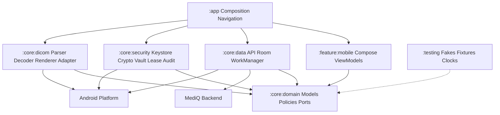
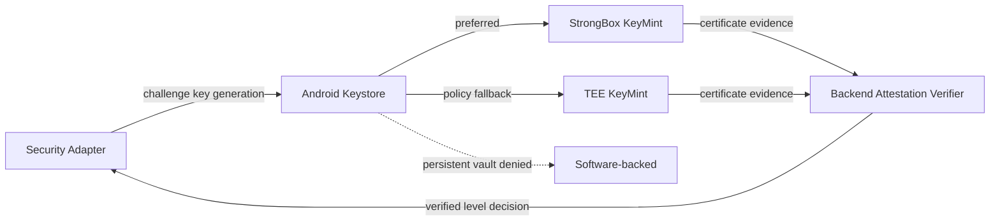
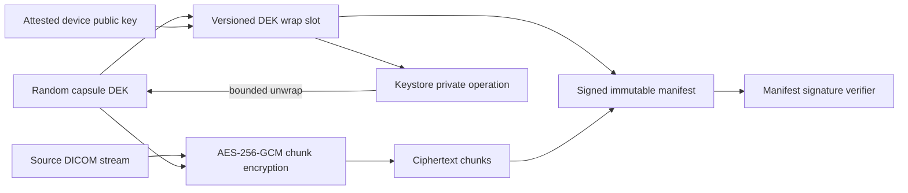
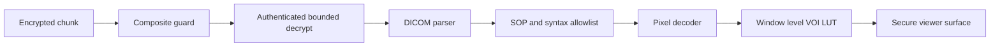
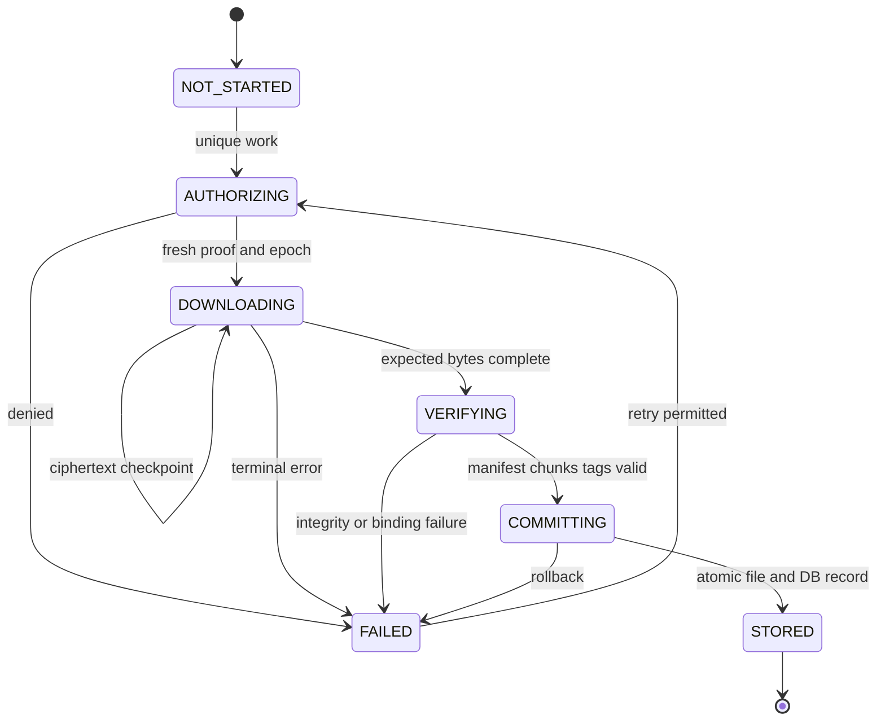
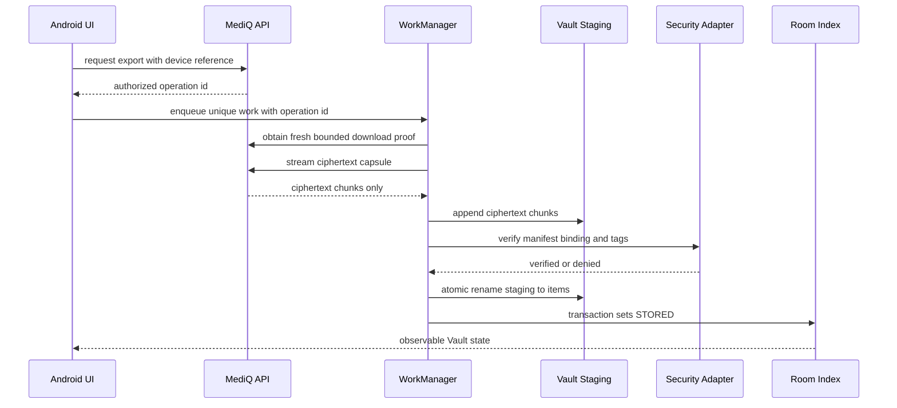
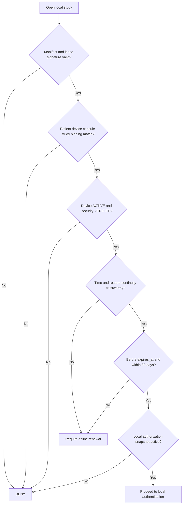
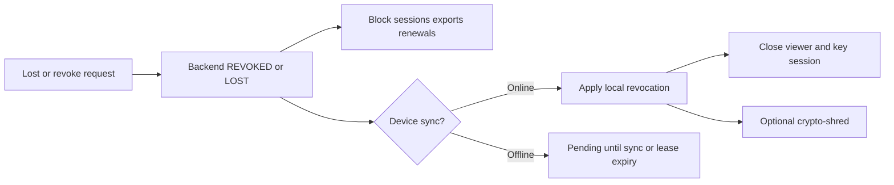
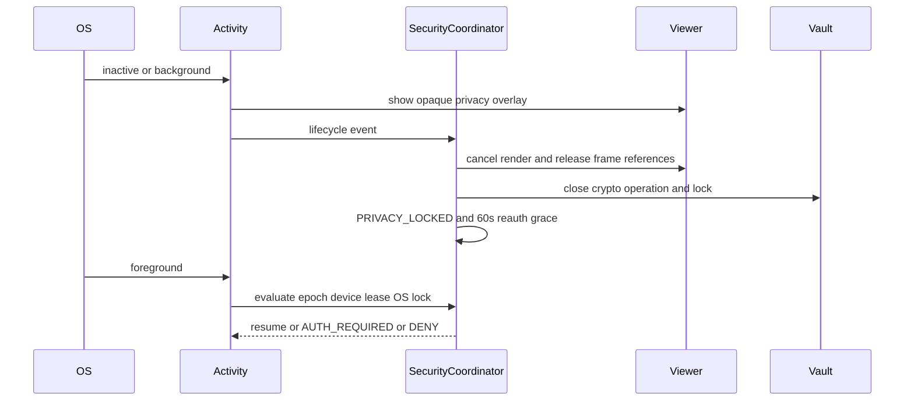
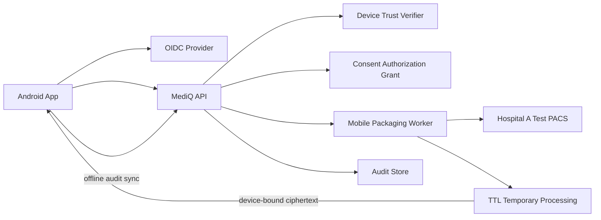

# MediQ Mobile Secure Vault — Android Application Architecture

**Project:** MediQ  
**Document:** `MOBILE-APP-ARCHITECTURE.md`  
**Version:** v1.1 Synthetic Health Data Preview Amendment  
**Baseline Date:** 2026-09-20  
**Scope:** CAPSTONE-P1 / Android-first / Synthetic·Test·De-identified DICOM  
**Status:** APPROVED P1 ARCHITECTURE BASELINE — DOCUMENTED, NOT IMPLEMENTED / NOT TESTED  
**Dependency:** P0 Golden Path와 P0 Security Validation PASS

---

# 1. Executive Summary

본 문서는 `MOBILE-UI-UX-SPEC.md`와 `MOBILE-NAVIGATION-AND-STATE-MODEL.md`을 Android에서 구현하기 위한 기술 아키텍처다.

P1 기준선은 Kotlin, Gradle Kotlin DSL, Jetpack Compose, Single Activity, Navigation Compose, ViewModel/StateFlow UDF, Coroutines, Hilt, Room, DataStore, WorkManager와 Android Keystore다. Backend가 Device-bound AES-256-GCM Capsule을 만들고 Android는 Ciphertext만 받아 내부 `noBackupFilesDir`에 저장한다.

StrongBox를 선호하고 서버가 검증한 TEE를 허용한다. Software/Unknown Key는 Persistent Vault에서 거부한다. DICOM Engine은 Adapter 뒤에 격리하며 Classic single-frame CT + Explicit VR Little Endian 실기기 Spike 후 선정한다.

현재 Android/Gradle 코드와 Mobile API는 없으며 구현·시험 상태는 `NOT IMPLEMENTED / NOT RUN`이다.

---

# 2. Architecture Context

```text
Hospital A Test PACS
→ MediQ Authorization + Patient Identity + Consent + study:mobile-export Grant
→ Device Admission + Device Public Key
→ TTL Temporary Packaging / Device-bound Encrypted Capsule
→ Android Ciphertext Download
→ App-private Vault
→ Offline Lease + Local Authentication
→ Local DICOM Viewer
```

Hospital PACS가 Source of Record다. Mobile App은 PACS를 직접 호출하거나 PACS Credential을 받지 않는다. Mobile Capsule을 병원에 직접 Upload하지 않으며 병원 간 전달은 별도 `study:pacs-transfer` Backend Exchange다.

비목표:

- Key Escrow와 Cross-device 복구
- Gallery/Shared Storage/Download Folder Export
- Permanent Cloud PACS/Archive
- 검증 없는 Custom DICOM Parser
- 모든 SOP Class, Transfer Syntax, Android Device 지원 주장
- 실제 환자·운영 PACS 사용

---

# 3. Current Implementation Baseline

| 영역 | 상태 | 근거 |
|---|---|---|
| Android Gradle/Manifest/Kotlin | NOT IMPLEMENTED | 관련 파일 없음 |
| Mobile UI/UX | DOCUMENTED | 15개 화면 |
| Navigation/State | DOCUMENTED | 9개 State Machine과 Composite Guard |
| Native Stack | ARCHITECTURE SELECTED | Version Pin은 구현 Ticket |
| Device/Mobile Export/Lease API | P1 CONTRACT SELECTED | `MOBILE-API-CONTRACT.md`; OpenAPI/구현 없음 |
| Capsule Format | P1 BASELINE SELECTED | `SECURE-MEDICAL-CAPSULE-FORMAT.md`; Crypto/Device Benchmark 필요 |
| DICOM Engine | OPEN DECISION | Compatibility·License·Fuzz 필요 |
| Physical Device Matrix | NOT AVAILABLE | StrongBox/TEE 기기 필요 |
| Acceptance | PLANNED / NOT RUN | TC-MOB-007~017 |

첨부된 Highpass의 Azure 전제와 Mobile P0 분류는 MediQ 기준을 대체하지 않는다. MediQ Android Vault는 `CAPSTONE-P1`이다.

---

# 4. Android Technology Baseline

## 4.1 채택

| 영역 | 선택 | 상태/경계 |
|---|---|---|
| Language/Build | Kotlin, Gradle Kotlin DSL, Version Catalog | ACCEPTED |
| UI/Navigation | Compose, Single Activity, Navigation Compose | ACCEPTED |
| State/Async | ViewModel, StateFlow, Coroutines/Flow | ACCEPTED |
| DI | Hilt, constructor injection | ACCEPTED |
| Structured Metadata | Room | 최소 Index + encrypted metadata blob |
| Settings | DataStore | 비민감 Preference만 |
| Persistent Work | WorkManager | Android 16 장기작업 Gate |
| Hardware Key | Android Keystore | StrongBox/TEE Physical Gate |
| Local Auth | AndroidX BiometricPrompt/CryptoObject | API/Device Matrix Gate |
| Network | HTTPS + Network Security Config | Cleartext fail closed |

## 4.2 보류

| 항목 | 결정 Gate |
|---|---|
| minSdk/targetSdk | StrongBox/TEE·Biometric·Background API Device Matrix |
| HTTP/OIDC SDK | Provider와 Streaming Spike |
| Device Wrap Algorithm | HPKE P-256 Profile 선택; Physical Device Crypto Matrix Gate |
| DICOM Engine | Android·License·Codec·Malformed Corpus Spike |
| Renderer | Bitmap/Canvas 대 OpenGL/SurfaceView Benchmark |
| Whole DB Encryption | Metadata field encryption Prototype 후 판단 |

의존성은 구현 시작 시 최신 Stable을 확인해 Version Catalog에 정확히 고정한다. Dynamic Version을 사용하지 않는다.

---

# 5. Architecture Overview

```text
UI/Feature → Domain Ports ← Data/Security/DICOM Adapters
                   ↑
              App Composition
```

## Diagram 1 — Android 전체 모듈 구조도



UI는 Keystore, File, Room, HTTP, DICOM Native API를 직접 호출하지 않는다.

---

# 6. Android Module Structure

Student MVP는 과도한 Gradle 분리를 피하기 위해 7개 물리 Module로 시작한다.

```text
android/
├── app/
├── core/domain/
├── core/data/
├── core/security/
├── core/dicom/
├── feature/mobile/
└── testing/
```

| Module | Responsibility | Public Interface | Dependencies | Sensitive Data | Security Boundary | Test Strategy |
|---|---|---|---|---|---|---|
| `:app` | App, Activity, Navigation, DI | Entry only | all runtime modules | 최소 Runtime state | Component/Back stack | Smoke/Navigation |
| `:core:domain` | Models, use cases, policy ports, reducers | Pure Kotlin interfaces | Kotlin only | Reference/state | Android-free policy | JVM property/unit |
| `:core:data` | API, Room, repositories, workers | Repository implementations | domain, security ports | Token handle/metadata | Network/DB/Worker | Mock server/migration |
| `:core:security` | Keystore, attestation client, capsule, vault, lease, audit | Narrow security ports | domain, Android | Key handle/ciphertext | Primary trust boundary | Device/instrumentation/fuzz |
| `:core:dicom` | Parser/decoder/renderer adapter | `DicomEngine`, `FrameSource` | domain | bounded plaintext frame | Untrusted parser | Corpus/memory/codec |
| `:feature:mobile` | MOB-01~15 UI/ViewModel | Destinations | domain | minimized display PHI | Capture/display | Compose/accessibility |
| `:testing` | Synthetic fixtures/fakes/clocks | Test-only | domain | Synthetic only | Release 제외 | Fixture validation |

`feature:mobile`은 `auth`, `identity`, `device`, `studies`, `export`, `vault`, `viewer`, `permissions`, `settings`, `navigation` Package로 논리 분리한다. 팀·빌드 규모가 커질 때만 별도 Module로 승격한다.

---

# 7. Dependency Architecture

주요 Domain Port:

```text
AuthRepository
PatientContextRepository
DeviceRegistrationRepository
DeviceTrustEvaluator
StudyRepository
MobileExportRepository
CapsuleDownloadRepository
VaultRepository
VaultKeyProvider
LeaseVerifier
LocalAuthorizationVerifier
DicomEngine
ViewerSessionController
AuditSink
SecureClock
```

규칙:

- Domain은 Android `Context`, Room Entity, HTTP DTO, Keystore Class를 참조하지 않는다.
- UI는 File Path, Key Alias, PACS URL 대신 opaque ID와 Domain Model만 사용한다.
- Worker는 Domain Use Case를 호출하고 정책을 재구현하지 않는다.
- Security Error는 `KeyUnavailable`, `IntegrityFailed`, `BindingMismatch`, `LeaseExpired` 같은 최소 오류로 변환한다.
- App Composition Root만 구현체를 연결한다.

---

# 8. Android Keystore Architecture

| Key | 위치/Owner | 목적 | Export | 수명 |
|---|---|---|---|---|
| Device Attested Wrap Key Pair | StrongBox/TEE Keystore | DEK Device Binding | Private 금지 | Device 등록 |
| Local Metadata KEK | StrongBox/TEE Keystore | Metadata DEK 보호 | 금지 | Vault 수명 |
| Capsule Content DEK | Backend 생성, Device Wrap Slot | DICOM AES-GCM | 원문 저장 금지 | Capsule 수명 |
| Server Signing Key | Backend KMS/HSM 후보 | Manifest/Lease 서명 | Device에 Private 없음 | 서버 정책 |
| TLS Session Key | OS Network Stack | 전송 보호 | 앱 관리 아님 | Session |

Alias에는 PHI·Hospital ID·DICOM UID를 넣지 않는다.

```text
mediq.v1.device-wrap.<opaque-device-ref>
mediq.v1.metadata-kek.<opaque-device-ref>
```

생명주기:

```text
Generate → Attest → Register → Activate → Use
→ Rotate/Rewrap → Revoke/Invalidate → Delete → Audit
```

Backend가 Packaging Resume를 위해 DEK를 보관해야 한다면 KMS/HSM으로 보호된 짧은 Operation TTL에만 허용하고 완료·취소·만료 후 Purge Evidence를 남긴다. Cloud Key Escrow는 없다.

## Diagram 2 — Keystore / StrongBox / TEE



---

# 9. StrongBox / TEE Integration

Domain 값은 `key_security_level: STRONGBOX | TRUSTED_ENVIRONMENT | SOFTWARE | UNKNOWN`을 그대로 사용한다.

| 항목 | StrongBox | TEE | Software |
|---|---|---|---|
| 정책 | Preferred | Server-verified 시 허용 | 거부 |
| 특성 | Secure element profile | Trusted execution environment | System software |
| 성능 | 상대적으로 느릴 수 있음 | 일반적으로 더 빠름 | 정책 미충족 |
| 호환성 | 일부 Device | 상대적으로 넓음 | 넓음 |
| 판정 | Attestation + KeyInfo | Attestation + KeyInfo | self-report 금지 |

StrongBox 생성 실패 시 검증된 TEE용 새 Key를 만들 수 있지만 Software Key로 자동 하향하지 않는다. 실제 Security Level을 저장하고 사용자에게 “로컬 저장 가능”과 Level을 구분해 표시한다.

Device Wrap v1 Profile은 `SECURE-MEDICAL-CAPSULE-FORMAT.md`에서 RFC 9180 HPKE Base Mode의 P-256/HKDF-SHA256/AES-256-GCM으로 선택했다. StrongBox/TEE Algorithm 지원, Attestation, Point Encoding, Provider 상호운용성과 성능은 Physical Device Matrix Gate를 통과해야 한다. Gate 실패 시 RSA-OAEP 또는 Software Key로 조용히 하향하지 않고 별도 ADR로 대체 Profile을 승인한다.

---

# 10. Hardware Key Attestation

```text
Backend Challenge
→ Hardware-backed Key Generation
→ Certificate Chain + Public Key + App/Device Integrity Evidence
→ Backend Verification
→ MobileDevice ACTIVE or DENY
```

Backend 검증:

- Nonce 일치·미사용·만료와 Replay 방지
- Certificate Chain/Trust Root/Revocation
- Attestation·Keymaster Security Level
- Public Key와 요청 Binding
- Verified Boot/Device Lock 승인 속성
- Package/Signing Certificate/App Integrity
- Device Integrity Signal과 Evidence Freshness

Client가 전송한 `STRONGBOX` 문자열은 증거가 아니다. 실패·Unavailable·속성 불일치·만료는 Fail Closed하며 Cloud Viewer만 검토한다.

재평가 Trigger는 OS/App Update, Security Patch 정책 만료, Biometric/Lock 변경, Key invalidation, Integrity 변화, Reboot/Restore 이상 및 Policy Version 변경이다.

---

# 11. Encrypted Vault Storage

```text
noBackupFilesDir/vault/
├── staging/<operation-id>.partial
├── items/<opaque-vault-item-id>.capsule
└── quarantine/<opaque-id>.invalid

Room DB
└── minimal operational index + encrypted metadata blob
```

- Ciphertext는 내부 App-private `noBackupFilesDir`에 둔다.
- Shared/External Storage, MediaStore, Gallery를 사용하지 않는다.
- Opaque ID만 File Name으로 사용한다.
- DICOM Payload는 Room BLOB로 저장하지 않는다.
- Room DB, DataStore, Audit Queue도 Backup/D2D에서 제외한다.

| 데이터 | 위치 | 보호 |
|---|---|---|
| Encrypted DICOM chunks | Capsule file | AES-256-GCM |
| Wrapped DEK slots | Immutable manifest | signature/authentication |
| Vault Index | Room | 최소 컬럼 + encrypted blob |
| Lease/Auth snapshot | Room/encrypted file | Backend signature/binding |
| Download state | Room | Token 없이 operation metadata |
| Offline Audit | encrypted local queue | sequence/integrity TBD |

DataStore에는 Theme, 접근성 등 비민감 설정만 저장한다.

---

# 12. Envelope Encryption

## Diagram 3 — Envelope Encryption



암호 규칙:

- Capsule별 CSPRNG DEK와 AES-256-GCM
- Chunk별 유일한 96-bit Nonce, 동일 DEK에서 재사용 금지
- AAD: format version, Capsule/Device/Study reference, object/chunk index, length, algorithm ID
- Chunk 순서·수·Manifest Hash 검증
- Tag 검증 전 Parser/Renderer에 Plaintext 전달 금지
- Resume는 기존 Ciphertext Chunk를 재수신하며 Client 재암호화 금지

PQC 전환은 Versioned `wrapped_key_slots[]` 계층에서 수행한다. Android Hardware가 PQC를 직접 지원한다고 가정하지 않으며 Hybrid/PQC Private Material 보호는 별도 Crypto ADR이 필요하다.

---

# 13. Vault Data Model

Android Local Model이며 Backend DB를 자동 변경하지 않는다.

```text
VaultItem
- vault_item_id, capsule_id, study_reference_id, source_hospital_reference
- capsule_file_name, format_version, crypto_suite_version
- wrapped_key_slot_ids
- integrity_status: PENDING | VERIFIED | FAILED
- capsule_status: ACTIVE | EXPIRED | REVOKED | CRYPTO_SHREDDED
- offline_expires_at, last_policy_verified_at
- created_at, last_accessed_at, security_epoch

DownloadRecord
- operation_id, vault_item_id
- state: NOT_STARTED | AUTHORIZING | DOWNLOADING | VERIFYING |
         COMMITTING | STORED | FAILED | CANCELLED
- bytes_received, expected_bytes, etag_or_version
- retry_count, security_epoch, last_error_code, updated_at
```

Bearer Token, URL, DEK, Key Alias 원문은 저장하지 않는다. DICOM UID가 필요하면 encrypted metadata blob 안에 최소 범위로 둔다.

Room 자체가 DB Encryption을 제공한다고 가정하지 않는다. 평문 컬럼은 opaque reference/상태로 최소화하고 표시 Metadata는 Metadata DEK로 AES-GCM 암호화한다. Whole-DB 암호화 Library는 License/NDK/성능 Gate 후 검토한다.

---

# 14. DICOM Parser

최초 Validation Target:

```text
Classic CT Image Storage
Explicit VR Little Endian
Monochrome single-frame, bounded dimensions/bit depth
Synthetic/Test fixture
```

MR, Implicit VR, Multi-frame, JPEG/JPEG-LS/JPEG 2000/RLE은 각각 시험 후 추가한다.

Parser Contract:

```text
inspectHeader(boundedSource) -> DicomDescriptor
validateProfile(descriptor) -> Supported | Rejected(reason)
openFrame(index, boundedDecryptedSource) -> EncodedPixelFrame
readMinimalMetadata(allowlistedTags) -> DisplayMetadata
```

강제 Limit:

- Capsule/Instance/Frame 크기와 Rows×Columns×Samples×Bits overflow
- Frame 수, Sequence depth, Element/Metadata 길이
- Transfer Syntax allowlist와 압축 해제 상한
- malformed offset/length, timeout, cancellation, memory budget

| 후보 | 장점 | 위험 | 결정 |
|---|---|---|---|
| dcm4che | 성숙한 Java 구현, MPL 1.1 | Android/ImageIO/크기 호환성 검증 | SPIKE |
| Imebra | Android build/Native 기능 | GPL/상용 License, JNI/NDK | SPIKE + LEGAL |
| DCMTK/GDCM | 성숙한 C++/Codec | JNI, memory safety, ABI/size | RESERVE |
| Custom parser | 좁은 범위 가능 | 표준·보안 오류 위험 | NOT RECOMMENDED |

---

# 15. DICOM Renderer

## Diagram 6 — Parser / Renderer



- 최초 MVP는 single-frame grayscale CT, Zoom/Pan/Window-Level이다.
- Decoder Output은 bounded Direct Buffer/짧은 Pixel Buffer로 전달한다.
- 원본 16-bit/렌더 결과를 Disk Cache나 Thumbnail로 저장하지 않는다.
- Compose 안에서 `AndroidView` secure Surface 또는 검증된 Canvas path를 사용한다.
- `SurfaceView.setSecure(true)`와 Window `FLAG_SECURE`를 함께 검토한다.
- Bitmap/Canvas 대 OpenGL은 memory peak, copy count, 반응성, OEM Capture Test로 결정한다.

진단용 의료기기 성능을 주장하지 않는다.

---

# 16. Local Viewer Security

| 자산 | 수명/위치 | 통제 |
|---|---|---|
| Unwrapped DEK | memory/Keystore operation | Background/close 폐기 |
| Decrypted chunk | bounded memory | parse 후 release |
| Pixel Buffer | current/bounded frames | lifecycle clear/reference release |
| Thumbnail | 기본 금지 | derived asset 별도 승인 |
| Viewer Cache | memory-only bounded | session clear |
| Clipboard/Share/FileProvider | 금지 | 관련 Action/Provider 없음 |

```text
ELIGIBLE_LOCAL_OPEN
→ BiometricPrompt/CryptoObject
→ Vault key operation
→ ALLOW_LOCAL_KEY_OPERATION
→ GCM verify
→ DICOM profile validation/decode
→ Viewer ACTIVE
→ ALLOW_PIXEL_RENDER
```

모든 메모리에서 즉시 완전 삭제된다고 주장하지 않는다. 수명 최소화, Buffer overwrite best effort, Render stop, Dump 억제를 함께 사용한다.

---

# 17. WorkManager Architecture

| Work | 목적 | Constraint | Unique Key |
|---|---|---|---|
| `CapsuleDownloadWork` | Ciphertext download/verify/commit | Network, StorageNotLow | `capsule-download:<operationId>` |
| `VaultCleanupWork` | stale staging/quarantine 정리 | 없음 | `vault-cleanup` |
| `PolicySyncWork` | Device/Grant/Lease sync | Network | `policy-sync:<deviceId>` |
| `AuditUploadWork` | Offline audit upload | Network | `audit-upload:<deviceId>` |

Lease 만료는 Worker 실행에 의존하지 않고 Viewer Open마다 동기 검증한다.

## Diagram 5 — Download State



`CoroutineWorker`, Exponential Backoff, Unique Work, cancellation cleanup을 사용한다. InputData에는 Operation ID만 넣고 Token/URL을 넣지 않는다. Worker 실행 시 짧은 Credential을 얻는다. Progress는 실제 byte/서버 상태만 보고한다.

Android 16 Long-running Worker Job Quota 때문에 대용량 사용자 시작 전송은 User-initiated Data Transfer Job 또는 직접 Foreground Service와 비교한다. 최초 Synthetic CT는 WorkManager로 검증한다.

---

# 18. Secure Download

## Diagram 4 — Mobile Export → Vault



Network 규칙:

- HTTPS only, `usesCleartextTraffic=false`, Network Security Config
- PACS URL을 받지 않으며 Capsule Client Redirect는 기본 거부
- 필요 시 동일 승인 Origin Allowlist만 허용하고 Authorization Header를 타 Origin에 전달하지 않음
- Hostname/Certificate 실패는 Fail Closed
- Certificate Pinning은 Rotation/Recovery 운영계획 전 도입하지 않음
- Content-Type, size, ETag/version, Capsule/Device binding 검증

Partial/Resume 규칙:

- Partial File은 Ciphertext만 포함한다.
- 완전 수신된 Chunk 경계만 checkpoint한다.
- Operation/Capsule/ETag/Epoch mismatch이면 Partial을 활성화하지 않는다.
- Grant/Device 무효 시 취소·격리·정리한다.
- Storage Full은 자동 Retry가 아닌 사용자 조치 오류다.

---

# 19. Atomic Vault Commit

활성화 조건:

```text
Expected ciphertext complete
AND manifest signature valid
AND Patient/Device/Study/Grant binding valid
AND required GCM tags valid
AND metadata/profile valid
AND device key available
AND lease valid
AND security_epoch unchanged
```

Commit:

1. Staging File write/flush 결과를 확인한다.
2. Manifest/Chunk/Binding을 재검증한다.
3. 동일 Filesystem에서 opaque final name으로 atomic rename한다.
4. Room Transaction으로 `VaultItem=STORED`를 기록한다.
5. DB 실패 시 Final File을 orphan으로 두고 UI에 노출하지 않는다.
6. 앱 시작 시 staging/orphan reconciliation을 수행한다.

File과 DB는 단일 ACID Transaction이 아니므로 Reconciliation이 필수다. Download 시작만으로 `STORED`를 표시하지 않는다.

---

# 20. Offline Lease

```text
lease_id
capsule_id
patient_reference_id
device_id
study_reference_id
mobile_export_grant_id
issued_at
expires_at
policy_version
security_epoch
signature_algorithm
signature
```

Hospital-local ID와 원문 Study UID 대신 MediQ Reference를 사용한다.

## Diagram 7 — Offline Lease 검증



Android Keystore/TEE가 Trusted Offline Clock을 자동 제공한다고 가정하지 않는다. Signed Server Time, local monotonic elapsed time, Boot/Reboot, Wall Clock rollback, Restore/Binding mismatch, Security Epoch를 조합한다. 안전하게 판단할 수 없으면 Online Revalidation을 요구한다. 정확한 Algorithm은 Threat Test 후 별도 ADR로 확정한다.

---

# 21. Consent / Grant Revocation

다음은 서로 다른 상태다.

```text
Consent WITHDRAWN
Grant REVOKED
MobileDevice REVOKED or LOST
Lease EXPIRED or REVOKED_ON_SYNC
Capsule REVOKED or CRYPTO_SHREDDED
Local delete pending or confirmed
```

Server Revoke는 새 Export, Viewer Session, Lease Renewal, Reissue와 해당 Server Action을 차단한다. Device Sync 후 Local Viewer를 닫고 Key Session을 제거한다. Offline Device에는 즉시 수신을 보장하지 않으며 기존 Lease 만료가 상한이다.

## Diagram 9 — Device Revocation



Remote Delete는 `REQUESTED`, `DELIVERED`, `APPLIED`, `CONFIRMED`를 구분하기 전에는 완료로 주장하지 않는다.

---

# 22. Background Protection

## Diagram 8 — Background Lock



Activity Callback만 신뢰하지 않는다. App-level Lifecycle, Window Focus, OS Lock Signal을 함께 처리한다. Process 재시작은 Vault `LOCKED`, Viewer `CLOSED`다. 60초 동안에도 Privacy Overlay는 유지하며 유예는 재인증 생략 가능 여부에만 적용한다.

---

# 23. Screen Capture Protection

- MOB-02와 MOB-05~15 보호 Window에 `FLAG_SECURE` 적용
- Viewer Surface 사용 시 attach 전 `setSecure(true)` 검토
- Background 전 Opaque Overlay로 Recent Apps Snapshot 보호
- Media Projection/External Display Signal이 있으면 Viewer Pause/Block
- Screenshot Detection은 탐지 신호이며 접근통제 대체물이 아님
- Share Intent, Clipboard, FileProvider를 통한 DICOM/Pixel 외부 전달 없음

OEM/OS 취약점, Root 환경, 외부 카메라 촬영까지 완전 차단한다고 주장하지 않는다.

---

# 24. Logging & Sensitive Data Protection

절대 일반 Log에 남기지 않는다.

- DICOM Pixel/Raw Payload/Decrypted Chunk
- Access/Refresh/Transfer Token
- DEK/KEK/Private Key/Wrapped Key 원문
- Patient 이름·주민번호·생년월일·Hospital Patient ID
- Study/Series/SOP UID 원문
- PACS Endpoint/Credential
- Attestation Chain 전체, File Path, Key Alias 전체

Release에서 HTTP body logging과 verbose Crypto/DICOM log를 제거한다. Debug도 Synthetic 데이터만 사용한다.

Structured Audit:

```text
event_id, event_type, actor_reference, device_reference,
vault_item_reference, timestamp, result, reason_code,
correlation_id, operation_id, security_epoch, sequence_number
```

Offline Queue는 encrypted app-private store에 두고 Backend는 `event_id`로 Idempotent 처리한다. Audit upload 실패가 Viewer Allow로 이어져서는 안 된다.

---

# 25. Android Platform Security

## 25.1 Manifest/Network

- 모든 Component에 `android:exported` 명시, 외부 진입 불필요 시 `false`
- 외부 Storage/Photo/Contact/Location Permission 없음
- Cleartext 금지와 승인 Origin만 사용
- FileProvider 기본 미사용; 향후 필요 시 exported false와 최소 path
- OIDC Redirect와 승인 App Link만 등록
- Deep Link의 Patient/Study/Capsule ID를 권한으로 신뢰하지 않음

## 25.2 Backup/Restore

- Android Version별 `fullBackupContent`와 `dataExtractionRules`를 함께 설정한다.
- Capsule, Room DB, DataStore, Audit Queue, staging을 Backup/D2D에서 제외한다.
- Cloud Backup, D2D, OEM Migration, reinstall을 Physical Test한다.
- Restore/Binding mismatch는 Vault 복원이 아니라 새 Device 등록으로 처리한다.

---

# 26. Threat Model

| Threat | Asset/Attack | Control | Detection | Response | Residual Risk |
|---|---|---|---|---|---|
| Root/Compromise | memory/file hooking | integrity + hardware key | server signal | vault deny | root hiding/zero-day |
| Key Extraction | private key | non-exportable StrongBox/TEE | attestation/key error | revoke/reissue | authorized on-device misuse |
| Device Theft | active session | local auth/lease/background lock | lost report | revoke/deny renewal | offline until expiry |
| Token Theft | log/storage/network | PKCE, short token, no WorkData token | auth anomaly | revoke | OS memory compromise |
| Offline Replay | copied capsule/lease | device binding/signature | mismatch | deny | secure-time limit |
| Clock Manipulation | lease extension | signed time/monotonic/reboot | uncertainty | online validation | no universal trusted clock |
| Screenshot | pixels | secure window/surface | platform signal | pause | external camera/OEM bypass |
| Backup Leakage | capsule/metadata | explicit exclusion/binding | restore test | deny | OEM variance |
| Temp Leakage | partial/plain file | ciphertext-only staging | reconciliation | quarantine/delete | flash remnants |
| Malicious DICOM | parser exploit | allowlist/bounds/adapter | errors/watchdog | reject | upstream native flaw |
| Memory Exhaustion | huge frame | overflow/budget | telemetry | cancel | OEM variance |
| Download Corruption | payload | TLS/signature/GCM | verification | never commit | DoS |
| Grant Revocation | stale snapshot | sync/renewal/lease | server sync | close/revoke | offline delay |
| Device Cloning | app data copy | hardware binding | unwrap fail | re-register | advanced hardware attack |
| Stale Response | late allow | operation binding/epoch | mismatch | discard | implementation bug |
| Supply Chain | DICOM binary | version pin/SBOM/license | CI scan | block release | upstream compromise |

---

# 27. Test Strategy

Unit/JVM:

- Composite Guard deny precedence, 30일/60초 경계, rollback
- Manifest/AAD/Chunk order/Nonce uniqueness
- Download State, Atomic reconciliation, stale epoch
- DICOM length/dimension overflow와 allowlist

Instrumentation:

- Keystore generation/invalidation/deletion, BiometricPrompt
- app-private storage/backup, lifecycle/process death
- Room migration, WorkManager restart/cancel, capture protection

Physical Device:

- StrongBox/TEE 각각 최소 1대와 Software/Unknown deny
- Attestation server verification, biometric enrollment 변화
- Screenshot/record/external display, backup/D2D restore
- 대형 Capsule memory/performance/thermal

DICOM:

- Golden Classic CT Explicit VR LE
- unsupported SOP/syntax, truncated/corrupt/oversized corpus
- Multi-frame/compressed는 Unsupported 확인 후 별도 시험
- Parser/Decoder fuzz와 memory budget

---

# 28. Android Security Test Matrix

| Test ID | Component | Scenario | Environment | Expected | Current |
|---|---|---|---|---|---|
| AND-SEC-001 | Keystore | StrongBox attested key | Physical StrongBox | allow candidate/evidence | NOT RUN |
| AND-SEC-002 | Keystore | TEE attested key | Physical TEE | policy allow/evidence | NOT RUN |
| AND-SEC-003 | Admission | Software/Unknown | Emulator/physical | export/vault deny | NOT RUN |
| AND-SEC-004 | Attestation | replay challenge | Integration | deny | NOT RUN |
| AND-SEC-005 | Binding | Capsule copied device | 2 physical | unwrap/view deny | NOT RUN |
| AND-SEC-006 | Crypto | modified ciphertext/tag | JVM/device | no frame | NOT RUN |
| AND-SEC-007 | Metadata | modified manifest/lease | JVM/device | deny | NOT RUN |
| AND-SEC-008 | Lease | 30-day boundary | Fake clock/device | expired deny | NOT RUN |
| AND-SEC-009 | Lease | clock rollback/reboot | Physical | revalidate/deny | NOT RUN |
| AND-SEC-010 | Lifecycle | background viewer | Emulator/physical | privacy/buffer release | NOT RUN |
| AND-SEC-011 | Capture | screenshot/record/display | Physical OEM | platform-range block | NOT RUN |
| AND-SEC-012 | Work | process kill/resume | Emulator/physical | no false STORED | NOT RUN |
| AND-SEC-013 | Work | storage full | Emulator/physical | terminal/no active item | NOT RUN |
| AND-SEC-014 | Race | renewal vs revoke | Integration/device | revoke wins | NOT RUN |
| AND-SEC-015 | Backup | Cloud/D2D restore | Physical | unusable old Vault | NOT RUN |
| AND-SEC-016 | DICOM | malformed dimensions | JVM/device | bounded reject | NOT RUN |
| AND-SEC-017 | DICOM | Golden CT | Emulator/physical | parse/render pass | NOT RUN |
| AND-SEC-018 | Logging | token/key/PHI scan | CI/device log | zero finding | NOT RUN |
| AND-SEC-019 | Network | cleartext/redirect/cert fail | Instrumentation | fail closed | NOT RUN |
| AND-SEC-020 | Delete | crypto-shred | Physical | old capsule decrypt deny | NOT RUN |

StrongBox/TEE, OEM Capture, Backup/D2D, Key invalidation은 Emulator만으로 PASS 처리하지 않는다.

---

# 29. Backend Integration

Azure는 선택적 Deployment Profile이며 Android Contract는 Cloud Provider에 종속되지 않는다.

## Diagram 10 — Android ↔ Backend



| 영역 | Contract | 상태 |
|---|---|---|
| Authentication | Authorization Code + PKCE; 등록 후 DPoP Profile | P1 CONTRACT / IAM GATE |
| Patient Context | 기존 Exchange/Patient Binding 재사용 범위 | OPEN DECISION |
| Device Challenge/Register | `/mobile/attestation-challenges`, `/mobile/devices` | P1 CONTRACT |
| Study List/Detail | `/mobile/studies...` | PROPOSED API |
| Mobile Export | `/exchange-sessions/{sessionId}/actions/mobile-export` | P1 CONTRACT |
| Operation/Capsule | operation, download session, envelope/chunk, storage ack | P1 CONTRACT |
| Lease | `/mobile-capsules/{capsuleId}/lease-issuances`, `/mobile-leases/{leaseId}/renewals` | P1 CONTRACT |
| Lost/Retire | `/mobile/devices/{deviceId}/revocations` | P1 CONTRACT |
| Audit Sync | `POST /mobile/audit-events` batch | P1 CONTRACT |
| Cloud Viewer | P0 view action | EXISTING P0 |
| Consent/Grant revoke | P0 endpoints | EXISTING P0 |

상세 Path, Schema, Error, Idempotency와 Security Matrix는 `MOBILE-API-CONTRACT.md`를 따른다. 구현 전 별도 Mobile OpenAPI, Domain/Data/ERD, Security, Acceptance를 함께 개정한다.

---

# 30. P0 / P1 / P2 Scope

| MediQ Scope | 내용 |
|---|---|
| CAPSTONE-P0 선행 | Backend E2E, Cloud Viewer, PACS Import, Security Negative PASS |
| CAPSTONE-P1 Core | Android identity/admission/export/capsule/vault/Golden CT/30일 Lease/background |
| CAPSTONE-P1 Hardening | lost/reissue, resume, revoke sync, device matrix, crypto-shred |
| P2/Productionization | iOS, 추가 Codec/Modality, Fleet/Telemetry/Incident, scale |
| OUT-OF-SCOPE | Mobile direct hospital upload, escrow, permanent cloud archive |

---

# 31. Open Decisions

| ID | 항목 | 권고/Gate |
|---|---|---|
| APP-OD-001 | minSdk/targetSdk | Physical Device/API Matrix |
| APP-OD-002 | Device Wrap Algorithm | HPKE P-256 StrongBox/TEE interop gate; 대체 Profile은 별도 ADR |
| APP-OD-003 | Capsule Chunk Size/Format | v1 1 MiB 기준; Resume/memory benchmark로 허용 범위 검증 |
| APP-OD-004 | DICOM Engine | compatibility/license/fuzz |
| APP-OD-005 | Renderer | memory/FPS/capture benchmark |
| APP-OD-006 | Metadata DB Encryption | encrypted blob prototype/legal |
| APP-OD-007 | Auth SDK/Provider | System browser + PKCE IAM decision |
| APP-OD-008 | Large Download API | WorkManager vs UIDT/FGS Android 16 |
| APP-OD-009 | Secure Time | Threat test |
| APP-OD-010 | Offline Audit Queue | format/integrity/retention |
| APP-OD-011 | Certificate Pinning | 운영 PKI/rotation 후 결정 |
| APP-OD-012 | Remote Delete | 상태/보장 Backend contract |
| APP-OD-013 | Native Crash Dump | Pixel/Plaintext exposure test |
| APP-OD-014 | Exact Versions | kickoff stable pin + SBOM |

---

# 32. Acceptance Criteria

- Module Dependency가 본 문서 방향을 지킨다.
- Software/Unknown Key에서 Persistent Vault가 생성되지 않는다.
- Attestation을 Backend에서 검증한다.
- Download 경로에 평문 DICOM File이 없다.
- Nonce 재사용이 없고 변조 Capsule이 활성화되지 않는다.
- Atomic Commit 전 `STORED`를 표시하지 않는다.
- Room/DataStore/Backup/Log에 금지 데이터가 없다.
- Viewer가 Open/Resume마다 Composite Guard와 Lease를 검증한다.
- Background 즉시 Privacy Lock/Render stop/Buffer release가 동작한다.
- Process restart 후 Vault `LOCKED`, Viewer `CLOSED`다.
- Golden CT/Explicit VR LE가 Physical Device에서 검증된다.
- Unsupported/Corrupt DICOM은 bounded failure다.
- StrongBox/TEE를 실제 Physical Evidence로 구분한다.
- `TC-MOB-007~017`과 `AND-SEC-001~020` 증거가 연결된다.

실행 증거 없이 PASS로 표시하지 않는다.

---

# 33. References

Repository: `REQUIREMENTS.md`, `SECURITY-REQUIREMENTS.md`, `DOMAIN-MODEL.md`, `DATA-MODEL.md`, `SYSTEM-ARCHITECTURE.md`, `DATA-FLOW.md`, `OPENAPI.yaml`, `THREAT-MODEL.md`, `ACCEPTANCE-TESTS.md`, `IMPLEMENTATION-PLAN.md`, `TECH-STACK-DECISION.md`, `MOBILE-UI-UX-SPEC.md`, `MOBILE-NAVIGATION-AND-STATE-MODEL.md`, `MOBILE-APP-ARCHITECTURE.md`, `SECURE-MEDICAL-CAPSULE-FORMAT.md`, `DICOM-INTEROPERABILITY-PROFILE.md`.

Android official:

- <https://developer.android.com/topic/architecture>
- <https://developer.android.com/topic/architecture/ui-layer>
- <https://developer.android.com/topic/modularization>
- <https://developer.android.com/privacy-and-security/keystore>
- <https://developer.android.com/reference/android/security/keystore/KeyInfo>
- <https://developer.android.com/privacy-and-security/security-key-attestation>
- <https://developer.android.com/identity/sign-in/biometric-auth>
- <https://developer.android.com/develop/background-work/background-tasks/persistent>
- <https://developer.android.com/develop/background-work/background-tasks/persistent/how-to/long-running>
- <https://developer.android.com/develop/background-work/background-tasks/data-transfer-options>
- <https://developer.android.com/training/data-storage/app-specific>
- <https://developer.android.com/privacy-and-security/risks/backup-best-practices>
- <https://developer.android.com/privacy-and-security/security-config>
- <https://developer.android.com/reference/android/view/WindowManager.LayoutParams>
- <https://developer.android.com/privacy-and-security/security-tips>

DICOM/Security:

- <https://dicom.nema.org/medical/dicom/current/output/chtml/part05/PS3.5.html>
- <https://dicom.nema.org/medical/dicom/current/output/chtml/part18/PS3.18.html>
- <https://mas.owasp.org/MASVS/>
- <https://mas.owasp.org/MASTG/>
- <https://github.com/dcm4che/dcm4che>
- <https://imebra.com/wp-content/uploads/documentation/html/html/>

---

# 34. Completion Boundary

본 문서는 Architecture를 확정했지만 Android Project, Dependency Version, API, Keystore/Crypto, DICOM Engine, WorkManager/Room/Compose 및 Device Test를 구현하지 않았다.

후속 순서:

```text
APP-OD-001/002/004/008 Validation Spike
→ Mobile OpenAPI 승인
→ Android Scaffold
→ Device Admission vertical slice
→ Capsule Crypto + Atomic Download
→ Golden CT Viewer
→ Lease/Background/Revocation Acceptance
```

---

# 35. Synthetic Health Data Preview Architecture — 2026-09-26

Preview는 Mobile App의 Optional Feature Module로 격리한다.

```text
:feature:health-preview
  → preview UI and state
  → HealthDataProvider port
  → MockHealthDataProvider
  → SyntheticFixtureValidator
  → DemoAuditPort
```

Rules:

- `:feature:health-preview`는 `:feature:vault`, Viewer, QR 또는 PACS 기능에 의존하지 않는다.
- Capstone Build Variant는 Mock Provider만 Dependency Injection graph에 등록한다.
- 실제 Provider Class, 운영 URL, Credential, 인증서와 Secret을 포함하지 않는다.
- Fixture는 `:testing` 또는 승인된 Demo Asset에서 공급하고 Release 운영데이터로 승격하지 않는다.
- Network Client가 필요 없는 Local Fixture가 최초 구현 기본값이다.
- 실제 Backend Connector가 필요한 시점에는 Mobile OpenAPI와 Productionization Architecture를 별도 승인한다.

Preview 구현 순서는 P0와 Mobile Core Gate 이후 `MEDIQ-HHP-001~005`를 따른다.
