# MediQ Mobile Navigation and Security State Model

**Project:** MediQ  
**Product:** Patient-Controlled Medical Imaging Mobility SaaS  
**Document:** `MOBILE-NAVIGATION-AND-STATE-MODEL.md`  
**Version:** v1.1 Synthetic Health Data Preview Amendment  
**Baseline Date:** 2026-09-20  
**Scope:** CAPSTONE-P1 / Android-first Mobile Secure Vault  
**Status:** APPROVED P1 DESIGN BASELINE — DOCUMENTED, NOT IMPLEMENTED / NOT TESTED  
**Depends On:** P0 Golden Path와 P0 Security Validation PASS  
**Native State Technology:** OPEN DECISION

---

# 1. Executive Summary

본 문서는 MediQ Mobile Secure Vault에서 화면 이동과 보안 상태를 분리하고, 의료영상의 로컬 접근 여부를 여러 독립 상태 머신의 합성 결과로 결정하는 기준을 정의한다.

핵심 원칙은 다음과 같다.

```text
Navigation State != Security State

Online API Authorization != Offline Local Decryption Authorization

Server Revocation Recorded != Offline Device Revocation Applied

Encrypted File Exists != Vault Key Available != Viewer Access Allowed
```

화면이 Local Viewer에 머물러 있어도 Lease 만료, Device Revoke, Integrity 실패 또는 Background 전환이 발생하면 픽셀 접근을 즉시 중단한다. 반대로 Server Access Token이 만료되어도 유효한 Device-bound Capsule, Local Authentication 및 Offline Lease가 있으면 승인된 오프라인 열람은 가능할 수 있다.

이 문서는 Navigation·State Management·API·DB 또는 암호화 코드를 구현하지 않는다. 현재 Mobile App과 Mobile API는 `NOT IMPLEMENTED`, 관련 시험은 `NOT RUN`이다.

---

# 2. Scope & Architecture Context

## 2.1 정식 범위

- `MOBILE-UI-UX-SPEC.md`의 `MOB-01`~`MOB-15` Navigation Guard
- Authentication, Patient Identity, Device Registration, Device Security, Vault, Offline Lease, Consent/Grant, Viewer Session, App Lifecycle 상태
- Online/Offline Composite Security Decision
- Background Lock, Resume, Reauthentication, Revocation
- 상태 전이, Race Condition, Persistence, Audit 및 시험 기준

## 2.2 경계

- P1은 Android Native Vault가 우선이다.
- Persistent Vault는 검증된 Android `STRONGBOX` 또는 `TRUSTED_ENVIRONMENT`만 허용한다.
- Mobile Payload는 AES-256-GCM, Capsule별 DEK, Device-bound Wrap Slot으로 보호한다.
- Offline Lease는 마지막 발급 또는 성공한 온라인 정책 검증 후 최대 30일이다.
- Background 진입 즉시 민감 화면과 복호화 Pixel Buffer를 보호하며 60초는 재인증 편의 유예일 뿐이다.
- Mobile Capsule 또는 복호화 DICOM을 다른 병원에 직접 업로드하지 않는다.
- 병원 간 전달은 별도 Consent와 `study:pacs-transfer` Grant를 사용하는 Backend Exchange/STOW-RS 흐름이다.
- Hospital PACS가 Source of Record이며 새 Device 재발급은 Source PACS에서 다시 시작한다.

## 2.3 상태 계층

| 계층 | 예 | 권위 |
|---|---|---|
| Domain State | `MobileDevice.ACTIVE`, `SecureMedicalCapsule.REVOKED` | Backend/승인 Domain |
| Server Authorization State | Consent, Grant, Account, Device 상태 | Backend |
| Signed Offline Evidence | Capsule/Device/Patient/Lease Binding | Backend 발급, Device 검증 |
| Client Security State | Vault `LOCKED`, Device Security `ASSESSING` | Device Runtime |
| Navigation State | `MOB-09`, Dialog, Tab | UI Router |
| Operation State | Downloading, Verifying, Renewing | Backend Operation + Client |

Domain과 OpenAPI에 없는 Client 상태는 본 문서에서 `CLIENT` 또는 `UI-DERIVED`로 표시한다. 이를 Database Enum이나 API Enum으로 자동 채택하지 않는다.

---

# 3. Current Implementation Baseline

| 항목 | 상태 | 근거 |
|---|---|---|
| Mobile UI/UX | DOCUMENTED | `MOBILE-UI-UX-SPEC.md` |
| Mobile Domain Objects | DOCUMENTED | `MobileDevice`, `SecureMedicalCapsule`, `MobileViewerSession` |
| Android App | NOT IMPLEMENTED | Native Project 없음 |
| Navigation/State Store | NOT IMPLEMENTED | 기술 미선정 |
| Device Registration API | P1 CONTRACT / NOT IMPLEMENTED | `MOBILE-API-CONTRACT.md`; Mobile OpenAPI 없음 |
| Mobile Export/Lease API | P1 CONTRACT / NOT IMPLEMENTED | `MOBILE-API-CONTRACT.md`; Mobile OpenAPI 없음 |
| Consent/Grant API | PARTIAL CONTRACT | P0 Withdraw/Revoke 존재 |
| Cloud Viewer Fallback | DOCUMENTED / P0 CONTRACT | Backend Viewer Gateway |
| Mobile Security Tests | PLANNED / NOT RUN | `TC-MOB-007`~`TC-MOB-019` |

첨부된 Highpass 프롬프트는 구성 참고자료다. Azure 전제, Secure Sharing 및 첨부안의 상태명은 MediQ 승인 기준을 대체하지 않는다.

---

# 4. Design Principles

1. **State Separation:** Router 위치를 권한 증거로 사용하지 않는다.
2. **Independent Machines:** 인증, Device, Lease, Vault는 독립적으로 변경될 수 있다.
3. **Fail Closed:** 상태가 누락·손상·불명확하면 보호 데이터 접근을 거부한다.
4. **Offline Intent:** 네트워크 부재 자체는 유효한 Offline Lease를 무효화하지 않는다.
5. **Authority Separation:** Backend의 현재 상태와 Device의 마지막 Signed Snapshot을 구분한다.
6. **Deny Dominance:** Allow 조건 하나보다 Deny 신호 하나가 우선한다.
7. **Freshness:** 오래된 비동기 응답이 최신 Security Epoch를 덮어쓰지 못한다.
8. **Least Persistence:** Unwrapped Key, Plaintext Frame, Token은 필요한 최소 수명만 메모리에 둔다.
9. **Honest Revocation:** 서버 철회, Device 동기화, Local Key 파기를 별도 상태로 기록한다.
10. **Observable Decisions:** 중요한 상태 전이와 거부는 Correlation Context를 포함해 감사한다.

---

# 5. Global Navigation Flow

대표 사용자 흐름은 직선처럼 보이지만 내부 Security State는 항상 독립 평가한다.

## Diagram A — 전체 Mobile Navigation Flow

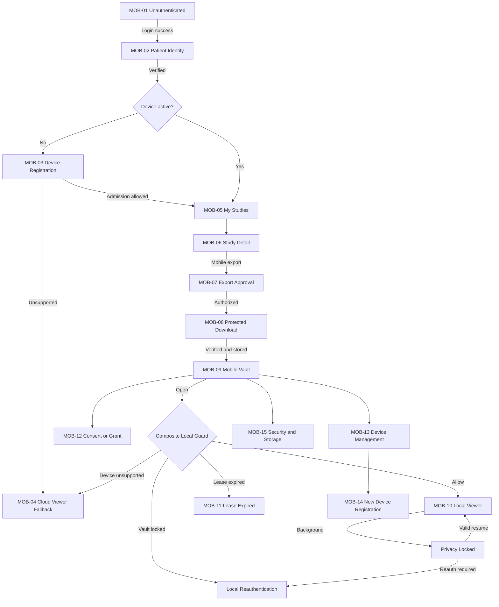

Navigation 명령은 `Navigate`, `Replace`, `ClearSensitiveBackStack`, `ShowPrivacyOverlay`로 구분한다. Logout, Patient Context 변경, Device Revoke 및 Crypto-shred에서는 보호 화면 Back Stack을 제거한다.

---

# 6. State Model Overview

| Machine | 책임 | Authoritative Source | Local Access 영향 |
|---|---|---|---|
| Authentication | Online API Session | Identity Provider/Backend | Online 필수, Offline은 직접 필수 아님 |
| Patient Identity | Subject↔PatientReference | Backend + Signed Capsule Binding | Online 목록/Export와 Local Capsule Binding |
| Device Registration | Device lifecycle | Backend Domain | `ACTIVE`만 허용 |
| Device Security | Runtime admission posture | Backend verified evidence + Device signal | `VERIFIED`만 Persistent Vault 허용 |
| Vault | Key와 encrypted store 접근 | Device | `UNLOCKED` 필요 |
| Offline Lease | 시간 제한 Local right | Signed lease + Local validation | `ACTIVE` 필요 |
| Consent/Grant | 업무 권한 | Backend; Offline은 signed snapshot | Export/renewal 및 local continuation |
| Viewer Session | 픽셀 표시 Session | Device | `ACTIVE`에서만 표시 |
| App Lifecycle | Foreground/Background | OS | Background 시 Privacy lock |

## 6.1 Domain 상태와 Client 상태 매핑

| 대상 | 정식 Domain 상태 | Client/Workflow 상태 |
|---|---|---|
| MobileDevice | `PENDING`, `ACTIVE`, `REVOKED`, `LOST`, `RETIRED` | `UNREGISTERED`, `REGISTRATION_FAILED` |
| Key Security | `STRONGBOX`, `TRUSTED_ENVIRONMENT`, `SOFTWARE`, `UNKNOWN` | `ASSESSING`, `LIMITED`, `UNSUPPORTED`, `REASSESSMENT_REQUIRED` |
| Attestation | `VERIFIED`, `FAILED`, `UNAVAILABLE` | 검사 진행 상태 |
| Capsule | `ACTIVE`, `EXPIRED`, `REVOKED`, `CRYPTO_SHREDDED` | Download/Verify Operation 상태 |
| MobileViewerSession | `ACTIVE`, `PRIVACY_LOCKED`, `AUTH_REQUIRED`, `CLOSED` | `AUTHORIZING`, `LOADING`, `TERMINATED` |

---

# 7. Authentication State

## 7.1 상태

| State | 유형 | 의미 |
|---|---|---|
| `UNAUTHENTICATED` | CLIENT | 유효 Server Session 없음 |
| `AUTHENTICATING` | CLIENT | OIDC 흐름 진행 중 |
| `AUTHENTICATED` | CLIENT+CACHE | Online API 호출 가능한 Session |
| `SESSION_EXPIRED` | CLIENT | Access Session 만료 감지 |
| `REAUTHENTICATION_REQUIRED` | CLIENT | Server 재인증 필요 |
| `AUTHENTICATION_FAILED` | CLIENT | 인증 실패 |
| `LOGGED_OUT` | CLIENT | 명시적 Logout 후 상태 |

## Diagram B — Authentication State Machine

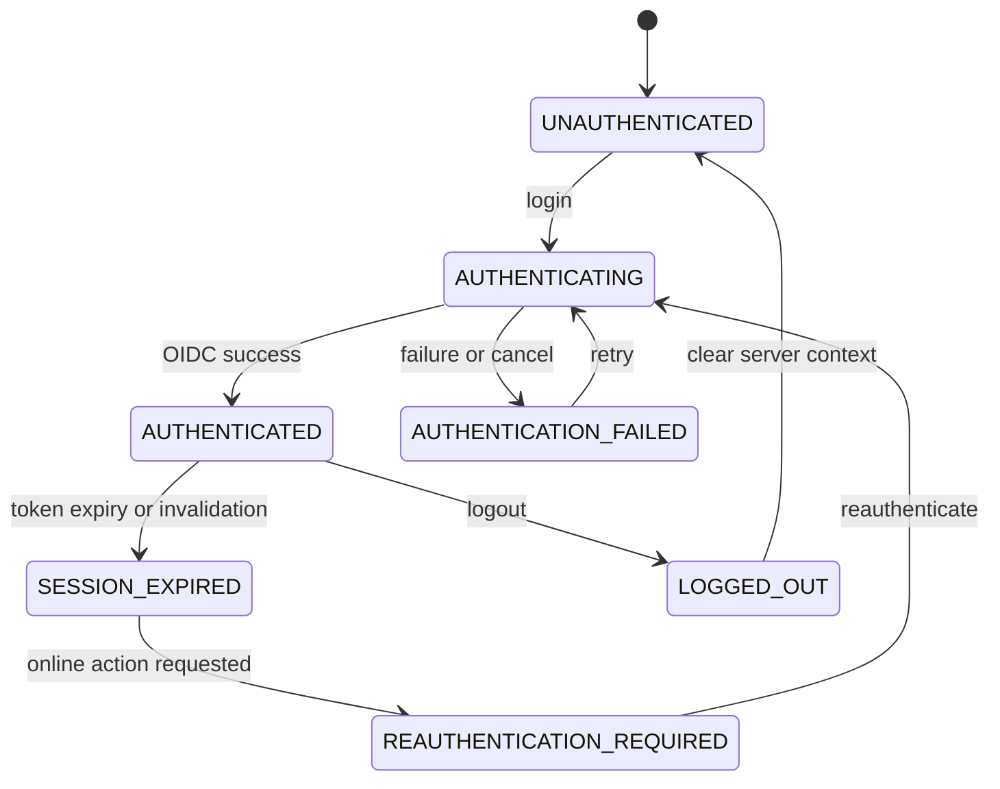

## 7.2 규칙

- Server Authentication, Local Biometric/Device Credential, Vault Unlock, Token Refresh를 별도 Event로 다룬다.
- Local Authentication 성공으로 Server Session을 생성하지 않는다.
- Token Refresh 성공으로 Vault를 Unlock하지 않는다.
- `SESSION_EXPIRED`여도 Offline Composite Guard가 허용하면 기존 Capsule 열람은 가능할 수 있다.
- Online List, Export, Lease Renewal, Revocation은 `AUTHENTICATED`가 필수다.
- Logout 시 Access Token과 Online Context를 제거하되 Capsule 삭제 여부는 별도 명시 Action이다. Local Key 사용 정책은 `TC-MOB-017`과 함께 구현 시 확정한다.

---

# 8. Patient Identity State

| State | 유형 | 의미 |
|---|---|---|
| `UNVERIFIED` | CLIENT | Subject와 PatientReference 결합 미확인 |
| `VERIFYING` | CLIENT | Backend 검증 중 |
| `VERIFIED` | SERVER SNAPSHOT | 승인된 PatientReference 결합 |
| `MISMATCH` | SERVER RESULT | 불일치 또는 중복 후보 |
| `REVERIFICATION_REQUIRED` | CLIENT/SERVER | 정책·Account 변경으로 재검증 필요 |

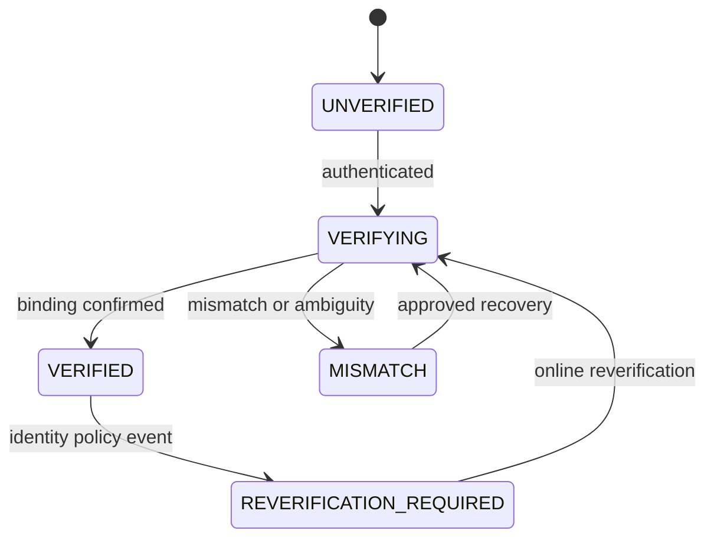

규칙:

- `MISMATCH`에서는 Study 목록, Mobile Export, Lease Renewal을 거부한다.
- Capsule은 `patient_reference_id`에 결합되어야 하며 현재 Local Patient Binding과 다르면 열지 않는다.
- Account 전환 또는 다른 Patient Context 선택 시 기존 Vault를 자동 연결하지 않고 보호 Back Stack과 Memory Key를 제거한다.
- Offline Access는 임의로 입력한 Patient ID가 아니라 Capsule의 Signed Patient Binding과 Device-local Account Binding을 비교한다.

---

# 9. Device Registration State

정식 `MobileDevice.status`를 그대로 사용한다.

| State | 의미 | 허용 |
|---|---|---|
| `UNREGISTERED` | CLIENT 파생, 서버 Device 없음 | 등록 시작만 |
| `PENDING` | Domain, Challenge/검증 진행 | Local 저장 불가 |
| `ACTIVE` | Domain, 등록 활성 | Security 검증 후 후보 |
| `REGISTRATION_FAILED` | CLIENT 파생 | 재시도/Cloud Viewer |
| `REVOKED` | Domain, 정책상 취소 | Server/Local future access 거부 |
| `LOST` | Domain, 분실 신고 | 갱신·새 Session 거부 |
| `RETIRED` | Domain, 사용 종료 | 재활성화하지 않고 새 Device 등록 |

Device가 `ACTIVE`라는 사실만으로 Local 저장을 허용하지 않는다. Device Security State와 Key Security Level을 추가로 확인한다.

---

# 10. Device Security State

| State | 유형 | 의미 |
|---|---|---|
| `UNKNOWN` | CLIENT | Evidence 없음 |
| `ASSESSING` | CLIENT | Key Attestation/App·Device Integrity 검증 중 |
| `VERIFIED` | SERVER DECISION | Android + verified StrongBox/TEE + 정책 적합 |
| `LIMITED` | UI-DERIVED | Cloud Viewer는 가능하나 Persistent Vault 불가 |
| `UNSUPPORTED` | UI-DERIVED | 필수 Capability 부족 |
| `COMPROMISED` | UI/SERVER | 명시적 침해 Signal 또는 정책 차단 |
| `REASSESSMENT_REQUIRED` | CLIENT/SERVER | Evidence freshness 또는 환경 변경 |

## Diagram C — Device Registration / Security State Machine

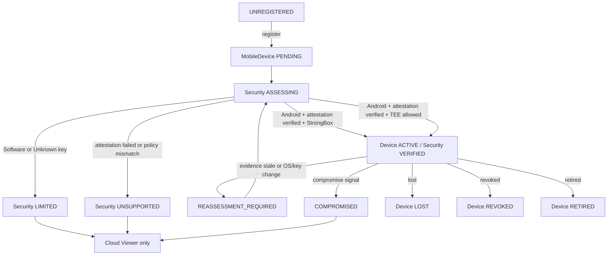

`LIMITED`, `UNSUPPORTED`, `COMPROMISED`, `UNKNOWN`, `ASSESSING`, `REASSESSMENT_REQUIRED`에서는 새로운 Mobile Export와 Persistent Vault Unlock을 허용하지 않는다. 이미 열린 Viewer는 Security State 악화를 감지하면 `PRIVACY_LOCKED` 후 재평가한다.

---

# 11. Vault State

Vault State는 Client Runtime 상태이며 `SecureMedicalCapsule.status`와 다르다.

| State | 의미 |
|---|---|
| `NOT_INITIALIZED` | Device-bound Vault Metadata 없음 |
| `INITIALIZING` | App-private storage와 Key Binding 설정 중 |
| `LOCKED` | Ciphertext는 있으나 Unwrapped DEK 사용 불가 |
| `UNLOCKING` | Local Authentication/Key operation 중 |
| `UNLOCKED` | 제한된 Key Session 사용 가능 |
| `KEY_UNAVAILABLE` | Key invalidated, missing 또는 Hardware access 실패 |
| `CORRUPTED` | Vault index/manifest 무결성 실패 |
| `DELETING` | Key 파기·Ciphertext 정리 중 |
| `DELETED` | Key 사용 불가 확인, Local Index 제거 |

## Diagram D — Vault State Machine

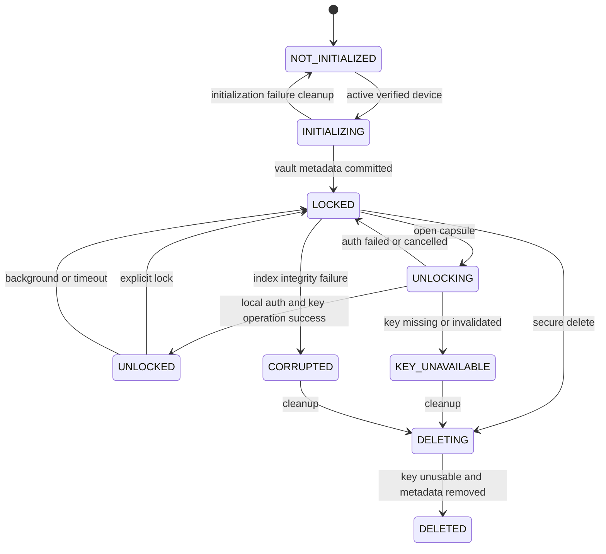

Vault `UNLOCKED`는 일반 파일시스템 접근이 아니라 선택된 Capsule에 대해 짧은 수명의 Key Operation이 가능한 상태다. 전체 DEK 목록을 메모리에 상주시켜서는 안 된다.

---

# 12. Offline Lease State

Offline Lease는 `SecureMedicalCapsule.offline_expires_at`과 Signed Policy Evidence에서 파생한다.

| State | 유형 | 의미 |
|---|---|---|
| `NOT_ISSUED` | UI-DERIVED | Offline right 없음 |
| `ACTIVE` | UI-DERIVED | 최대 30일 범위 내 Local validation 성공 |
| `EXPIRING` | UI-DERIVED | 만료 임박 표시; 정확한 UX 임계값은 결정 필요 |
| `EXPIRED` | Capsule/Derived | 기한 경과 또는 안전한 시간 판정 불가 |
| `RENEWAL_REQUIRED` | CLIENT | 온라인 재검증 필요 |
| `RENEWING` | CLIENT | 서버 재검증 진행 |
| `RENEWAL_DENIED` | SERVER RESULT | Consent/Grant/Account/Device 등 거부 |
| `REVOKED_ON_SYNC` | CLIENT | 서버 철회가 Device에 반영됨 |

## Diagram E — Offline Lease State Machine

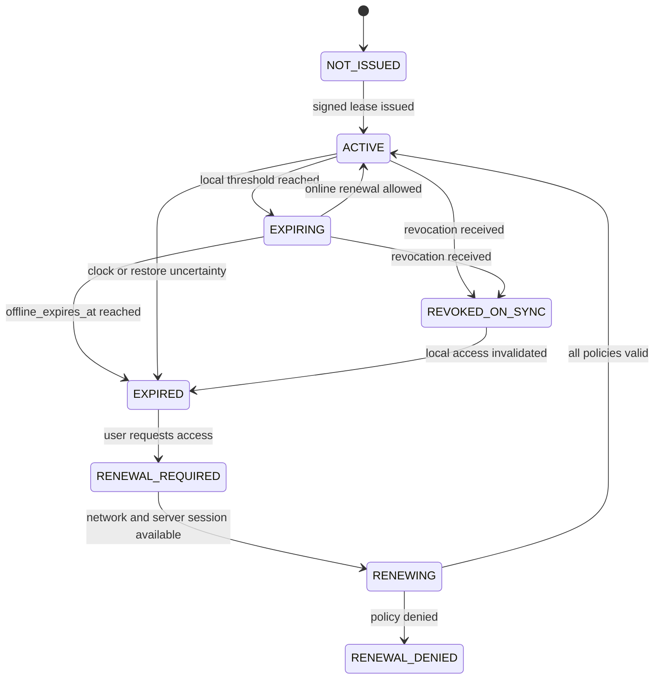

Offline Grace Period를 30일 이후에 추가하지 않는다. `EXPIRING`은 알림 구간이지 접근기간 연장이 아니다. Server Grant가 오프라인 기기에 즉시 반영된다고 주장하지 않으며, 동기화 전에는 마지막 Signed Snapshot과 Lease 만료가 통제 경계다.

---

# 13. Consent / Grant State

## 13.1 Server State

| 객체 | 정식 상태 |
|---|---|
| Consent | `PENDING`, `ACTIVE`, `WITHDRAWN`, `EXPIRED`, `REJECTED` |
| Grant | `NOT_ISSUED`는 Client 파생; 정식은 `ACTIVE`, `EXPIRED`, `REVOKED`, `CONSUMED` |

## 13.2 Local Authorization Snapshot

| State | 의미 |
|---|---|
| `ACTIVE_LOCAL` | Signed Grant/Consent Snapshot이 Capsule Scope와 일치하고 Local expiry 전 |
| `EXPIRED_LOCAL` | Snapshot/Capsule/Lease expiry 도달 |
| `REVOKED_ON_SYNC` | 서버 철회를 수신·검증함 |
| `UNKNOWN_LOCAL` | Snapshot 누락·손상·검증 실패 |

Consent와 Grant는 별개다. Consent `ACTIVE`만으로 Grant를 만들거나 Vault를 Unlock하지 않는다. `study:mobile-export` Grant는 Export 발급과 Online Renewal에 필요하며, 다른 `VIEW`, `DOWNLOAD`, `PACS_IMPORT` Scope로 대체할 수 없다.

오프라인 열람에서 “Grant ACTIVE”는 서버의 실시간 상태가 아니라 Capsule에 결합된 마지막 Signed Authorization Snapshot이 아직 만료되지 않았고 Local Revocation이 적용되지 않았다는 뜻이다.

---

# 14. Local Viewer Session State

정식 `MobileViewerSession.status`는 `ACTIVE | PRIVACY_LOCKED | AUTH_REQUIRED | CLOSED`다. `AUTHORIZING`, `LOADING`, `EXPIRED`, `TERMINATED`는 Client Workflow 상태다.

## Diagram F — Local Viewer Session State Machine

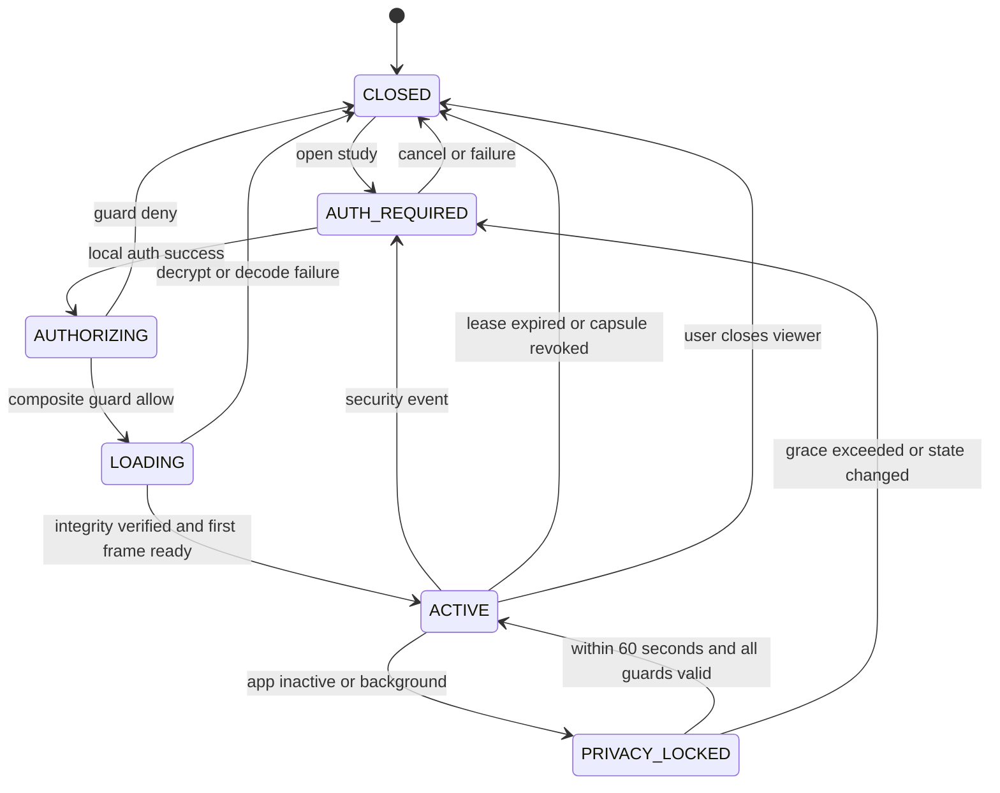

Viewer Open마다 Patient/Capsule Binding, Device `ACTIVE`, Security `VERIFIED`, Vault Key, Capsule Integrity, Offline Lease 및 Local Authorization Snapshot을 검증한다. `LOADING` 중 한 조건이 바뀌어도 첫 픽셀을 표시하지 않는다.

---

# 15. Application Lifecycle State

| State | OS 의미 | 보안 Action |
|---|---|---|
| `FOREGROUND` | 상호작용 가능 | Composite Guard 후 표시 |
| `INACTIVE` | 일시적 중단/Overlay | 즉시 Privacy Overlay, Render stop |
| `BACKGROUND` | 다른 앱/화면 | Pixel Buffer 제거, Key Session lock |
| `SUSPENDED` | 실행 정지 가능 | 민감 Memory가 남지 않는 상태 유지 |
| `TERMINATED` | 정상/강제 종료 | 다음 시작 시 Persisted State 검증 |

정상 종료 Callback 실행을 가정하지 않는다. State Commit은 원자적으로 수행하고 Partial Download는 Ciphertext와 검증 전 Manifest만 남길 수 있으며, 평문 Temp File은 허용하지 않는다.

다음 Event는 Security Epoch 재평가를 유발한다.

- App foreground/background
- OS 화면 잠금/해제
- 전화·System Dialog로 인한 Inactive
- Process death와 재시작
- Device reboot
- Network 연결 변경
- App/OS update
- Biometric enrollment 또는 Device Credential 변화
- Storage restore/migration 징후

---

# 16. Composite Security State

## 16.1 Online API Decision

```text
ALLOW_ONLINE =
  Authentication == AUTHENTICATED
  AND PatientIdentity == VERIFIED
  AND BackendAuthorization(action, actor, tenant, patient, resource) == ALLOW
  AND all action-specific guards pass
```

Mobile Export에는 추가로 Device `ACTIVE`, Device Security `VERIFIED`, `study:mobile-export` Grant, Study/Device Scope 및 Storage Preflight가 필요하다.

## 16.2 Offline Local Decision Stages

Viewer State를 Guard의 입력과 결과로 동시에 사용하지 않도록 세 단계로 나눈다.

```text
ELIGIBLE_LOCAL_OPEN =
  AppLifecycle == FOREGROUND
  AND LocalAccountBinding matches Capsule.patient_reference_id
  AND MobileDevice.status == ACTIVE in last trusted local state
  AND DeviceSecurity == VERIFIED
  AND key_security_level in {STRONGBOX, TRUSTED_ENVIRONMENT}
  AND Capsule.status == ACTIVE
  AND Capsule.device_binding matches current hardware key
  AND Capsule integrity == VERIFIED
  AND OfflineLease == ACTIVE
  AND LocalAuthorizationSnapshot == ACTIVE_LOCAL

ALLOW_LOCAL_KEY_OPERATION =
  ELIGIBLE_LOCAL_OPEN
  AND Vault == UNLOCKED
  AND LocalViewerSession in {AUTHORIZING, LOADING, ACTIVE}

ALLOW_PIXEL_RENDER =
  ALLOW_LOCAL_KEY_OPERATION
  AND LocalViewerSession == ACTIVE
  AND AppLifecycle == FOREGROUND
```

Open 요청은 먼저 `ELIGIBLE_LOCAL_OPEN`을 평가하고 Local Authentication으로 Vault를 Unlock한다. 이후 `ALLOW_LOCAL_KEY_OPERATION`이 참일 때만 검증된 Chunk를 복호화하며, 첫 Frame 준비 후 Session을 `ACTIVE`로 전이한 다음 `ALLOW_PIXEL_RENDER`를 다시 평가한다. 현재 Server Access Token은 이 세 Local Decision의 직접 조건이 아니다. 그러나 Online Renewal, 새 Export, Study 목록, Cloud Viewer 및 Revocation 제출에는 유효 Server Session이 필요하다.

## 16.3 Deny 우선순위

1. `CRYPTO_SHREDDED`, Key unavailable, Integrity failure
2. Device `REVOKED|LOST|RETIRED` 또는 Local revocation applied
3. Patient/Capsule/Device Binding mismatch
4. Lease `EXPIRED|RENEWAL_DENIED|REVOKED_ON_SYNC`
5. Device Security not `VERIFIED`
6. App not foreground 또는 Viewer privacy locked
7. Local Authentication required
8. Unsupported DICOM codec

상위 Deny가 존재하면 하위 Allow나 오래된 성공 응답으로 복구하지 않는다.

## Diagram I — Composite Security Decision Flow

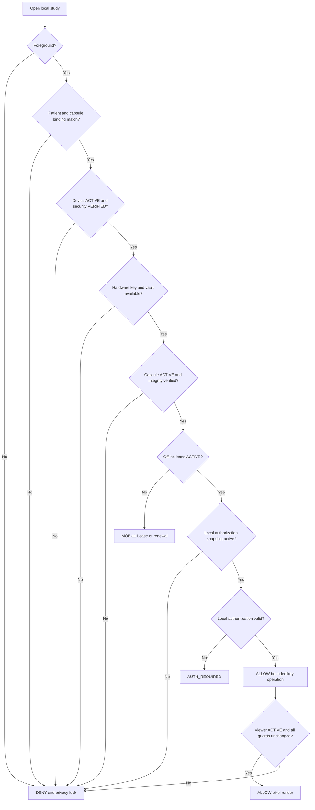

---

# 17. Navigation Guards

## 17.1 Guard 실행 지점

- Route 진입 전
- 민감 Metadata 표시 직전
- Capsule Key unwrap 직전
- 각 Instance/Chunk 복호화 직전
- Background→Foreground 복귀 시
- Network Sync/Revocation 적용 시
- 긴 Operation 완료 응답 적용 전

UI Guard는 UX 경계다. 실제 보안 강제는 Key Operation, Local Repository 및 Backend Authorization에서 반복한다.

## 17.2 Guard 결과

| 실패 | Navigation | Data Action |
|---|---|---|
| Server 미인증 | MOB-01 | Online request 중단 |
| Identity 미확인/불일치 | MOB-02 | Study Metadata clear |
| Device 미등록 | MOB-03 | Export/Vault init 차단 |
| Device Security 미달 | MOB-04 | Local key operation 차단 |
| Vault 잠김 | Local Auth Sheet/MOB-09 | DEK unwrap 전 중단 |
| Key unavailable/corrupt | MOB-15 안전 오류 | Viewer 폐쇄, 재발급 안내 |
| Lease 만료 | MOB-11 | Decrypt 차단 |
| Grant/Consent 철회 동기화 | MOB-12 또는 MOB-09 잠금 | Local Session 폐쇄 |
| Capsule Integrity 실패 | 안전 오류 | Capsule 격리, 활성화 금지 |
| Codec 미지원 | MOB-06/MOB-09 안내 | 복호화된 Frame 저장 금지 |

---

# 18. Screen Access Matrix

`R`은 화면 진입 필수, `S`는 민감정보 표시 또는 Action 실행 시 필수, `—`는 직접 필수 아님이다.

| 화면 | Server Auth | Identity | Device Active | Security Verified | Vault Unlocked | Lease Active | Grant/Consent | 화면 접근과 민감 데이터 규칙 |
|---|---:|---:|---:|---:|---:|---:|---:|---|
| MOB-01 앱 시작·로그인 | — | — | — | — | — | — | — | 공개 Shell만 표시 |
| MOB-02 Identity 확인 | R | — | — | — | — | — | — | 확인 전 Study 정보 금지 |
| MOB-03 Device 등록 | R | R | — | — | — | — | — | Challenge/Attestation Online 필수 |
| MOB-04 지원 불가 | R | R | — | — | — | — | S | 이유 최소화; Cloud Viewer는 별도 `study:view` 검증 |
| MOB-05 내 영상 | R | R | — | — | — | — | S | Online 목록; Offline은 Local Index 경로 분리 |
| MOB-06 영상 상세 | R | R | — | — | — | — | S | Action별 Scope 독립 검증 |
| MOB-07 Export 승인 | R | R | R | R | — | — | R | `study:mobile-export` 필수 |
| MOB-08 다운로드 | R/S | R | R | R | S | — | R | 응답 적용 전 Security Epoch 재검증 |
| MOB-09 Vault | — | S | R | R | S | Study별 S | Local Snapshot S | 잠금 상태에서는 Metadata 최소화 |
| MOB-10 Local Viewer | — | R | R | R | R | R | Local Snapshot R | 모든 조건이 동시에 참 |
| MOB-11 Lease 만료 | — | S | R | S | — | — | — | 갱신 Action은 Server Auth·정책 재검증 필요 |
| MOB-12 Consent/Grant | R | R | — | — | — | — | 대상별 R | 철회 완료와 Local 적용 구분 |
| MOB-13 분실 기기 | R | R | — | — | — | — | — | 민감 Action Server 재인증 후보 |
| MOB-14 새 기기 | R | R | — | — | — | — | 재발급 시 R | 새 Device Admission 필수 |
| MOB-15 설정 | S | S | S | S | S | S | S | Local/Server 항목별 Guard 분리 |

MOB-09/10의 Offline 진입은 Server Auth가 직접 필수는 아니지만, Device-local Account Binding, Signed Authorization Snapshot과 Lease가 필수다.

---

# 19. Background Lock

## Diagram G — App Background / Resume Flow

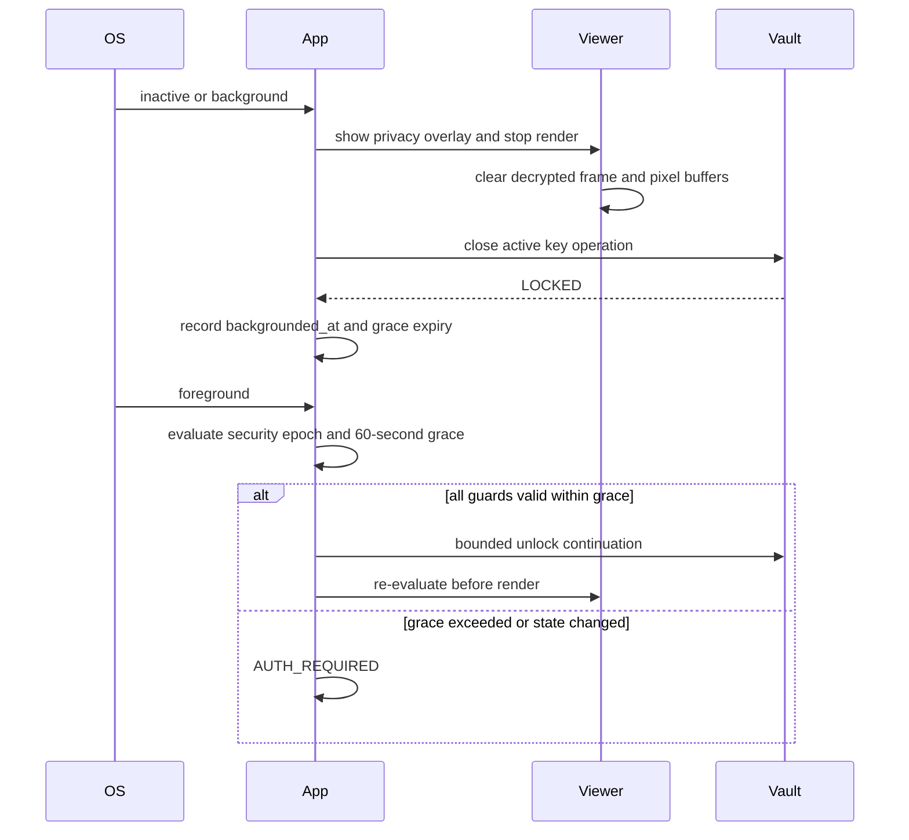

필수 처리 순서:

1. Privacy Overlay를 동기적으로 표시한다.
2. Render Pipeline을 중단한다.
3. 복호화 Frame, Pixel Buffer, Thumbnail 작업을 취소·제거한다.
4. 활성 Crypto Operation과 Viewer Session을 `PRIVACY_LOCKED`로 만든다.
5. OS Snapshot이 민감 화면을 캡처하지 않게 한다.
6. Ciphertext Capsule 자체는 삭제하지 않는다.

앱이 중간에 강제 종료되어도 다음 실행은 Vault `LOCKED`, Viewer `CLOSED|AUTH_REQUIRED`에서 시작한다.

---

# 20. Resume & Reauthentication

Resume 판단 순서:

```text
Foreground Event
→ Process/Boot/Restore continuity 확인
→ Device Registration/Security freshness 확인
→ Patient/Capsule Binding 확인
→ Lease 및 Local Authorization Snapshot 확인
→ 60초 grace와 OS lock 상태 확인
→ Local Authentication 필요 여부 결정
→ Viewer 새 Guard 평가
→ Restore 또는 Deny
```

| 결과 | 조건 | 처리 |
|---|---|---|
| `VALID_SESSION` | 60초 이내, 기기 잠금 없음, Security Epoch 동일 | Guard 재평가 후 View 재구성 가능 |
| `LOCAL_REAUTH_REQUIRED` | Grace 초과 또는 Key Session 폐쇄 | Local Authentication 후 새 Viewer Session |
| `SERVER_REAUTH_REQUIRED` | Online Action, Server Session 만료 | MOB-01 재인증; Offline Viewer와 분리 |
| `LEASE_EXPIRED` | 만료 또는 시간 불확실 | MOB-11, 복호화 금지 |
| `DEVICE_REVOKED` | Sync된 Revoke/Lost/Retired | Viewer 폐쇄, 갱신 금지 |
| `KEY_UNAVAILABLE` | Hardware Key invalid/missing | Viewer 폐쇄, 재발급 안내 |

Resume는 이전 Pixel Buffer를 다시 보여주는 것이 아니라 현재 State를 검증한 뒤 필요한 Frame을 다시 복호화·렌더링하는 과정이다.

---

# 21. Revocation

## 21.1 분리 상태

| State | 의미 |
|---|---|
| `SERVER_REVOKED` | Backend에서 Device/Grant/Consent 철회 확정 |
| `DEVICE_REVOCATION_PENDING` | 대상 Device가 아직 철회를 수신하지 못함 |
| `LOCAL_REVOCATION_APPLIED` | Device가 철회를 검증하고 Session/Key 접근을 차단 |
| `REMOTE_DELETE_REQUESTED` | 정리 명령 또는 의도 기록 |
| `LOCAL_DELETE_CONFIRMED` | 대상 Device가 Key 파기·정리를 확인 |

`SERVER_REVOKED`는 `LOCAL_DELETE_CONFIRMED`와 같지 않다. Offline Device는 Lease 만료 전 서버 철회를 받지 못할 수 있다.

## Diagram H — Device Revocation / Recovery Flow

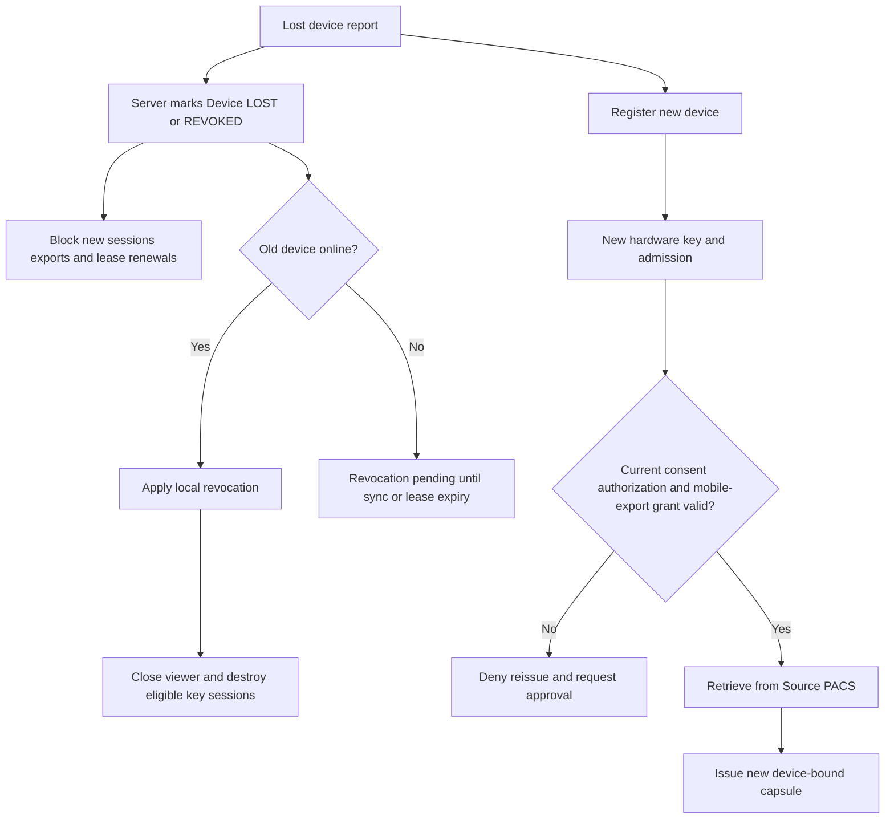

---

# 22. Transition Specification

| Transition ID | Current State | Trigger | Precondition | Guard | Action | Next State | Failure State | UI Response | Backend API | Audit Event |
|---|---|---|---|---|---|---|---|---|---|---|
| T-AUTH-001 | UNAUTHENTICATED | Login | Network | OIDC state/nonce valid | Start auth | AUTHENTICATING | AUTHENTICATION_FAILED | MOB-01 progress/error | Auth profile TBD | MOBILE_LOGIN_* |
| T-ID-001 | VERIFYING | Identity result | Authenticated | Unique approved binding | Cache signed context | VERIFIED | MISMATCH | MOB-02 result | Patient context PROPOSED | PATIENT_CONTEXT_* |
| T-DEV-001 | UNREGISTERED | Register | Auth+Identity | Fresh challenge | Generate hardware key | PENDING | REGISTRATION_FAILED | MOB-03 | Registration PROPOSED | DEVICE_REGISTRATION_REQUESTED |
| T-DEV-002 | PENDING/ASSESSING | Admission result | Evidence submitted | Android, attestation verified, StrongBox/TEE | Bind public key | ACTIVE/VERIFIED | LIMITED/UNSUPPORTED | MOB-03 or 04 | Registration PROPOSED | DEVICE_ADMISSION_* |
| T-VAULT-001 | NOT_INITIALIZED | Init | Active verified Device | App-private storage available | Commit metadata atomically | LOCKED | NOT_INITIALIZED | MOB-09 | None | VAULT_INITIALIZED |
| T-VAULT-002 | LOCKED | Open Study | Capsule selected | Composite precheck | Local auth and unwrap | UNLOCKED | KEY_UNAVAILABLE/LOCKED | Auth sheet/error | None | VAULT_UNLOCK_* |
| T-EXP-001 | Study detail | Mobile Export | Online valid context | Consent+Auth+Grant+Device+scope | Create operation | REQUESTED | DENIED | MOB-07/08 | Mobile export PROPOSED | MOBILE_EXPORT_* |
| T-CAP-001 | DOWNLOADING | Ciphertext complete | Operation valid | Manifest/scope/binding | Verify and atomic activate | Capsule ACTIVE | Quarantined/cleanup | MOB-08 | Ack PROPOSED | CAPSULE_STORED |
| T-VIEW-001 | AUTH_REQUIRED | Local auth success | Foreground | Full Composite Guard | Start bounded decrypt | AUTHORIZING | CLOSED | MOB-10 loading/deny | None | LOCAL_VIEW_STARTED/DENIED |
| T-VIEW-002 | LOADING | First frame ready | Codec supported | Integrity and epoch unchanged | Render | ACTIVE | CLOSED | Viewer/error | None | LOCAL_VIEW_ACTIVE |
| T-LIFE-001 | ACTIVE Viewer | App inactive | None | Always | Overlay, stop, clear, lock | PRIVACY_LOCKED | CLOSED on fatal error | Privacy screen | None | VIEWER_PRIVACY_LOCKED |
| T-RESUME-001 | PRIVACY_LOCKED | Foreground | Same process/device | <=60s, no OS lock, epoch equal, guards valid | Rebuild frame | ACTIVE | AUTH_REQUIRED/CLOSED | Viewer or auth | Optional sync | VIEWER_RESUMED |
| T-LEASE-001 | EXPIRING/EXPIRED | Renew | Online auth | Current Consent+Grant+Account+Device valid | Issue signed lease | ACTIVE | RENEWAL_DENIED | MOB-11 | Renew PROPOSED | LEASE_RENEW* |
| T-LEASE-002 | ACTIVE | Expiry/uncertain time | None | Local validation fail | Stop decrypt | EXPIRED | EXPIRED | MOB-11 | None | LEASE_EXPIRED_LOCAL |
| T-REV-001 | Device ACTIVE | Lost report | Online reauth | ownership | Server revoke | LOST/REVOKED | unchanged | MOB-13 result | Report lost PROPOSED | DEVICE_REPORTED_LOST |
| T-REV-002 | Local active state | Revocation sync | Signed server result | Target binding/version valid | Close, lock, invalidate | LOCAL_REVOCATION_APPLIED | Fail closed/pending audit | Vault locked | Sync PROPOSED | LOCAL_REVOCATION_APPLIED |
| T-DEL-001 | LOCKED/KEY_UNAVAILABLE | Secure delete | Target confirmed | Device binding | Destroy key/material, delete ciphertext best effort | DELETED/CRYPTO_SHREDDED | DELETING error | MOB-15 result | Optional ack | CAPSULE_CRYPTO_SHREDDED |
| T-REISSUE-001 | New Device VERIFIED | Reissue | Online | Current approvals + Source PACS available | New Capsule for new key | REQUESTED | DENIED | MOB-14→08 | Reissue PROPOSED | CAPSULE_REISSUE_* |

API 이름은 `MOBILE-UI-UX-SPEC.md`의 Proposed Contract를 참조하며 `OPENAPI.yaml` 개정 전 구현 계약이 아니다.

---

# 23. Race Conditions

모든 Security-relevant 상태에는 단조 증가 `security_epoch` 또는 동등한 Version을 사용한다. Operation은 시작 시 Epoch와 Binding을 캡처하고 응답 적용 직전에 현재 값과 비교한다.

| Case | 동시 사건 | 우선 상태 | 취소/무시 | 최종 Navigation | Audit |
|---|---|---|---|---|---|
| A | Viewer Loading 중 Lease 만료 | Lease `EXPIRED` | Decode/Render 취소, 늦은 Frame 무시 | MOB-11 | `VIEW_DENIED_LEASE_EXPIRED` |
| B | Download 중 Grant 철회 | Server Deny | Download 취소, Partial Ciphertext 격리/삭제, 성공 응답 무시 | MOB-06/12 | `EXPORT_CANCELLED_GRANT_REVOKED` |
| C | Vault Unlock 중 Background | Lifecycle Deny | Biometric/Crypto Operation 취소 | Privacy Screen, 이후 AUTH_REQUIRED | `UNLOCK_CANCELLED_BACKGROUND` |
| D | Registration 중 Network 단절 | PENDING 유지 또는 만료 | Challenge 만료 후 응답 무시, Private Key 정책에 따라 폐기 | MOB-03 재시도 | `DEVICE_REGISTRATION_INTERRUPTED` |
| E | Lease Renewal과 Device Revocation | Device Revoke 우선 | Renewal success가 늦게 와도 적용 금지 | MOB-13/09 잠금 | `LEASE_RESULT_DISCARDED_REVOKED` |
| F | Old Session 응답이 New Session에 도착 | 최신 Session/Epoch 우선 | Actor/Patient/Operation mismatch 응답 폐기 | 현재 화면 유지 | `STALE_RESPONSE_DISCARDED` |

추가 규칙:

- Allow 응답보다 Deny Event가 우선한다.
- Operation ID, Session ID, Device ID, Capsule ID, PatientReference, Security Epoch를 응답 적용 조건에 포함한다.
- 사용자 전환 후 이전 Account의 Coroutine/Task/Subscription을 취소한다.
- State Store는 동일 Event의 재처리에 Idempotent해야 한다.
- Capsule 활성화는 Ciphertext와 Manifest 검증 후 원자적 Rename/Commit으로 수행한다.

---

# 24. State Persistence

| State/Data | 저장 위치 | 수명 | 보호/규칙 |
|---|---|---|---|
| Device Private Key/KEK | Hardware-backed Keystore | Device 등록 수명 | Non-exportable; Cloud backup 금지 |
| Device ID/Public Key Metadata | Encrypted app-private store | 등록 수명 | Patient/Account binding |
| Device Domain State snapshot | Encrypted app-private store | 다음 sync까지 | Signed/versioned; Server가 권위 |
| Capsule Ciphertext | App-private file | 삭제/crypto-shred까지 | Backup/D2D 제외 |
| Capsule Manifest/Wrap slots | Encrypted app-private store | Capsule 수명 | Authenticated binding |
| Signed Offline Lease | Encrypted app-private store | Lease 수명 | Anti-rollback/restore 검증 필요 |
| Local Authorization Snapshot | Encrypted app-private store | Capsule/Grant 수명 | Signed, scope/binding/expiry 검증 |
| Vault Index | Encrypted app-private DB | Vault 수명 | 최소 Metadata, integrity protected |
| Offline Audit Queue | Encrypted app-private store | Upload/retention 결정까지 | Sequence/integrity/idempotency 미결정 |
| Access Token | Memory 우선 | 짧은 Session | 로그/backup 금지 |
| Refresh Credential | OPEN DECISION | 최소 필요 수명 | OS secure storage, rotation/revoke 필요 |
| Unwrapped DEK/Crypto handle | Memory/Keystore operation | 단일 Viewer operation | Background/close에서 폐기 |
| Plaintext Frame/Pixel Buffer | Memory only | 현재 Frame | Disk/cache/crash dump 금지 |
| Navigation Back Stack | Memory | Process Session | PHI argument 금지, 보안 Event에서 clear |

절대 저장하지 않는 항목:

- Export 가능한 Private Key, KEK, 원문 DEK
- 평문 DICOM Study/Instance/Frame
- Biometric Template
- PACS Credential/Endpoint
- Access Token 또는 Key 원문이 포함된 Log

Process 재시작 시 `Viewer=ACTIVE`, `Vault=UNLOCKED`를 복원하지 않는다. Persisted Capsule이 있어도 Viewer는 `CLOSED`, Vault는 `LOCKED`에서 시작한다.

---

# 25. State Management Technology

Native Mobile Stack이 미결정이므로 라이브러리는 확정하지 않는다. 구현은 다음 구조를 만족해야 한다.

```text
OS / User / Backend Events
        ↓
Typed Event Intake
        ↓
Security State Reducers
        ↓
Composite Policy Evaluator
        ↓
Side-effect Coordinator
        ↓
Navigation Intent + Audit Intent
```

필수 특성:

- Single Source of Truth이나 하나의 거대한 Enum이 아닌 독립 State Slice
- Immutable Snapshot과 Deterministic Reducer
- Crypto/Network/Storage Side Effect와 순수 Decision 분리
- Structured concurrency와 Screen/ViewModel 수명보다 긴 Security Coordinator
- `security_epoch` 기반 stale result suppression
- Process death 후 안전한 기본 상태 복원
- Event와 State에 Patient PHI 대신 내부 Reference 사용
- Test Scheduler/Fake Clock으로 30일·60초 경계 시험 가능
- Navigation은 Composite Decision의 결과를 소비할 뿐 권한을 생성하지 않음

Kotlin + Jetpack Compose를 채택할 경우 `StateFlow`/Coroutine 기반 단방향 데이터 흐름은 후보지만, `TECH-STACK-DECISION.md` 개정 전 정식 선택이 아니다.

---

# 26. Security Invariants

| ID | Invariant | 화면 | API/강제점 | Test |
|---|---|---|---|---|
| NAV-INV-001 | Navigation Route는 권한 증거가 아니다. | 전 화면 | Router + Repository | 신규 Guard Test |
| NAV-INV-002 | Identity `MISMATCH`는 Study/Export/Viewer를 거부한다. | MOB-02/05/10 | Patient context | TC-MOB-008 확장 |
| NAV-INV-003 | Device가 `ACTIVE`여도 Security `VERIFIED`가 아니면 Vault를 허용하지 않는다. | MOB-03/04/09 | Registration/Key operation | TC-MOB-011 |
| NAV-INV-004 | Software/Unknown Key로 Silent Downgrade하지 않는다. | MOB-03/04 | Device admission | TC-MOB-011-C |
| NAV-INV-005 | Capsule은 Patient, Device, Study, Grant에 결합한다. | MOB-07~10 | Export/Local repository | TC-MOB-008/012 |
| NAV-INV-006 | AES-GCM Integrity 실패 Capsule은 한 Frame도 표시하지 않는다. | MOB-08/10 | Verify/decrypt | TC-MOB-012-B |
| NAV-INV-007 | Lease가 Active가 아니면 Local Decrypt를 실행하지 않는다. | MOB-10/11 | Key/decrypt boundary | TC-MOB-013 |
| NAV-INV-008 | 30일 이후 Offline Grace를 추가하지 않는다. | MOB-11 | Lease evaluator | TC-MOB-013-B |
| NAV-INV-009 | Server Token 만료와 Local Lease 만료를 동일 상태로 취급하지 않는다. | MOB-01/10/11 | Composite evaluator | 신규 Offline Test |
| NAV-INV-010 | Consent와 Grant는 독립 검증한다. | MOB-07/12 | Backend authorization | TC-MOB-013-C |
| NAV-INV-011 | `VIEW`, `DOWNLOAD`, `PACS_IMPORT`, `MOBILE_EXPORT`를 자동 승격하지 않는다. | MOB-06/07 | Backend scope | Scope Negative Test |
| NAV-INV-012 | Background 즉시 화면을 가리고 Buffer를 제거한다. | MOB-10 | Lifecycle coordinator | TC-MOB-014-A |
| NAV-INV-013 | 60초는 재인증 유예이지 민감 화면 노출 유예가 아니다. | MOB-10 | Resume guard | TC-MOB-014-B/C |
| NAV-INV-014 | Process 재시작 후 Viewer Active/Vault Unlocked를 복원하지 않는다. | MOB-09/10 | State restore | Force-kill Test |
| NAV-INV-015 | 늦은 Allow 응답은 최신 Revoke/Epoch를 덮어쓰지 못한다. | MOB-08/10/11 | Async coordinator | Concurrent State Test |
| NAV-INV-016 | Server Revoke와 Local 적용·삭제 완료를 구분한다. | MOB-12/13 | Revocation sync | TC-MOB-016-A |
| NAV-INV-017 | 새 Device는 기존 Key/Capsule을 복사하지 않고 Source PACS에서 재발급한다. | MOB-14 | Reissue action | TC-MOB-016-B/C |
| NAV-INV-018 | Crypto-shred 후 해당 Key에 의존한 Capsule은 복호화되지 않는다. | MOB-15 | Keystore/local store | TC-MOB-017 |
| NAV-INV-019 | 평문 DICOM/Pixel은 Disk, Backup, Gallery, Log에 남지 않는다. | MOB-08~10 | Storage/render/log | TC-MOB-012-A 확장 |
| NAV-INV-020 | Unsupported Device의 Cloud Viewer도 서버 권한 검증을 통과한다. | MOB-04 | Existing view action | Viewer Security Test |
| NAV-INV-021 | DICOM UID, Viewer URL, Capsule ID는 단독 권한이 아니다. | MOB-06/10 | Backend/local binding | IDOR Test |
| NAV-INV-022 | Local Capsule을 병원으로 직접 Upload하지 않는다. | MOB-06 | UI/API absence | Scope Contract Test |

---

# 27. State Transition Test Matrix

모든 시험은 Synthetic/Test/De-identified 데이터만 사용하며 현재 상태는 `PLANNED / NOT RUN`이다.

| Test ID | Initial State | Trigger | Expected Transition | Expected Navigation | Expected Security Result | Expected Audit Event |
|---|---|---|---|---|---|---|
| NAV-TST-001 | UNAUTHENTICATED | Login | → AUTHENTICATING | MOB-01 | 보호 데이터 미표시 | MOBILE_LOGIN_STARTED |
| NAV-TST-002 | AUTHENTICATING | Valid response | → AUTHENTICATED | MOB-02 | Online context만 생성 | MOBILE_LOGIN_SUCCEEDED |
| NAV-TST-003 | AUTHENTICATING | Invalid response | → AUTHENTICATION_FAILED | MOB-01 | Fail closed | MOBILE_LOGIN_FAILED |
| NAV-TST-004 | Identity VERIFYING | Mismatch | → MISMATCH | MOB-02 | Study/Export deny | PATIENT_CONTEXT_DENIED |
| NAV-TST-005 | Device UNREGISTERED | Vault 접근 | 유지 | MOB-03 | Vault deny | DEVICE_REGISTRATION_REQUIRED |
| NAV-TST-006 | PENDING/ASSESSING | StrongBox/TEE verified | → ACTIVE/VERIFIED | MOB-05 | Persistent Vault candidate | DEVICE_ADMISSION_ALLOWED |
| NAV-TST-007 | ASSESSING | Software/Unknown/failed attestation | → LIMITED/UNSUPPORTED | MOB-04 | Local storage deny | DEVICE_ADMISSION_DENIED |
| NAV-TST-008 | LOCKED | Valid local auth | → UNLOCKED | MOB-09/10 | Key operation allowed | VAULT_UNLOCK_SUCCEEDED |
| NAV-TST-009 | UNLOCKING | Key unavailable | → KEY_UNAVAILABLE | MOB-15 error | Decrypt deny | VAULT_KEY_UNAVAILABLE |
| NAV-TST-010 | Valid Composite | Open study | CLOSED→ACTIVE | MOB-10 | Bounded decrypt | LOCAL_VIEW_STARTED |
| NAV-TST-011 | Viewer ACTIVE | App background | → PRIVACY_LOCKED | Privacy Overlay | Buffer clear/key lock | VIEWER_PRIVACY_LOCKED |
| NAV-TST-012 | PRIVACY_LOCKED | Resume <=60s, no change | → ACTIVE | MOB-10 | Guard rechecked | VIEWER_RESUMED |
| NAV-TST-013 | PRIVACY_LOCKED | Resume >60s/OS lock | → AUTH_REQUIRED | Auth sheet | Render deny | LOCAL_REAUTH_REQUIRED |
| NAV-TST-014 | Lease ACTIVE | 30-day boundary | → EXPIRED | MOB-11 | Decrypt deny | LEASE_EXPIRED_LOCAL |
| NAV-TST-015 | Lease EXPIRED | Valid online renewal | → ACTIVE | MOB-09/10 | New signed lease | LEASE_RENEWED |
| NAV-TST-016 | Lease RENEWING | Grant revoked | → RENEWAL_DENIED | MOB-11 | Access deny | LEASE_RENEWAL_DENIED |
| NAV-TST-017 | Viewer ACTIVE | Revocation sync | → CLOSED | MOB-09/12 | Future local access deny | LOCAL_REVOCATION_APPLIED |
| NAV-TST-018 | Device ACTIVE | Lost report | → LOST | MOB-13 | New sessions/renewals deny | DEVICE_REPORTED_LOST |
| NAV-TST-019 | New Device VERIFIED | Valid reissue | → Export operation | MOB-08 | New Device-bound Capsule | CAPSULE_REISSUE_ALLOWED |
| NAV-TST-020 | Registration PENDING | Network disconnect | Pending/expired challenge | MOB-03 | No partial registration allow | DEVICE_REGISTRATION_INTERRUPTED |
| NAV-TST-021 | Viewer ACTIVE | App force kill/restart | Vault LOCKED, Viewer CLOSED | MOB-01/09 | No active state restoration | PROCESS_RESTORE_LOCKED |
| NAV-TST-022 | Lease ACTIVE | Device reboot/time uncertainty | → RENEWAL_REQUIRED/EXPIRED | MOB-11 | Fail closed if time unsafe | LEASE_TIME_UNCERTAIN |
| NAV-TST-023 | Renewal response in flight | Device revoke first | Revoke dominates | MOB-13/09 | Late allow discarded | STALE_RESPONSE_DISCARDED |
| NAV-TST-024 | Old patient session | Account switch | Context cleared | MOB-02 | Old PHI/back stack clear | PATIENT_CONTEXT_CLEARED |
| NAV-TST-025 | Downloading | Grant revoke | Operation cancelled | MOB-06/12 | Partial data not activated | EXPORT_CANCELLED_GRANT_REVOKED |
| NAV-TST-026 | Vault UNLOCKING | Background | → LOCKED/PRIVACY_LOCKED | Privacy Overlay | Crypto op cancelled | UNLOCK_CANCELLED_BACKGROUND |

기존 `TC-MOB-007`~`TC-MOB-017`과 위 Navigation Test를 연결해 실행하며, 중복 항목은 동일 Evidence Bundle을 참조할 수 있다.

---

# 28. P0 / P1 / P2 Scope

| Scope | 내용 |
|---|---|
| CAPSTONE-P0 | Backend Authorization Gateway 기반 Cloud Viewer, Hospital A→B PACS 전송, P0 Security Validation |
| CAPSTONE-P1 | Android Mobile Navigation, 9개 보안 State Machine + 1개 Synthetic Health Preview State Machine, Composite Guard, Device-bound Vault, Offline Lease, Local Viewer, Lost/Reissue |
| POST-P1/P2 | iOS Native Vault, Guardian/Representative, Mobile-originated server Exchange request, 운영 Push/MDM 연계 |
| OUT-OF-SCOPE | Mobile Capsule 직접 병원 Upload, Key Escrow, Permanent Cloud PACS, 실제 환자 데이터 |

P1 State Model은 P0 완료를 막지 않으며 Mobile 코드 착수는 P0 Gate 이후다.

---

# 29. Open Decisions

| ID | 결정 | 현재 권고 | 필요한 증거 |
|---|---|---|---|
| NAV-OD-001 | Android State Technology | Platform-agnostic reducer 우선, Kotlin/Compose/StateFlow 후보 | Prototype + ADR |
| NAV-OD-002 | `security_epoch` 발급·저장 | Server policy version + local monotonic epoch 조합 | Concurrency test |
| NAV-OD-003 | Secure Time | Signed Lease, monotonic signal, reboot/restore detection | Threat test |
| NAV-OD-004 | `EXPIRING` UX 임계값 | 접근기간을 늘리지 않는 알림 전용 값 | Product decision |
| NAV-OD-005 | Local Authenticator 조합 | Strong biometric/device credential과 Key operation 결합 | Device matrix |
| NAV-OD-006 | Refresh Credential 저장 | OS secure storage, rotation/revoke 최소화 | IAM ADR |
| NAV-OD-007 | Offline Audit Queue | Signed sequence, retry/idempotency, retention | Audit design |
| NAV-OD-008 | Background Key Session | 즉시 Operation close 원칙, 60초 재인증 유예와 분리 | Performance/security test |
| NAV-OD-009 | Remote Delete 상태 | Requested/Delivered/Applied/Confirmed 구분 | Backend contract |
| NAV-OD-010 | Mobile API 상태 Enum | 계약 기준선 선택; Domain과 Client Operation 상태 분리 검증 | Mobile OpenAPI change |
| NAV-OD-011 | Download Resume | Ciphertext chunk authentication과 epoch binding | Crypto benchmark |
| NAV-OD-012 | Logout의 Local Vault 영향 | Server logout과 explicit local delete 분리 권고 | Product/security approval |

---

# 30. References

## 30.1 Normative Repository Documents

- `PROJECT-CHARTER.md`
- `CAPSTONE-MVP-BOUNDARY.md`
- `PRODUCT-BASELINE.md`
- `REQUIREMENTS.md`
- `SECURITY-REQUIREMENTS.md`
- `DOMAIN-MODEL.md`
- `DATA-MODEL.md`
- `ERD.md`
- `SYSTEM-ARCHITECTURE.md`
- `DATA-FLOW.md`
- `OPENAPI.yaml`
- `THREAT-MODEL.md`
- `ACCEPTANCE-TESTS.md`
- `IMPLEMENTATION-PLAN.md`
- `TECH-STACK-DECISION.md`
- `MOBILE-UI-UX-SPEC.md`
- `DICOM-INTEROPERABILITY-PROFILE.md`

## 30.2 Baseline Decisions

- ADR-0007 — Android-first, StrongBox preferred, verified TEE allowed
- ADR-0008 — AES-256-GCM Capsule and PQC-ready Wrap agility
- ADR-0009 — 30-day Offline Lease and 60-second reauthentication grace
- ADR-0010 — Platform-bounded Capture Protection
- ADR-0011 — No Key Escrow and Source PACS Reissue
- ADR-0016 — P1 Mobile Secure Vault UI/UX Baseline

---

# 31. Completion Boundary

본 문서는 다음을 완료했다.

- 9개 독립 보안 상태 머신, 1개 Synthetic Health Preview 상태 머신과 Composite Security Decision 정의
- 15개 화면 Access Guard 정의
- 9개 필수 Mermaid Diagram 제공
- Background/Resume/Revocation 처리 정의
- 18개 주요 Transition과 6개 Race Condition 정의
- 22개 Security Invariant와 26개 State Transition Test 정의
- Domain 상태와 Client/UI 상태 분리
- P0/P1/P2 및 Open Decision 분리

Mobile 기능의 구현 완료를 의미하지 않는다. `MOBILE-UI-UX-SPEC.md`, 본 문서, Mobile OpenAPI, Domain/Data Migration, Native Code 및 실행된 Acceptance Evidence가 함께 있어야 P1 `DONE`을 주장할 수 있다.

---

# 32. Synthetic Health Data Preview State Model — 2026-09-26

Preview는 기존 Mobile Security State Machine과 분리된 비권한 시연 상태다.

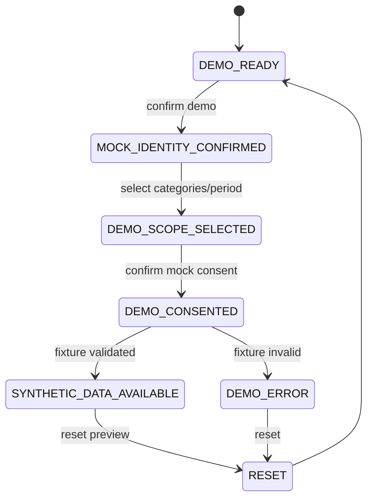

State invariants:

- `DEMO MODE` Banner는 모든 State에서 유지한다.
- Preview State는 Consent/Grant/Vault/QR/Exchange State를 변경하지 않는다.
- `INSTITUTION_APPROVED`, `PRODUCTION_CONNECTED`, `REAL_DATA_AVAILABLE` State는 Capstone Build에 존재하지 않는다.
- Preview Deep Link는 인증·Tenant·Patient Guard를 우회하지 않으며 TEST Identity가 아니면 진입을 거부한다.
- Preview Reset은 Preview State만 초기화하고 P0/P1 의료영상 상태를 변경하지 않는다.
