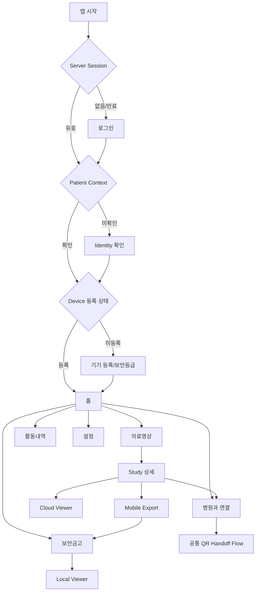

# MediQ Mobile Application Screen Design Specification

**Project:** MediQ  
**Product:** Patient-Controlled Medical Imaging Mobility SaaS  
**Document ID:** MEDIQ-MOB-SCREEN-001  
**Document Title:** MediQ Mobile Application Screen Design Specification  
**Version:** 0.2.1 — Synthetic Lab Preview Amendment  
**Classification:** CAPSTONE-P1  
**Status:** Proposed Screen Design Baseline  
**Owner:** MediQ Product, Mobile, Architecture, Security & QA  
**Related Documents:** `MOBILE-APPLICATION-REQUIREMENTS.md`, `MOBILE-UI-UX-SPEC.md`, `MOBILE-NAVIGATION-AND-STATE-MODEL.md`, `MOBILE-APP-ARCHITECTURE.md`, `SECURE-MEDICAL-CAPSULE-FORMAT.md`, `MOBILE-API-CONTRACT.md`, `docs/architecture/qr/*`  
**Last Updated:** 2026-09-26  
**Implementation:** NOT IMPLEMENTED  
**Test Status:** NOT RUN

---

# 1. 목적과 문서 권위

본 문서는 MediQ 환자용 Android 애플리케이션을 개발자가 추가 제품 해석 없이 구현할 수 있도록 화면, 상태, 이동, API 의존성, 보안 Guard, 감사 이벤트 및 검증 기준을 화면 단위로 정의한다. 실제 Android 코드, Backend API, 데이터베이스 Migration 또는 Test 실행 결과를 의미하지 않는다.

```text
MOBILE-APPLICATION-REQUIREMENTS.md
        ↓
MOBILE-UI-UX-SPEC.md
        ↓
MOBILE-SCREEN-DESIGN-SPEC.md
        ↓
Android 화면 구현
```

이 문서는 기존 15개 개념 화면을 삭제하거나 대체하지 않는다. 세부 구현 화면 77개로 분해하며, 기존 `MOB-01`~`MOB-15`와 본 문서의 `MOB-SCR-*`/`MOB-QR-*`/`MOB-HHP-*`는 별도 ID 체계다.

# 2. 기준선 분석

## 2.1 문서 정합성

| 기준 | 상태 | 화면설계 반영 |
|---|---|---|
| Project Charter, MVP Boundary, Product Baseline | ALIGNED | P0 우선, P1 Android, Synthetic/Test 경계 유지 |
| Requirements v1.3 / Mobile Requirements v1.1 | ALIGNED | `MAPP-*`, `REQ-MOB-020~026`, `REQ-QR-001~009` 반영 |
| Mobile Navigation/State Model | ALIGNED | Domain·서버·로컬·UI 상태를 분리하고 Composite Guard 사용 |
| Android Architecture / Capsule Format / Mobile API | ALIGNED | Compose, DPoP, Device Proof/Wrap Key 분리, Capsule exact bytes, 원자적 활성화 반영 |
| QR 설계 패키지 | ALIGNED | Pairing capability, 최초 유효 claim, 별도 Consent/승인/Grant, 전송상태 분리 |
| `MOBILE-UI-UX-SPEC.md`의 “모바일 공유 요청 P2” | PARTIALLY ALIGNED | 2026-09-21 후속 승인 기준인 QR P1 문서를 적용하며 기존 문구 개정 필요 |
| Mobile Native Stack `OPEN DECISION` 표기 | PARTIALLY ALIGNED | 후속 요구사항의 Kotlin+Jetpack Compose 결정을 적용; SDK/라이브러리는 미결정 |
| `SECURITY-REQUIREMENTS.md`의 `SEC-MOB-007/008` 중복 ID | CONFLICT | 제목을 함께 인용하고 `SEC-MOB-010~019`를 우선 사용; 중복 ID 정리 Ticket 필요 |
| Patient Context/Study discovery API | MISSING | 화면은 정의하되 Proposed API Gap으로 표시 |
| Device 목록/활동내역 조회 API | MISSING | 화면은 정의하되 구현 전 계약 추가 필요 |
| QR API의 Core OpenAPI 병합 | MISSING | QR 계약 문서 기준 Proposed; `OPENAPI.yaml`에는 미반영 |

## 2.2 제품 불변조건

- Hospital PACS가 Source of Record이며 MediQ Cloud는 Permanent PACS 또는 장기 Archive가 아니다.
- 모바일은 PACS endpoint를 직접 호출하거나 PACS credential을 받지 않는다.
- Cloud Viewer는 Backend Authorization Gateway와 short-lived Viewer Session을 거쳐 WADO-RS 데이터를 온디맨드로 전달한다.
- Mobile Export는 `study:mobile-export`, QR VIEW는 `study:view`, QR PACS 반입은 `study:pacs-transfer`를 각각 요구한다.
- Consent, Authorization, Transfer Grant, QR claim, 환자 승인은 서로 대체되지 않는다.
- 불확실한 Identity, Device, Consent, Authorization, Grant, Lease 또는 Integrity 상태는 `DENY BY DEFAULT`와 `FAIL CLOSED`로 처리한다.
- QR `GRANT_ISSUED`는 영상 조회 또는 PACS 저장 완료가 아니다.
- 평문 DICOM/Pixel Data는 Gallery, Download, 공유 Storage, 로그, Crash Report에 남기지 않는다.

# 3. 범위와 사용자

| 항목 | 결정 |
|---|---|
| Client | Android Native Patient App |
| UI 기술 | Kotlin, Jetpack Compose, Single Activity |
| 범위 | CAPSTONE-P1; P0 성공조건과 독립 |
| 사용자 | 인증되고 PatientReference에 결합된 Patient |
| 데이터 | Synthetic/Test/De-identified DICOM only |
| Persistent Vault 허용 | 검증된 `STRONGBOX` 또는 `TRUSTED_ENVIRONMENT` |
| `SOFTWARE`/`UNKNOWN` | Mobile Export/Vault 거부, 승인된 Cloud Viewer 대안 |
| Offline Lease | 발급 또는 마지막 온라인 검증 후 최대 30일 |
| 제외 | iOS Native, 직접 PACS 연결·업로드, Key escrow/이전, 일반 공유, AI 진단 |

# 4. 정보구조와 Navigation

하단 Navigation은 다음 5개 항목으로 확정한다.

```text
홈 | 의료영상 | 보안금고 | 활동내역 | 설정
```

QR Handoff의 두 진입점은 하나의 공통 Flow로 연결한다.



## 4.1 기존 개념 화면 매핑

| 기존 ID | 세부 구현 화면 |
|---|---|
| MOB-01 | MOB-SCR-001~002 |
| MOB-02 | MOB-SCR-003~004 |
| MOB-03 | MOB-SCR-005~006, 008 |
| MOB-04 | MOB-SCR-007 |
| MOB-05 | MOB-SCR-010~012 |
| MOB-06 | MOB-SCR-013~017 |
| MOB-07 | MOB-SCR-020~022 |
| MOB-08 | MOB-SCR-023~027 |
| MOB-09 | MOB-SCR-028~030, 040 |
| MOB-10 | MOB-SCR-041~046 |
| MOB-11 | MOB-SCR-047, 057 |
| MOB-12 | MOB-SCR-048 및 관련 Consent/Grant 상태 |
| MOB-13 | MOB-SCR-051~054 |
| MOB-14 | MOB-SCR-055~056 |
| MOB-15 | MOB-SCR-050, 058 |
| 후속 QR P1 | MOB-QR-001~019 |

# 5. 공통 화면 구현 계약

아래 공통값과 화면별 계약을 합친 결과가 각 화면의 완전한 구현 계약이다. 화면별 표에서 별도 값이 없으면 이 절을 상속한다.

| 템플릿 필드 | 공통 계약 |
|---|---|
| Client / Classification | Patient Android App / CAPSTONE-P1 |
| Actor | Patient; Hospital actor 정보는 서버 검증 결과로만 표시 |
| Required Authentication | 공개 Shell을 제외하고 OIDC Authorization Code + PKCE; 등록 후 민감 API는 DPoP; 승인·폐기·QR 최종승인은 최근 재인증 |
| Never Trust from Client | `patientId`, tenant/hospital/actor, Study/UID, action/scope, destination, Consent/Grant 상태, security level, expiry, 성공 여부 |
| Screen States | `INITIAL`, `LOADING`, `CONTENT`, `EMPTY`, `OFFLINE`, `RETRYABLE_ERROR`, `NON_RETRYABLE_ERROR`, `AUTH_REQUIRED`, `ACCESS_DENIED`, `EXPIRED`, `REVOKED`, `CONFLICT`; 화면별 적용 불가 상태는 생략 가능 |
| Security Controls | 서버 권위 상태, 최소권한, fail closed, stale response 폐기, 중복 명령 방지, Correlation ID |
| Privacy Controls | 민감 화면 `FLAG_SECURE`, Background 즉시 Privacy Screen, App Switcher 비노출, Cache/Clipboard/Notification/로그 최소화 |
| Accessibility | TalkBack label/순서, 48dp touch target, Font Scale, AA 대비, 색상 외 Text/Icon 상태, 오류 시 Focus 이동 |
| Error Display | 내부 endpoint, DICOM UID, Token, Key, PACS credential, Stack trace를 표시하지 않고 안전한 행동과 Correlation ID만 제공 |
| API Status | 별도 표시 없으면 `PROPOSED / NOT IMPLEMENTED`; P0 Viewer/Consent/Grant만 `EXISTING P0 CONTRACT` |
| Local Storage | Room에는 최소 메타데이터·상태만, Capsule은 app-private/no-backup, 평문 DICOM·DEK 저장 금지 |
| Acceptance Status | 연결된 모든 Test는 `NOT RUN`; 실행 증거 전 PASS 금지 |

## 5.1 공통 Component

`AppBar`, `BottomNavigation`, `StudyCard`, `HospitalBadge`, `SecurityLevelBadge`, `ConsentSummaryCard`, `GrantStatusBadge`, `OfflineLeaseBadge`, `VaultItemCard`, `DownloadProgress`, `QRDisplayCard`, `VerifiedHospitalCard`, `ConfirmationBottomSheet`, `SecurityWarningBanner`, `EmptyState`, `RetryPanel`, `PrivacyScreen`을 Compose 공통 Component로 사용한다. 아이콘은 Text Label 없이 단독 의미로 사용하지 않는다.

## 5.2 Design Token

| Token | 값/원칙 |
|---|---|
| Primary Medical Blue | `#1769AA` 후보; 최종 Contrast 검증 필요 |
| Secondary Teal | `#00796B` 후보 |
| Secure Navy | `#12324A` 후보 |
| Success / Warning / Critical | Green / Orange / Red 계열 + Text/Icon 병행 |
| Neutral | Gray scale; disabled와 unavailable을 구분 |
| Spacing | 4dp grid, 8/12/16/24/32dp |
| Typography | Title 24sp, Section 20sp, Body 16sp, Caption 12~14sp, Metadata tabular style 후보 |
| Dark Mode | OPEN DECISION; Viewer 가독성·대비 시험 전 승인하지 않음 |

# 6. 화면 목록

| 영역 | 화면 ID | 수 |
|---|---|---:|
| 앱 시작·인증 | MOB-SCR-001~008 | 8 |
| 홈·의료영상 | MOB-SCR-010~017 | 8 |
| Mobile Export·Vault | MOB-SCR-020~030 | 11 |
| Local Viewer | MOB-SCR-040~048 | 9 |
| QR Handoff | MOB-QR-001~019 | 19 |
| 기기·보안·복구 | MOB-SCR-050~058 | 9 |
| 활동·감사 | MOB-SCR-060~064 | 5 |
| **합계** |  | **69** |

# 7. 화면별 구현 계약

각 표의 열은 다음 템플릿을 압축한다.

- **목적·경로:** Purpose, Entry Point, Exit Point
- **Guard:** Preconditions, Authentication, Authorization, Device, Network
- **데이터·UI:** Input Data, Server-derived Data, Local Data, Never Trust, Components, Information Hierarchy, CTA
- **행동·상태:** Screen States, User Actions, Navigation, State Transition
- **의존성:** API Dependency, Local Storage Dependency
- **보호·검증:** Security, Privacy, Accessibility, Audit, Error, Acceptance, Related Requirements, Open Decisions

## 7.1 앱 시작 및 인증

| ID / 화면 | 목적·경로 | Guard | 데이터·UI | 행동·상태 | 의존성 | 보호·검증 |
|---|---|---|---|---|---|---|
| MOB-SCR-001 Splash·보안 초기화 | 앱 무결성·세션·로컬 복구상태를 확인; 실행→002/003/010/040/007 | Auth 선택; Device 상태 로컬 snapshot; Network 선택 | 앱 버전·환경·초기화 단계; 환자정보 금지; `안전하게 시작하는 중` | 초기화, Staging 복구/격리, Deep Link 검증; 실패 시 Retry/지원 | Local secure prefs·Vault index; Session/보안상태 API는 GAP | Privacy Screen을 먼저 설치; `APP_STARTED`, `STAGING_RECOVERY_*`; MAPP-LIFE-005/006, PLT-006; Process-death test |
| MOB-SCR-002 로그인 | 서버 Session 생성; 001/만료→003 | Network 필수; OIDC IdP; Device 미등록 허용 | 서비스 설명, 테스트환경 Banner, 로그인 CTA; Password 입력 금지 | System Browser 시작/취소/재시도; success→003 | OIDC Code+PKCE profile; Token은 OS 보호 저장소 | State/nonce/redirect 검증; `LOGIN_SUCCESS/FAILURE`; MAPP-AUTH-001~003, TC-MOB-019-A; 문구 `MediQ에 로그인` |
| MOB-SCR-003 환자 Identity 확인 | Subject↔PatientReference 확인; 002→004/005/010 | Auth 필수; Network 필수; Identity 미확인 | 서버 마스킹 별칭·상태; Hospital-local ID 입력 금지 | 확인/불일치 신고/재시도; mismatch는 ACCESS_DENIED | `GET /mobile/patient-context` GAP | BOLA 방지; `PATIENT_CONTEXT_VERIFIED/DENIED`; MAPP-AUTH-004, STU-001; 문구 `내 정보가 맞는지 확인해 주세요` |
| MOB-SCR-004 이용약관·필수 안내 | 승인된 정책 버전 확인; 003→005/010 | Auth+Identity; Network 필수 | 정책 제목/버전/필수·선택 구분; 자유 Consent 확대 금지 | 스크롤/확인/거절; 미동의→로그아웃 | Policy/acknowledgement API GAP; local accepted version 최소 캐시 | 의료영상 Consent와 서비스 약관 분리; `POLICY_ACKNOWLEDGED`; MAPP-UX-008; UI/API 결정 필요 |
| MOB-SCR-005 기기 등록 | Proof/Wrap Key 생성·등록; 004/055→006 | Auth+Identity+recent auth; Android; Network 필수 | 등록 목적·단계·기기 별칭; Private Key/Attestation 원문 미표시 | Challenge→키 생성→Evidence 제출; cancel→010 제한모드 | `POST /mobile/attestation-challenges`, `POST /mobile/devices`; Keystore aliases | Proof/Wrap Key 분리·non-export; `DEVICE_REGISTERED/DEVICE_REGISTRATION_FAILED`; MAPP-DEV-001~003, TC-MOB-019-C |
| MOB-SCR-006 기기 보안등급 확인 | 서버 Admission 결과 설명; 005/050→008/007 | Auth+Identity; registered candidate; Network 필수 | 실제 `STRONGBOX/TEE/SOFTWARE/UNKNOWN`, Vault/Viewer 허용; 점수 과장 금지 | 상태 조회/재검사; verified→008, limited→007 | `GET /mobile/devices/{deviceId}/security-status`; minimal local snapshot | Silent downgrade 금지; `DEVICE_ADMISSION_ALLOWED/DENIED`; MAPP-DEV-004~006, TC-MOB-011-A~C |
| MOB-SCR-007 지원 불가 기기 | 안전한 대안 제공; 006→015/005/도움말 | Auth+Identity; `SOFTWARE/UNKNOWN/FAILED` | 제한 사유, `[클라우드에서 영상 보기] [다른 기기 등록] [보안 요구사항 확인]` | Vault/Export CTA 비활성; Cloud Viewer는 별도 view Guard | security-status + existing Viewer action | Software를 TEE로 표시 금지; `DEVICE_ADMISSION_DENIED`; MAPP-DEV-005/006, MAPP-ERR-001; TC-MOB-011-C |
| MOB-SCR-008 생체인증·Device Credential 설정 | Vault Key 사용 승인수단 설정; 006→010 | Active verified device; OS secure lock; Network 선택 | 지원 Authenticator와 영향; 앱 PIN은 미승인 OPEN DECISION | BiometricPrompt 등록/시험; 실패→007 또는 재시도 | Android Keystore/BiometricPrompt; 서버 API 없음 | 생체인증은 Identity/Consent 아님; `LOCAL_AUTH_CONFIGURED`; MAPP-AUTH-006, LVW-001; TC-MOB-008 |

## 7.2 홈과 의료영상

| ID / 화면 | 목적·경로 | Guard | 데이터·UI | 행동·상태 | 의존성 | 보호·검증 |
|---|---|---|---|---|---|---|
| MOB-SCR-010 홈 Dashboard | 핵심 작업 요약; 인증 완료→각 Tab/QR | Auth+Identity; Network 선택 | 최근 Study/Vault·Lease·보안 알림·`병원과 연결`; 서버/로컬 출처 표기 | 새로고침, Study/Vault/QR 이동; offline은 local summary만 | Study/Activity summary API GAP; Room safe summary | 잠금화면/Recent에 PHI 금지; `HOME_VIEWED` 선택; MAPP-STU-001/UX-001/AUD-006 |
| MOB-SCR-011 내 의료영상 목록 | 허용 Study 탐색; 010/Tab→013 | Auth+Identity; online | 병원, 검사일, modality, 설명, 상태; UID·local patient ID 금지 | refresh/paging/select; empty/offline/error 분리 | `GET /mobile/studies` GAP | 서버 소유권 필터; `STUDY_LIST_VIEWED`; MAPP-STU-001~003, TC-MOB-019-D |
| MOB-SCR-012 병원별 의료영상 필터 | 목록을 로컬 필터링; 011→011/013 | 011과 동일 | 서버 제공 병원 display name만; 검색문 저장 최소화 | 병원/기간/modality 선택·초기화 | Study list 응답; UI local state only | 필터가 권한을 확대하지 않음; MAPP-STU-002, UX-005; Compose UI test |
| MOB-SCR-013 의료영상 상세 | Study 정보와 독립 Action 제시; 011/010→014/015/020/QR | Auth+Identity+Study ownership; online | 원본 병원, 날짜, modality, series/images 요약; Cloud/저장/병원연결 CTA | 각 Action은 별도 Guard; 저장됨이면 Vault 이동 | `GET /mobile/studies/{studyRefId}` GAP | UID/URL은 권한 아님; `STUDY_DETAIL_VIEWED`; MAPP-STU-001~003, UX-002 |
| MOB-SCR-014 영상 접근권한 확인 | Consent/Auth/Grant 결과를 Action별 표시; 013→015/020/차단 | Auth+Identity; online; selected Study/action | `조회`, `모바일 저장`, `PACS 반입` 권한을 분리; Client 상태 신뢰 금지 | 재승인/동의 화면/뒤로; UNKNOWN은 deny | Existing Exchange/Consent/Grant + Patient action summary GAP | `ACCESS_DECISION_VIEWED/DENIED`; MAPP-ERR-001/003, EXP-001/002 |
| MOB-SCR-015 Cloud Viewer 시작 | short-lived Viewer Session 요청; 013/007/014→016 | Auth+Identity+Consent+Authorization+`study:view`; online | 원본 병원·대상 Study·세션 제한; 시작 CTA | 재인증 필요 시 002; 허용→016; deny→014 | `POST /exchange-sessions/{sessionId}/actions/view` EXISTING P0 | 모바일이 PACS 호출 금지; Viewer session만 사용; MAPP-STU-004, TC-VIEW-004~009 |
| MOB-SCR-016 Patient Cloud Viewer | WADO-RS 온디맨드 영상 열람; 015→013 | 유효 Viewer Session; foreground; online | 원본 병원, 연결상태, Study/Series, frame loading, 남은 시간; viewer controls | Series/Instance, zoom/pan/WL/reset/fullscreen/close; expiry/revoke 즉시 중지 | Viewer Gateway/WADO proxy EXISTING P0; memory cache only/no-store | Background clear, UID 직접접근 금지; `VIEWER_OPENED/CLOSED/DENIED`; MAPP-STU-004~008, LIFE-001~004 |
| MOB-SCR-017 Source PACS 연결 실패 | 안전한 실패와 재시도; 016→015/013 | Auth 상태 재평가; online 여부 | 사용자용 사유, 재시도 가능 여부, Correlation ID; endpoint 금지 | retry/back; permanent copy fallback 금지 | Viewer error envelope EXISTING P0 | 실패를 성공/캐시영상으로 표시 금지; `VIEWER_UPSTREAM_FAILED`; MAPP-STU-006, ERR-003/004 |

## 7.3 Mobile Export와 Secure Vault

| ID / 화면 | 목적·경로 | Guard | 데이터·UI | 행동·상태 | 의존성 | 보호·검증 |
|---|---|---|---|---|---|---|
| MOB-SCR-020 모바일 저장 안내 | Cloud Viewer와 Device Vault 차이 설명; 013→021 | Auth+Identity; Device 상태 조회 가능 | 암호화, 기기결합, 최대 30일, 저장용량, no-share; CTA `안전하게 저장` | 계속/취소; unsupported→007 | Study detail + security status | Mobile Export가 PACS 전송 아님; MAPP-EXP-001~005, UX-008 |
| MOB-SCR-021 Mobile Export Consent | 특정 Study/Device/action 승인; 020→022 | recent auth; exact active/new Consent; online | Study, source, device, purpose, lease, 철회 한계; Consent version | approve/reject; success라도 Grant와 분리 | Existing Consent action + mobile exact-scope amendment GAP | `MOBILE_EXPORT_CONSENT_APPROVED/REJECTED`; MAPP-EXP-001~003, TC-MOB-016-C |
| MOB-SCR-022 저장공간·기기보안 사전검사 | Export 전 로컬/서버 조건 확인; 021→023/007 | Active verified device, storage margin, network, current Grant | 보안등급·필요/가용공간·네트워크·권한 결과 | 다시검사/정리/계속; 실패 항목별 복구 | security-status + local storage API + grant decision | Client 보고 storage는 힌트; 서버 binding 재검증; `MOBILE_EXPORT_PREFLIGHT_*`; MAPP-EXP-003/006, VLT-006 |
| MOB-SCR-023 Capsule 생성 대기 | 서버 package operation 추적; 022→024 | exact `study:mobile-export`, active device/Consent/Auth; online | 실제 operation state만; 가짜 percent 금지 | poll/cancel 가능 시 cancel; failed→안내 | `POST .../actions/mobile-export`, `GET /mobile-export-operations/{operationId}` | idempotency; `MOBILE_EXPORT_REQUESTED/AUTHORIZED/FAILED`; MAPP-EXP-001~010, API-MOB-008~011 |
| MOB-SCR-024 암호화 다운로드 진행 | exact ciphertext records 다운로드; 023→026/025 | DPoP-bound Download Session; active device/grant; online | byte progress, chunk count, ETA는 보수적; PHI 최소 | pause/retry/cancel; completion→026 | Download session, manifest, chunk APIs; encrypted Staging | ETag/Range/If-Range, no JSON reconstruction; `CAPSULE_DOWNLOAD_STARTED/COMPLETED`; MAPP-EXP-006~009, TC-MOB-018-C/D |
| MOB-SCR-025 다운로드 일시정지·재개 | 안전한 resume; 024→024/삭제 | 동일 Capsule/content version/ETag/device; online for resume | 완료 record·남은 크기; Token 표시 금지 | resume/reset/cancel; ETag change→Staging reset | Same download APIs; encrypted Staging | 서로 다른 Capsule record 혼합 금지; `CAPSULE_DOWNLOAD_PAUSED/RESUMED/RESET`; MAPP-EXP-008, API-MOB-014~019 |
| MOB-SCR-026 Capsule 검증 | 서명·binding·record 무결성 확인; 024→027/046 | foreground; verified device; Capsule complete | 단계명만 표시, key/hash 원문 금지 | 자동검증; success commit, failure quarantine | Local Capsule parser/crypto; no network required unless policy refresh | COSE/GCM/hash/order/version fail closed; `CAPSULE_VERIFICATION_SUCCEEDED/FAILED`; MAPP-CAP-001~009, TC-MOB-018-A/B/F |
| MOB-SCR-027 Vault 저장 완료 | 원자적 활성화 확인; 026→029/028 | verification success + atomic commit + current epoch | 원본병원/Study/크기/Lease; `저장 완료`는 local commit 의미 | 보기/목록; storage acknowledgement retry | storage ack + lease issue; app-private Vault/Room metadata | 서버 Ack 실패와 로컬 commit 구분; `VAULT_ITEM_ACTIVATED`; MAPP-EXP-009, VLT-005, TC-MOB-018-D |
| MOB-SCR-028 Mobile Secure Vault 목록 | 로컬 Capsule 상태 탐색; 010/Tab→029/040 | Identity snapshot; Active/verified device; Vault metadata access | 병원, 검사일, modality, 설명, 크기, 상태, integrity, lease, last viewed | select/filter/delete; locked/revoked/corrupt 구분 | Room metadata + optional online sync | 부분/손상 항목을 AVAILABLE로 표시 금지; `VAULT_LIST_VIEWED`; MAPP-VLT-001~010 |
| MOB-SCR-029 Vault 의료영상 상세 | Local 상태와 다음 Action 설명; 028/027→040/030/057 | Capsule binding, state snapshot; network optional | 모든 Vault metadata, source, integrity, lease, sync, 재검증 | 열기/온라인확인/삭제; share/export 버튼 없음 | Room + lease proof; optional lease status | Cloud/Local viewer label 분리; `VAULT_ITEM_VIEWED`; MAPP-VLT-007~010, LVW-001 |
| MOB-SCR-030 Vault 항목 삭제 확인 | Crypto-shred와 상태 차이 설명; 029→028 | Local auth; target binding; server deletion optional | 대상 Study·영향·서버/로컬 삭제 상태; `삭제` 위험 CTA | 취소/삭제; key destroy 후 ciphertext cleanup | `DELETE /mobile-capsules/{capsuleId}` proposed + local key/file deletion | 물리 완전삭제 과장 금지; `CAPSULE_CRYPTO_SHREDDED/DELETE_FAILED`; MAPP-VLT-007/008, TC-MOB-017 |

## 7.4 Local Viewer

| ID / 화면 | 목적·경로 | Guard | 데이터·UI | 행동·상태 | 의존성 | 보호·검증 |
|---|---|---|---|---|---|---|
| MOB-SCR-040 Vault 잠금해제 | Hardware key 사용 승인; 029→041 | Capsule/device/lease precheck; foreground; local biometric/device credential | 대상 Study 최소정보, 인증 prompt; PIN은 승인 전 제공 금지 | 인증/취소; 실패 횟수 정책은 OS 준수 | BiometricPrompt+Keystore; no API | 생체=Identity/Consent 아님; `VAULT_UNLOCK_SUCCEEDED/FAILED`; MAPP-AUTH-006, LVW-001, TC-MOB-008 |
| MOB-SCR-041 Local Viewer 초기 로딩 | Composite Guard와 첫 frame 준비; 040→042/045~048 | Device binding+Capsule+Lease+local auth+integrity 모두 valid | 검사명, loading stage, first-frame progress; 평문 temp 금지 | cancel; guard failure별 전용화면 | Local crypto/parser/renderer; bounded memory | 필요한 record만 복호화; `LOCAL_VIEW_STARTED/DENIED`; MAPP-LVW-001~004, PERF-004 |
| MOB-SCR-042 Local DICOM Viewer | 저장 영상 빠른 열람; 041→029 | Viewer session ACTIVE, foreground, lease valid | Study/Series/Instance, offline/lease 표시, controls, 비진단 문구 | zoom/pan/WL/series/frame/reset/close | Local Capsule reader/renderer; no network required | `FLAG_SECURE`, background buffer clear, share 없음; `LOCAL_VIEW_STARTED/CLOSED`; MAPP-LVW-001~008, TC-MOB-007/012-A |
| MOB-SCR-043 Series·Instance 탐색 | Series/frame 선택; 042→042 | 동일 Viewer Guard | 서버 서명 manifest 기반 안전 metadata; raw UID 기본 미표시 | 이전/다음/list select; prefetch bounded | Local index + encrypted records | malicious metadata bounds; `LOCAL_VIEW_NAVIGATED` client-reported; MAPP-LVW-002/005/006 |
| MOB-SCR-044 Window/Level 조정 | 영상 표현 조정; 042→042 | 동일 Viewer Guard | preset, current W/L; 진단 preset 보장 금지 | gesture + 접근 가능한 +/-/reset 버튼 | Renderer memory only | 설정/thumbnail 평문 저장 금지; `VIEWER_TOOL_USED` optional; MAPP-LVW-005, UX-006 |
| MOB-SCR-045 지원하지 않는 DICOM | 안전한 codec 거부; 041→029/Cloud Viewer | unsupported SOP/Transfer Syntax/size; network optional | 일반화된 형식 미지원, 원본 손상 단정 금지 | Cloud Viewer/뒤로/지원 | Local parser result; optional Viewer P0 | partial pixel 저장 금지; `LOCAL_VIEW_DENIED_UNSUPPORTED`; MAPP-LVW-006, TC-MOB-007 확장 |
| MOB-SCR-046 Capsule 무결성 검증 실패 | 손상/변조 Capsule 격리; 026/041→029/재다운로드 | integrity fail; no viewer access | `안전하게 확인할 수 없어 열 수 없음`, Correlation ID; 세부 hash 금지 | 안전하게 삭제/재다운로드/지원 | local quarantine + reissue API | 절대 AVAILABLE/Viewer 표시 금지; `CAPSULE_VERIFICATION_FAILED`; MAPP-ERR-002, TC-MOB-012-B/018-B |
| MOB-SCR-047 Offline Lease 만료 | 복호화 차단과 온라인 재검증; 028/041→057/029 | Lease expired/time unknown; network optional | 만료일·이유 범주·`온라인으로 다시 확인`/`홈으로 이동` | renew 또는 exit; 기기 날짜 변경 안내 금지 | Lease renewal API; signed local proof | 만료 즉시 decrypt 중지; `OFFLINE_LEASE_EXPIRED`; MAPP-OFF-001~006, TC-MOB-013-B/C |
| MOB-SCR-048 Consent·Grant·기기상태 변경 | 동기화된 revoke/epoch 변화 처리; 041/042/028→029/056 | signed server update or safe unknown | 변경 대상과 가능한 행동; 즉시 원격삭제 완료 주장 금지 | close viewer, lock item, reapprove/reissue | sync GAP + consent/grant/device status APIs | stale success 재사용 금지; `LOCAL_VIEW_DENIED/LOCAL_REVOCATION_APPLIED`; MAPP-ERR-001/003, REC-002 |

## 7.5 QR Handoff

| ID / 화면 | 목적·경로 | Guard | 데이터·UI | 행동·상태 | 의존성 | 보호·검증 |
|---|---|---|---|---|---|---|
| MOB-QR-001 병원과 연결 시작 | QR 의미·절차 설명; 010/013→002 | Auth+Identity; registered session; online | `QR은 영상/승인 아님`, receiving hospital 로그인 필요 | 시작/취소 | none, local route | 민감 snapshot 방지; MAPP-QR-010/017, QR-AT-045 |
| MOB-QR-002 공유할 Study 선택 | 정확히 한 Study 선택; 001→003 | patient-owned authorized Studies; online | source hospital/date/modality/description; UID 금지 | one select/refresh | `GET /mobile/studies` GAP | Client Study spoof 금지; MAPP-QR-001, QR-AT-001 |
| MOB-QR-003 허용 작업 선택 | VIEW 또는 PACS_IMPORT 하나 선택; 002→004 | selected Study; online | 두 결과 설명; PACS_IMPORT 미선택 기본 | radio select/back/continue | local form; server validates create | scope 자동확대 금지; MAPP-QR-002, QR-AT-048 |
| MOB-QR-004 요청 목적 확인 | 정책 controlled purpose 선택; 003→005 | action selected | purpose code/설명; 자유 PHI text 금지 | select/continue | purpose catalog API GAP | 목적 변경은 새 snapshot; MAPP-QR-009/013, QR-AT-047 |
| MOB-QR-005 QR 생성 전 확인 | Study/source/action/purpose/5분 검토; 004→006 | recent auth, exact selection, online | destination 미정 경고, `[5분 QR 생성]`; Client patient/destination 금지 | create/back | `POST /api/v1/qr-handoff/requests` | idempotency; `QR_REQUEST_CREATED`; MAPP-QR-001~005, QR-AT-001/033/034 |
| MOB-QR-006 QR 표시·스캔 대기 | one-time QR 표시·poll/cancel; 005→007/015/016 | state CREATED; server expiry; foreground | QR, server countdown, 6-char display ref, Study/action, 안내·취소 | poll/cancel; refresh가 새 QR 생성 금지 | GET request, cancellation API | QR/raw ref 로그·clipboard 금지; `QR_CANCELLED/EXPIRED`; MAPP-QR-003~005/018, QR-AT-002/045 |
| MOB-QR-007 병원 스캔 확인 | claim 발생을 환자에게 알림; 006→008 | state CLAIMED/AWAITING; server data only | `의료기관이 연결됨`, 아직 승인 전; 병원 요약은 준비 후만 | continue/cancel | GET request | scan≠Consent/Grant; `QR_CLAIM_SUCCEEDED` server-observed; MAPP-QR-006/010, QR-AT-003 |
| MOB-QR-008 요청 병원·의료진 확인 | 독립 검증 destination/actor 검토; 007→009/010/014 | AWAITING, owner, unexpired | verified hospital/trust, actor/role, source, Study, purpose, action, expiry, display ref | approve path/reject | GET request | QR 값 아닌 서버 snapshot; `QR_STATUS_VIEWED`; MAPP-QR-007/009/017, QR-AT-004/016/047 |
| MOB-QR-009 QR 관련 Consent 확인 | 정확한 Consent/version 확인·별도 승인; 008→010 | exact destination/Study/purpose/action; online | ACTIVE Consent 또는 새 Consent 내용·version·expiry | approve consent/reject/back | EXISTING P0 Consent action + QR binding | QR 승인과 Consent 분리; `CONSENT_APPROVED/REJECTED`; MAPP-QR-010/011, QR-AT-005/029~031 |
| MOB-QR-010 환자 최종승인 | immutable snapshot 최종 결정; 009/008→011/014 | recent reauth, active exact Consent, If-Match, unexpired | hospital/actor/source/Study/purpose/action/duration 반복, `[거절] [내용을 확인하고 승인]` | approve/reject; override field 없음 | approval/rejection endpoints | DPoP+idempotency+ETag; `QR_APPROVED/REJECTED`; MAPP-QR-009~013/016, QR-AT-006/020~023/035~037 |
| MOB-QR-011 Grant 발급 대기 | 현재 정책 재검증 상태 표시; 010→012/013/019 | GRANT_ISSUANCE_PENDING | `접근 권한을 확인하고 있습니다`; `전송 중` 금지 | poll/close; success 추정 금지 | GET request | bounded retry; `QR_GRANT_ISSUANCE_REQUESTED`; MAPP-QR-012/014, QR-AT-040/050 |
| MOB-QR-012 VIEW 권한 발급 완료 | VIEW Grant 준비 결과; 011→활동/닫기 | GRANT_ISSUED, scope study:view | 병원·Study·15분 제안 TTL, `제한된 시간 동안 뷰어` | close/activity; 환자 앱이 병원 Viewer 자동 실행하지 않음 | GET request result | Grant≠view complete; `QR_GRANT_ISSUED`; MAPP-QR-014, QR-AT-007/008 |
| MOB-QR-013 PACS_IMPORT 권한 발급 완료 | 전송 권한 준비 결과; 011→활동/닫기 | GRANT_ISSUED, scope study:pacs-transfer | `실제 전송과 목적지 확인은 별도`, 30분 제안 TTL | close/activity | GET request; later existing PACS action | Grant≠STOW/verification complete; MAPP-QR-014, QR-AT-009/022 |
| MOB-QR-014 요청 거절 | terminal REJECTED 확인; 010/008→닫기/새 요청 | owner decision committed | 병원/Study 최소요약, `영상은 공유되지 않음` | close/new request | rejection endpoint/GET | terminal mutation 금지; `QR_REJECTED`; MAPP-QR-015, QR-AT-010/044 |
| MOB-QR-015 요청 취소 | terminal CANCELLED 확인; 006~008→닫기/새 요청 | owner+If-Match; no Grant binding | 취소 결과, 이미 승인/발급 상태 오인 금지 | close/new request | cancellation endpoint | race serialization; `QR_CANCELLED`; MAPP-QR-015/016, QR-AT-011/038 |
| MOB-QR-016 QR 만료 | terminal EXPIRED 안내; 006/008→새 요청 | server time authoritative | QR 또는 승인시간 만료를 구분 | new request/close | GET/command lazy expiry | client clock이 연장 금지; `QR_EXPIRED`; MAPP-QR-005/015, QR-AT-023/043 |
| MOB-QR-017 중복 스캔·상태 충돌 | claim/version conflict 안전 처리; 006/010→status/새 요청 | server state+ETag | 다른 병원 정보 노출 없는 generic conflict | refresh/new request | claim/status API | atomic first claim, one decision; `QR_CLAIM_DENIED/QR_DECISION_DENIED`; MAPP-QR-006/016, QR-AT-015/024/037 |
| MOB-QR-018 QR·요청 검증 실패 | origin/version/ref/trust/binding 오류; deep link/scan→닫기 | allowlisted origin, auth context; online | `요청을 확인할 수 없습니다`, 세부 존재정보 금지 | rescan/close/support | claim or status error contract | raw ref/PHI 로그 금지; `QR_CLAIM_DENIED`; MAPP-QR-003/007/018, QR-AT-012/014/017~019/026~028 |
| MOB-QR-019 Grant 발급 실패 | FAILED 또는 retryable pending 처리; 011→새 요청/재시도 | server-declared retryability | `권한을 발급하지 못함; 영상은 공유되지 않음` | retry status only if allowed/new request | GET status; issuance internal | 실패 시 Grant 없음; `QR_GRANT_FAILED`; MAPP-QR-012~015, QR-AT-025/030/040/041 |

## 7.6 기기·보안·복구

| ID / 화면 | 목적·경로 | Guard | 데이터·UI | 행동·상태 | 의존성 | 보호·검증 |
|---|---|---|---|---|---|---|
| MOB-SCR-050 보안·저장공간 설정 | 현재 보안·용량·정책 요약; 설정 Tab→051/057/058 | Auth/Identity; 일부 offline | security level, local auth, Vault bytes, lease summary, capture 설명 | 재검사/정리/기기/로그아웃 | security-status + local storage; settings summary API GAP | 과장된 보안표현 금지; `SECURITY_SETTINGS_VIEWED`; MAPP-DEV-004, VLT-006 |
| MOB-SCR-051 등록 기기 목록 | 본인 기기 lifecycle 조회; 050→052/055 | Auth+Identity; online | 별칭, 등록일, last seen, status, level; key/attestation 원문 금지 | select/register | `GET /mobile/devices` API GAP | 다른 patient device 은닉; `DEVICE_LIST_VIEWED`; MAPP-DEV-007, API-004 |
| MOB-SCR-052 기기 상세 | 기기 상태·영향 확인; 051→053/054 | ownership; online | ACTIVE/LOST/REVOKED/RETIRED, level, Vault eligibility, last sync | lost/revoke/retire | security-status + device detail GAP | stale 상태 배지; `DEVICE_DETAIL_VIEWED`; MAPP-DEV-007, REC-001 |
| MOB-SCR-053 분실 기기 신고 | 분실 영향과 잔여위험 설명; 052→054 | Auth+Identity+recent reauth; online | 대상기기, 신규 session/lease 차단, 오프라인 잔여기간 가능성 | 계속/취소 | revocation endpoint | 원격 즉시삭제 보장 금지; `DEVICE_MARKED_LOST`; MAPP-REC-001/002/006, TC-MOB-016-A |
| MOB-SCR-054 기기 Revoke 확인 | LOST/REVOKED commit 결과; 053/052→051/055 | server committed result | server revoke 시각, local delete `UNKNOWN/PENDING/CONFIRMED` 분리 | 새 기기 등록/닫기 | `POST /mobile/devices/{deviceId}/revocations` | target DPoP 불필요, recent auth; `DEVICE_REVOKED`; MAPP-REC-001~003, API-MOB-024/025 |
| MOB-SCR-055 새 기기 등록 | 새 keys/attestation 시작; 051/054→005 | Auth+Identity+recent auth; new Android; online | 복구 아닌 새 등록·재다운로드 안내 | 시작/취소 | registration APIs | 기존 private key/DEK 이전 금지; `DEVICE_REGISTRATION_REQUESTED`; MAPP-REC-003/004, TC-MOB-016-B |
| MOB-SCR-056 의료영상 재다운로드 안내 | Source PACS 기반 새 Capsule 재발급; 048/055→022/023 | new verified device, current Consent/Auth/Grant, source available | 이전 Capsule 복구 아님, 대상 Study, 재승인 필요 여부 | reissue/request new approval | `POST /mobile-capsules/{capsuleId}/reissues` | cloud key escrow/copy 금지; `CAPSULE_REISSUE_REQUESTED/DENIED`; MAPP-REC-004/005, TC-MOB-016-B/C |
| MOB-SCR-057 Offline Lease 상태 | Study별 lease 확인/갱신; 029/047/050→029 | Device binding; online for renew | issued/last verified/expires/status/30-day max; safe-time 오류 | renew/back | lease issue/renewal APIs + signed proof | current Consent/Grant/Device 재검증; `OFFLINE_LEASE_RENEWED/DENIED`; MAPP-OFF-001~006, TC-MOB-013-A~C |
| MOB-SCR-058 앱 데이터 삭제·로그아웃 | server/local Session 정리와 Crypto-shred 영향 확인; 050→001 | local auth; recent server auth where needed | 삭제 대상, 로그아웃과 서버 revoke 차이, 복구불가 경고 | confirm/cancel | optional capsule delete/revoke + local wipe | Token/pixel/key session clear; `MOBILE_LOGOUT/CAPSULE_CRYPTO_SHREDDED`; MAPP-AUTH-008, VLT-008, TC-MOB-017 |

## 7.7 활동 및 감사

| ID / 화면 | 목적·경로 | Guard | 데이터·UI | 행동·상태 | 의존성 | 보호·검증 |
|---|---|---|---|---|---|---|
| MOB-SCR-060 활동내역 목록 | 환자에게 주요 행위 결과 제공; Tab→061~064 | Auth+Identity; online, safe cache optional | 시간·범주·결과·병원 display; raw audit schema/PHI 금지 | filter/select/refresh | **GET patient activity API GAP**; POST audit는 조회용 아님 | 최소 공개·서버 관찰/Client reported 구분; MAPP-AUD-001~007 |
| MOB-SCR-061 의료영상 열람 기록 | Cloud/Local Viewer 이력 설명; 060→뒤로 | ownership; online | Cloud/Local, source, time, outcome; UID/session token 금지 | detail/back | Activity query GAP | Local event는 `CLIENT_REPORTED`; `VIEWER_*`, `LOCAL_VIEW_*`; MAPP-AUD-003/006 |
| MOB-SCR-062 Mobile Export 기록 | 요청·다운로드·활성화 결과 분리; 060→Vault/detail | ownership; online | Study/source/device/operation states; 실제 server/local 관찰 구분 | retry eligible/open Vault | Activity query GAP + operation GET | `requested`를 저장완료로 표시 금지; MAPP-AUD-001/003/006, EXP-* |
| MOB-SCR-063 QR 승인·거절 기록 | QR decision과 Grant/transfer 상태 구분; 060→status | owner; online | hospital, action, decision, Grant state; PACS transfer 별도 | view detail/new request | QR GET/history API GAP | raw ref/display ref 저장·표시 최소화; `QR_*`; MAPP-QR-014/018, AUD-005/006 |
| MOB-SCR-064 보안 이벤트 안내 | 분실·revoke·integrity·login 실패 안내; 010/060→복구화면 | Auth+Identity; server-verified event | 일반화된 원인·영향·다음 행동·Correlation ID | reauth/register/reissue/support | Security notification/activity API GAP | 공격자에게 정책 세부 비노출; MAPP-AUD-007, ERR-004/005 |

# 8. 저충실도 Wireframe

아래 Wireframe은 정보 우선순위와 행동 계약을 표현한다. 실제 색상·간격·Typography는 Compose Design System과 접근성 검증 후 확정한다.

## WF-01 로그인 — MOB-SCR-002

```text
┌──────────────────────────────┐
│ MediQ              TEST 환경 │
│ 내 의료영상을 안전하게       │
│ 확인하고 병원과 연결합니다.  │
│                              │
│ [ MediQ에 로그인 ]           │
│ 비밀번호는 앱에서 받지 않음  │
│ 개인정보 안내 · 도움말       │
└──────────────────────────────┘
```

## WF-02 기기 보안등급 — MOB-SCR-006

```text
┌──────────────────────────────┐
│ ← 기기 보안 확인             │
│ ✓ 기기 등록                  │
│ ✓ 화면 잠금                  │
│ ✓ 키 보호: StrongBox         │
│                              │
│ 이 기기는 보안금고를         │
│ 사용할 수 있습니다.          │
│ [생체인증 설정] [다시 검사]  │
└──────────────────────────────┘
```

## WF-03 지원 불가 기기 — MOB-SCR-007

```text
┌──────────────────────────────┐
│ 이 기기에는 저장할 수 없음   │
│ 보안 키 수준을 확인하지       │
│ 못해 모바일 저장을 막았습니다│
│                              │
│ [클라우드에서 영상 보기]     │
│ [다른 기기 등록]             │
│ [보안 요구사항 확인]         │
└──────────────────────────────┘
```

## WF-04 홈 — MOB-SCR-010

```text
┌──────────────────────────────┐
│ 안녕하세요                   │
│ [ 병원과 연결 ]              │
│ 최근 의료영상                │
│ ┌ Hospital A · 흉부 CT ┐     │
│ └ 2026.09.20 · 보기     ┘     │
│ 보안금고 2건 · 만료임박 1건  │
│ 홈 영상 금고 활동 설정       │
└──────────────────────────────┘
```

## WF-05 의료영상 목록 — MOB-SCR-011

```text
┌──────────────────────────────┐
│ 내 의료영상        [필터]    │
│ Hospital A · 2026.09.20      │
│ 흉부 CT · CT                 │
│ [상세 보기]                  │
│ ───────────────────────────  │
│ Hospital B · 2026.08.12      │
│ 무릎 MRI · MR                │
└──────────────────────────────┘
```

## WF-06 의료영상 상세 — MOB-SCR-013

```text
┌──────────────────────────────┐
│ ← 의료영상 상세              │
│ Hospital A                   │
│ 2026.09.20 흉부 CT           │
│ CT · 3 Series · 320 Images   │
│ [클라우드에서 보기]          │
│ [모바일에 안전하게 저장]     │
│ [병원과 연결]                │
│ 원본은 Hospital A PACS 보관  │
└──────────────────────────────┘
```

## WF-07 Cloud Viewer — MOB-SCR-016

```text
┌──────────────────────────────┐
│ Hospital A · Cloud Viewer    │
│ 연결됨 · 세션 12:31          │
│ ┌──────────────────────────┐ │
│ │        DICOM Frame       │ │
│ └──────────────────────────┘ │
│ Series 2/3 · Image 41/120    │
│ [−][+][이동][W/L][초기화]    │
│ [닫기]                       │
└──────────────────────────────┘
```

## WF-08 Mobile Export 승인 — MOB-SCR-021

```text
┌──────────────────────────────┐
│ 모바일 저장 승인             │
│ Hospital A · 흉부 CT         │
│ 대상: 이 Android 기기        │
│ 암호화 저장 · 최대 30일      │
│ 일반 공유/갤러리 저장 불가   │
│ [취소] [내용을 확인하고 승인]│
└──────────────────────────────┘
```

## WF-09 다운로드 — MOB-SCR-024

```text
┌──────────────────────────────┐
│ 암호화 영상 저장 중          │
│ 628 MB / 1.2 GB · 52%        │
│ ██████████░░░░░░░░           │
│ Record 84 / 160              │
│ 연결이 끊겨도 이어받을 수 있음│
│ [일시정지] [취소]            │
└──────────────────────────────┘
```

## WF-10 Secure Vault — MOB-SCR-028

```text
┌──────────────────────────────┐
│ 보안금고             [잠금]  │
│ Hospital A · 흉부 CT         │
│ 사용 가능 · 1.2 GB           │
│ 오프라인 18일 남음           │
│ [상세] [열기]                │
│ ───────────────────────────  │
│ 무결성 확인 필요 · 열기 차단 │
└──────────────────────────────┘
```

## WF-11 Vault 상세 — MOB-SCR-029

```text
┌──────────────────────────────┐
│ ← 저장된 의료영상            │
│ Hospital A · 흉부 CT         │
│ 암호화 저장: 완료            │
│ 무결성: 확인됨               │
│ 오프라인 만료: 2026.10.20    │
│ [영상 열기] [온라인 재확인]  │
│ [이 기기에서 삭제]           │
└──────────────────────────────┘
```

## WF-12 Local Viewer — MOB-SCR-042

```text
┌──────────────────────────────┐
│ Local Viewer · 오프라인 18일 │
│ ┌──────────────────────────┐ │
│ │        DICOM Frame       │ │
│ └──────────────────────────┘ │
│ Series 2/3 · Image 41/120    │
│ [−][+][이동][W/L][초기화]    │
│ 확인용이며 공식 판독 대체 아님│
└──────────────────────────────┘
```

## WF-13 Offline Lease 만료 — MOB-SCR-047

```text
┌──────────────────────────────┐
│ 오프라인 열람 기간 만료      │
│ 이 영상은 현재 열 수 없습니다│
│ 인터넷에 연결해 동의·권한·   │
│ 기기 상태를 다시 확인하세요. │
│ [온라인으로 다시 확인]       │
│ [홈으로 이동]                │
└──────────────────────────────┘
```

## WF-14 QR 생성 확인 — MOB-QR-005

```text
┌──────────────────────────────┐
│ QR 요청 확인                 │
│ Hospital A · 흉부 CT         │
│ 작업: 영상 보기 허용         │
│ 목적: 진료 참고              │
│ 받을 병원은 스캔 후 확인됨   │
│ [이전] [5분 QR 생성]         │
└──────────────────────────────┘
```

## WF-15 QR 표시·대기 — MOB-QR-006

```text
┌──────────────────────────────┐
│ 의료기관 스캔 대기 중 04:42  │
│ ┌──────────────────────────┐ │
│ │          QR CODE         │ │
│ └──────────────────────────┘ │
│ 확인번호 A7K2Q9             │
│ 스캔 후 다시 승인해야 합니다 │
│ [요청 취소]                  │
└──────────────────────────────┘
```

## WF-16 요청 병원 확인 — MOB-QR-008

```text
┌──────────────────────────────┐
│ 요청 내용을 확인하세요       │
│ ✓ 인증된 Hospital B          │
│ 요청자: 김의사 · 영상의학과  │
│ 원본: Hospital A · 흉부 CT   │
│ 목적: 진료 참고 · VIEW       │
│ 확인번호 A7K2Q9 · 03:51      │
│ 병원/내용이 다르면 승인 금지 │
│ [거절] [계속]                │
└──────────────────────────────┘
```

## WF-17 Consent 확인 — MOB-QR-009

```text
┌──────────────────────────────┐
│ 의료영상 제공 동의           │
│ 대상: Hospital B             │
│ 영상: Hospital A 흉부 CT     │
│ 행위: 제한시간 동안 조회     │
│ 동의 버전 v1 · 만료시각 표시 │
│ [동의하지 않음] [동의]       │
└──────────────────────────────┘
```

## WF-18 최종승인 — MOB-QR-010

```text
┌──────────────────────────────┐
│ 최종 승인                    │
│ Hospital B의 김의사가        │
│ 흉부 CT를 15분 동안 봅니다.  │
│ 승인 후에도 현재 권한을      │
│ 서버가 다시 확인합니다.      │
│ [거절] [내용을 확인하고 승인]│
└──────────────────────────────┘
```

## WF-19 VIEW Grant 완료 — MOB-QR-012

```text
┌──────────────────────────────┐
│ 조회 권한이 준비되었습니다   │
│ Hospital B는 제한된 시간 동안│
│ 승인된 영상만 볼 수 있습니다│
│ 영상 열람 완료 상태는 아님   │
│ [활동내역 보기] [닫기]       │
└──────────────────────────────┘
```

## WF-20 PACS_IMPORT Grant 완료 — MOB-QR-013

```text
┌──────────────────────────────┐
│ 전송 권한이 준비되었습니다   │
│ 실제 PACS 반입과 목적지 확인은│
│ 병원 시스템에서 별도 진행됨  │
│ PACS 저장 완료 상태는 아님   │
│ [활동내역 보기] [닫기]       │
└──────────────────────────────┘
```

## WF-21 QR Terminal 변형 — MOB-QR-014/016/017/019

```text
┌──────────────────────────────┐
│ 요청을 진행할 수 없습니다    │
│ [만료됨|거절됨|상태 충돌|실패]│
│ 영상과 권한은 공유되지 않음  │
│ 오류참조: MQ-••••••          │
│ [새 요청 만들기] [닫기]      │
└──────────────────────────────┘
```

## WF-22 분실 기기 신고 — MOB-SCR-053

```text
┌──────────────────────────────┐
│ 분실 기기 신고               │
│ Galaxy Test Device           │
│ 신규 로그인·다운로드·갱신 차단│
│ 오프라인 기기는 기존 Lease가 │
│ 끝날 때까지 즉시 차단 불가   │
│ [취소] [분실로 신고]         │
└──────────────────────────────┘
```

## WF-23 새 기기 재등록 — MOB-SCR-055

```text
┌──────────────────────────────┐
│ 새 기기 등록                 │
│ 새 보안키를 이 기기에서 생성 │
│ 이전 키와 영상은 복구하지 않음│
│ 필요한 영상은 원본 PACS에서  │
│ 다시 암호화해 내려받습니다.  │
│ [등록 시작]                  │
└──────────────────────────────┘
```

## WF-24 활동내역 — MOB-SCR-060

```text
┌──────────────────────────────┐
│ 활동내역            [필터]   │
│ QR 승인 · Hospital B         │
│ 조회 권한 발급 · 14:31       │
│ ───────────────────────────  │
│ 모바일 저장 · Hospital A     │
│ 기기 저장 완료 · 10:05       │
│ 서버 확인 / 기기 보고 배지   │
└──────────────────────────────┘
```

## WF-25 Privacy Screen — 전 민감 화면 공통

```text
┌──────────────────────────────┐
│                              │
│            MediQ             │
│      보호된 화면입니다       │
│                              │
│ [앱으로 돌아가 다시 확인]    │
│                              │
└──────────────────────────────┘
```

# 9. 상태와 화면 전환

## 9.1 QR 상태 전환

| Current Screen | Current State | User/System Action | Guard | Next State | Next Screen | Error Screen |
|---|---|---|---|---|---|---|
| MOB-QR-005 | none | QR 생성 | owner, valid Study/action, recent auth | CREATED | MOB-QR-006 | MOB-QR-018 |
| MOB-QR-006 | CREATED | 병원 claim | first valid authenticated hospital, unexpired | CLAIMED | MOB-QR-007 | MOB-QR-017/018 |
| MOB-QR-007 | CLAIMED | safe summary 준비 | immutable destination/actor binding | AWAITING_PATIENT_APPROVAL | MOB-QR-008 | MOB-QR-019 |
| MOB-QR-008/009 | AWAITING_PATIENT_APPROVAL | Consent 확인 | exact ACTIVE Consent/version | same | MOB-QR-010 | MOB-QR-009/019 |
| MOB-QR-010 | AWAITING_PATIENT_APPROVAL | 승인 | recent auth, If-Match, active Consent, unexpired | APPROVED | MOB-QR-011 | MOB-QR-016/017/019 |
| MOB-QR-011 | APPROVED | Outbox commit | immutable approval evidence | GRANT_ISSUANCE_PENDING | MOB-QR-011 | MOB-QR-019 |
| MOB-QR-011 | GRANT_ISSUANCE_PENDING | unique Grant 발급 | current ALLOW, exact snapshot, no binding | GRANT_ISSUED | MOB-QR-012/013 | MOB-QR-019 |
| MOB-QR-008/010 | AWAITING_PATIENT_APPROVAL | 거절 | owner, If-Match, unexpired | REJECTED | MOB-QR-014 | MOB-QR-017 |
| MOB-QR-006~008 | CREATED/CLAIMED/AWAITING | 취소 | owner, If-Match, no Grant | CANCELLED | MOB-QR-015 | MOB-QR-017 |
| MOB-QR-006~011 | expiry-eligible | 서버시간 만료 | serialized conditional transition | EXPIRED | MOB-QR-016 | — |

## 9.2 Viewer·Vault·Lease 주요 전환

| Current Screen | Current State | User/System Action | Guard | Next State | Next Screen | Error Screen |
|---|---|---|---|---|---|---|
| MOB-SCR-013 | Study ready | Cloud 보기 | exact `study:view` allow | Viewer session created | MOB-SCR-016 | 014/017 |
| MOB-SCR-013 | Study ready | 모바일 저장 | `study:mobile-export` + verified device | REQUESTED | MOB-SCR-023 | 007/014/022 |
| MOB-SCR-023 | PACKAGING | Capsule available | grant/device/current epoch valid | AVAILABLE | MOB-SCR-024 | 023 error |
| MOB-SCR-024 | DOWNLOADING | complete | manifest/ETag/record completeness | VERIFYING | MOB-SCR-026 | 025/046 |
| MOB-SCR-026 | VERIFYING | verify+atomic commit | signature/GCM/hash/binding all valid | AVAILABLE(local) | MOB-SCR-027 | MOB-SCR-046 |
| MOB-SCR-029 | LOCKED | 영상 열기 | binding/capsule/lease precheck | AUTH_REQUIRED | MOB-SCR-040 | 046~048 |
| MOB-SCR-040 | AUTH_REQUIRED | local auth | approved authenticator | LOADING | MOB-SCR-041 | MOB-SCR-029 |
| MOB-SCR-041 | LOADING | first frame | integrity+codec+epoch valid | ACTIVE | MOB-SCR-042 | 045~048 |
| MOB-SCR-042 | ACTIVE | app background | unconditional privacy action | PRIVACY_LOCKED | WF-25 | — |
| Privacy Screen | PRIVACY_LOCKED | foreground resume | <=60s, no lock/change, all guards valid | ACTIVE | MOB-SCR-042 | MOB-SCR-040/047/048 |
| MOB-SCR-042 | ACTIVE | lease expiry/revoke | local validation fail/signed update | CLOSED | MOB-SCR-047/048 | — |
| MOB-SCR-047 | EXPIRED | online revalidate | current Consent/Grant/Device/Account allow | ACTIVE(new version) | MOB-SCR-029/041 | MOB-SCR-047 denied |

## 9.3 상태 분리 규칙

다음 상태는 서로 합치지 않는다.

| State Machine | 예 | 권위 |
|---|---|---|
| QR Request | CREATED~GRANT_ISSUED, terminal states | QR Backend |
| Consent | PENDING/ACTIVE/WITHDRAWN/EXPIRED/REJECTED | Consent Service |
| Transfer Grant | ACTIVE/EXPIRED/REVOKED/CONSUMED | Grant Service |
| Viewer Session | issued/active/expired/revoked | Viewer Gateway |
| Mobile Export | REQUESTED/AUTHORIZED/PACKAGING/AVAILABLE/FAILED/EXPIRED/CANCELLED | Mobile Backend |
| Download | DOWNLOADING/PAUSED/VERIFYING/READY_TO_COMMIT | Android operation state |
| Vault | LOCKED/UNLOCKED/CORRUPTED/DELETING/DELETED | Android secure store |
| Capsule | ACTIVE/EXPIRED/REVOKED/CRYPTO_SHREDDED | Domain + local proof |
| Offline Lease | ACTIVE/EXPIRING/EXPIRED/RENEWING/DENIED | signed evidence + Backend |
| Transfer Job/Exchange | preflight/transfer/verification/completion | Transfer Orchestrator |

# 10. Background, 화면보호 및 Resume

```text
Foreground
→ OS Inactive/Background callback
→ 즉시 Privacy Screen 설치
→ DICOM rendering/네트워크 frame 요청 중지
→ 평문 Pixel Buffer와 unwrapped key session 제거
→ App Switcher용 비민감 snapshot 유지
→ Foreground 복귀
→ lifecycle/device/lease/epoch 재검증
→ 60초 이내라도 Guard 실패 시 재인증 또는 종료
```

60초는 재인증 편의 유예일 뿐 민감 화면 노출 유예가 아니다. Android `FLAG_SECURE` 등 플랫폼 통제를 적용하지만 외부 카메라 촬영까지 막는다고 주장하지 않는다.

# 11. 기기 보안등급·오프라인·복구 UX

## 11.1 Security Level

| Security Level | Mobile Vault | QR Handoff | Cloud Viewer | UI 결과 |
|---|---:|---:|---:|---|
| STRONGBOX | 허용 | 정책상 허용 | 허용 | `최상위 보안` Badge; 실제 Evidence 기반 |
| TRUSTED_ENVIRONMENT | 허용 | 정책상 허용 | 허용 | `지원됨` Badge |
| SOFTWARE | 거부 | 등록·재인증 정책에 따라 제한 | 허용 | MOB-SCR-007; Vault CTA 제거 |
| UNKNOWN | 거부 | 검증 전 제한 | 별도 Viewer Guard 통과 시 가능 | `보안 확인 필요`; 재검사 제공 |

## 11.2 Offline 상태

| 조건 | 표시 | 허용 행동 |
|---|---|---|
| Online + Lease 유효 | 만료일과 최근 검증일 | Local open, renew |
| Offline + Lease 유효 | `오프라인`, 남은 기간 | Local open; 서버행위 차단 |
| 만료 임박 | Warning + 날짜 | Online renew |
| 만료 | MOB-SCR-047 | Online revalidation only |
| 안전한 시간 불명 | 만료와 동일한 fail-closed 설명 | Online revalidation |
| 서버 revoke 미수신 가능 | 잔여위험 안내 | 다음 sync까지 signed local evidence만 판단 |
| 재검증 성공 | 새 version/expiry | Local open |
| 재검증 실패 | 정책상 거부 범주 | 새 승인·재다운로드 또는 지원 |

## 11.3 분실·교체

```text
설정 → 등록 기기 → 기기 선택 → 분실 신고 → 영향 확인
→ 최근 재인증 → LOST/REVOKED → 신규 Session/Lease/Download 차단

새 기기 로그인 → 새 Proof/Wrap Key 생성 → Attestation
→ 현재 Consent/Authorization/Grant 확인 → Source PACS 재조회
→ 새 Device-bound Capsule 생성 → 재다운로드
```

기존 키, 기존 DEK, 기존 Capsule을 Cloud에서 복구하거나 기기 간 이전하는 UI는 금지한다.

# 12. API와 화면 연결

## 12.1 API Status 규칙

- `EXISTING P0`: `OPENAPI.yaml`에 이미 정의된 Core 업무 API. 구현 완료는 별도 증거가 필요하다.
- `P1 CONTRACT`: `MOBILE-API-CONTRACT.md` 또는 QR API 계약에 문서화되었으나 구현·Mobile OpenAPI·Contract Test는 없다.
- `API GAP`: 화면에 필요하지만 정식 계약이 아직 없다. 구현 전에 Domain/Data/OpenAPI/Security/Acceptance를 함께 개정한다.
- GET 상태 조회가 없는데 POST audit 수집 API가 있다는 이유만으로 활동내역 화면을 구현하지 않는다.

| Screen ID | API | Method | Authentication | Success State | Error State | Status |
|---|---|---|---|---|---|---|
| MOB-SCR-001 | Session/security bootstrap | GET 후보 | public shell/session credential | next route | safe initialization error | API GAP |
| MOB-SCR-002 | OIDC Authorization Endpoint/Token Endpoint | GET/POST | PKCE S256, state, nonce | AUTHENTICATED | AUTH_FAILED | Profile documented |
| MOB-SCR-003 | `/mobile/patient-context` | GET | user token/DPoP 후보 | VERIFIED | MISMATCH/DENIED | API GAP |
| MOB-SCR-004 | policy acknowledgement | GET/POST | DPoP | ACKNOWLEDGED | VERSION_REQUIRED | API GAP |
| MOB-SCR-005 | `/mobile/attestation-challenges`; `/mobile/devices` | POST | Bearer + challenge/attestation/PoP | PENDING/ACTIVE | REGISTRATION_FAILED | P1 CONTRACT |
| MOB-SCR-006~007, 050, 052 | `/mobile/devices/{deviceId}/security-status` | GET | DPoP | VERIFIED/LIMITED | REASSESSMENT_REQUIRED | P1 CONTRACT |
| MOB-SCR-008, 040~044 | Local Keystore/Biometric/Renderer | local | OS local authentication | ACTIVE | DENIED/CLOSED | Android implementation gap |
| MOB-SCR-010~013, QR-002 | `/mobile/studies`; `/mobile/studies/{studyRefId}` | GET | DPoP patient context | CONTENT | EMPTY/DENIED | API GAP |
| MOB-SCR-014 | action authorization summary | GET 후보 | DPoP + server context | ALLOW/DENY | UNKNOWN→DENY | API GAP |
| MOB-SCR-015~017 | `/exchange-sessions/{sessionId}/actions/view` + Viewer routes | POST/GET | authenticated actor + exact `study:view` Grant | Viewer Session ACTIVE | DENIED/UPSTREAM_FAILED | EXISTING P0 |
| MOB-SCR-021, QR-009 | Existing Consent request/approve/withdraw | POST | patient auth + exact scope | Consent ACTIVE | REQUIRED/MISMATCH | EXISTING P0 + mobile binding GAP |
| MOB-SCR-022 | security status + local storage preflight | GET/local | DPoP | READY | UNSUPPORTED/STORAGE_FULL | Mixed P1/GAP |
| MOB-SCR-023 | `/exchange-sessions/{sessionId}/actions/mobile-export`; `/mobile-export-operations/{operationId}` | POST/GET | DPoP + `study:mobile-export` | REQUESTED→AVAILABLE | FAILED/EXPIRED | P1 CONTRACT |
| MOB-SCR-024~025 | `/mobile-capsules/{capsuleId}/download-sessions`; `/manifest`; `/chunks/{globalSequence}` | POST/GET | DPoP-bound short token | DOWNLOADING/COMPLETE | TOKEN/ETAG/RANGE/INTEGRITY error | P1 CONTRACT |
| MOB-SCR-026 | Capsule verify | local | Device Wrap Key + signed Envelope | VERIFIED | QUARANTINED | Local implementation gap |
| MOB-SCR-027 | `/mobile-capsules/{capsuleId}/storage-acknowledgements`; `/lease-issuances` | POST | DPoP | ACTIVE/LEASE_ACTIVE | ACK/LEASE error | P1 CONTRACT |
| MOB-SCR-028~029 | Vault index and signed lease | local + optional GET | local auth/signed proof | CONTENT | LOCKED/CORRUPTED | Local implementation gap |
| MOB-SCR-030, 058 | `/mobile-capsules/{capsuleId}` | DELETE | DPoP + local auth | purge requested/local deleted | DELETE_FAILED | P1 CONTRACT |
| MOB-SCR-045~046 | local parser/integrity result; reissue route | local/POST | local guard/DPoP | safe fallback | UNSUPPORTED/INTEGRITY_FAILED | Mixed local/P1 |
| MOB-SCR-047, 057 | `/mobile-leases/{leaseId}/renewals` | POST | DPoP + `If-Match` | LEASE_RENEWED | EXPIRED/DENIED/VERSION_MISMATCH | P1 CONTRACT |
| MOB-SCR-048 | device/Consent/Grant/policy sync | GET/Push 후보 | DPoP + signed update | synchronized | UNKNOWN→DENY | API GAP |
| MOB-QR-005 | `/api/v1/qr-handoff/requests` | POST | patient DPoP + idempotency | CREATED | CREATE_DENIED | P1 QR CONTRACT |
| MOB-QR-006~008, 011~013, 016~019 | `/api/v1/qr-handoff/requests/{requestId}` | GET | patient owner DPoP + ETag | current authorized view | UNAVAILABLE/EXPIRED/CONFLICT | P1 QR CONTRACT |
| MOB-QR-007 | `/api/v1/qr-handoff/claims`는 Hospital Web 호출 | POST | workforce auth + server hospital context | CLAIMED/AWAITING | ALREADY_CLAIMED/UNAVAILABLE | P1 QR CONTRACT |
| MOB-QR-010 | `/api/v1/qr-handoff/requests/{requestId}/approvals`; `/rejections` | POST | patient DPoP + recent auth + idempotency + If-Match | PENDING/REJECTED | CONSENT/VERSION/BINDING error | P1 QR CONTRACT |
| MOB-QR-014 | `/api/v1/qr-handoff/requests/{requestId}/rejections` | POST | patient DPoP + idempotency + If-Match | REJECTED | CONFLICT | P1 QR CONTRACT |
| MOB-QR-015 | `/api/v1/qr-handoff/requests/{requestId}/cancellations` | POST | patient DPoP + idempotency + If-Match | CANCELLED | CONFLICT | P1 QR CONTRACT |
| MOB-SCR-051 | `/mobile/devices` list | GET | DPoP patient context | CONTENT | DENIED | API GAP |
| MOB-SCR-053~054 | `/mobile/devices/{deviceId}/revocations` | POST | recent user reauth; target DPoP 불필요 | LOST/REVOKED/RETIRED | DENIED/CONFLICT | P1 CONTRACT |
| MOB-SCR-055 | Registration APIs | POST | Bearer/DPoP progression | new ACTIVE device | FAILED | P1 CONTRACT |
| MOB-SCR-056 | `/mobile-capsules/{capsuleId}/reissues` | POST | target Device DPoP + current approvals | REQUESTED | DENIED/UNAVAILABLE | P1 CONTRACT |
| MOB-SCR-060~064 | patient activity/security event query | GET | DPoP patient context | CONTENT | EMPTY/DENIED | API GAP |
| 모든 Client-reported event | `/mobile/audit-events` | POST | DPoP + event dedup/sequence | receipt | forged/gap/replay error | P1 CONTRACT |

## 12.2 QR 오류와 UI 매핑

| API Code | 화면 | 사용자 행동 |
|---|---|---|
| `QR_PAYLOAD_INVALID` | MOB-QR-018 | 공식 앱/포털에서 다시 스캔 |
| `AUTHENTICATION_REQUIRED` | MOB-SCR-002 | 재로그인 후 최신 상태 조회 |
| `QR_HOSPITAL_NOT_TRUSTED` | MOB-QR-018 | 병원 담당자에게 등록상태 확인 요청 |
| `QR_CONSENT_REQUIRED` | MOB-QR-009 | 정확한 Consent를 확인·승인 |
| `QR_AUTHORIZATION_DENIED` | MOB-QR-019 | 공유 안 됨을 표시; 정책 수정 후 새 요청 |
| `QR_REQUEST_UNAVAILABLE` | MOB-QR-018 | 존재 여부를 추론시키지 않고 닫기/새 요청 |
| `QR_REQUEST_ALREADY_CLAIMED` | MOB-QR-017 | 현재 요청 상태 확인; 다른 scanner 정보 비공개 |
| `QR_REQUEST_STATE_CONFLICT` | MOB-QR-017 | GET으로 상태 갱신 |
| `QR_REQUEST_VERSION_CONFLICT` | MOB-QR-017 | 재조회 후 다시 결정 |
| `QR_REQUEST_EXPIRED` | MOB-QR-016 | 새 QR 생성 |
| `QR_BINDING_MISMATCH` | MOB-QR-019 | 기존 요청 폐기 후 새 요청 |
| `QR_RATE_LIMITED` | MOB-QR-018 | `Retry-After` 이후 재시도 |
| `QR_GRANT_ISSUANCE_UNAVAILABLE` | MOB-QR-011/019 | 서버가 retryable로 선언한 경우만 상태 재조회 |

# 13. 감사 이벤트 연결

감사 UI에 표시되는 이벤트와 보안 증거 저장소의 원문 Audit은 동일하지 않다. Client 보고 이벤트는 `CLIENT_REPORTED`로 표시하고 서버 관찰 이벤트처럼 승격하지 않는다.

| Event | Source | Screen/Trigger | 필수 Outcome |
|---|---|---|---|
| `LOGIN_SUCCESS`, `LOGIN_FAILURE` | Identity/Backend | MOB-SCR-002 | success/failure |
| `DEVICE_REGISTERED` | Backend | MOB-SCR-005 | active/pending |
| `DEVICE_ADMISSION_DENIED` | Backend | MOB-SCR-006~007 | safe reason code |
| `MOBILE_EXPORT_REQUESTED` | Backend | MOB-SCR-023 | accepted/denied |
| `CAPSULE_DOWNLOAD_STARTED` | Backend + Client correlation | MOB-SCR-024 | started |
| `CAPSULE_DOWNLOAD_COMPLETED` | Client-reported + server receipt | MOB-SCR-024~026 | downloaded, not activated |
| `CAPSULE_VERIFICATION_FAILED` | Client-reported | MOB-SCR-026/046 | failed; no sensitive hash/key |
| `VAULT_ITEM_ACTIVATED` | Client-reported + storage ack | MOB-SCR-027 | local commit acknowledged |
| `LOCAL_VIEW_STARTED` | Client-reported | MOB-SCR-041~042 | allowed |
| `LOCAL_VIEW_DENIED` | Client-reported | MOB-SCR-041/045~048 | safe denial code |
| `LOCAL_VIEW_CLOSED` | Client-reported | MOB-SCR-042 | user/system close |
| `OFFLINE_LEASE_EXPIRED` | Client-reported; server on sync | MOB-SCR-047 | expired/time-unknown |
| `DEVICE_MARKED_LOST`, `DEVICE_REVOKED` | Backend | MOB-SCR-053~054 | committed state |
| `QR_REQUEST_CREATED` | Backend | MOB-QR-005~006 | CREATED |
| `QR_CLAIM_SUCCEEDED` | Backend | MOB-QR-007 | destination bound |
| `QR_APPROVED` | Backend | MOB-QR-010 | approval only |
| `QR_REJECTED`, `QR_CANCELLED`, `QR_EXPIRED` | Backend | MOB-QR-014~016 | terminal state |
| `QR_GRANT_ISSUED`, `QR_GRANT_FAILED` | Backend | MOB-QR-012~013/019 | grant result, not transfer result |

최소 감사 필드는 actor, tenant, action, resource reference, outcome, timestamp, correlation/session context다. Token, DPoP proof, QR 원문, DICOM UID/Payload, Pixel Data, private key, DEK/KEK, Attestation 원문은 기록하지 않는다.

# 14. 접근성 상세 계약

- TalkBack 순서는 AppBar→상태 경고→핵심 정보→Primary CTA→Secondary/Destructive CTA다.
- QR countdown은 매초 읽지 않고 최초, 1분 단위, 30초·10초 등 제한된 임계점에서만 알린다.
- 의료영상 Gesture는 `확대`, `축소`, `이전`, `다음`, `Window/Level 초기화` 버튼으로 대체할 수 있어야 한다.
- 오류 발생 시 Focus를 오류 제목 또는 첫 복구 CTA로 이동한다.
- Font Scale 200%에서 핵심 CTA와 상태가 잘리거나 겹치지 않아야 한다.
- 세로 화면을 기본으로 하되 Viewer는 가로 회전을 허용한다. 회전 시 새 Authorization을 만들지 않고 동일 Session Guard를 재검증한다.
- QR 수동 승인코드는 접근성 대안 후보지만 v1에는 포함하지 않고 `UI-OD-004`로 유지한다.
- 의료정보의 음성 과다노출을 피하기 위해 목록 Content Description은 정책상 허용된 최소 metadata만 읽는다.

# 15. 요구사항·보안·테스트 추적성

화면별 세부 행의 추적성과 아래 정규화 표를 함께 사용한다. 범위 표기는 나열된 모든 화면에 개별 적용된다.

| Screen ID | MAPP Requirement | Base Requirement | Security Requirement | State/API | Acceptance Test |
|---|---|---|---|---|---|
| MOB-SCR-001 | MAPP-PLT-006, LIFE-005/006 | REQ-MOB-020/025 | SEC-MOB-019 | bootstrap/GAP | TC-MOB-018-D, 019-A |
| MOB-SCR-002 | MAPP-AUTH-001~003/008 | REQ-MOB-021 | SEC-MOB-019 | OIDC | TC-MOB-019-A/B |
| MOB-SCR-003~004 | MAPP-AUTH-004/007, UX-008 | REQ-MOB-020/021 | SEC-MOB-019 | Identity/Policy GAP | TC-MOB-019-D + UI tests needed |
| MOB-SCR-005~008 | MAPP-DEV-001~008, AUTH-006 | REQ-MOB-003~005/010/011/017/021/022 | SEC-MOB-010/011/017/019 | Device registration/security | TC-MOB-008/010/011/017/019-C |
| MOB-SCR-010~014 | MAPP-STU-001~003, UX-001~004 | REQ-MOB-020 | SEC-IAM/Tenant + SEC-MOB-019 | Study API GAP | TC-MOB-019-D + UI tests needed |
| MOB-SCR-015~017 | MAPP-STU-004~008 | REQ-VIEW-* | SEC-AUTHZ-006 + Viewer controls | Viewer Session P0 | TC-VIEW-004~009 |
| MOB-SCR-020~023 | MAPP-EXP-001~006/010 | REQ-MOB-006/011/019/023 | SEC-MOB-006/011/019 | Export operation | TC-MOB-011/016-C/019-B~D; API-MOB-008~011 |
| MOB-SCR-024~027 | MAPP-EXP-006~009, CAP-001~009, VLT-005 | REQ-MOB-002/012/018/023 | SEC-MOB-012/018/019 | Download/verify/commit | TC-MOB-012/018/019-E; API-MOB-012~020 |
| MOB-SCR-028~030 | MAPP-VLT-001~010 | REQ-MOB-001/007/008/018 | SEC-MOB-007 Mobile Vault Encryption, SEC-MOB-017/018 | Vault local/delete | TC-MOB-008/017/018-D; API-MOB-026 |
| MOB-SCR-040~044 | MAPP-LVW-001~008, LIFE-001~003 | REQ-MOB-VIEW-001/024/025 | SEC-MOB-008 Mobile Local Access Control, SEC-MOB-014/015 | Local Viewer | TC-MOB-007/008/012-A/014/015 |
| MOB-SCR-045~048 | MAPP-LVW-006, OFF-004~006, ERR-001~005 | REQ-MOB-009/013/016/024/025 | SEC-MOB-013/014/016/018 | deny/revalidate | TC-MOB-009/012-B/013/016/018-B |
| MOB-QR-001~005 | MAPP-QR-001~005/010/017 | REQ-QR-001/002/006/007 | SEC-MOB-008 QR Security | none→CREATED/create | QR-AT-001/002/033/034/045/048 |
| MOB-QR-006~008 | MAPP-QR-003~010/017/018 | REQ-QR-001/003/006/007 | SEC-MOB-008 QR Security | CREATED→AWAITING/status | QR-AT-003/004/012~019/024/026/027/045~047 |
| MOB-QR-009~010 | MAPP-QR-009~013/016 | REQ-QR-004/005/006 | SEC-CONSENT + SEC-MOB-008 QR Security | AWAITING→APPROVED | QR-AT-005/006/020~023/028~037/047/048 |
| MOB-QR-011~013 | MAPP-QR-012~015 | REQ-QR-005/008 | SEC-GRANT + SEC-MOB-008 QR Security | PENDING→ISSUED | QR-AT-007~009/025/030/031/039/040/050 |
| MOB-QR-014~019 | MAPP-QR-013~018 | REQ-QR-006~009 | SEC-MOB-008 QR Security | terminal/error APIs | QR-AT-010/011/014/015/023/037~044/050 |
| MOB-SCR-050~052 | MAPP-DEV-004~007, VLT-006 | REQ-MOB-011/020 | SEC-MOB-011/019 | status/list GAP | TC-MOB-011/019-D |
| MOB-SCR-053~056 | MAPP-REC-001~006 | REQ-MOB-016/025 | SEC-MOB-016/017/019 | revoke/register/reissue | TC-MOB-016-A~C/017; API-MOB-024~028 |
| MOB-SCR-057 | MAPP-OFF-001~006 | REQ-MOB-013 | SEC-MOB-013/019 | lease issue/renew | TC-MOB-013/019-F; API-MOB-021~023 |
| MOB-SCR-058 | MAPP-AUTH-008, VLT-008, REC-* | REQ-MOB-007/016/025 | SEC-MOB-016/017 | logout/crypto-shred | TC-MOB-016/017/019-G |
| MOB-SCR-060~064 | MAPP-AUD-001~007, ERR-004/005 | REQ-MOB-026 | SEC-AUD-* + SEC-MOB-019 | activity query GAP/audit POST | TC-MOB-019-H + Activity UI tests needed |

`SEC-MOB-007/008`는 현재 문서 내 중복 식별자이므로 위 표에서 제목을 병기했다. QR은 `SEC-MOB-008 — QR Security`, Local Viewer는 후속 절의 `SEC-MOB-008 — Mobile Local Access Control`을 뜻한다. 중복 정리 전 자동 Traceability는 `TRACEABILITY GAP`이다.

# 16. 화면 Acceptance Criteria

## 16.1 공통

1. 모든 화면은 Loading/Content/Empty/Offline/Error 중 적용 가능한 상태를 Compose Preview와 UI Test fixture로 제공한다.
2. 인증·보안·권한·무결성의 `UNKNOWN`은 보호 Action을 활성화하지 않는다.
3. Timeout, polling 지연 또는 앱 재시작을 성공으로 추정하지 않는다.
4. 민감 화면은 Background 즉시 Privacy Screen으로 대체하고 Viewer buffer를 제거한다.
5. 표시된 서버 상태에는 서버 시각/버전/ETag를 결합하고 stale response를 폐기한다.
6. 모든 destructive action은 대상, 영향, 복구 가능 여부를 확인한 후 실행한다.
7. 오류에는 안전한 다음 행동과 Correlation ID를 제공하고 민감 내부정보를 노출하지 않는다.

## 16.2 핵심 기능별

| Area | Acceptance |
|---|---|
| Cloud Viewer | Backend Viewer Session 만 사용하고 PACS endpoint/credential이 Client에 나타나지 않으며 expiry/revoke 시 frame 요청을 중지한다. |
| Mobile Export | `study:view/download`로 Export하지 않고, verified device와 exact `study:mobile-export`가 없으면 시작하지 않는다. |
| Download | 동일 ETag의 검증 record만 재사용하고 변경 시 Staging을 reset한다. Partial을 Vault에 표시하지 않는다. |
| Capsule/Vault | Signature/GCM/hash/order/binding/version 중 하나라도 실패하면 activate/decrypt하지 않는다. |
| Local Viewer | Device binding, Capsule, Lease, local auth가 모두 valid일 때 필요한 frame만 메모리에서 복호화한다. |
| QR | Scan만으로 Consent/Grant를 만들지 않고, verified destination/action을 환자가 확인한 뒤 exact Grant를 최대 하나 발급한다. |
| PACS Import | QR Grant 완료와 STOW-RS/목적지 검증 완료를 분리한다. |
| Lost Device | 서버 revoke와 실제 오프라인 단말 반영/삭제를 분리하고 새 기기에는 새 key와 새 Capsule을 사용한다. |
| Audit | Client-reported와 server-observed를 구분하고 raw QR/PHI/DICOM/secret을 기록하지 않는다. |

# 17. Open Decisions와 구현 전 Gate

| Decision ID | 항목 | 현재 상태 | 선택지/권고 | 구현 전 필요한 검증 |
|---|---|---|---|---|
| UI-OD-001 | Android 최소 지원 버전 | OPEN | Test Device Matrix 후 고정 | StrongBox/TEE/OEM/보안패치 조사 |
| UI-OD-002 | DICOM Renderer | OPEN | 검증된 Library 또는 제한 Custom | License·SOP/TS·악성 Corpus·성능 |
| UI-OD-003 | Dark Mode | OPEN | 지원/미지원 | 영상·Overlay 대비와 사용자 시험 |
| UI-OD-004 | QR 수동코드 대체 | OPEN / POST-MVP 후보 | 제한된 접근성 fallback | relay·brute force·rate limit·UX |
| UI-OD-005 | QR TTL | PROPOSED 5분 | 유지/조정 | 대면 사용성·relay Threat Test |
| UI-OD-006 | Viewer Gesture | OPEN | Library 기본 + 대체 버튼 권고 | Physical Device/접근성 Test |
| UI-OD-007 | 환자 알림 | OPEN | In-app 우선, Push 후보 | Lock-screen PHI 노출 검토 |
| UI-OD-008 | 태블릿 Layout | OPEN | Responsive 우선 | Foldable/Tablet 화면 시험 |
| UI-OD-009 | App PIN | OPEN | BiometricPrompt+Device Credential 우선; 별도 App PIN은 보류 | brute-force/key-authenticator 정책 |
| UI-OD-010 | Patient Context/Study API | MISSING | Mobile 전용 read model 권고 | Domain/OpenAPI/BOLA/tenant tests |
| UI-OD-011 | Device 목록 API | MISSING | owner-scoped GET 계약 추가 | 존재정보 은닉·pagination |
| UI-OD-012 | Patient Activity API | MISSING | 환자 친화 projection 별도 제공 | 감사 원문과 개인정보 최소화 |
| UI-OD-013 | QR P1 문구 충돌 | OPEN DOC FIX | 기존 UI/UX P2 문구를 P1로 개정 | 승인 기준선 일괄 검토 |
| UI-OD-014 | `SEC-MOB-007/008` 중복 | OPEN DOC FIX | 식별자 renumber/migration table | 전 문서·Test traceability scan |
| UI-OD-015 | Secure Time | OPEN | signed lease+rollback detection | reboot/restore/clock manipulation test |
| UI-OD-016 | Offline Audit Queue | OPEN | bounded signed/deduplicated events | 순서 gap·replay·storage pressure |

# 18. 금지 패턴

- Mobile 또는 Browser가 PACS endpoint를 직접 호출하거나 PACS credential을 받는 화면
- MediQ Cloud를 Permanent PACS, 장기 Archive 또는 Mobile Backup으로 표현하는 문구
- QR에 PHI, DICOM, UID, Token, Grant, Consent, Key를 넣거나 QR scan을 승인으로 표시하는 UI
- `VIEW`를 `PACS_IMPORT`, `DOWNLOAD`, `MOBILE_EXPORT`로 자동 확대하는 Action
- Grant 발급을 영상 조회·전송·PACS 저장 완료로 표시하는 문구
- 평문 DICOM/Pixel Data를 Gallery, Download, Clipboard, 일반 Share Intent로 내보내는 CTA
- 기기 간 Private Key/DEK 이전, Cloud Key Escrow 또는 기존 Capsule 복원 Flow
- Screenshot 제한이 외부 카메라 촬영까지 막는다는 보장
- iOS Native가 현재 P1 구현 범위인 것처럼 표시하는 화면
- 실제 환자정보·운영 PACS·운영 Credential을 Fixture 또는 Screenshot에 사용하는 것
- API/Android/Test 증거 없이 화면을 `IMPLEMENTED`, `TESTED`, `PASS`로 표시하는 것

# 19. 화면설계서 완료조건

| 조건 | 문서 상태 |
|---|---|
| 주요 화면 ID, 진입·종료, Guard, 상태 정의 | DOCUMENTED |
| 화면별 API·Local dependency 연결 | DOCUMENTED; Gap 표시 |
| 화면별 Security/Privacy/Audit 연결 | DOCUMENTED |
| Cloud Viewer와 Local Viewer 구분 | DOCUMENTED |
| QR scan/Consent/승인/Grant/전송 분리 | DOCUMENTED |
| Background Privacy와 60초 의미 | DOCUMENTED |
| Unsupported Device 대체경로 | DOCUMENTED |
| Offline Lease와 분실·재등록 | DOCUMENTED |
| Accessibility | DOCUMENTED |
| 요구사항·화면·API·테스트 추적성 | PARTIAL — Security ID 충돌/API Gap 존재 |
| Android 화면 구현 | NOT IMPLEMENTED |
| Backend/Mobile/QR API 구현 | NOT IMPLEMENTED / UNKNOWN |
| UI·Security·Contract·E2E Test | NOT RUN |

# 20. Phase Result

```text
PHASE RESULT

Previous:
모바일 요구사항·UI/UX·Navigation·Architecture는 존재하지만 구현 단위 화면설계 계약은 분산됨

Target:
Android 개발자가 구현 가능한 MediQ Mobile Screen Design Specification

Achieved:
PASS — DOCUMENTATION SCOPE ONLY
```

| 보고 항목 | 결과 |
|---|---|
| 생성 문서 | `docs/MOBILE-SCREEN-DESIGN-SPEC.md` |
| 전체 화면 | 77 |
| Android 화면 | 77 |
| QR 화면 | 19 |
| Wireframe | 25 |
| Navigation Flow | 5-tab + 공통 QR Flow 정의 |
| 상태 모델 | QR, Viewer, Vault, Capsule, Lease, Export, Transfer 분리 |
| API 연결 | P0 Existing/P1 Contract/API Gap 구분 |
| Security Guard | 화면별 + Composite Guard 정의 |
| Audit | 필수 21개 Event family 연결 |
| Accessibility | TalkBack/Font/Contrast/Gesture/Countdown/Error focus 정의 |
| Traceability | 모든 화면 연결; Security ID 중복은 Gap 표시 |
| 문서 충돌 | QR P1/P2 문구, Native Stack 상태, SEC-MOB ID 중복 |
| 구현되지 않은 항목 | Android App, Mobile/QR Backend, DB, Mobile OpenAPI |
| 테스트되지 않은 항목 | 모든 Mobile/QR UI·Contract·Security·E2E·Performance Test |

문서 작성 자체는 완료되었지만 제품 기능은 구현·검증되지 않았다. 따라서 `PASS`는 화면설계 문서 산출물 범위에만 적용된다.

---

# Synthetic Health Data Preview Screen Pack — 2026-09-26

| Screen ID | 화면 | Primary CTA | 필수 Disclosure | API 상태 |
|---|---|---|---|---|
| `MOB-HHP-001` | 건강정보 연동 데모 소개 | `합성 데이터로 체험` | DEMO MODE·실제 연계 미완료 | Local Mock |
| `MOB-HHP-002` | 모의 연결·본인확인 | `모의 본인확인` | TEST Identity | Local Mock |
| `MOB-HHP-003` | 항목·기간 선택 | `선택 확인` | 검진·혈액·항체 포함 합성 범위 | Local Mock |
| `MOB-HHP-004` | 모의 활용동의 | `시연용 동의` | 법적 동의 아님 | Local Mock |
| `MOB-HHP-005` | 합성 건강기록 목록 | Record 선택·유형 Filter | 검진·혈액·항체 Card별 SYNTHETIC | Local Mock |
| `MOB-HHP-006` | 합성 건강기록 상세 | `관련 기록 보기`·`목록으로` | 값·단위·출처 참고범위·비진단·Fixture Version | Local Mock |
| `MOB-HHP-007` | Preview 초기화 | `합성 데이터 초기화` | 실제 기관 동의 철회 아님 | Local Mock |
| `MOB-HHP-008` | 오류·미지원 | `다시 시작` | 외부 연계 없음 | Local Mock |

공통 Component:

```text
DemoModeBanner
SyntheticSourceBadge
MockIdentityPanel
MockConsentSummary
FixtureProvenancePanel
NonDiagnosticNotice
PreviewResetDialog
```

금지 Component/상태:

```text
OfficialPartnerBadge
InstitutionApprovedStatus
ProductionConnectedStatus
RealPatientRecordBadge
ClinicianShareCTA
PacsImportCTA
```

화면 상세 Copy, 상태와 Acceptance는 `SYNTHETIC-HEALTH-DATA-PREVIEW.md`를 따른다. 모든 화면은 `NOT IMPLEMENTED / NOT TESTED`다.
