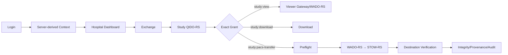

# MediQ SaaS Web Application Screen Design Specification

**Project:** MediQ  
**Product:** Patient-Controlled Medical Imaging Mobility SaaS  
**Document ID:** MEDIQ-SAAS-SCREEN-001  
**Document Title:** MediQ SaaS Web Application Screen Design Specification  
**Version:** 0.3.0 — Hospital Clinical Workflow P1 Extension  
**Classification:** MIXED — CAPSTONE-P0 / CAPSTONE-P1 / POST-MVP  
**Status:** Proposed Reference-Driven SaaS Screen Design Baseline  
**Owner:** MediQ Product, Web, Architecture, Security & QA  
**Implementation:** NOT IMPLEMENTED  
**Test Status:** NOT RUN  
**Last Updated:** 2026-09-27

---

# 1. 목적과 문서 관계

본 문서는 Hospital Portal, Synthetic Patient Web, QR Hospital Web, Hospital Clinical Workflow P1 Extension 및 후속 SaaS Administration 화면의 구현 계약을 정의한다. 실제 React 코드, Backend API, DB Migration, PACS 연동 또는 테스트 완료를 의미하지 않는다.

`mediq-patient-experience-mockup.html`의 통합 Timeline·쉬운 모드·AI 질문자료 화면은 비규범 Synthetic Patient Web Prototype이다. 기존 79개 SaaS Screen ID에 자동 합산하지 않으며, 실제 건강정보 외부 제공 또는 외부 LLM 연동이 구현되었다는 주장을 금지한다.

```text
REQUIREMENTS.md
      ↓
P0-WEB-UI-UX-SPEC.md
      ↓
SAAS-SCREEN-DESIGN-SPEC.md
      ↓
React SaaS Web 구현
```

기존 `WEB-01`~`WEB-14`는 상위 업무 화면으로 유지한다. 본 문서의 `SAAS-SCR-*`, `SAAS-QR-*`, `SAAS-ADM-*`는 이를 구현 상태 단위로 세분화한 별도 ID 체계다.

# 2. 기준선 분석

| 기준 | 결과 | 적용 |
|---|---|---|
| Charter/MVP/Product/Architecture/Data Flow | ALIGNED | P0 Golden Path와 PACS Source of Record 유지 |
| P0 Web UI/UX 14개 화면 | ALIGNED | 58개 P0 구현 화면으로 세분화 |
| OpenAPI v1.1 | PARTIALLY ALIGNED | Core Action은 사용; 목록·상세·비동기 Operation Gap 표시 |
| React 19.3/Vite 8/OHIF 3.11 | PROPOSED BASELINE | 기술 스택 문서 기준; 실제 dependency/통합 미검증 |
| Hospital Actor | ALIGNED | P0 정식 Actor는 `HOSPITAL_USER`; 세부 직군은 권한 아님 |
| QR Handoff package | ALIGNED | P1 Hospital Scanner/Claim/Waiting/Grant 화면 반영 |
| Exchange 목록 API | MISSING | P0 단건 진입 또는 승인된 pagination 계약 필요 |
| Consent 상세 GET/Reject | MISSING | 승인 화면 구현 전 계약 필요 |
| OHIF metadata discovery gateway | MISSING | Browser→PACS 직접 연결 없이 보완 필요 |
| Durable PACS Import operation/status | MISSING | 장시간 처리·새로고침 복구 계약 필요 |
| Tenant/Hospital/Connector 관리 API | MISSING | POST-MVP/PRODUCTIONIZATION으로 격리 |
| `SEC-MOB-007/008` 중복 | CONFLICT, 비적용 | 본 Web 문서에서는 Web/Core Security ID를 사용; 원문 정리 별도 필요 |
| UI/UX Reference Research 26개 | ALIGNED, NON-NORMATIVE | 구조·상태 Pattern만 선택 적용; 제품 화면 복제 금지 |
| 79개 Screen Reference Matrix | ALIGNED | Screen ID 79/79 일치; 적용·금지 요소 추적 |

# 3. 불변조건과 범위

- Hospital PACS가 영상의 Source of Record이며 MediQ Cloud는 Permanent PACS나 장기 Archive가 아니다.
- Browser는 PACS를 직접 호출하거나 PACS endpoint/credential을 받지 않는다.
- Viewer는 Backend Authorization Gateway의 short-lived Session으로 WADO-RS Study/Series/Instance/Frame을 점진 전달한다.
- PACS Import는 Mandatory Preflight 후 Backend가 WADO-RS→STOW-RS를 수행한다.
- Destination Verification, Integrity, Provenance, Audit가 충족되기 전 `COMPLETED`를 표시하지 않는다.
- Consent, Authorization, Grant, QR claim, 환자 승인, 전송 완료는 별도 상태다.
- `VIEW`, `DOWNLOAD`, `PACS_IMPORT`, `MOBILE_EXPORT`는 서로 확대 해석하지 않는다.
- 기본 정책은 `DENY BY DEFAULT`, 실패 정책은 `FAIL CLOSED`다.
- MVP에서는 Synthetic/Test/De-identified DICOM과 Test Hospital만 사용한다.

| 분류 | 화면 |
|---|---:|
| CAPSTONE-P0 | 58 |
| CAPSTONE-P1 | 10 |
| POST-MVP/PRODUCTIONIZATION | 11 |
| 합계 | 79 |

위 표는 기존 Reference Matrix 기준선이다. 2026-09-27 승인된 Hospital Clinical Workflow는 `HCW-SCR-001~005` 별도 P1 Extension으로 관리하며 현재 설계 총계는 기존 79개 + 확장 5개 고유 화면이다.

# 4. Portal과 Navigation

```text
Hospital Portal
├─ 대시보드
├─ 교환 요청
├─ 의료영상
├─ 전송 관리
├─ 감사·추적
└─ 관리 [권한/API 승인 전 숨김]

Patient Web
├─ 요청 확인
├─ 동의 관리
├─ 의료영상 보기
└─ 활동내역 [API GAP]

Platform Operations [POST-MVP]
├─ Tenant
├─ Hospital·Connector
├─ 작업·장애
├─ 감사·보안
└─ 시스템 상태
```



# 5. 공통 화면 계약

화면별 표와 이 절을 합친 결과가 완전한 구현 계약이다.

| 필드 | 공통값 |
|---|---|
| Client | React SPA; Desktop/Hospital Workstation 우선 |
| Implementation | NOT IMPLEMENTED |
| Authentication | 공개 Shell 외 OIDC Authorization Code + PKCE; state/nonce 검증 |
| Context | Tenant/Hospital/Actor는 서버 검증 Claim/Context에서 결정 |
| Never Trust | Browser의 tenant, hospital, actor, patient, Study/UID, action/scope, Consent/Grant/status/expiry/success |
| Common States | INITIAL, LOADING, CONTENT, EMPTY, OFFLINE, RETRYABLE_ERROR, NON_RETRYABLE_ERROR, AUTH_REQUIRED, ACCESS_DENIED, EXPIRED, REVOKED, CONFLICT, PACS_UNAVAILABLE, INTEGRITY_FAILED |
| Browser Security | CSP, clickjacking/CSRF/XSS 방어, no-store, Referrer 최소화, URL/History 민감 ID 금지 |
| DICOM Storage | Service Worker, Cache API, IndexedDB, localStorage에 DICOM/Pixel 저장 금지 |
| Accessibility | WCAG 2.2 AA 목표, keyboard, focus, label, table headers, aria-live, non-color state |
| Error | Correlation ID와 안전한 복구만 표시; endpoint/UID/token/key/credential/stack 금지 |
| Audit | actor, tenant, action, resource, outcome, timestamp, correlation/session context |
| Test | 모든 연결 Test는 NOT RUN; 실행 증거 전 PASS 금지 |

# 6. 화면별 구현 계약

열 의미: **경로**는 Entry→Exit, **Guard**는 Role/Tenant/Hospital/Auth/Consent/Grant/Network, **UI**는 Server Data·Component·CTA·상태·문구, **API**는 계약 상태, **보호·검증**은 Security·Privacy·Audit·Requirement/Test다.

## 6.1 공통 인증과 Context

| ID / 분류 | 목적·경로 | Guard | UI·행동·상태 | API | 보호·검증 |
|---|---|---|---|---|---|
| SAAS-SCR-001 로그인 / P0 | 공개 Shell→002 | Network, OIDC Provider | Test Banner, `MediQ 로그인`; Loading/Provider error | OIDC external | Token 입력·localStorage 금지; LOGIN_SUCCESS/FAILURE; AC-UI-AUTH-001~003 |
| SAAS-SCR-002 인증 Callback / P0 | IdP→003/005 | code,state,nonce,redirect exact match | `로그인을 확인하는 중`; 뒤로/복제 시 재검증 | OIDC callback | URL code 제거, replay 거부; AUTH_CALLBACK_* |
| SAAS-SCR-003 역할·병원 Context / P0 | 002/Context switch→010 | authenticated actor, server claim, active tenant/hospital | 확인된 병원·역할만 선택; 임의 ID 입력 금지 | Context API GAP 또는 verified claims | 전환 시 query/cache clear; CONTEXT_SELECTED/SWITCHED; AC-UI-CTX-001~002 |
| SAAS-SCR-004 Session 만료·재인증 / P0 | protected route→001/previous | expired/revoked session | 민감 화면 제거, `다시 로그인`; unsaved action 성공 추정 금지 | session profile | SESSION_EXPIRED; auth negative tests |
| SAAS-SCR-005 접근 거부 / P0 | any denied→safe home | explicit backend DENY | 최소 사유·Correlation ID; retry가 권한을 만들지 않음 | ErrorResponse P0 | 존재정보 최소화; ACCESS_DENIED; AT-SEC-* |
| SAAS-SCR-006 장애·점검 / P0 | 5xx/network→retry/status | no stale authority | 영향 범위·재시도·지원; success 추정 금지 | health/status UI GAP | credential/endpoint 비노출; SERVICE_UNAVAILABLE |

## 6.2 Hospital Dashboard와 Exchange

| ID / 분류 | 목적·경로 | Guard | UI·행동·상태 | API | 보호·검증 |
|---|---|---|---|---|---|
| SAAS-SCR-010 Hospital Dashboard / P0 | 003→011/012/014/QR | HOSPITAL_USER, active context | Test Banner, current Exchange entry, pending cards only if server data exists | GET Exchange by ID; summaries GAP | 가짜 통계 금지; DASHBOARD_VIEWED |
| SAAS-SCR-011 Exchange 목록 / P0 PROPOSED | 010→012 | tenant/hospital object auth | paginated table/filter/empty; API 전까지 숨김 또는 단건 입력 | **API GAP** | cross-tenant row 금지; SAAS-OD-002 |
| SAAS-SCR-012 Exchange 상세 / P0 | 010/011→015/actions | exact exchange visibility | source/destination/state/expiry + Consent/Auth/Grant 별도 cards | `GET /exchange-sessions/{id}` EXISTING P0 | EXCHANGE_VIEWED; AT-FUNC-002/AT-SEC-003 |
| SAAS-SCR-013 PatientReference 확인 / P0 | 010/014→014 | authorized hospital workflow | UUID/Test alias, mapping status; 일반 환자검색 없음 | Patient binding read GAP | local patient ID 최소화; PATIENT_CONTEXT_CHECKED |
| SAAS-SCR-014 Exchange 생성 / P0 | 013→012 | valid patientRef, source/destination, context | 입력 요약·확인·중복방지; success는 server response만 | `POST /exchange-sessions` EXISTING P0 | body tenant spoof 거부; EXCHANGE_CREATED; AT-FUNC-001 |
| SAAS-SCR-015 Exchange Timeline / P0 | 012→detail/action | visible exchange | state events와 Consent/Grant/Transfer를 별도 lane으로 표시 | GET Exchange + Audit/Provenance | client 추론 금지; EXCHANGE_VIEWED |
| SAAS-SCR-016 Exchange 만료·종료 / P0 | 012/015→new exchange | terminal/expired server state | 재사용 불가·새 승인 필요; terminal mutation CTA 제거 | GET Exchange | EXCHANGE_EXPIRED/CLOSED; state tests |

## 6.3 Source PACS와 의료영상

| ID / 분류 | 목적·경로 | Guard | UI·행동·상태 | API | 보호·검증 |
|---|---|---|---|---|---|
| SAAS-SCR-020 Source Hospital 확인 / P0 | 012→021/022 | exchange source binding | verified source display; browser 수정 불가 | GET Exchange | WRONG_SOURCE deny; provenance source binding |
| SAAS-SCR-021 Source PACS 연결상태 / P0 | 020/026→022 | backend connector allowlist | reachable/unavailable/last checked; endpoint/credential 금지 | connector status GAP | PACS_CONNECTION_CHECKED |
| SAAS-SCR-022 Study 조회 / P0 | 012/020→023 | active exchange, mapping, QIDO auth | 조회 시작·loading; PACS 직접 URL 없음 | `GET /exchange-sessions/{id}/studies` EXISTING P0 | QIDO via backend; STUDY_LISTED; AT-DICOM-001 |
| SAAS-SCR-023 Study 목록·필터 / P0 | 022→024 | result ownership | date/modality/description safe metadata; UID 기본 숨김 | same GET | filter는 권한 아님; STUDY_LISTED |
| SAAS-SCR-024 Study 상세 / P0 | 023→025/030/040/050/060 | exact Study scope | source, date, modality, series count, action cards | Study detail contract PARTIAL | UID 접근권한 아님; STUDY_VIEWED |
| SAAS-SCR-025 Series·Instance 요약 / P0 | 024→040 | exact Study/view decision | bounded metadata tree; pixel preview는 Viewer Session 후 | Viewer metadata **API GAP** | malicious metadata bounds; SAAS-OD-005 |
| SAAS-SCR-026 PACS 조회 실패 / P0 | 022/025→retry/012 | normalized upstream error | retryable 여부·Correlation ID; Cloud copy fallback 금지 | DICOMweb error P0 | DICOMWEB_FAILURE; AT-DICOM negative |

## 6.4 Consent와 Transfer Grant

| ID / 분류 | 목적·경로 | Guard | UI·행동·상태 | API | 보호·검증 |
|---|---|---|---|---|---|
| SAAS-SCR-030 Consent 요청 / P0 | 024→031 | HOSPITAL_USER, exchange/Study/action/purpose valid | 범위·destination·expiry 확인; request only | `POST .../consents/request` EXISTING P0 | CONSENT_REQUESTED; AC-UI-CON-001~003 |
| SAAS-SCR-031 Consent 상태 / P0 | 012/030→032/036 | authorized exchange | PENDING/ACTIVE/WITHDRAWN/EXPIRED/REJECTED 별도 | Consent detail **API GAP** | stale state로 Grant 금지 |
| SAAS-SCR-032 Patient Consent 확인 / P0 | secure patient link→033/close | Synthetic PATIENT binding, unexpired request | source/destination/Study/action/purpose/version; local ID 금지 | detail GET **API GAP** | BOLA deny; AC-UI-CON-004~006 |
| SAAS-SCR-033 Patient Consent 승인 / P0 | 032→031 | exact patient, version, expiry, recent auth | `[나중에] [동의]`; Grant 발급으로 표현 금지 | approve EXISTING P0 | CONSENT_APPROVED; AT-FUNC-006 |
| SAAS-SCR-034 Consent 철회 / P0 | 031→031 | patient/authorized actor exact consent | 영향·이미 완료된 반입 한계·확인 dialog | withdraw EXISTING P0 | CONSENT_WITHDRAWN; AT-FUNC-007 |
| SAAS-SCR-035 Consent 만료·불일치 / P0 | 031~033→new request | expired/version/destination/action mismatch | fail-closed, 새 요청 안내 | ErrorResponse | CONSENT_DENIED; AT-SEC-004/005 |
| SAAS-SCR-036 Transfer Grant 발급 / P0 | active Consent→037 | current Authorization ALLOW, exact action/resource/recipient | scope·recipient·expiry 확인; 별도 발급 CTA | issue Grant EXISTING P0 | GRANT_CREATED; AT-FUNC-008 |
| SAAS-SCR-037 Transfer Grant 상태 / P0 | 012/036→action/038 | owner/recipient binding | ACTIVE/EXPIRED/REVOKED/CONSUMED; action별 badge | GET via Exchange/Grant GAP 일부 | scope 자동확대 금지; grant tests |
| SAAS-SCR-038 Transfer Grant 철회 / P0 | 037→037 | exact verified destination USER recipient Actor/Tenant/Hospital and matching Session/Grant | 대상·범위 확인, already-revoked replay, offline/in-flight 회수 불가 안내 | `revokeTransferGrant` OpenAPI contract; implementation evidence required | GRANT_REVOKED; `TC-GRT-004-REV-API-*`; AT-FUNC-009 |
| SAAS-SCR-039 Authorization 거부 / P0 | any action deny→012 | explicit backend DENY/UNKNOWN | 정책 세부 없이 사유범주·다음 행동 | authorization result | AUTHORIZATION_DENIED; AT-SEC-017 |

## 6.5 Cloud Viewer

| ID / 분류 | 목적·경로 | Guard | UI·행동·상태 | API | 보호·검증 |
|---|---|---|---|---|---|
| SAAS-SCR-040 Viewer 시작 확인 / P0 | 024→041 | Consent+Authorization+`study:view` | source/Study/session 제한·시작 CTA | view action EXISTING P0 | VIEW_REQUESTED; TC-VIEW-004/005 |
| SAAS-SCR-041 Viewer Session 생성 / P0 | 040→042 | exact actor/tenant/resource/grant | `안전한 뷰어 세션 준비 중`; retry idempotent | POST view + GET session | VIEWER_SESSION_CREATED |
| SAAS-SCR-042 Cloud DICOM Viewer / P0 | 041→024 | active short-lived session, foreground, online | source/status/remaining time/frame; series, zoom, pan, WL, reset, fullscreen | Viewer Gateway P0 + metadata GAP | no-store, no PACS direct; VIEWER_OPENED/CLOSED; TC-VIEW-006~009 |
| SAAS-SCR-043 Series·Instance 탐색 / P0 | 042→042 | same viewer guard | tree/thumbnail only via authorized gateway; keyboard controls | authorized metadata/WADO routes GAP | UID alone denied; VIEWER_NAVIGATED |
| SAAS-SCR-044 W/L·Zoom·Pan / P0 | 042→042 | same session | controls+gesture alternatives; no diagnostic guarantee | client renderer | Pixel buffer memory only; VIEWER_TOOL_USED optional |
| SAAS-SCR-045 Viewer Session 만료 / P0 | 042→040/024 | server expiry | 즉시 frame 중지·화면 제거·재승인 | GET Viewer Session | VIEWER_EXPIRED; TC-VIEW-007 |
| SAAS-SCR-046 Source PACS/Frame 오류 / P0 | 042→retry/024 | normalized WADO error | frame retry/close; 영구 copy fallback 없음 | Viewer Gateway error | VIEWER_UPSTREAM_FAILED; TC-VIEW-009 |
| SAAS-SCR-047 Consent·Grant 철회 종료 / P0 | 042→039/024 | persisted status checked at a later protected request | 다음 retrieval/action은 deny; 이미 전달된 frame/다운로드 또는 진행 중 STOW를 즉시 회수한다고 표시하지 않음 | Future operation-time revalidation/fencing (GRT-004 alone does not prove it) | VIEWER_DENIED/CLOSED only after separate operation gate |

## 6.6 DICOM Download

| ID / 분류 | 목적·경로 | Guard | UI·행동·상태 | API | 보호·검증 |
|---|---|---|---|---|---|
| SAAS-SCR-050 Download 확인 / P0 | 024→051 | exact `study:download`, Consent/Auth/Grant | Study/source/파일 취급 경고; view Grant 사용 금지 | download action EXISTING P0 | DOWNLOAD_STARTED; AT-FUNC-011 |
| SAAS-SCR-051 Download 진행 / P0 | 050→052/053 | active request/session | 실제 byte/response 상태; 자동 재요청 금지 | streaming response P0 | browser cache no-store; response-loss unknown |
| SAAS-SCR-052 Download 완료 / P0 | 051→024 | server/stream completion confirmed | 완료시각·Correlation ID; PACS import 완료 아님 | download response | DOWNLOAD_COMPLETED |
| SAAS-SCR-053 Download 실패·만료 / P0 | 051→050/024 | error/expired grant | retryability·새 Grant 안내 | ErrorResponse | DOWNLOAD_FAILED; view-only denial test |

## 6.7 PACS Import와 전송

| ID / 분류 | 목적·경로 | Guard | UI·행동·상태 | API | 보호·검증 |
|---|---|---|---|---|---|
| SAAS-SCR-060 Destination Hospital 확인 / P0 | 024→061 | immutable exchange destination | verified destination/tenant; browser 변경 금지 | GET Exchange | WRONG_DESTINATION deny |
| SAAS-SCR-061 Destination Patient Mapping / P0 | 060→062 | destination mapping exists and VALID | mapping status만, local patient ID 최소화 | mapping read/preflight P0 | INVALID mapping blocks STOW; AT-SEC-012 |
| SAAS-SCR-062 PACS Import Preflight / P0 | 061→063/070 | all 12 checks explicit | CHECKING/READY/DENIED/UNKNOWN checklist | preflight in action contract | UNKNOWN≠READY; PACS_PREFLIGHT_ALLOWED/DENIED |
| SAAS-SCR-063 최종 확인 / P0 | 062→064 | READY fresh snapshot, recent auth if policy | source/destination/Study/scope/irreversibility; confirm | PACS action preparation | double-click guard; no body destination override |
| SAAS-SCR-064 전송 요청 / P0 | 063→065 | `study:pacs-transfer`, exact destination, valid mapping | submit once, correlation; timeout≠failure/success | PACS import action EXISTING P0 | PACS_IMPORT_STARTED; AT-FUNC-012 |
| SAAS-SCR-065 전송 진행 / P0 | 064→067/070 | server operation state | retrieve/package/STOW/verify 단계; 가짜 percent 금지 | synchronous P0; durable status **GAP** | 새로고침 중복 STOW 금지; SAAS-OD-006 |
| SAAS-SCR-066 부분 성공·재시도 대기 / P0 | 065→status/operator path | server says partial/unknown | reconcile 필요, 자동 completed/전체 retry 금지 | operation/status **API GAP** | idempotency/dedup; PACS_IMPORT_PARTIAL |
| SAAS-SCR-067 Destination Verification / P0 | 065→068/070 | STOW result exists | expected/observed Study evidence, verified boolean | verification result P0 | false/pending blocks completion; DESTINATION_VERIFIED |
| SAAS-SCR-068 Integrity 결과 / P0 | 067→069/070 | verification complete | source/destination hash/count/result; secret/raw DICOM 금지 | integrity result P0 | FAILED/PENDING blocks completion; INTEGRITY_VERIFIED/FAILED |
| SAAS-SCR-069 PACS Import 완료 / P0 | 068→080/081 | verified=true, integrity PASS, provenance+audit exist | 완료요약·destination·time·evidence links | result/provenance/audit P0 | client-side 완료 추론 금지; AT-FUNC-013 |
| SAAS-SCR-070 전송 실패·거부 / P0 | 062~068→safe retry/012 | normalized failure/deny | wrong destination/mapping/consent/grant/PACS/integrity 구분 | ErrorResponse P0 | 실패 후 STOW 호출 여부 증거; PACS_IMPORT_FAILED |

## 6.8 QR Hospital Web

| ID / 분류 | 목적·경로 | Guard | UI·행동·상태 | API | 보호·검증 |
|---|---|---|---|---|---|
| SAAS-QR-001 Scanner 시작 / P1 | Hospital Portal→002 | authenticated active Hospital/actor | 현재 병원·actor 고정 표시, scanner 시작 | local camera | 환자정보 없음; QR-AT-046 |
| SAAS-QR-002 카메라 권한 / P1 | 001→003 | browser permission | 권한 목적·대체수단 open decision | browser API | frame 저장/업로드 금지 |
| SAAS-QR-003 QR 검증 / P1 | decoded→004/007 | allowlisted HTTPS origin, v1 path, length/alphabet | 로컬 검증중; raw URL 반사 금지 | local parser | malformed safe reject; QR-AT-014 |
| SAAS-QR-004 Claim 요청 / P1 | 003→005/007 | workforce auth, server hospital context, first claim | `연결 요청`; hospital fields body 금지 | `POST /api/v1/qr-handoff/claims` P1 CONTRACT | QR_CLAIM_SUCCEEDED/DENIED; QR-AT-003/017/019/024 |
| SAAS-QR-005 환자 승인 대기 / P1 | 004→006/008~010 | claimed actor/context, unexpired | 병원/actor/display ref/action/countdown만; patient/Study/source 없음 | GET QR request P1 | poll/ETag; QR-AT-046 |
| SAAS-QR-006 거절·취소·만료 / P1 | 005→close | terminal server state | generic 종료 사유, 새 환자 요청 필요 | GET status | QR terminal audit; QR-AT-010/011/043 |
| SAAS-QR-007 중복 Claim·충돌 / P1 | 003/004→rescan | already claimed/version/error | loser에게 patient/hospital identity 비공개 | claim error P1 | atomic claim; QR_CLAIM_DENIED; QR-AT-015/024 |
| SAAS-QR-008 VIEW Grant 준비 / P1 | 005→040 | GRANT_ISSUED exact `study:view` | `영상 보기`만 활성; 조회 완료 표현 금지 | GET status + existing view action | QR_GRANT_ISSUED; QR-AT-007/008 |
| SAAS-QR-009 PACS_IMPORT Grant 준비 / P1 | 005→060 | GRANT_ISSUED exact `study:pacs-transfer` | `PACS 반입 시작`만 활성; 저장 완료 아님 | GET status + existing PACS action | preflight 여전히 필수; QR-AT-009/022 |
| SAAS-QR-010 Grant 실패 / P1 | 005→close/rescan | FAILED or bounded retry status | 공유되지 않음·retryable 여부 | GET status | QR_GRANT_FAILED; QR-AT-040/041/050 |

## 6.9 Audit, Provenance와 보안

| ID / 분류 | 목적·경로 | Guard | UI·행동·상태 | API | 보호·검증 |
|---|---|---|---|---|---|
| SAAS-SCR-080 Exchange Audit Timeline / P0 | 012/069→detail | authorized exchange actor | actor/action/outcome/time/correlation; payload 없음 | session audit P0 | AUDIT_VIEWED; AT-FUNC-016 |
| SAAS-SCR-081 Provenance 상세 / P0 | 069/080→evidence | resource visibility | source→package→destination graph | provenance P0 | PROVENANCE_VIEWED; AT-PROV-001 |
| SAAS-SCR-082 Integrity Evidence / P0 | 068/081→back | authorized evidence | expected/observed count/hash status; raw object 금지 | integrity P0 | INTEGRITY_EVIDENCE_VIEWED |
| SAAS-SCR-083 접근·거부 이력 / P0 | 080→error detail | least-privileged audit read | safe action/reason/outcome; 공격정책 세부 금지 | session audit P0 | ACCESS_AUDIT_VIEWED |
| SAAS-SCR-084 Correlation 오류 추적 / P0 | error→080/support | visible event/exchange | correlation ID, time, safe category; stack 금지 | audit/error P0 | ERROR_EVIDENCE_VIEWED |
| SAAS-SCR-085 보안 이벤트 목록 / POST-MVP | ops→event | dedicated security role not yet defined | tenant-scoped alerts/filter | **API GAP** | TRACEABILITY GAP; no P0 exposure |

## 6.10 SaaS Tenant와 Hospital 관리

모든 관리 화면은 별도 Admin Portal에서만 표시하며 P0 `HOSPITAL_USER`에게 노출하지 않는다.

| ID / 분류 | 목적·경로 | Guard | UI·행동·상태 | API | 보호·검증 |
|---|---|---|---|---|---|
| SAAS-ADM-001 Tenant 목록·상세 / POST-MVP | Admin→tenant | formal platform admin RBAC 필요 | tenant status/region/policy; secret 없음 | API GAP | cross-tenant admin audit; TRACEABILITY GAP |
| SAAS-ADM-002 Hospital 등록·상태 / POST-MVP | tenant→hospital | tenant admin role 필요 | onboarding/trust/status | API GAP | HOSPITAL_REGISTERED audit |
| SAAS-ADM-003 사용자·역할 / POST-MVP | hospital→actors | approved IAM/RBAC 필요 | invite/disable/role; 임의 custom 권한 금지 | API GAP | least privilege/SoD |
| SAAS-ADM-004 PACS Connector 등록 / PRODUCTIONIZATION | hospital→connector | privileged ops + approval | connector identity/capability; credential 입력/표시 금지 | API GAP | secret manager only; CONNECTOR_REGISTERED |
| SAAS-ADM-005 DICOMweb Endpoint / PRODUCTIONIZATION | connector→endpoint | privileged ops | QIDO/WADO/STOW capability/allowlist; password 금지 | API GAP | SSRF/allowlist/mTLS validation |
| SAAS-ADM-006 인증서·mTLS / PRODUCTIONIZATION | connector→trust | PKI operator | subject/issuer/expiry/fingerprint; private key 금지 | API GAP | rotation/revoke audit |
| SAAS-ADM-007 VPN·Private Connectivity / PRODUCTIONIZATION | connector→network | network/security operator | 상태·last check; config secret 금지 | API GAP | connectivity proof, no false `secure` claim |
| SAAS-ADM-008 정책·TTL·Rate Limit / POST-MVP | tenant→policy | policy admin + four-eyes 후보 | versioned policy/diff/approval | API GAP | unsafe widening review/audit |
| SAAS-ADM-009 Temporary Object·Purge / POST-MVP | ops→evidence | operations/security role | tenant/session/study-bound metadata·TTL·purge evidence | API GAP | object URL/payload 금지; purge evidence |
| SAAS-ADM-010 Queue·Worker 상태 / POST-MVP | ops→job | operations role | bounded operational metadata, retry/dead-letter status | API GAP | manual retry idempotency; no DICOM/PHI |

# 7. 저충실도 Wireframe

## WF-01 로그인 — SAAS-SCR-001
```text
┌──────────────────────────────────────────┐
│ MediQ                         TEST ONLY  │
│ 환자 통제형 의료영상 이동 SaaS           │
│              [ MediQ 로그인 ]           │
└──────────────────────────────────────────┘
```

## WF-02 병원 Context — SAAS-SCR-003
```text
┌──────────────────────────────────────────┐
│ 접속할 병원 Context 확인                 │
│ ● Hospital B · HOSPITAL_USER · VERIFIED │
│ [로그아웃]                    [계속]      │
└──────────────────────────────────────────┘
```

## WF-03 Hospital Dashboard — SAAS-SCR-010
```text
┌────────────┬─────────────────────────────┐
│대시보드    │ Hospital B · TEST           │
│교환 요청   │ [Exchange ID로 열기]        │
│의료영상    │ Consent 대기 · 전송 검증대기 │
│감사·추적   │ 목록 API 없음 표시           │
└────────────┴─────────────────────────────┘
```

## WF-04 Exchange 목록 — SAAS-SCR-011
```text
┌──────────────────────────────────────────┐
│ 교환 요청                    API GAP     │
│ [상태▼] [기간▼] [검색]                   │
│ 승인된 pagination 계약 전에는 메뉴 숨김 │
└──────────────────────────────────────────┘
```

## WF-05 Exchange 상세 — SAAS-SCR-012
```text
┌──────────────────────────────────────────┐
│ Exchange EX-TEST-001                     │
│ Hospital A → Hospital B · ACTIVE         │
│ Consent ACTIVE | Auth ALLOW | Grant ACTIVE│
│ [Study 조회] [감사·추적]                 │
└──────────────────────────────────────────┘
```

## WF-06 PatientReference 확인 — SAAS-SCR-013
```text
┌──────────────────────────────────────────┐
│ PatientReference 확인                    │
│ Test Reference: 00000000-…               │
│ Mapping: VALID · 일반 환자검색은 미지원  │
│ [취소]                         [확인]     │
└──────────────────────────────────────────┘
```

## WF-07 Study 목록 — SAAS-SCR-023
```text
┌──────────────────────────────────────────┐
│ Hospital A Study              [필터]     │
│ 2026.09.20 | CT | 흉부 CT | [상세]      │
│ 2026.08.12 | MR | 무릎 MRI | [상세]     │
└──────────────────────────────────────────┘
```

## WF-08 Study 상세 — SAAS-SCR-024
```text
┌──────────────────────────────────────────┐
│ Hospital A · 흉부 CT · 3 Series          │
│ [Cloud Viewer] [DICOM Download]          │
│ [Hospital B PACS 반입]                   │
│ 각 Action은 별도 Grant를 요구합니다.     │
└──────────────────────────────────────────┘
```

## WF-09 Consent 요청 — SAAS-SCR-030
```text
┌──────────────────────────────────────────┐
│ Consent 요청                             │
│ Study: 흉부 CT | Destination: Hospital B │
│ Action: PACS_IMPORT | 목적: 진료 참고    │
│ [취소]                       [요청]       │
└──────────────────────────────────────────┘
```

## WF-10 Patient Consent 승인 — SAAS-SCR-033
```text
┌──────────────────────────────────────────┐
│ 의료영상 제공 동의                       │
│ Hospital A → Hospital B · 흉부 CT        │
│ 행위: PACS 반입 · 동의 v1                │
│ [나중에]                     [동의]       │
└──────────────────────────────────────────┘
```

## WF-11 Grant 발급 — SAAS-SCR-036
```text
┌──────────────────────────────────────────┐
│ Transfer Grant 발급                      │
│ Consent ✓ | Authorization ALLOW          │
│ Scope: study:pacs-transfer · 30분        │
│ [취소]                  [권한 발급]       │
└──────────────────────────────────────────┘
```

## WF-12 Cloud Viewer — SAAS-SCR-042
```text
┌──────────────────────────────────────────┐
│ Hospital A · Viewer Session 12:31        │
│ [Series] │       DICOM Frame             │
│ 2/3      │                               │
│ [−][+][Pan][W/L][Reset][닫기]            │
└──────────────────────────────────────────┘
```

## WF-13 Viewer 만료 — SAAS-SCR-045
```text
┌──────────────────────────────────────────┐
│ Viewer Session이 만료되었습니다.          │
│ 영상 요청과 화면 표시를 중지했습니다.    │
│ [새 권한 확인]                 [닫기]     │
└──────────────────────────────────────────┘
```

## WF-14 DICOM Download 확인 — SAAS-SCR-050
```text
┌──────────────────────────────────────────┐
│ DICOM Download 확인                      │
│ Hospital A · 흉부 CT                     │
│ 권한: study:download · 로컬취급 주의     │
│ [취소]                      [다운로드]    │
└──────────────────────────────────────────┘
```

## WF-15 Destination Mapping — SAAS-SCR-061
```text
┌──────────────────────────────────────────┐
│ Hospital B Patient Mapping               │
│ Destination: VERIFIED                    │
│ Mapping: VALID                           │
│ [뒤로]                    [Preflight]     │
└──────────────────────────────────────────┘
```

## WF-16 PACS Import Preflight — SAAS-SCR-062
```text
┌──────────────────────────────────────────┐
│ PACS Import Preflight                    │
│ ✓ Destination  ✓ Mapping  ✓ Consent     │
│ ✓ Auth  ✓ Grant  ✓ Integrity Context    │
│ [UNKNOWN 항목 존재 시 시작 불가]         │
└──────────────────────────────────────────┘
```

## WF-17 PACS Import 최종 확인 — SAAS-SCR-063
```text
┌──────────────────────────────────────────┐
│ 최종 확인: Hospital A → Hospital B       │
│ Study: 흉부 CT | Mapping VALID           │
│ 전송 후 목적지 정책에 따라 관리됩니다.   │
│ [취소]              [PACS 반입 시작]     │
└──────────────────────────────────────────┘
```

## WF-18 전송 진행 — SAAS-SCR-065
```text
┌──────────────────────────────────────────┐
│ PACS 반입 진행                           │
│ ✓ Source Retrieval → ● STOW-RS          │
│ ○ Destination Verify → ○ Integrity      │
│ 결과 불명 상태에서는 다시 전송하지 않음  │
└──────────────────────────────────────────┘
```

## WF-19 Destination Verification — SAAS-SCR-067
```text
┌──────────────────────────────────────────┐
│ Destination Verification                │
│ Expected Study 1 · Observed Study 1      │
│ Result: VERIFIED                         │
│ [Integrity 결과 확인]                    │
└──────────────────────────────────────────┘
```

## WF-20 Integrity 결과 — SAAS-SCR-068
```text
┌──────────────────────────────────────────┐
│ Integrity Evidence                       │
│ Instance count: MATCH                    │
│ Content digest: PASS                     │
│ [Provenance]                  [계속]      │
└──────────────────────────────────────────┘
```

## WF-21 PACS Import 완료 — SAAS-SCR-069
```text
┌──────────────────────────────────────────┐
│ PACS 반입 완료                           │
│ Destination ✓ Integrity ✓ Provenance ✓  │
│ Audit ✓ · 완료시각 · Correlation ID      │
│ [감사·추적 보기]                         │
└──────────────────────────────────────────┘
```

## WF-22 전송 실패 — SAAS-SCR-070
```text
┌──────────────────────────────────────────┐
│ PACS 반입을 완료하지 못했습니다.          │
│ 범주: Destination Verification 실패      │
│ 오류참조: MQ-••••••                      │
│ [안전한 상태 확인]             [닫기]     │
└──────────────────────────────────────────┘
```

## WF-23 QR Scanner — SAAS-QR-001
```text
┌──────────────────────────────────────────┐
│ Hospital B · 김의사       QR Scanner     │
│        [ Camera Preview — local ]        │
│ Frame/QR 이미지는 서버에 저장하지 않음   │
│ [스캔 취소]                              │
└──────────────────────────────────────────┘
```

## WF-24 환자 승인 대기 — SAAS-QR-005
```text
┌──────────────────────────────────────────┐
│ 환자 승인 대기 중              03:42     │
│ Hospital B · 김의사 · VIEW               │
│ 확인번호 A7K2Q9                         │
│ 환자·Study 정보는 승인 전 표시하지 않음  │
└──────────────────────────────────────────┘
```

## WF-25 QR VIEW Grant — SAAS-QR-008
```text
┌──────────────────────────────────────────┐
│ 조회 권한이 준비되었습니다.               │
│ Scope: study:view · 제한시간 표시        │
│ 조회 완료 상태는 아닙니다.                │
│ [영상 보기]                              │
└──────────────────────────────────────────┘
```

## WF-26 QR PACS_IMPORT Grant — SAAS-QR-009
```text
┌──────────────────────────────────────────┐
│ 전송 권한이 준비되었습니다.               │
│ Scope: study:pacs-transfer               │
│ Preflight와 목적지 검증은 별도입니다.     │
│ [PACS 반입 시작]                         │
└──────────────────────────────────────────┘
```

## WF-27 Audit Timeline — SAAS-SCR-080
```text
┌──────────────────────────────────────────┐
│ Exchange Audit Timeline                  │
│ 14:01 Consent ACTIVE                     │
│ 14:03 Grant CREATED · 14:08 STOW START  │
│ 14:12 Verification PASS                  │
└──────────────────────────────────────────┘
```

## WF-28 Provenance — SAAS-SCR-081
```text
┌──────────────────────────────────────────┐
│ Provenance                               │
│ Hospital A → Package → Hospital B        │
│ Source evidence | Transfer | Destination │
│ [Integrity] [Audit]                      │
└──────────────────────────────────────────┘
```

## WF-29 Tenant/Hospital 관리 — SAAS-ADM-001/002
```text
┌──────────────────────────────────────────┐
│ POST-MVP Admin Portal                    │
│ Tenant TEST-T1 · Hospital B · ACTIVE     │
│ Role/API 승인 전 P0 사용자에게 숨김      │
│ [상세] [감사]                            │
└──────────────────────────────────────────┘
```

# 8. 상태와 화면 전환

| Current Screen | State | Action | Guard | API | Next State/Screen | Error |
|---|---|---|---|---|---|---|
| 001 | UNAUTHENTICATED | login | PKCE/state/nonce | OIDC | AUTHENTICATED→003 | 001/005 |
| 003 | AUTHENTICATED | context 선택 | server claim, active tenant/hospital | Context GAP | CONTEXT_ACTIVE→010 | 005 |
| 014 | none | Exchange 생성 | valid patient/source/destination | POST exchange | CREATED→012 | 005/006 |
| 022 | Exchange active | Study 조회 | mapping/auth/tenant | GET studies | CONTENT→023 | 026 |
| 030 | no Consent | 요청 | exact resource/action/destination | POST consent request | PENDING→031 | 035 |
| 033 | PENDING | 환자 동의 | patient binding/version/expiry | POST approve | ACTIVE→031 | 035 |
| 036 | Consent ACTIVE | Grant 발급 | current Authorization ALLOW | POST grant issue | Grant ACTIVE→037 | 039 |
| 040 | Grant ACTIVE | Viewer 시작 | exact `study:view` | POST view | Session ACTIVE→042 | 039/046 |
| 042 | Viewer ACTIVE | expiry/revoke | server session invalid | GET/revalidate | CLOSED→045/047 | — |
| 050 | Grant ACTIVE | download | exact `study:download` | POST download | STREAMING→051 | 053 |
| 062 | CHECKING | Preflight | all checks READY | PACS action preflight | READY→063 | 070 |
| 064 | READY | import | exact `study:pacs-transfer`, mapping valid | POST pacs-import | PROCESSING→065 | 070 |
| 065 | PROCESSING | STOW result | server evidence | operation GAP | VERIFYING→067 | 066/070 |
| 067 | VERIFYING | verify | destination observed | verification P0 | VERIFIED→068 | 070 |
| 068 | VERIFIED | integrity | PASS+provenance+audit | result APIs | COMPLETED→069 | 070 |
| QR-004 | CREATED | claim | first valid hospital | POST claim | AWAITING→QR-005 | QR-007 |
| QR-005 | AWAITING | poll | same claimant/context | GET QR | GRANT_ISSUED→008/009 | 006/010 |

Consent, Authorization, Grant, Viewer, QR, Transfer, Verification, Integrity, Provenance 상태는 단일 종합 Badge로 합치지 않는다.

# 9. PACS Import Preflight 계약

| Check | READY 조건 | 실패 UI | 실패 시 Data Action |
|---|---|---|---|
| Source/Destination | Exchange binding과 동일 | WRONG_DESTINATION | STOW 금지 |
| Tenant Context | actor와 destination tenant 일치 | ACCESS_DENIED | STOW 금지 |
| Patient Mapping | destination mapping `VALID` | MAPPING_INVALID | STOW 금지 |
| Study | 승인된 ImagingPackage/Study scope | SCOPE_MISMATCH | retrieve/STOW 금지 |
| Consent | exact ACTIVE, unexpired | CONSENT_REQUIRED/EXPIRED | STOW 금지 |
| Authorization | explicit current ALLOW | AUTHORIZATION_DENIED | STOW 금지 |
| Grant | exact `study:pacs-transfer`, recipient/resource/expiry | GRANT_INVALID | STOW 금지 |
| Integrity Context | source evidence available | INTEGRITY_UNKNOWN | STOW 금지 |
| Provenance Context | source/session chain ready | PROVENANCE_UNAVAILABLE | STOW 금지 |
| PACS Connectivity | backend connector available/trusted | PACS_UNAVAILABLE | STOW 금지 |

`UNKNOWN`은 `READY`가 아니다. STOW-RS 성공만으로 완료하지 않으며 Destination Verification→Integrity→Provenance→Audit 순서를 보존한다.

# 10. API 연결표

| Screen | API/Method | Actor/Auth/Scope | Success | Error | Status |
|---|---|---|---|---|---|
| 001~004 | OIDC Authorization Code + PKCE | common actor | session/context | auth denied | PROFILE / API GAP |
| 010~016 | `POST/GET /exchange-sessions` | HOSPITAL_USER, object auth | Exchange state | 403/404/409 | EXISTING P0; list GAP |
| 013 | PatientReference binding | HOSPITAL_USER | valid context | mapping denied | API GAP |
| 022~024 | `GET /exchange-sessions/{id}/studies` | exchange scope | Study list | DICOMWEB_FAILURE | EXISTING P0 |
| 025 | Viewer metadata discovery | exact view session | metadata | denied/upstream | API GAP |
| 030 | `POST .../consents/request` | hospital actor | PENDING | 403/409 | EXISTING P0 |
| 031~032 | Consent detail | hospital/patient binding | state/detail | concealed deny | API GAP |
| 033~034 | Consent approve/withdraw | matching patient | ACTIVE/WITHDRAWN | 403/409 | EXISTING P0 |
| 036~038 | Grant issue/revoke/status | authorized actor, exact scope | ACTIVE/REVOKED | denied/conflict | EXISTING P0 / read GAP |
| 040~047 | view action, Viewer Session, authorized WADO gateway | `study:view` | ACTIVE/frames | expired/revoked/502 | EXISTING P0 + metadata GAP |
| 050~053 | download action | `study:download` | stream complete | grant/upstream error | EXISTING P0 |
| 060~070 | pacs-import, result, verification, integrity | `study:pacs-transfer` | verified completion | preflight/STOW/verify fail | EXISTING P0; durable operation GAP |
| QR-004 | `POST /api/v1/qr-handoff/claims` | workforce + server context | CLAIMED | unavailable/conflict | P1 CONTRACT |
| QR-005~010 | `GET /api/v1/qr-handoff/requests/{id}` | claimant | pending/issued/terminal | 403/404/410 | P1 CONTRACT |
| 080~084 | session Audit/Provenance/Integrity | authorized exchange actor | evidence | denied/not found | EXISTING P0 |
| 085, ADM-* | Admin/Operations APIs | roles not defined | — | — | API GAP |

구현 전 필수 Gap: Exchange 목록, Context resolution, PatientReference 진입, Consent 상세/Reject, Grant read, OHIF metadata, durable import operation/status, Patient activity, Admin/Connector APIs.

# 11. Multi-tenant와 Browser 보안

- Tenant/Hospital/Actor는 인증 Context에서만 결정하고 Body·URL·UI 선택값을 신뢰하지 않는다.
- Context 전환 즉시 이전 Query Cache, object URL, rendered buffer, form state를 제거한다.
- 다른 Tenant 리소스는 안전한 403/404 정책으로 존재정보를 최소화한다.
- 버튼 숨김은 Backend Authorization을 대체하지 않는다.
- Access Token을 `localStorage`에 장기 보관하지 않는다. BFF Secure/HttpOnly/SameSite cookie 또는 memory-token profile은 `SAAS-OD-007`에서 결정한다.
- Mutation에는 CSRF 방어, idempotency/중복 클릭 차단, 최신 상태 재검증을 적용한다.
- CSP, frame-ancestors/clickjacking 방어, output encoding/sanitization, strict Referrer-Policy를 적용한다.
- Browser history/query에는 patient, Study UID, Grant, token, QR reference를 넣지 않는다.
- Viewer/Download response는 `private, no-store`; Service Worker/Cache API/IndexedDB 저장 금지다.
- Logout/Viewer close/Context switch에서 object URL, pixel buffer reference, query cache, 민감 UI state를 제거한다.

# 12. 감사 이벤트 연결

| 화면군 | Server-observed Event |
|---|---|
| 001~005 | LOGIN_SUCCESS/FAILURE, CONTEXT_SELECTED/SWITCHED, ACCESS_DENIED |
| 012~016 | EXCHANGE_CREATED/VIEWED |
| 022~026 | STUDY_LISTED, DICOMWEB_FAILURE |
| 030~035 | CONSENT_REQUESTED/APPROVED/WITHDRAWN/DENIED |
| 036~039 | AUTHORIZATION_ALLOWED/DENIED, GRANT_CREATED/REVOKED |
| 040~047 | VIEWER_SESSION_CREATED, VIEWER_OPENED/CLOSED/DENIED |
| 050~053 | DOWNLOAD_STARTED/COMPLETED/FAILED |
| 060~070 | PACS_PREFLIGHT_ALLOWED/DENIED, PACS_IMPORT_STARTED/FAILED, DESTINATION_VERIFIED, INTEGRITY_VERIFIED/FAILED, PROVENANCE_CREATED |
| QR-001~010 | QR_CLAIM_SUCCEEDED/DENIED, QR_GRANT_ISSUED/FAILED |
| 080~085 | AUDIT/PROVENANCE/INTEGRITY/SECURITY_EVENT_VIEWED |
| ADM-* | ADMIN_CHANGE_REQUESTED/APPROVED/APPLIED/DENIED 후보 |

Audit·화면·Telemetry에 DICOM/Pixel, PACS credential, token, key, QR 원문, 실제 PHI, 내부 stack을 기록하지 않는다.

# 13. Design System과 접근성

| 영역 | 계약 |
|---|---|
| 색상 | Medical Blue, Teal, Secure Navy, Success Green, Warning Orange, Critical Red, Neutral, Viewer Dark Surface; Text/Icon 병행 |
| Typography | Page 28px, Section 22px, Body 16px, Metadata/Table 14px, Correlation ID monospace 후보; zoom 200% 대응 |
| Layout | Desktop 1280+, laptop 1024+, tablet 768+; Viewer/대형 table은 mobile web 제한 명시 |
| Components | Header, SideNav, TestBanner, ContextSwitcher, StatusCard, StudyTable, ConsentCard, GrantBadge, PreflightChecklist, ViewerToolbar, Stepper, VerificationCard, AuditTimeline, ProvenanceGraph, QRScanner, ErrorPanel, Dialog |
| Keyboard | 모든 CTA/표/Viewer 대체 control 접근; visible focus와 skip link |
| Screen Reader | table caption/header, 상태 `aria-live`, modal focus trap, 오류 focus 이동 |
| Viewer | gesture 외 Zoom±/Slice 이전·다음/WL reset 제공 |
| QR | Camera 대체 수단은 OPEN; countdown 과도한 음성 알림 금지 |

# 14. 요구사항·보안·테스트 추적성

| Screen 범위 | Requirement | Security/Domain | API/State | Acceptance |
|---|---|---|---|---|
| 001~006 | REQ-AUTH/CTX, P0 UI baseline | SEC-AUTHN/API/Tenant | auth/context | AC-UI-AUTH/CTX, AT-SEC-001~003 |
| 010~016 | REQ-EXC-* | Exchange state/object auth | exchange APIs | AT-FUNC-001/002, AT-SEC-003 |
| 020~026 | REQ-DICOM-001/002 | SEC-DICOM-001/002, Patient Mapping | QIDO/metadata | AT-DICOM-001/002, TC-VIEW-006 |
| 030~035 | REQ-CON-* | SEC-CONSENT-* | Consent states | AT-FUNC-006/007, AT-SEC-004/005 |
| 036~039 | REQ-AUT/GRT-* | SEC-AUTHZ/GRANT-* | Grant states | AT-FUNC-008/009, AT-SEC-006~010/017 |
| 040~047 | REQ-VIEW-* | Viewer Session, WADO | Viewer APIs | TC-VIEW-004~009 |
| 050~053 | REQ-DWN-* | exact download scope | download action | AT-FUNC-011, view-only denial |
| 060~070 | REQ-PACS/INT/PROV/AUD-* | Mapping/Preflight/Verification | PACS action/results | AT-FUNC-012/013, AT-DICOM-003, AT-E2E-003 |
| QR-001~010 | REQ-QR-001~009 | QR state/binding/relay controls | QR P1 Contract | QR-AT-003/007~009/014~019/022~027/040~050 |
| 080~084 | REQ-AUD/PROV/INT-* | evidence access/minimization | evidence APIs | AT-FUNC-016, AT-PROV-001, AT-SEC-018/020 |
| 085, ADM-* | none approved | admin RBAC/operations missing | API GAP | TRACEABILITY GAP |

# 15. Open Decisions

| ID | 항목 | 상태 | 구현 전 검증 |
|---|---|---|---|
| SAAS-OD-001 | 정식 Hospital Role Model | OPEN | IAM·Permission·Acceptance |
| SAAS-OD-002 | Exchange 목록 API | OPEN | pagination·tenant isolation |
| SAAS-OD-003 | Consent 상세·Reject | OPEN | Domain transition·authorization |
| SAAS-OD-004 | PatientReference 진입 UX | OPEN | 검색 허용범위·개인정보 |
| SAAS-OD-005 | OHIF Metadata Gateway | OPEN | WADO-RS·cache·authorization |
| SAAS-OD-006 | PACS Import async Operation | OPEN | idempotency·retry·recovery |
| SAAS-OD-007 | Browser 인증 저장 | OPEN | BFF cookie vs memory token·CSRF |
| SAAS-OD-008 | QR Polling/SSE | OPEN | security·load·reconnect |
| SAAS-OD-009 | Tenant Administration | POST-MVP | Domain/API/Role |
| SAAS-OD-010 | PACS Connector 관리 | PRODUCTIONIZATION | VPN·mTLS·secret management |
| SAAS-OD-011 | Audit 검색 범위 | OPEN | privacy·retention·authorization |
| SAAS-OD-012 | 지원 Browser | OPEN | hospital device survey |
| SAAS-OD-013 | Tablet | OPEN | Viewer/table usability |
| SAAS-OD-014 | QR 수동코드 | POST-MVP 후보 | relay·brute force·accessibility |

# 16. 금지 패턴

- Browser→PACS 직접 연결, PACS credential의 JavaScript/Browser 저장
- Permanent Cloud PACS/Archive 표현, 일반 환자검색 API 가정
- Client Role/Context 선택 또는 버튼 노출을 권한으로 취급
- Consent와 Authorization/Grant 통합, VIEW scope 확대
- STOW 성공만으로 완료, Verification/Integrity 실패에서 완료
- QR claim을 승인으로, Grant를 조회/전송 완료로 표시
- 환자 승인 전 Hospital QR 화면에 환자/Study/source/thumbnail 노출
- DICOM의 Browser Cache/IndexedDB/Service Worker 보존
- 실제 환자·운영 PACS·운영 credential 사용
- 구현·테스트 증거 없는 PASS

# 17. 완료조건과 Phase Result

| 항목 | 결과 |
|---|---|
| 전체 화면 ID/Classification | 기존 79 + HCW Extension 5 / DOCUMENTED |
| CAPSTONE-P0 | 58 |
| CAPSTONE-P1 | 기존 10 + HCW Extension 5 |
| POST-MVP/PRODUCTIONIZATION | 11 |
| Wireframe | 29 inline + 47 detailed pack |
| Portal Navigation/State/API/Security/Audit | DOCUMENTED |
| Traceability | P0/P1 연결; Admin은 GAP 명시 |
| React/Backend/DB/PACS 구현 | NOT IMPLEMENTED |
| UI/Contract/Security/E2E Test | NOT RUN |

```text
PHASE RESULT

Previous:
P0 Web UI/UX 명세에는 14개 업무 화면이 정의되어 있으나 전체 SaaS Portal의 구현 단위 화면 계약과 Wireframe은 부족함

Target:
Hospital Portal, Patient Web, QR Hospital Web, SaaS Administration 경계를 포함하는 MediQ SaaS Screen Design Specification

Achieved:
PASS — DOCUMENTATION SCOPE ONLY
```

문서 작성 완료는 SaaS 기능 구현 완료를 뜻하지 않는다. API Gap이 해결되고 React·Backend·PACS 통합과 필수 테스트 증거가 확보되기 전 제품 기능 PASS를 주장하지 않는다.

# 18. Reference-Driven 상세 설계 개정

## 18.1 문서 패키지

본 문서의 79개 화면 계약은 다음 보조 문서와 결합하여 상세 설계로 사용한다.

```text
SAAS-SCREEN-DESIGN-SPEC.md
├─ 화면 ID·Phase·Actor·Guard·API·보안 계약
├─ SAAS-UI-DESIGN-SYSTEM.md
│  └─ Token·Component·Accessibility·Responsive 계약
├─ SAAS-UI-WIREFRAME-PACK.md
│  └─ 핵심 42개 화면의 정보계층·Layout·CTA·State
├─ SAAS-UI-SCREEN-TRACEABILITY-MATRIX.md
│  └─ 79개 Screen의 Requirement·Security·API·Audit·Test·Reference
├─ SAAS-UI-REFERENCE-RESEARCH.md
│  └─ 26개 공개 Reference의 사실·추론·적용 판단
└─ SAAS-UI-REFERENCE-MATRIX.md
   └─ 79개 Screen의 Primary/Secondary Reference·적용/금지 요소
```

보조 문서는 본 문서의 Screen ID, Phase 또는 보안 불변조건을 변경하지 않는다. 충돌 시 승인된 Scope, Requirements, Security, Domain, Architecture, OpenAPI와 Acceptance가 우선한다.

## 18.2 Reference 적용 절차

```text
Requirement/Security/API 확인
→ 해당 Screen의 Primary/Secondary Reference 확인
→ 유용한 하위 Pattern 선택
→ 금지 Pattern 제거
→ MediQ 상태와 Component로 변형
→ Wireframe·Traceability 기록
```

- OHIF·Cornerstone의 Viewer 도구와 navigation은 Viewer Session/Backend Gateway 뒤에서만 사용한다.
- Enterprise workflow monitor의 graph·step detail은 PACS Import 상태 표현에 사용하지만 일반 `Retry All`은 채택하지 않는다.
- Consent/approval 사례의 review queue는 참고하되 MediQ의 Consent, Authorization, Grant를 합치지 않는다.
- QR/device flow의 pending·expiry·conflict는 참고하되 QR을 token이나 환자 승인으로 취급하지 않는다.
- Connector/health 사례의 상태와 next action을 참고하되 `Healthy`를 전체 E2E PASS로 확대하지 않는다.

# 19. 화면군별 상세 UI 구성

| 화면군 | 정보 우선순위 | 핵심 Component | 주요 상태 | Responsive | Reference 판단 |
|---|---|---|---|---|---|
| 001~006 로그인·Context | 환경→Identity→Tenant/Hospital→Session | EnvironmentBanner, VerifiedContextHeader, ContextSwitcher, CorrelationErrorPanel | Loading/Denied/Expired/Switching | card stack+context drawer | Azure/Auth0 `ADOPT/ADAPT` |
| 010~016 Dashboard·Exchange | 현재 Context→작업 상태→Exchange evidence | StatusCard, ExchangeTable, ExchangeTimeline | Empty/Active/Expired/Unknown | table→cards, lanes→sections | ADF/Step Functions `ADAPT` |
| 020~026 Study | Exchange scope→Source→Study metadata | StudyTable, SeriesNavigator, PacsUnavailableState | Loading/Empty/PACS_UNAVAILABLE | 중요 열+detail drawer | OHIF `ADAPT`; Orthanc `STUDY ONLY` |
| 030~039 Consent·Grant | Parties→Resource→Action/Purpose→Version/Expiry | ConsentStatusCard, AuthorizationDecisionCard, TransferGrantCard | Pending/Active/Denied/Expired/Revoked | summary stack+sticky action | Epic/Entra/NHS `ADAPT/STUDY` |
| 040~047 Viewer | Test/Context→Session→Series→Pixel→Tools | ViewerSessionHeader, SeriesNavigator, ViewerToolbar | Loading/Expired/Revoked/Frame error | panels→drawers | OHIF toolbar `ADOPT`, 나머지 `ADAPT` |
| 050~053 Download | Study→exact scope→bytes/state→outcome | ConfirmationCard, Progress, CorrelationErrorPanel | Progress/Expired/Failed/Unknown | single-column sticky action | Workflow patterns `ADAPT` |
| 060~070 PACS Import | Destination→Preflight→Operation→Verification→Integrity | PreflightChecklist, TransferStepper, ResultUnknownPanel, VerificationCard, IntegrityCard | Checking/Ready/Denied/Unknown/Failed/Completed | checklist stack, vertical stepper | Workflow/lineage `ADAPT`; gates MediQ unique |
| QR-001~010 | Current Hospital→Pairing→Claim→Patient approval→Grant | QRScannerPanel, PairingReference, WaitingPanel | Invalid/Claimed/Waiting/Expired/Conflict/Grant failed | responsive-first | Device flow/pairing `ADAPT` |
| 080~085 Audit·Provenance | Filter→Event/evidence→Correlation | AuditEventTable, ProvenanceGraph, IntegrityCard | Empty/Denied/Partial | table→activity cards, graph→list | Audit `ADOPT`, lineage `ADAPT` |
| ADM-001~010 | Admin Context→Resource→Health/Policy→Evidence | AdminHeader, HealthCard, CertificateCard, IncidentPanel | Active/Degraded/Inactive/Unknown | desktop-first; mobile 제한 | Connector/Health `ADOPT/ADAPT` |

## 19.1 화면별 계약 완전성

본 문서 6장의 각 행과 공통 계약을 결합하면 다음 필드를 충족한다.

| 필드 | 출처 |
|---|---|
| Screen ID/Name/Phase | 6장 Screen Inventory |
| Purpose/Entry/Exit | `목적·경로` |
| Actor/Precondition/Permission | `Guard` + 3장/5장 |
| Information/Layout/Component/CTA | `UI·행동·상태` + Wireframe Pack + Design System |
| Loading/Empty/Denied/Expired/Conflict/Error | 5장 공통 상태 + 8장 전환 + Design System |
| API/Contract Status | 10장 + Traceability Matrix |
| Audit/Security/Privacy | `보호·검증` + 11~12장 + Traceability Matrix |
| Accessibility/Keyboard/Responsive | 13장 + Design System |
| Reference/Decision/Applied/Rejected | Reference Matrix + 18~19장 |
| Requirement/Security/Test Trace | 14장 + Traceability Matrix |
| Open Gap | 15장 + Traceability Matrix |

값이 없는 항목은 `NOT APPLICABLE`, `API GAP`, `OPEN DECISION`, `POST-MVP`로 유지한다. 화면 설계가 API 또는 권한을 암묵적으로 생성하지 않는다.

# 20. 공통 Shell과 Layout

## 20.1 Hospital Portal

```text
┌──────────────────────────────────────────────────────────────────────┐
│ Synthetic/Test Banner                                               │
├──────────────┬───────────────────────────────────────┬───────────────┤
│ MediQ        │ Breadcrumb / Page title               │ Tenant        │
│ Side Nav     │ Main Workspace                        │ Hospital      │
│              │                                       │ Actor/Session │
├──────────────┴───────────────────────────────────────┴───────────────┤
│ Safe status / Correlation reference / Expiry                        │
└──────────────────────────────────────────────────────────────────────┘
```

## 20.2 Viewer

```text
┌ Test | Source | Study alias | Session remaining | Close ─────────────┐
├ Series/Thumb ───┬──────────── Viewer Viewport ───────┬ Session/Frame ┤
├─────────────────┴────────────────────────────────────┴───────────────┤
│ W/L | Zoom | Pan | Previous/Next | Reset | Fullscreen                │
└──────────────────────────────────────────────────────────────────────┘
```

## 20.3 Patient Web

- 제공 병원, 요청 병원, Study 최소정보, action, purpose, expiry, Consent version 순서로 표시한다.
- `나중에`, `동의`, `최종 승인`, `거절`을 분리한다.
- 모바일에서는 summary가 먼저, CTA는 safe-area를 고려한 sticky 영역에 둔다.

## 20.4 Admin Portal

- Hospital Portal과 navigation/role boundary를 분리한다.
- Admin Tenant와 권한을 지속 표시한다.
- Secret, private key, endpoint credential과 raw DICOM을 표시하지 않는다.

# 21. 상태·완료 표현 강화

## 21.1 Security State Cards

```text
Consent        Authorization       Transfer Grant
ACTIVE v3      ALLOW               PACS_IMPORT / ACTIVE
scope/purpose  decision time       recipient/expiry
```

세 Card 중 하나가 `UNKNOWN`, `DENY`, `EXPIRED`, `REVOKED`이면 보호된 action CTA를 활성화하지 않는다.

## 21.2 PACS Import

```text
Preflight
→ Source Retrieval
→ Package Preparation
→ Destination STOW
→ Destination Verification
→ Integrity Verification
→ Provenance/Audit
→ Completed
```

- progress는 server operation state에서만 가져온다.
- total bytes/instances가 없으면 percent를 표시하지 않는다.
- STOW response가 유실되면 `RESULT_UNKNOWN`으로 이동한다.
- `RESULT_UNKNOWN`은 destination verification과 reconciliation 전 전체 retry를 허용하지 않는다.
- Destination Verification과 Integrity가 모두 `VERIFIED`, Provenance와 Audit evidence가 존재할 때만 `COMPLETED`를 표시한다.

## 21.3 QR

```text
CREATED → SCANNED LOCALLY → CLAIMED → PATIENT REVIEW
→ CONSENT ACTIVE → FINAL APPROVAL → GRANT ISSUING → GRANT ISSUED
```

각 상태는 독립 label과 설명을 사용한다. Hospital Web은 승인 전 환자·Study·source·thumbnail을 표시하지 않는다.

# 22. API·Role·Policy Gap

상세 설계에서 확인된 Gap은 다음과 같다.

| Gap | 영향 Screen | 필요한 계약 | Phase |
|---|---|---|---|
| Context profile/switch | 003~004 | verified context list/switch/session | P0 결정 필요 |
| Dashboard summary | 010 | tenant-scoped summary | P0 optional |
| Exchange list | 011 | pagination/filter/object auth | P0 proposed |
| PatientRef safe entry | 013 | exact binding read/resolve | P0 결정 필요 |
| Consent/Grant detail | 031~032, 037 | protected read + status/version | P0 필요 |
| Consent reject | 033~035 | Domain transition/authorization | Open |
| Viewer metadata discovery | 025, 043 | authorized Study/Series/Instance projection | P0 Viewer Gate |
| Durable PACS operation | 065~070 | operation resource/status/idempotency | P0 reliability |
| Result unknown reconcile | 066/070 | destination verify/reconcile action | P0 reliability |
| Integrity detail | 068/082 | safe evidence projection | P0 evidence |
| Audit correlation search | 080~085 | role/filter/export policy | P0 limited/Post-MVP |
| Admin Domain/API/RBAC | ADM-* | Tenant/Hospital/Connector/PKI/Policy/Job | POST-MVP/Productionization |

Gap은 OpenAPI를 임의 수정하거나 UI mock data로 숨기지 않는다.

# 23. Reference-Driven 검증 결과

| 검증 | 결과 |
|---|---|
| 원본 Screen ID | 79 |
| 결과 Screen ID | 79 |
| 누락/추가 ID | 0 / 0 |
| P0/P1/POST-MVP 분류 변경 | 없음 |
| 공개 Reference | 26 official |
| 개별 Reference 연결 | 79/79 |
| Inline Wireframe | 29 |
| 상세 Wireframe Pack | 42 |
| Design System Component | 33 core components |
| Traceability Matrix | 79/79 |
| React/Backend/DB/PACS 구현 | NOT IMPLEMENTED |
| UI/Security/Accessibility/E2E Test | NOT RUN |

문서 설계 결과는 기존 P0/P1 범위와 보안 불변조건을 유지한다. 외부 Reference는 화면 계약의 근거가 아니라 선택 가능한 UX Pattern의 근거로만 사용한다.

# 24. Reference-Driven PHASE RESULT

```text
PHASE RESULT

Previous:
79개 SaaS 화면과 Reference Research는 존재하지만 Reference 기반 상세 Layout·Component·상태·Design System 적용 설계가 부족함

Target:
79개 화면 전체에 Reference 판단, 구현 가능한 UI 계약, Wireframe, Design System과 추적성을 제공

Achieved:
PASS — DOCUMENTATION SCOPE ONLY
```

| 보고 항목 | 결과 |
|---|---|
| 기존 Screen | 79 |
| 결과 Screen | 79 |
| 누락/추가 Screen | 0 / 0 |
| Phase 분류 변화 | 없음 — P0 58 / P1 10 / POST-MVP·PRODUCTIONIZATION 11 |
| 상세 Wireframe | 42 |
| 공통 Core Component | 33 |
| 조사한 공식 Reference | 26 |
| 화면 Reference 연결 | 79/79 |
| Screen Decision | ADOPT 11 / ADAPT 64 / STUDY ONLY 2 / NO SUITABLE PUBLIC REFERENCE 2 |
| API GAP 또는 PARTIAL/GAP Screen | 23 |
| Security/Role/Test Traceability GAP Screen | 11 — Security Event/Admin 범위 |
| Open Decision | 22 entries — SAAS 14 + Design System 8; 일부 주제 중복 가능 |
| React/Backend/DB/PACS 구현 | NOT IMPLEMENTED |
| UI·Accessibility·Security·E2E Test | NOT RUN |

변경 문서는 본 문서, `SAAS-UI-DESIGN-SYSTEM.md`, `SAAS-UI-WIREFRAME-PACK.md`, `SAAS-UI-SCREEN-TRACEABILITY-MATRIX.md`와 README 문서 색인이다. 승인된 Scope, Product, Requirement, Security, Domain, Data, Architecture, OpenAPI, Threat 및 Acceptance 기준은 수정하지 않았다.

---

# Synthetic Health Data Preview Boundary — 2026-09-26

`MOB-HHP-001~008`은 Android Patient App 전용 `CAPSTONE-P1 PROTOTYPE`이며 본 SaaS Web 79개 Screen ID에 포함하지 않는다. `mediq-patient-experience-mockup.html`의 건강검진·혈액·항체검사 화면은 발표용 Patient Web HTML 시안일 뿐 79개 SaaS Screen 기준선이나 구현 완료 상태에 포함되지 않는다. Hospital Portal과 Admin Portal은 합성 건강기록을 실제 환자정보, 의료진 공유 또는 PACS Import 대상으로 표시해서는 안 된다.

향후 실제 Provider 연계와 의료진 활용 화면은 지정심사·법률·Identity/Consent·OpenAPI·Security 승인을 포함하는 별도 Productionization Screen Baseline이 필요하다. 상세 경계는 `SYNTHETIC-HEALTH-DATA-PREVIEW.md`를 따른다.

# Hospital Clinical Workflow P1 Screen Extension — 2026-09-27

기존 79개 Screen ID와 Reference Matrix를 재번호화하지 않는다. 다음은 병원 Portal의 별도 P1 Extension이다.

| Screen | Entry → Exit | Actor/Guard | UI·State | API | Protection/Test |
|---|---|---|---|---|---|
| `HCW-SCR-001` 관련 과거 영상 | 024/042→002 | CLINICIAN/IMAGING_STAFF, exchange/patient/source scope | Date/Modality/Body Part filter, 권한별 후보, Empty/Partial/Denied | `ListAuthorizedPriorStudies` GAP | Study별 view 재인가; `TC-HCW-PR-002~004/006~007` |
| `HCW-SCR-002` 비교 Viewer | 001→Viewer/close | Multi-study exact allowlist | Side-by-side, Study별 expiry/revoke state | `CreateComparisonViewerSession` GAP | UID allowlist; `TC-HCW-PR-001/004~005` |
| `HCW-SCR-003` 진료 인계 패킷 | 012/015→004 | CLINICIAN/IMAGING_STAFF, Resource별 scope | Purpose, Study, hospitals, consent projection, expiry, next state | Create/Get Handoff GAP | no payload/export; `TC-HCW-HP-001~008` |
| `HCW-SCR-004` 팀 배정·인계 | 003/업무함→accept/hold/handover | same Hospital + assign capability | assignee/queue, due, structured reason, version conflict | Assign/Accept/Hold GAP | 권한 비승격; `TC-HCW-AS-001~008` |
| `HCW-SCR-005` 병원 알림함 | Portal Shell→authorized target | workforce auth + open-time reauth | minimal summary, unread/read, mandatory alert | List/Acknowledge GAP | PHI minimization; `TC-HCW-NT-001~007` |
| `SAAS-SCR-080` P1 확장 | Exchange/완료/오류→detail | CLINICIAN/AUDITOR role filter | human stages + technical drawer, RESULT_UNKNOWN | Timeline Projection GAP/PARTIAL | immutable source order; `TC-HCW-AT-001~007` |

화면 공통 규칙:

- Assignment, Notification, Deep Link와 Packet Reference는 권한이 아니다.
- Consent, Authorization, Grant, Viewer, Transfer, Verification, Integrity와 Provenance 상태를 한 Badge로 합치지 않는다.
- 판독문·의뢰서는 별도 Resource Scope와 POST-MVP Capability가 모두 없으면 UI에 표시하지 않는다.
- Side-by-side는 임상적 동일·악화·호전 판정을 생성하지 않는다.
- 모든 화면은 Loading, Empty, Partial, Denied, Expired, Revoked, Upstream Failure와 `RESULT_UNKNOWN`을 구분한다.
- 기존 79개 기준선은 유지되며 Extension 포함 총계는 84개 고유 화면 ID와 `SAAS-SCR-080` 기능 확장이다.

상세 기준은 `hospital-workflow/HOSPITAL-CLINICAL-WORKFLOW-P1-SPEC.md`를 따른다. API·React·DB·Test는 아직 구현되지 않았다.
