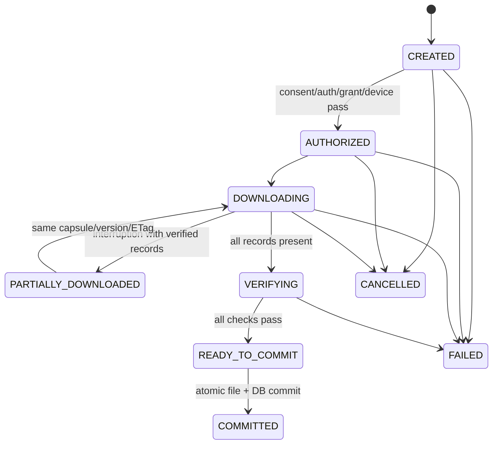

# MediQ Secure Medical Capsule Format

**Project:** MediQ  
**Document:** `SECURE-MEDICAL-CAPSULE-FORMAT.md`  
**Version:** v1.0  
**Baseline Date:** 2026-09-20  
**Scope:** CAPSTONE-P1 / Android-first Mobile Secure Vault / Synthetic·Test·De-identified DICOM  
**Status:** APPROVED P1 FORMAT BASELINE — DOCUMENTED, NOT IMPLEMENTED / NOT TESTED  
**Dependency:** P0 Golden Path와 P0 Security Validation PASS  
**Implementation Gate:** Physical Android Device Crypto Matrix, independent interoperability test, cryptographic test vector 승인

이 문서의 `MUST`, `MUST NOT`, `SHOULD`, `MAY`는 구현 상호운용성을 위한 규범 용어다. 다만 현재 저장소에는 Capsule 구현과 시험 증거가 없으므로, 규격 승인과 구현 완료를 혼동하지 않는다.

---

# 1. Executive Summary

MediQ Secure Medical Capsule은 Source PACS에서 조회한 DICOM 객체를 환자의 검증된 Android Device에 안전하게 저장하고 빠르게 로컬 열람하기 위한 **Device-bound 암호화 패키지**다. 이는 DICOMweb multipart, ZIP 파일, 장기 Cloud PACS 또는 병원 간 전송 패키지가 아니다.

P1 포맷은 다음을 선택한다.

- Container: 고정 128-byte Header와 길이·Offset이 명시된 Framed Binary Container
- Metadata: RFC 8949 Core Deterministic Encoding을 따르는 CBOR
- Payload: DICOM PS3.10 File 객체를 1 MiB 기본 Chunk로 분할한 독립 암호문 Record
- Payload Cipher: Capsule별 256-bit DEK를 사용하는 AES-256-GCM
- Nonce: Capsule별 64-bit 무작위 Prefix와 32-bit 전역 Chunk Sequence의 결합
- Tag: Chunk마다 128-bit GCM Authentication Tag
- Envelope Authenticity: COSE_Sign1 + ES256으로 Header, Public Manifest, Recipient Set을 서명
- Whole Integrity: 서명된 Manifest의 Record별 SHA-256과 각 Record의 AES-GCM Tag를 결합
- Device Wrap: RFC 9180 HPKE Base Mode, P-256/HKDF-SHA256/AES-256-GCM을 P1 후보 기준으로 선정
- PQC: Payload 암호는 유지하고 Wrap Slot 계층만 확장한다. 승인된 ML-KEM/Hybrid Profile이 없으면 활성화하지 않는다.
- Resume: 강한 ETag와 Record 경계에 맞춘 HTTP Range, `If-Range`, Staging Checkpoint 사용
- Commit: 모든 Manifest, 서명, Hash, Tag, Device Binding, Lease 검증 후에만 Atomic Commit

포맷은 `P1 규격 기준선`으로 승인하지만, Device Wrap은 실제 StrongBox/TEE와 독립 구현 간 상호운용 시험을 통과해야 한다. 시험 전 상태는 `DOCUMENTED / NOT IMPLEMENTED / NOT TESTED`다.

---

# 2. Scope & Architecture Context

## 2.1 포함 범위

- Backend 또는 보호된 Packaging Worker가 Source PACS에서 Synthetic/Test DICOM을 조회한다.
- Backend가 Capsule별 DEK를 생성하고 DICOM을 Chunk 단위로 암호화한다.
- DEK를 등록된 Hardware-backed Device Public Key에 결합한다.
- Android 앱은 Ciphertext Capsule만 수신하여 `noBackupFilesDir`에 저장한다.
- 앱은 Viewer Session에서 필요한 Chunk만 검증·복호화한다.
- 평문 DICOM 전체 파일을 Local Storage에 만들지 않는다.
- 30일 Offline Lease와 Capsule Cryptography를 분리하되 접근 판단에서 함께 검증한다.

## 2.2 제외 범위

- 운영 환자 데이터
- Permanent Cloud PACS 또는 장기 Archive
- Mobile Capsule의 병원 직접 Upload
- Cloud Key Escrow 또는 Cross-device Private Key 복구
- iOS Native Vault 구현
- P0 Hospital A → Hospital B STOW-RS 교환 패키지
- 암호 구현, Android Vault 변경, Backend API 변경, DB Migration, Azure Resource 생성
- ML-KEM 또는 Hybrid PQC의 실제 배포

## 2.3 시스템 경계

```text
Hospital PACS (Source of Record)
        │ WADO-RS / application/dicom
        ▼
MediQ Packaging Boundary
  - authorization recheck
  - DICOM validation
  - per-Capsule DEK
  - chunk encryption
  - Device wrap
  - manifest signature
        │ ciphertext-only Capsule
        ▼
Android App-private Vault
  - signature/hash/tag verification
  - hardware-backed unwrap
  - short-lived local viewer session
  - plaintext in bounded memory only
```

---

# 3. Current Implementation Baseline

| 항목 | 현재 상태 | 이 문서의 처리 |
|---|---|---|
| AES-256-GCM | 승인된 P1 정책 | 정확한 Key/Nonce/Tag/AAD 정의 |
| Capsule별 DEK | 승인된 P1 정책 | 1 Capsule : 1 DEK 확정 |
| Hardware-backed Device Key | 승인된 P1 정책 | HPKE Recipient Key와 Binding 정의 |
| 복수 Wrap Slot | 승인된 Crypto-agility 방향 | Slot Schema 정의; P1 발급은 동일 Device용 Slot만 허용 |
| 30일 Offline Lease | 승인된 P1 정책 | Capsule과 분리된 Signed Policy Evidence로 결합 |
| Capsule Container/Chunk | 미확정 | 본 문서에서 v1 규격 확정 |
| Device Wrap Algorithm | 미확정 | HPKE P-256 Profile 선택, Physical Device Gate 유지 |
| PQC 구현 | POST-MVP/미검증 | 확장점만 정의 |
| Mobile API | OpenAPI 미반영 | API 요구사항만 제시, 구현하지 않음 |
| Test Vector | 없음 | 구조와 생성 Gate 정의; Package Vector는 PENDING |

첨부된 Highpass 프롬프트는 설계 입력일 뿐 MediQ의 승인 기준선을 대체하지 않는다. 충돌 시 MediQ의 Domain, Security, Architecture, Acceptance 기준이 우선한다.

---

# 4. Security Objectives

Capsule은 다음 속성을 제공해야 한다.

1. **Confidentiality:** Device Private Key와 유효한 Local Access Decision 없이는 DICOM 평문을 얻지 못한다.
2. **Chunk Authenticity:** Ciphertext, Tag, AAD 또는 Record Metadata 변경을 탐지한다.
3. **Envelope Authenticity:** 신뢰된 MediQ Signing Key가 승인한 Header, Manifest, Recipient Set만 수용한다.
4. **Structural Completeness:** 누락, 중복, 순서 변경, 교체, 절단, 혼합, 추가 데이터를 탐지한다.
5. **Device Binding:** 다른 Device로 Capsule 파일만 복사해도 DEK를 얻지 못한다.
6. **Crypto Agility:** Payload 재암호화 없이 승인된 Wrap Profile을 추가할 수 있는 구조를 유지한다.
7. **Fast Local View:** 1 MiB 단위 점진 복호화로 전체 Study 평문 적재를 피한다.
8. **Fail Closed:** 알 수 없는 Critical Feature, Suite, Slot, Signature Key, Version 또는 Integrity 실패 시 열람하지 않는다.
9. **No False Authorization:** Capsule ID, DICOM UID, File possession 또는 Viewer URL은 단독 접근권한이 아니다.

비목표는 다음과 같다.

- Ciphertext 파일 존재 자체를 숨기는 Traffic Analysis 방어
- Rooted/compromised Device에서 화면 촬영까지 완전 차단
- Offline Device에 대한 즉시 Remote Revocation
- DICOM Parser 취약점을 암호 포맷만으로 제거

---

# 5. Capsule Format Overview

## 5.1 식별자

| 항목 | 값 |
|---|---|
| File extension | `.mqc` |
| Media type | `application/vnd.mediq.secure-medical-capsule` |
| Magic | ASCII `MEDIQSC1` |
| Format version | `1.0` |
| Integer byte order | Big-endian / network byte order |
| Manifest encoding | RFC 8949 Core Deterministic CBOR |

## 5.2 물리 배치

```text
+------------------------------+ 0
| Fixed Header (128 bytes)     |
+------------------------------+
| Public Manifest (CBOR)       |
+------------------------------+
| Envelope Signature           | COSE_Sign1, detached payload
+------------------------------+
| Recipient Set (CBOR)         | Device-bound Wrap Slot(s)
+------------------------------+ payload_offset
| Protected Manifest Record    | global_sequence = 0
+------------------------------+
| DICOM Data Chunk Record 1    | global_sequence = 1
+------------------------------+
| ...                          |
+------------------------------+
| DICOM Data Chunk Record N    |
+------------------------------+ total_length
```

모든 Offset과 Length는 파일 시작 기준 `uint64`다. Public Manifest 내부 Payload Record Offset만 `payload_offset` 기준 상대값이다. 암묵적 Padding은 없다. 실제 파일 길이가 `Header.total_length`와 다르면 거부한다.

---

# 6. Container Format Decision

| 후보 | 장점 | 단점 | 결정 |
|---|---|---|---|
| Custom Binary Container | 고정 Header, Range, Streaming, 엄격한 Parser 가능 | 자체 Framing 시험 필요 | **선택** |
| ZIP | 도구 풍부, 여러 객체 수용 | Central Directory, Zip Bomb/Path, Random Access·서명 Canonicalization 복잡 | 거부 |
| 단일 CBOR Container | Schema와 Canonicalization 우수 | 대형 Byte String Streaming/Range가 구현별로 불리 | 단독 사용 거부 |
| Manifest + 독립 Chunk 객체 | Cloud Resume와 병렬 다운로드 용이 | Mobile 단일 Artifact·Atomic Move·Export 관리 복잡 | 논리 모델로 채택, 물리는 Framed File |

결론은 **Framed Binary Container 안에 Deterministic CBOR Manifest와 독립 AEAD Record를 배치**하는 Hybrid 구조다. Binary Header는 Range Discovery를 담당하고, CBOR는 확장 가능한 Metadata를 담당하며, 각 Chunk는 독립 검증 단위다.

ZIP Entry Name, Compression, Extra Field와 같은 추가 해석 계층을 두지 않는다. Capsule 내부 DICOM은 별도로 ZIP 압축하지 않는다.

---

# 7. Capsule Header

Header는 정확히 128 bytes다.

| Offset | Size | Type | Field | v1 규칙 |
|---:|---:|---|---|---|
| 0 | 8 | bytes | `magic` | ASCII `MEDIQSC1` |
| 8 | 2 | u16 | `format_major` | `1` |
| 10 | 2 | u16 | `format_minor` | `0` |
| 12 | 4 | u32 | `header_length` | `128` |
| 16 | 4 | u32 | `feature_flags` | v1은 `0` |
| 20 | 4 | u32 | `content_suite_id` | `0x00010001` |
| 24 | 4 | u32 | `manifest_schema_id` | `0x00010001` |
| 28 | 4 | u32 | `record_header_length` | `32` |
| 32 | 16 | bytes | `capsule_id` | UUID 128-bit raw bytes, text가 아님 |
| 48 | 8 | u64 | `total_length` | 정확한 전체 File bytes |
| 56 | 8 | u64 | `public_manifest_offset` | `128` |
| 64 | 8 | u64 | `public_manifest_length` | CBOR bytes 길이 |
| 72 | 8 | u64 | `signature_offset` | Signature 시작 |
| 80 | 8 | u64 | `signature_length` | COSE_Sign1 bytes 길이 |
| 88 | 8 | u64 | `recipient_set_offset` | Recipient Set 시작 |
| 96 | 8 | u64 | `recipient_set_length` | CBOR bytes 길이 |
| 104 | 8 | u64 | `payload_offset` | 첫 Encrypted Record 시작 |
| 112 | 8 | u64 | `payload_length` | 모든 Encrypted Record bytes |
| 120 | 4 | u32 | `payload_record_count` | Protected Manifest 포함 |
| 124 | 4 | u32 | `reserved` | `0`; 그 외 거부 |

## 7.1 Header 검증 순서

1. 128 bytes를 완전히 읽는다.
2. Magic, Header Length, Reserved를 검증한다.
3. 지원 Version, Suite, Schema를 검증한다.
4. 모든 Offset/Length의 Overflow와 File Boundary를 검증한다.
5. 영역이 겹치거나 역순이면 거부한다.
6. `total_length`와 실제 Representation Length를 비교한다.
7. Public Manifest, Recipient Set과 Header 상호 일치성을 검증한다.
8. Envelope Signature를 검증한다.

## 7.2 Version과 Flag

- 알 수 없는 Major Version은 거부한다.
- 같은 Major의 더 높은 Minor는 구현이 선언된 Compatibility Matrix를 만족할 때만 허용한다.
- `feature_flags` 하위 16 bits는 Critical, 상위 16 bits는 Advisory다.
- v1 Parser는 알 수 없는 Critical bit를 거부하고 알 수 없는 Advisory bit를 무시할 수 있다.
- v1 Writer는 모든 bit를 `0`으로 기록한다.

---

# 8. Public Manifest

Public Manifest는 암호화되지 않지만 Envelope Signature로 인증된다. PHI, DICOM UID, 환자명, 병원 Local Patient ID, Grant Token을 포함해서는 안 된다.

## 8.1 공개 가능한 정보

- Opaque Capsule ID
- Format/Suite/Schema Version
- 생성 시각
- Content Version
- Nonce Prefix
- Chunk Size, Record Count, 전체 크기
- Record Offset, Length, Sequence, Type, SHA-256
- Critical Extension 목록

파일 보유자는 Capsule 크기, Record 수, 생성 시각을 추정할 수 있다. 이 Metadata Leakage는 P1에서 수용하되 로그에는 기록하지 않는다.

## 8.2 Deterministic Encoding

Public Manifest와 Recipient Set, Protected Manifest는 RFC 8949 Core Deterministic Encoding을 사용한다.

- 정수와 Length는 최단 Encoding을 사용한다.
- Map Key는 RFC 8949 결정적 순서로 정렬한다.
- Indefinite-length Item을 금지한다.
- Duplicate Map Key를 금지한다.
- Float, NaN, CBOR Tag는 금지한다. 단 COSE_Sign1 바깥 Tag 18은 허용한다.
- Text는 UTF-8이며 Unicode Normalization에 의존하지 않는다. 식별자는 가능하면 bstr 또는 정수로 표현한다.
- Decoder는 Decode 후 재인코딩한 bytes가 원본과 일치하는지 검증해야 한다.

---

# 9. Protected Manifest

Protected Manifest는 `record_type=0x0001`, `global_sequence=0`인 하나의 AES-256-GCM Record다. P1 구현은 최대 16 MiB Plaintext Manifest를 허용한다. 초과 Capsule은 발급하지 않는다.

포함 정보:

- Patient Reference, Source Hospital, Study Reference
- Study/Series/SOP Instance UID
- SOP Class UID, Transfer Syntax UID
- 원본 DICOM byte length와 SHA-256
- 각 Instance를 구성하는 전역 Chunk Sequence 목록
- Mobile Export Grant Reference와 Authorization Snapshot Reference
- Lease Reference와 발급 당시 `offline_expires_at`
- Source Retrieval/Provenance Reference

최소 정보 원칙을 적용하며 Patient Name, 주민등록번호, 주소, 연락처를 Index 목적으로 중복 저장하지 않는다. DICOM 원문 자체에 포함된 정보는 Payload Encryption으로 보호한다.

---

# 10. Manifest Schema

다음 CDDL은 v1 논리 Schema다. 구현 전 CDDL Parser/Validator Fixture로 고정해야 한다.

```cddl
public-manifest = {
  1: bstr .size 16,              ; capsule_id
  2: [1, 0],                     ; format_version
  3: uint,                       ; content_suite_id
  4: uint,                       ; manifest_schema_id
  5: uint,                       ; created_at, Unix seconds UTC
  6: uint,                       ; content_version, starts at 1
  7: bstr .size 8,               ; nonce_prefix
  8: uint,                       ; nominal_chunk_plaintext_size
  9: uint,                       ; payload_record_count
  10: uint,                      ; payload_plaintext_length
  11: uint,                      ; payload_encoded_length
  12: [+ record-descriptor],
  ? 13: [* uint],                ; critical_extensions
  ? 14: { * uint => any }        ; non-critical extensions
}

record-descriptor = {
  1: uint,                       ; global_sequence
  2: uint,                       ; record_type
  3: uint,                       ; offset relative to payload_offset
  4: uint,                       ; encoded record length
  5: bstr .size 32,              ; SHA-256(record_header || ciphertext || tag)
  6: uint                        ; plaintext_length
}

protected-manifest = {
  1: 1,                          ; schema version
  2: bstr .size 16,              ; capsule_id
  3: bstr,                       ; patient_reference_id, opaque
  4: bstr,                       ; source_hospital_id, opaque
  5: bstr,                       ; study_reference_id, opaque
  6: tstr,                       ; study_instance_uid
  7: bstr,                       ; mobile_export_grant_id/ref
  8: bstr,                       ; authorization_snapshot_ref
  9: uint,                       ; issued_at
  10: bstr,                      ; offline_lease_ref
  11: uint,                      ; issuance offline_expires_at
  12: bstr,                      ; provenance_ref
  13: [+ dicom-object],
  ? 14: [* uint],                ; critical_extensions
  ? 15: { * uint => any }
}

dicom-object = {
  1: uint,                       ; object_index, starts at 0
  2: tstr,                       ; series_instance_uid
  3: tstr,                       ; sop_instance_uid
  4: tstr,                       ; sop_class_uid
  5: tstr,                       ; transfer_syntax_uid
  6: uint,                       ; exact DICOM PS3.10 byte length
  7: bstr .size 32,              ; SHA-256 of reassembled plaintext object
  8: [+ uint],                   ; ordered global_sequence list
  9: "application/dicom",
  10: bstr                       ; source resource/provenance ref, opaque
}

recipient-set = {
  1: 1,                          ; recipient schema version
  2: bstr .size 16,              ; capsule_id
  3: bstr .size 32,              ; device_binding_hash
  4: [+ wrap-slot],
  ? 5: [* uint],
  ? 6: { * uint => any }
}

wrap-slot = {
  1: bstr .size 16,              ; slot_id
  2: 1,                          ; slot_version
  3: uint,                       ; wrap_profile_id
  4: bstr,                       ; recipient_key_id, opaque
  5: bstr .size 32,              ; recipient_public_key_thumbprint
  6: uint,                       ; key_security_level
  7: uint,                       ; created_at
  8: uint,                       ; not_after
  9: bstr,                       ; encapsulated_key / HPKE enc
  10: bstr,                      ; wrapped_dek / HPKE ciphertext+tag
  11: bstr .size 32,             ; slot_binding_hash
  ? 12: { * uint => any }
}
```

`bstr` 식별자의 정확한 길이는 해당 Domain ID Registry에서 고정한다. UUID 기반 ID는 16-byte raw representation을 권장한다. text UUID와 raw UUID를 혼용하지 않는다.

---

# 11. DICOM Instance Structure

## 11.1 저장 단위

- 하나의 `dicom-object`는 하나의 완전한 SOP Instance다.
- Plaintext는 DICOM PS3.10 File Format bytes여야 한다.
- DICOMweb multipart Boundary와 HTTP Header는 Capsule에 저장하지 않는다.
- WADO-RS 응답에서 `application/dicom` Part를 추출·검증한 뒤 객체 bytes만 저장한다.
- P1 Validation Target은 Synthetic Classic single-frame CT와 Explicit VR Little Endian UID `1.2.840.10008.1.2.1`이다.
- 지원되지 않는 SOP Class/Transfer Syntax는 Capsule에 넣기 전에 Fail Closed한다.

## 11.2 객체와 Chunk Mapping

```text
DICOM PS3.10 Instance bytes
  ├── first 1 MiB  → global_sequence 1
  ├── next 1 MiB   → global_sequence 2
  └── final bytes  → global_sequence 3

Protected Manifest object.chunk_sequences = [1, 2, 3]
```

Chunk Boundary는 DICOM Element 또는 Frame Boundary와 일치할 필요가 없다. 재조립 시 byte-for-byte 동일해야 한다. Viewer Adapter가 특정 Frame Random Access를 요구하면 별도 인덱스를 Protected Manifest Extension으로 추가하되 v1 필수 기능으로 간주하지 않는다.

---

# 12. Chunk Structure

## 12.1 Record Header

각 암호화 Record의 Header는 정확히 32 bytes다.

| Offset | Size | Type | Field | 규칙 |
|---:|---:|---|---|---|
| 0 | 4 | bytes | `record_magic` | ASCII `MQCR` |
| 4 | 2 | u16 | `record_type` | `0x0001` Protected Manifest, `0x0002` DICOM Data |
| 6 | 2 | u16 | `record_version` | `1` |
| 8 | 4 | u32 | `record_flags` | v1은 `0` |
| 12 | 4 | u32 | `global_sequence` | Capsule 내 유일, 0부터 연속 |
| 16 | 8 | u64 | `plaintext_length` | Record 평문 bytes |
| 24 | 8 | u64 | `ciphertext_length` | v1에서 `plaintext_length`와 동일 |

Record bytes는 다음과 같다.

```text
32-byte Record Header
|| ciphertext[ciphertext_length]
|| authentication_tag[16]
```

## 12.2 Chunk 크기와 제한

| 항목 | P1 값 |
|---|---:|
| 기본 DICOM Chunk Plaintext | 1,048,576 bytes (1 MiB) |
| 허용 범위 | 262,144–4,194,304 bytes |
| Protected Manifest 최대 | 16 MiB |
| P1 Capsule 최대 | 2 GiB 또는 Device Policy의 더 작은 값 |
| P1 DICOM Instance 최대 | 4,096 |
| P1 Payload Record 최대 | 65,535 |
| Format 절대 Sequence 한계 | `0xFFFFFFFE` |

Writer는 Public Manifest의 nominal Chunk Size를 모든 DICOM Data Record에 적용하고, 각 Instance의 마지막 Record만 더 짧게 만들 수 있다. Zero-length DICOM Record는 금지한다.

---

# 13. AES-256-GCM Profile

| Parameter | 값 |
|---|---|
| Algorithm | AES-256-GCM |
| COSE Algorithm reference | A256GCM / `3` |
| DEK length | 32 bytes / 256 bits |
| Nonce length | 12 bytes / 96 bits |
| Authentication Tag | 16 bytes / 128 bits |
| AAD length | 64 bytes |
| Encryption granularity | Protected Manifest Record와 각 DICOM Data Record |

Capsule마다 CSPRNG로 새 DEK를 생성한다. DEK를 다른 Capsule에 재사용하지 않는다. 동일 DEK/Nonce 조합을 절대 재사용하지 않는다.

암호화 결과는 `ciphertext || tag`로 저장한다. API가 결합 결과를 반환하더라도 Parser는 마지막 16 bytes를 Tag로 해석한다. Tag가 검증되기 전의 Plaintext를 DICOM Parser나 Renderer에 전달해서는 안 된다.

---

# 14. Nonce Construction

## 14.1 선택안

```text
nonce = nonce_prefix[8] || I2OSP(global_sequence, 4)
```

- `nonce_prefix`: Capsule 생성 시 CSPRNG로 생성하는 64-bit 값
- `global_sequence`: 32-bit unsigned big-endian
- Protected Manifest는 Sequence `0`
- DICOM Data는 Sequence `1..N`

NIST SP 800-38D와 RFC 9053의 96-bit GCM Nonce를 사용한다.

## 14.2 비교

| 방식 | 평가 |
|---|---|
| Record마다 96-bit Random | 충돌 확률 관리와 중복 검출이 필요 |
| 96-bit 단순 Counter | Capsule별 DEK가 유일하면 가능하나 Domain 식별성이 약함 |
| 64-bit Random Prefix + 32-bit Counter | 병렬 생성과 재개가 단순하고 Capsule Domain 분리 명확 — **선택** |

## 14.3 금지 규칙

- 같은 DEK로 Sequence를 재암호화하지 않는다.
- Capsule Build 실패 후 같은 DEK/Prefix로 다시 시작하지 않는다.
- 재시도는 저장된 동일 Ciphertext bytes를 재전송하며 재암호화하지 않는다.
- Payload 내용이나 Record 순서가 바뀌면 새 Capsule ID, 새 DEK, 새 Nonce Prefix를 생성한다.
- 병렬 Encryptor는 Immutable Build Plan에서 Sequence를 선할당한다.

---

# 15. Authentication Tag

- Tag는 Record마다 16 bytes다.
- Truncated Tag를 허용하지 않는다.
- Tag 검증 실패 시 해당 Record와 Capsule을 `INTEGRITY_FAILED`로 격리한다.
- 실패한 Plaintext는 한 byte도 Viewer로 내보내지 않는다.
- 동일 Record의 반복 Tag 실패는 단순 Network Error가 아니라 Security Event다.
- Tag 비교는 사용하는 검증된 Crypto Provider가 수행해야 하며 Application Code가 직접 비교 로직을 만들지 않는다.

Tag는 해당 Record와 AAD의 무결성을 제공하지만 Record 누락이나 전체 Package 진본성을 단독으로 보장하지 않는다. 따라서 Signed Manifest와 Record Hash가 별도로 필요하다.

---

# 16. Additional Authenticated Data

AAD는 정확히 64 bytes이며 모든 다중 byte 정수는 Big-endian이다.

| Offset | Size | Field |
|---:|---:|---|
| 0 | 16 | ASCII `MEDIQ-SMC-AAD-v1` |
| 16 | 16 | `capsule_id` raw bytes |
| 32 | 4 | `content_suite_id` |
| 36 | 2 | `record_type` |
| 38 | 2 | `record_version` |
| 40 | 4 | `record_flags` |
| 44 | 4 | `global_sequence` |
| 48 | 8 | `plaintext_length` |
| 56 | 8 | `ciphertext_length` |

AAD는 File에 별도 저장하지 않고 Header와 Record Header에서 재구성한다. 재구성된 AAD와 Record Header가 일치하지 않으면 복호화 전에 거부한다.

AAD는 다음 치환을 차단한다.

- 다른 Capsule의 Chunk 삽입
- Sequence 변경
- Protected Manifest와 DICOM Data의 Type 변경
- Length 조작
- Suite Downgrade

---

# 17. DEK Architecture

| 후보 | 장점 | 단점 | 결정 |
|---|---|---|---|
| Capsule별 DEK | 단순, 접근 승인 1회, 빠른 Viewer | Capsule 단위 노출 범위 | **선택** |
| Instance별 DEK | 세밀한 폐기 | Slot/Key 수 증가, Viewer 복잡 |
| Chunk별 DEK | 최소 노출 | Key 관리 폭증, 성능·Manifest 부담 |

P1은 1 Capsule : 1 무작위 256-bit DEK를 사용한다. Capsule은 한 Patient, 한 Study, 한 Device Binding, 한 Mobile Export Grant Scope에 결합되므로 Capsule 단위 DEK가 현재 접근 단위와 일치한다.

DEK 수명:

```text
GENERATED
→ ACTIVE_IN_PACKAGING_MEMORY
→ WRAPPED_TO_APPROVED_DEVICE_SLOT
→ ZEROIZED_FROM_BACKEND_MEMORY
→ ACTIVE_ON_DEVICE_SESSION
→ SESSION_ZEROIZED
→ EXPIRED / REVOKED / CRYPTO_SHREDDED
```

- Backend는 Capsule 발급 완료 후 평문 DEK를 저장하지 않는다.
- Android는 Hardware-backed Private Key로 Slot을 열고 짧은 Viewer Session Memory에만 DEK를 둔다.
- Session 종료, Background Lock, Process 종료 시 DEK Reference를 폐기하고 가능한 Buffer를 덮어쓴다.
- Managed Runtime의 완전한 Memory Erasure 보장은 제한적이므로 평문 수명과 복제 수를 최소화한다.

---

# 18. Key Wrap Slot

## 18.1 P1 Wrap Profile

`wrap_profile_id = 0x00010001`은 다음 RFC 9180 HPKE Base Mode Profile이다.

| Parameter | 값 |
|---|---|
| Mode | Base (`0x00`) |
| KEM | DHKEM(P-256, HKDF-SHA256), `0x0010` |
| KDF | HKDF-SHA256, `0x0001` |
| AEAD | AES-256-GCM, `0x0002` |
| Plaintext | 32-byte Capsule DEK |
| Recipient Key | Attested Android Keystore P-256 ECDH Public Key |

HPKE `info`는 다음 Deterministic CBOR Array의 exact bytes다.

```cddl
wrap-info = [
  "MediQ-SMC-HPKE-v1",
  capsule_id: bstr .size 16,
  slot_id: bstr .size 16,
  content_suite_id: uint,
  recipient_public_key_thumbprint: bstr .size 32
]
```

HPKE AAD는 다음 Deterministic CBOR Map의 exact bytes다.

```cddl
wrap-aad = {
  1: bstr .size 16,  ; capsule_id
  2: bstr .size 16,  ; slot_id
  3: bstr .size 32,  ; device_binding_hash
  4: uint,           ; key_security_level
  5: uint            ; wrap_profile_id
}
```

`encapsulated_key`에는 RFC 9180 `enc`, `wrapped_dek`에는 HPKE `Seal()`이 반환한 Ciphertext와 Tag를 저장한다.

## 18.2 Device 검증 Gate

HPKE Profile 선택은 포맷 결정을 의미하며 실기기 지원 증거를 의미하지 않는다. 다음을 Physical Device Matrix에서 검증해야 한다.

- StrongBox/TEE P-256 ECDH Key Generation
- Hardware Attestation과 Public Key Binding
- Non-exportable Private Key로 HPKE Decap에 필요한 ECDH 수행 가능성
- Provider 간 P-256 Point Encoding 상호운용성
- Biometric/Device Credential Key Use Authorization
- 성능, 오류, Key Invalidated 처리

실기기 Gate 실패 시 RSA-OAEP로 조용히 하향하지 않는다. 대체 Profile은 별도 ADR, Registry, Test Vector 승인 후에만 추가한다.

## 18.3 Device Binding Encoding

`key_security_level`은 Capsule Registry 값이며 Android Framework 상수를 그대로 직렬화하지 않는다.

| 값 | 의미 | P1 발급 |
|---:|---|---|
| 0 | UNKNOWN | 금지 |
| 1 | SOFTWARE | 금지 |
| 2 | TRUSTED_ENVIRONMENT | 정책 허용 시 가능 |
| 3 | STRONGBOX | 선호 |

`recipient_public_key_thumbprint`는 P-256 Public Key의 DER SubjectPublicKeyInfo bytes에 대한 SHA-256이다.

`device_binding_hash`는 다음 Deterministic CBOR Array exact bytes의 SHA-256이다.

```cddl
device-binding-input = [
  "MediQ-Device-Binding-v1",
  device_registration_id: bstr,
  recipient_public_key_thumbprint: bstr .size 32,
  key_security_level: uint,
  attestation_policy_version: uint
]
```

`slot_binding_hash`는 다음 Deterministic CBOR Array exact bytes의 SHA-256이다.

```cddl
slot-binding-input = [
  "MediQ-SMC-SlotBinding-v1",
  capsule_id: bstr .size 16,
  slot_id: bstr .size 16,
  wrap_profile_id: uint,
  recipient_key_id: bstr,
  recipient_public_key_thumbprint: bstr .size 32,
  device_binding_hash: bstr .size 32,
  key_security_level: uint,
  created_at: uint,
  not_after: uint
]
```

App은 로컬 등록정보로 위 Hash를 재계산하고 Recipient Set과 비교해야 한다. Opaque Device ID나 Hash 자체가 접근권한은 아니다.

---

# 19. Key Lifecycle

## 19.1 Slot 규칙

- 모든 Slot은 같은 32-byte DEK를 보호한다.
- P1 Slot은 동일한 승인 Device Binding을 가리켜야 한다.
- Server Recovery, Administrator Recovery, Cross-device Recipient Slot은 금지한다.
- Recipient Set은 v1 Capsule 발급 후 Immutable이다.
- Slot 추가·삭제·교체 시 Envelope Signature와 Representation ETag가 바뀌어야 한다.
- 현재 P1 정책에서는 기존 Capsule에 새 Device Slot을 추가하지 않고 Source PACS에서 새 Capsule을 발급한다.

## 19.2 회전과 폐기

| 사건 | 처리 |
|---|---|
| Signing Key rotation | 이전·신규 검증키 Overlap, `kid` Registry, 새 Capsule은 신규 Key 사용 |
| Device Key rotation | 기존 Capsule 복구 금지; 현재 권한 확인 후 Source PACS 재발급 |
| Wrap Algorithm migration | 발급 시 같은 Device용 승인 Slot을 병행할 수 있음; 후속 In-place Rewrap은 별도 승인 |
| Device revoke | Online 갱신 차단, Local Revocation 반영, Lease 만료 전 Offline 즉시 차단 한계 기록 |
| Secure delete | Device Key 또는 Capsule-specific Local Binding 제거 후 복호화 불가 확인 |
| Suspected DEK compromise | Capsule Revoke, 재발급, Audit/Security Incident |

NIST SP 800-57의 Key State, Cryptoperiod, Compromise 처리 원칙을 따른다. `not_after`는 Slot 사용 승인 종료이며 Offline Lease를 대체하지 않는다.

---

# 20. Crypto Suite Registry

## 20.1 Content Suite

| ID | 이름 | 구성 | 상태 |
|---|---|---|---|
| `0x00010001` | `MSMC-CONTENT-A256GCM-SHA256-ES256` | AES-256-GCM, 96-bit Nonce, 128-bit Tag, SHA-256 Record Hash, COSE_Sign1 ES256 | P1 SELECTED |

## 20.2 Wrap Profile

| ID | 이름 | 구성 | 상태 |
|---|---|---|---|
| `0x00010001` | `MSMC-WRAP-HPKE-P256-SHA256-A256GCM` | RFC 9180 Base, KEM `0x0010`, KDF `0x0001`, AEAD `0x0002` | SELECTED WITH PHYSICAL DEVICE GATE |
| `0x00010002` | `MSMC-WRAP-RSA-OAEP-256` | 정확한 MGF1/Label/Profile 미승인 | RESERVED / MUST NOT EMIT |
| `0x00020001` | `MSMC-WRAP-PQC-HYBRID` | 표준 Hybrid Profile 미승인 | RESERVED / MUST NOT EMIT |

알 수 없는 Content Suite는 Capsule 전체를 거부한다. 알 수 없는 Wrap Profile은 해당 Slot만 사용할 수 없지만, 같은 Recipient Set의 다른 승인 Slot이 검증되면 사용할 수 있다. Writer는 Registry에 `APPROVED`된 ID만 생성한다.

## 20.3 Envelope Signature

- Structure: Tagged COSE_Sign1, CBOR Tag 18
- Algorithm: ES256 / COSE Algorithm `-7`
- Curve: NIST P-256
- Hash: SHA-256
- Payload field: `nil` (detached content)
- Protected Headers: `alg`, `kid`
- Unprotected Headers: empty map
- `external_aad`: zero-length bstr

Detached Payload는 다음 Deterministic CBOR Array의 exact bytes다.

```cddl
signed-envelope = [
  "MediQ-SMC-SignedEnvelope-v1",
  header: bstr .size 128,
  public_manifest: bstr,
  recipient_set: bstr
]
```

Writer는 Public Manifest와 Recipient Set을 먼저 확정하고, 고정 길이 ES256 Signature를 포함한 COSE 구조 길이를 계산한 뒤 최종 Header를 작성하고 서명한다. Reader는 `kid`에 대응하는 신뢰된 MediQ Public Key와 Key Status를 확인한다. Signature가 유효해도 Signing Identity가 Capsule 발급 권한을 가진 Key인지 별도 검증한다.

---

# 21. Version Compatibility

| 변화 | Version 처리 | Reader 행동 |
|---|---|---|
| 의미가 호환되는 선택 Field 추가 | Minor 또는 Extension | Critical이 아니면 무시 가능 |
| AAD, Nonce, Header Layout 변경 | Major 또는 새 Content Suite | 미지원 시 거부 |
| 새 Wrap Algorithm | 새 Wrap Profile ID | 지원 Slot만 선택 |
| 새 Signature Algorithm | 새 Content Suite/Envelope Profile | 미지원 시 거부 |
| Chunk Hash/Merkle 변경 | 새 Integrity Extension 또는 Suite | Critical이면 미지원 거부 |
| DICOM Index 추가 | Protected non-critical Extension | 미지원 Reader는 순차 조립 |

Reader는 “알 수 없지만 아마 호환”이라고 추정하지 않는다. Version, Suite, Critical Extension은 Allowlist 기반이다.

---

# 22. PQC / Hybrid Extension

PQC는 대용량 Payload Cipher를 교체하는 기능이 아니라 DEK Recipient Wrap 계층의 전환이다.

## 22.1 확정 원칙

- FIPS 203의 ML-KEM은 향후 KEM 후보로 수용한다.
- FIPS 204 ML-DSA와 FIPS 205 SLH-DSA는 향후 Envelope Signature 후보로 수용한다.
- ML-KEM Ciphertext 또는 Hybrid Component는 새 Wrap Slot의 opaque field/extension으로 수용한다.
- 기존 AES-256-GCM Payload를 다시 암호화하지 않고 승인 Slot을 병행할 수 있는 구조를 유지한다.
- Algorithm ID, Parameter Set, Public Key Encoding, KDF, Combiner, Downgrade 규칙이 모두 승인된 Profile이어야 한다.

## 22.2 금지 원칙

- `ECDH secret || ML-KEM secret` 같은 자체 Hybrid Combiner를 만들지 않는다.
- FIPS 203만 존재한다는 이유로 Android StrongBox/TEE가 ML-KEM Private Key를 보호한다고 가정하지 않는다.
- 검증되지 않은 Software-only PQC Key를 Hardware-backed Device Key와 동일 등급으로 표시하지 않는다.
- Draft Algorithm Identifier를 운영 Format에 고정하지 않는다.

P1은 PQC-ready Schema와 Registry만 제공한다. 실제 `MSMC-WRAP-PQC-HYBRID` 활성화는 NIST SP 800-227, 적용 가능한 IETF Profile, Android Key Protection, 독립 Test Vector를 검토한 별도 ADR 이후다.

---

# 23. Capsule Integrity

검증 계층은 다음과 같다.

```text
Strong ETag / Representation identity
        ↓
Header bounds and exact total length
        ↓
COSE Envelope Signature
        ↓
Signed record directory + SHA-256(record bytes)
        ↓
Record Header/AAD/Nonce consistency
        ↓
AES-GCM Tag
        ↓
Protected Manifest object SHA-256 after reassembly
```

| 위협 | 탐지 통제 |
|---|---|
| Missing Chunk | Signed Record Count/Directory, missing Sequence |
| Duplicated Chunk | Sequence uniqueness, Offset overlap, exact directory |
| Reordered Chunk | Directory order, Sequence, AAD |
| Replaced Instance | Protected object hash와 Sequence mapping |
| Modified Manifest | COSE Signature 또는 GCM Tag |
| Truncated Capsule | `total_length`, 영역 Length, missing Record |
| Mixed Capsule | Capsule ID in Header/Manifest/AAD/Recipient Set |
| Unknown Extra Data | 실제 길이와 `total_length` 불일치 |
| Crypto Downgrade | Signed Suite IDs, Allowlist |

SHA-256만으로 발급자 진본성을 주장하지 않는다. 진본성은 신뢰된 Signing Key로 검증한 COSE Signature가 제공한다. AES-GCM Tag는 DEK 보유자 관점의 Record 인증을 제공한다.

---

# 24. Merkle Tree Decision

| Option | 장점 | 비용 |
|---|---|---|
| Signed Manifest + Chunk Hash | 단순, 독립 Range 검증, P1 Record 수에 충분 | Manifest가 Record 수에 비례 |
| Merkle Root + Proof | 매우 큰 객체와 선택 Chunk Proof 효율 | Tree/Proof 생성·저장·검증 복잡 |

P1은 **Merkle Tree를 사용하지 않는다**. 2 GiB Capsule과 1 MiB Chunk의 일반적 Directory는 약 2,048 Record 수준으로 Signed Hash List가 충분하다. Merkle Tree는 P2에서 대규모 Capsule, 선택적 Instance Fetch 또는 Manifest 크기 문제가 측정될 때 검토한다.

---

# 25. Partial Download

## 25.1 Resume 절차

```text
GET bytes=0-127
→ Header 검증
→ Public Manifest / Signature / Recipient Set Range 다운로드
→ Envelope Signature 검증
→ Required Record Directory 계산
→ 누락 Record를 완전한 Record 경계로 Range 다운로드
→ SHA-256 검증 후 encrypted staging 저장
→ 모든 Record 수신 후 DEK unwrap / GCM / object integrity 검증
→ Atomic Commit
```

## 25.2 HTTP 조건

- 서버는 `Accept-Ranges: bytes`, 정확한 `Content-Length`, 강한 `ETag`를 제공해야 한다.
- Client는 최초 ETag를 Checkpoint에 저장한다.
- 재개 요청은 `Range`와 강한 ETag 기반 `If-Range`를 사용한다.
- 응답이 `206 Partial Content`가 아니거나 ETag가 바뀌면 기존 Staging을 혼합하지 않고 Reset한다.
- Azure Blob을 사용하는 경우 Blob은 Capsule Version 동안 Immutable해야 하며 Get Blob의 Range와 조건부 Header 지원을 검증한다.
- Client에 Storage Account Key나 장기 SAS를 제공하지 않는다. Download Proof는 Device, Capsule, Operation, Expiry에 결합된 Short-lived Credential이어야 한다.
- Multi-range 응답보다 Record별 또는 인접 Record 묶음의 Single Range를 우선한다.

## 25.3 Checkpoint

Checkpoint에는 다음만 저장한다.

- Capsule ID, Content Version, Strong ETag
- Total Length, Manifest Hash, Recipient Set Hash
- 검증 완료된 Global Sequence Bitset
- 각 완료 Record의 Offset, Length, SHA-256
- 마지막 성공 시각과 Attempt Count

Partial Ciphertext는 정상 Vault Item으로 노출하지 않는다. 중간 HTTP Fragment는 Record Hash 검증 전 `verified`로 표시하지 않는다.

---

# 26. Retry & Resume

기본 Network Retry는 최대 5회, Exponential Backoff with Full Jitter를 사용한다. 기준 지연은 1, 2, 4, 8, 16초이며 30초를 넘지 않는다.

| 상황 | Retry | 기존 검증 Chunk | 추가 처리 |
|---|---|---|---|
| Network Timeout | 가능 | ETag 동일 시 재사용 | Backoff |
| Connection Reset | 가능 | 완전 검증 Record만 재사용 | 불완전 Fragment 삭제 |
| Partial Response | 가능 | 완전 검증 Record만 재사용 | Content-Range 검증 |
| Record Hash 실패 | 1회 Fresh Fetch | 해당 Record 폐기 | 반복 시 Security Event |
| AES-GCM Tag 실패 | 자동 반복 금지 | Capsule 격리 | Security Event, 재발급 필요 |
| Authentication Failure | Token Refresh 1회 | ETag 동일 시 유지 | 재인증 실패 시 중단 |
| Grant Expired | 불가 | Staging 격리/TTL 삭제 | 새 승인 필요 |
| Device Revoked | 불가 | Commit 금지 | Key/Lease 처리 |
| Manifest/ETag Changed | 새 Representation으로 재시작 | 혼합 금지 | Staging Reset |
| Storage Full | 사용자 조치 후 가능 | 검증 완료분 유지 가능 | Preflight 재실행 |

---

# 27. Download State Machine



`RESUMED`는 Audit Event이며 별도 Durable State가 아니다. `COMMITTED`만 정상 Vault Item으로 노출한다.

---

# 28. Atomic Vault Commit

Commit 전 조건:

- Header/Offset/Length Valid
- Envelope Signature Valid
- Signing Key Trusted and Authorized
- Recipient Set와 Current Device Binding 일치
- 모든 Required Record 존재, 중복 없음
- 모든 Record SHA-256 일치
- 모든 AES-GCM Tag 검증 완료
- 모든 DICOM Object SHA-256와 길이 일치
- DEK Unwrap 성공
- Device Security Level 허용
- Offline Lease와 Authorization Snapshot 유효
- Storage/Backup Exclusion 정책 확인

권장 절차:

1. `noBackupFilesDir/staging/<operation-id>/`에 Ciphertext만 기록한다.
2. File Handle과 가능한 Directory Metadata를 flush/sync한다.
3. 모든 검증 후 같은 File System의 최종 Capsule 경로로 Atomic Rename한다.
4. Room Transaction에서 Vault Item 상태를 `COMMITTED`로 전환한다.
5. Rename 성공·DB 실패 시 Recovery Scanner가 Orphan을 재검증하거나 제거한다.
6. DB 성공·File 없음 상태는 정상으로 간주하지 않고 Fail Closed한다.

Cross-filesystem Move 또는 Copy 후 상태 전환을 Atomic Rename으로 간주하지 않는다.

---

# 29. Streaming Encryption

## 29.1 Backend

```text
WADO-RS DICOM Stream
→ bounded 1 MiB buffer
→ validate/package object sequence
→ AES-256-GCM record encryption
→ ciphertext record output
→ overwrite/release plaintext buffer
```

- 전체 Study를 Memory에 적재하지 않는다.
- 평문 Temporary File을 사용하지 않는다.
- Packaging 실패 시 미완성 Ciphertext Object를 정상 Capsule로 Publish하지 않는다.
- Final Header/Manifest/Signature가 준비되기 전에는 Download URL을 발급하지 않는다.

## 29.2 Android

```text
Encrypted Record
→ verify signed hash
→ hardware-bound DEK session
→ decrypt into bounded buffer
→ verify GCM tag
→ release verified plaintext to DICOM adapter
→ render required frame
→ clear plaintext/pixel buffers on lock/background
```

AEAD Provider가 Tag 확인 전에 Plaintext bytes를 출력할 수 있으므로, 한 Record 전체를 최대 1 MiB의 격리 Buffer에 보관하고 `doFinal` 성공 후에만 Parser에 전달한다. Android Process Kill 후 Viewer/Vault Unlocked 상태를 복원하지 않는다.

---

# 30. Offline Lease Integration

Offline Lease는 암호 알고리즘이나 Capsule File Mutation이 아니다. 별도 Signed Policy Evidence로 관리한다.

```text
Device Trust
+ Current Local Account Binding
+ Capsule Signature/Integrity
+ Hardware-backed DEK Unwrap
+ Signed Offline Lease
+ Local Authorization Snapshot
= Local Access Decision
```

- Protected Manifest의 `offline_expires_at`은 발급 당시 Binding 값이며 권한의 유일한 근거가 아니다.
- 갱신은 별도 Lease Artifact를 교체하며 Capsule Payload를 다시 암호화하지 않는다.
- Lease 만료 시 Ciphertext를 즉시 삭제할 필요는 없지만 복호화와 Viewer를 거부한다.
- Expired/Revoked Capsule은 Policy에 따라 Crypto-shred 또는 정리 Queue로 이동한다.
- Offline 상태에서는 서버 철회를 즉시 알 수 없다. 최대 30일 Risk Window를 수용·기록한다.
- 시각 되돌리기, Backup Restore, Capsule 복제로 Lease가 연장되어서는 안 된다.

---

# 31. Threat Model

| Asset | Threat / Attack Path | Control | Detection | Response | Residual Risk |
|---|---|---|---|---|---|
| DEK | Nonce reuse로 GCM 안전성 붕괴 | Capsule별 DEK, Prefix+Sequence, immutable build | duplicate sequence build check | 발급 중단, key discard | RNG/provider 결함 |
| Chunk | Ciphertext/Tag 변조 | SHA-256 + GCM Tag | verify failure | quarantine/security event | DoS 가능 |
| Manifest | Public Manifest 변조 | COSE ES256 | signature failure | reject | Signing key compromise |
| Payload | Chunk substitution/mixing | Capsule ID·Sequence AAD, signed directory | hash/tag mismatch | reject | DoS |
| Package | Truncation/extra bytes | total length, count, offsets | structural parser | reject | storage corruption |
| Device key | Key extraction/cloning | StrongBox/TEE, attestation, non-exportable key | server/device status | revoke/reissue | compromised unlocked device |
| Wrap Slot | Slot replacement/downgrade | signed Recipient Set, allowlist | signature/profile check | reject | signing key compromise |
| Suite | Crypto downgrade | signed Suite ID, unknown critical reject | parser | reject | stale app unavailable |
| Lease | Offline replay/clock rollback | signed lease, secure-time strategy | rollback indicators | lock/online refresh | offline immediate revoke 불가 |
| DICOM | Malicious parser input | validation, adapter isolation, corpus/fuzz gate | parser error/crash telemetry | fail closed | native decoder 0-day |
| Resume | Old/new Chunk mixing | Capsule ID, Content Version, strong ETag, If-Range | checkpoint mismatch | full reset | server validator bug |
| Version | Rollback to older valid Capsule | content version/lease/revocation state | local/server monotonic state | deny/revalidate | restored app data |

---

# 32. Test Matrix

모든 시험은 Synthetic/Test/De-identified DICOM만 사용한다.

## 32.1 Format

| ID | 시험 | 기대 결과 |
|---|---|---|
| SMC-FMT-001 | Valid Capsule | 독립 Reader 2개에서 동일 해석 |
| SMC-FMT-002 | Invalid Magic/Header Length | Reject |
| SMC-FMT-003 | Unsupported Major/Unknown Critical Flag | Reject |
| SMC-FMT-004 | Offset overflow/overlap | Reject before allocation |
| SMC-FMT-005 | Non-deterministic/Duplicate-key CBOR | Reject |
| SMC-FMT-006 | Unknown extra bytes after total length | Reject |

## 32.2 Cryptography

| ID | 시험 | 기대 결과 |
|---|---|---|
| SMC-CRY-001 | AES-256-GCM Known Answer | 공식 Vector 일치 |
| SMC-CRY-002 | Modified Ciphertext/Tag | Fail Closed |
| SMC-CRY-003 | Wrong DEK/AAD/Nonce | Fail Closed |
| SMC-CRY-004 | Sequence uniqueness over generated Capsule corpus | 중복 0 |
| SMC-CRY-005 | Wrong Device HPKE Key | Unwrap 실패 |
| SMC-CRY-006 | COSE Signature/KID 변조 | Reject |
| SMC-CRY-007 | Backend↔Android HPKE interop | 동일 DEK 복원 |

## 32.3 Integrity

| ID | 시험 | 기대 결과 |
|---|---|---|
| SMC-INT-001 | Missing/Duplicate/Reordered Record | Reject |
| SMC-INT-002 | 다른 Capsule Record 삽입 | Hash/AAD/Tag 실패 |
| SMC-INT-003 | Protected Manifest 교체 | Hash/Tag 실패 |
| SMC-INT-004 | Reassembled DICOM 한 byte 변경 | Object Hash 실패 |

## 32.4 Download

| ID | 시험 | 기대 결과 |
|---|---|---|
| SMC-DL-001 | Network interruption and resume | 검증 Chunk 재사용 |
| SMC-DL-002 | Changed ETag | Staging reset |
| SMC-DL-003 | Corrupted Range | 1회 fresh fetch 후 반복 실패 Security Event |
| SMC-DL-004 | Grant expiry during download | Commit 금지 |
| SMC-DL-005 | Process kill at every state | Partial Vault Item 비노출 |

## 32.5 Compatibility/Mobile

| ID | 시험 | 기대 결과 |
|---|---|---|
| SMC-MOB-001 | StrongBox Device | HPKE unwrap and view |
| SMC-MOB-002 | Verified TEE Device | 정책 허용 시 unwrap and view |
| SMC-MOB-003 | Software/Unknown Key | 발급/Commit 거부 |
| SMC-MOB-004 | Expired Lease | Ciphertext 존재해도 열람 거부 |
| SMC-MOB-005 | Storage Full/Atomic Rename failure | COMMITTED 아님 |
| SMC-MOB-006 | Background during decrypt | Viewer lock, buffer release |
| SMC-CMP-001 | Old Reader with new Critical Extension | Reject |
| SMC-CMP-002 | Unsupported Wrap Slot plus supported Slot | 지원 Slot만 사용 |

---

# 33. Test Vectors

## 33.1 Primitive Known-answer Vector

AES-256-GCM Primitive 시험은 NIST/RFC 검증 Vector를 사용한다. 예시 Empty Plaintext Vector:

```text
Key       = 0000000000000000000000000000000000000000000000000000000000000000
Nonce     = 000000000000000000000000
AAD       = <empty>
Plaintext = <empty>
Ciphertext= <empty>
Tag       = 530f8afbc74536b9a963b4f1c4cb738b
```

이는 Crypto Primitive KAT이며 MediQ Record AAD Vector를 대체하지 않는다.

## 33.2 Required MediQ Package Vector Set

구현 Ticket은 다음 Artifact를 생성하고 Backend와 Android가 상호 검증해야 한다.

```text
vectors/
  valid-single-instance/
    capsule.mqc
    header.hex
    public-manifest.cbor
    public-manifest.diag
    recipient-set.cbor
    protected-manifest.cbor
    dek.hex
    nonce-00000000.hex
    aad-00000000.hex
    plaintext-00000000.bin
    ciphertext-00000000.bin
    tag-00000000.hex
    hpke-recipient-private-test-key.pem
    hpke-enc.hex
    wrapped-dek.hex
    expected.json
  invalid-modified-tag/
  invalid-wrong-aad/
  invalid-missing-record/
  invalid-mixed-capsule/
```

현재 실제 Package Vector는 **PENDING / NOT GENERATED**다. 임의 암호문을 정상 Vector로 주장하지 않는다. 시험용 Key는 운영 Key와 완전히 분리하고 Repository에는 Synthetic Vector만 저장한다.

---

# 34. P0 / P1 / P2 Scope

| 분류 | 항목 |
|---|---|
| CAPSTONE-P0 | Hospital A → MediQ → Hospital B DICOMweb/STOW-RS Golden Path; Capsule 구현 선행 금지 |
| CAPSTONE-P1 | 본 v1 Format, Android Secure Vault, HPKE Device Wrap 검증, Resume, Atomic Commit, Local Viewer |
| P1 Validation Gate | Physical Device Crypto Matrix, independent Reader/Writer, KAT/negative vector, malformed parser tests |
| P2 | Merkle Tree, selective Instance fetch, iOS Native Vault, 승인된 Hybrid/PQC Slot, Mobile Sharing 검토 |
| OUT-OF-SCOPE | Permanent Cloud PACS, Cross-device Key Recovery, Mobile Capsule 병원 직접 Upload, 실제 환자 데이터 |

---

# 35. Open Decisions

| ID | 항목 | 현재 결정/Gate | Owner |
|---|---|---|---|
| SMC-OD-001 | HPKE on StrongBox/TEE | Profile 선택, Physical Device Interop 미검증 | Mobile + Security |
| SMC-OD-002 | Exact minSdk/targetSdk | Device/API Matrix에서 결정 | Mobile |
| SMC-OD-003 | Capsule API와 Download Proof | `MOBILE-API-CONTRACT.md` 기준선 선택; Mobile OpenAPI/구현 필요 | Backend + Security |
| SMC-OD-004 | Secure Time/Anti-rollback | 별도 Architecture Decision 필요 | Mobile + Security |
| SMC-OD-005 | Signing Key KMS/HSM 및 `kid` Registry | 구현 환경 선택 필요 | Backend + Ops |
| SMC-OD-006 | DICOM Engine Random Access | 1 MiB Chunk Benchmark 후 결정 | Imaging + Mobile |
| SMC-OD-007 | Whole DB/Metadata Encryption | Prototype 및 법적 검토 후 결정 | Mobile + Security |
| SMC-OD-008 | PQC/Hybrid Profile | 표준 Profile·Android Key Protection 승인 전 비활성 | Security |
| SMC-OD-009 | Final Package Test Vectors | 구현 전 양측 독립 생성·검증 | QA + Security |

---

# 36. Acceptance Criteria

다음 조건을 모두 충족해야 `IMPLEMENTED`를 넘어 `PASS`로 표시할 수 있다.

1. Backend Writer와 Android Reader가 같은 Capsule을 독립 구현으로 처리한다.
2. 128-byte Header와 모든 CBOR bytes가 Golden Vector와 byte-for-byte 일치한다.
3. Nonce/AAD/Tag/Hash/Signature/HPKE Vector가 독립 Crypto Library에서 일치한다.
4. StrongBox와 검증된 TEE 기기에서 Device Binding을 확인한다.
5. Software/Unknown Security Level에서 Fail Closed한다.
6. 2 GiB 정책 한도 내 대표 대용량 Study를 전체 평문 파일 없이 처리한다.
7. Network interruption, ETag 변경, Process Kill, Storage Full에서 Partial Item이 노출되지 않는다.
8. 누락·중복·순서 변경·교체·절단·혼합·추가 데이터 Negative Test가 모두 거부된다.
9. Lease 만료, Grant 만료, Device Revoke 상태에서 Commit/Open이 거부된다.
10. Synthetic Classic single-frame CT + Explicit VR Little Endian Viewer가 정상 작동한다.
11. Secret, DEK, PHI, DICOM Payload가 Log에 남지 않는다.
12. 관련 Requirements, Security, Threat, Acceptance, OpenAPI Traceability가 갱신된다.

현재 결과는 `DOCUMENTED / NOT IMPLEMENTED / NOT TESTED`다.

## 36.1 Traceability

| Requirement | Security | Threat | Acceptance | Planned Ticket |
|---|---|---|---|---|
| REQ-MOB-012/017 | SEC-MOB-012/017 | THR-MOB-006/010 | TC-MOB-012/017 | MEDIQ-MOB-011 |
| REQ-MOB-018 | SEC-MOB-018 | THR-MOB-011~016 | TC-MOB-018-A~F | MEDIQ-MOB-015 |

---

# 37. References

## Repository Baseline

- `PROJECT-CHARTER.md`
- `CAPSTONE-MVP-BOUNDARY.md`
- `PRODUCT-BASELINE.md`
- `REQUIREMENTS.md`
- `SECURITY-REQUIREMENTS.md`
- `DOMAIN-MODEL.md`
- `DATA-MODEL.md`
- `ERD.md`
- `SYSTEM-ARCHITECTURE.md`
- `DATA-FLOW.md`
- `DICOM-INTEROPERABILITY-PROFILE.md`
- `MOBILE-UI-UX-SPEC.md`
- `MOBILE-NAVIGATION-AND-STATE-MODEL.md`
- `MOBILE-APP-ARCHITECTURE.md`
- `THREAT-MODEL.md`
- `ACCEPTANCE-TESTS.md`
- `IMPLEMENTATION-PLAN.md`

## External Standards — checked 2026-09-20

- NIST SP 800-38D, GCM and GMAC: <https://csrc.nist.gov/pubs/sp/800/38/d/final>
- NIST SP 800-57 Part 1 Rev. 5, Key Management: <https://csrc.nist.gov/pubs/sp/800/57/pt1/r5/final>
- NIST SP 800-56C Rev. 2, Key Derivation: <https://csrc.nist.gov/pubs/sp/800/56/c/r2/final>
- NIST SP 800-227, Recommendations for KEMs: <https://csrc.nist.gov/pubs/sp/800/227/final>
- NIST FIPS 203, ML-KEM: <https://csrc.nist.gov/pubs/fips/203/final>
- NIST FIPS 204, ML-DSA: <https://csrc.nist.gov/pubs/fips/204/final>
- NIST FIPS 205, SLH-DSA: <https://csrc.nist.gov/pubs/fips/205/final>
- RFC 8949, CBOR: <https://www.rfc-editor.org/rfc/rfc8949.html>
- RFC 9052, COSE Structures: <https://www.rfc-editor.org/rfc/rfc9052.html>
- RFC 9053, COSE Algorithms: <https://www.rfc-editor.org/rfc/rfc9053.html>
- RFC 9180, HPKE: <https://www.rfc-editor.org/rfc/rfc9180.html>
- RFC 9110, HTTP Semantics and Range/If-Range: <https://www.rfc-editor.org/rfc/rfc9110.html>
- DICOM PS3.5 Current, Data Structures and Encoding: <https://dicom.nema.org/medical/dicom/current/output/html/part05.html>
- DICOM PS3.18 Current, Web Services: <https://dicom.nema.org/medical/dicom/current/output/html/part18.html>
- Android Keystore: <https://developer.android.com/privacy-and-security/keystore>
- Android Key Attestation: <https://developer.android.com/privacy-and-security/security-key-attestation>
- Azure Blob Range Header: <https://learn.microsoft.com/en-us/rest/api/storageservices/specifying-the-range-header-for-blob-service-operations>
- Azure Blob Conditional Headers: <https://learn.microsoft.com/en-us/rest/api/storageservices/specifying-conditional-headers-for-blob-service-operations>

NIST SP 800-38D와 SP 800-56C에는 개정 계획 공지가 있으므로 구현 시점에 최신 Final/Errata를 다시 확인한다. FIPS 203에도 NIST가 공지한 Errata 후보가 있으므로 PQC 활성화 시 최신 정오표를 필수 검토한다.

---

# 38. Required Decision Table

| 항목 | P1 결정 | 상태 | 검증 방법 |
|---|---|---|---|
| Container Format | 128-byte Header + Framed Binary Records | APPROVED | Golden binary parser tests |
| Manifest Encoding | RFC 8949 Deterministic CBOR | APPROVED | byte-for-byte canonical fixtures |
| Chunk Size | 기본 1 MiB, 허용 256 KiB–4 MiB | APPROVED WITH BENCHMARK | memory/FPS/resume benchmark |
| AES-GCM Parameters | AES-256, 96-bit Nonce, 128-bit Tag | APPROVED | NIST KAT + negative tests |
| Nonce Strategy | 64-bit random prefix + 32-bit sequence | APPROVED | generator uniqueness/property tests |
| AAD | 고정 64-byte binary layout | APPROVED | cross-language vectors |
| DEK Model | per-Capsule random 256-bit DEK | APPROVED | lifecycle and compromise tests |
| Wrap Slot | RFC 9180 HPKE P-256 Profile | SELECTED WITH VALIDATION GATE | StrongBox/TEE interop matrix |
| Crypto Suite | `0x00010001` A256GCM/SHA256/ES256 | APPROVED | allowlist/downgrade tests |
| PQC Extension | versioned future Slot; no custom hybrid | FORMAT READY / IMPLEMENTATION DEFERRED | standards + device key protection review |
| Integrity Model | COSE signature + signed per-record SHA-256 + GCM Tag | APPROVED | mutation corpus |
| Resume Strategy | strong ETag + If-Range + verified Record checkpoint | APPROVED | interruption/change tests |
| Atomic Commit | same-filesystem rename + DB transaction/recovery | APPROVED | process-kill fault injection |

---

# 39. Phase Result

```text
PHASE RESULT

Previous:
Secure Medical Capsule Format 미확정

Target:
SECURE-MEDICAL-CAPSULE-FORMAT.md 작성

Achieved:
PASS — 문서 기준선 작성 완료
PARTIAL — 구현·실기기·상호운용·Test Vector 검증은 미실시
```
