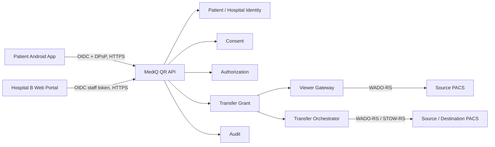

# MediQ QR Medical Image Handoff Overview

| Field | Value |
|---|---|
| Document ID | MEDIQ-QR-OVR-001 |
| Document Title | QR Medical Image Handoff Overview |
| Version | 0.1.0 |
| Status | PROPOSED — CAPSTONE-P1 Design Baseline |
| Owner | MediQ Architecture & Security |
| Related Documents | `CAPSTONE-MVP-BOUNDARY.md`, `MOBILE-APPLICATION-REQUIREMENTS.md`, `DOMAIN-MODEL.md`, `DATA-MODEL.md`, `OPENAPI.yaml`, `MOBILE-API-CONTRACT.md` |
| Last Updated | 2026-09-21 |

## 1. Decision summary

MediQ QR Handoff는 환자가 모바일 앱에서 특정 Study와 작업을 선택해 일회용 QR 요청을 만들고, 인증된 목적지 병원 의료진이 이를 스캔한 뒤, 환자가 확인·동의하면 기존 MediQ Authorization Chain을 통해 제한된 Transfer Grant를 발급하는 P1 기능이다.

QR은 다음 중 **Pairing Capability**로 분류한다.

- 단순 공개 식별자보다 강한 비밀성으로 취급한다.
- 인증된 병원이 요청을 한 번 claim하는 데 사용할 수 있다.
- 의료영상 Access Token, Consent 또는 Transfer Grant는 아니다.
- QR 보유만으로 환자·Study 정보 조회, 승인, Grant 발급 또는 DICOM 접근을 허용하지 않는다.

```text
QR Scan Alone
!= Patient Approval
!= Consent
!= Authorization
!= Transfer Grant
!= Transfer Completion
```

## 2. Scope classification

| Item | Classification | State |
|---|---|---|
| QR Handoff 문서 계약 | CAPSTONE-P1 | DOCUMENTED / PROPOSED |
| QR Backend/Android/Web 구현 | CAPSTONE-P1 follow-up | NOT IMPLEMENTED |
| QR Database migration | CAPSTONE-P1 follow-up | NOT IMPLEMENTED |
| P0 `OPENAPI.yaml` 변경 | Out of this design task | NOT CHANGED |
| 기존 Consent/Grant/PACS 전송 | CAPSTONE-P0 baseline | DOCUMENTED, implementation UNKNOWN |

QR P1의 미완성은 P0 성공조건을 차단하지 않는다. QR 구현은 `CAPSTONE-MVP-BOUNDARY.md`의 P1 Implementation Gate를 통과한 뒤 시작한다.

## 3. Selected profile

### 3.1 Primary flow

P1 QR MVP는 **환자 생성, 최초 유효 병원 claim** 모델을 선택한다.

```text
Patient Mobile App
  → Authenticate patient
  → Select source Study and one action
  → Create QRHandoffRequest
  → Display short-lived opaque QR

Hospital B Web Portal
  → Authenticate staff and hospital context
  → Scan QR
  → Atomically claim request

Patient Mobile App
  → Display independently verified Hospital B, actor, purpose, Study and action
  → Complete or reference matching Consent
  → Approve or reject

MediQ Backend
  → Re-evaluate Consent, Authorization, Tenant, Patient, Source, Destination, Study and action
  → Issue exactly one bound Transfer Grant
  → Allow Viewer or PACS Import through existing action APIs
```

### 3.2 Supported actions

The initial profile permits exactly one action per QR request.

| Requested action | Grant scope | Result |
|---|---|---|
| `VIEW` | `study:view` | Short-lived Viewer Session may be requested |
| `PACS_IMPORT` | `study:pacs-transfer` | Mandatory Preflight then STOW-RS may be requested |

`DOWNLOAD` and `MOBILE_EXPORT` are not part of this QR profile. Adding either requires an explicit scope decision, Consent/UI changes and negative tests. A `VIEW` approval never implies `PACS_IMPORT`.

### 3.3 Destination binding decision

Patient-created QR has no destination before scan. This conflicts with the existing P0 `ExchangeSession`, which requires `destination_hospital_id`. The selected resolution is:

1. Create a P1 `QRHandoffRequest` with patient, source hospital, Study and requested action.
2. Leave destination unset while state is `CREATED`.
3. On the first authenticated valid hospital claim, bind destination hospital/tenant/actor immutably.
4. Create the normal `ExchangeSession` using that destination.
5. Use the existing Consent, Authorization and Transfer Grant model thereafter.

The P0 `exchange_sessions` schema is not weakened and destination cannot be silently replaced after claim.

## 4. Actors and responsibilities

| Actor | Responsibilities | Must not do |
|---|---|---|
| Patient | Select Study/action, display QR, verify destination, consent, approve/reject/cancel | Treat display or scan as approval |
| Hospital B staff | Authenticate, scan and claim under verified hospital context, wait for approval | Supply trusted hospital identity in request body |
| MediQ QR service | Create opaque reference, enforce TTL/state/atomicity, minimize disclosure | Put PHI, DICOM or credentials in QR |
| Consent service | Create/version/activate/withdraw Consent evidence | Treat QR approval as implicit Consent |
| Authorization service | Produce explicit ALLOW/DENY from current context | Reuse stale approval as unconditional ALLOW |
| Grant service | Issue one scope-bound Grant and enforce expiry/revocation | Expand action, Study, recipient or destination |
| DICOM Gateway | Execute authorized QIDO/WADO/STOW operations | Accept QR reference as DICOM credential |
| Audit service | Record server-observed attempts and outcomes | Store raw QR reference, PHI, token or DICOM payload |

## 5. Trust boundaries



The browser and mobile app never receive PACS credentials or directly call PACS endpoints.

## 6. Status of existing repository capabilities

| Capability | Repository evidence | State |
|---|---|---|
| QR scope classification | Charter, MVP Boundary, Security Requirements | DOCUMENTED as P1 |
| QR bootstrap-only rule | `DATA-FLOW.md`, `SECURITY-REQUIREMENTS.md` | DOCUMENTED |
| Core Consent/Grant contract | `OPENAPI.yaml`, Domain/Data Model | DOCUMENTED |
| Mobile DPoP profile | `MOBILE-API-CONTRACT.md` | PROPOSED, NOT TESTED |
| QR API/UI/state/database | No existing detailed contract before this package | PROPOSED |
| Runtime/API/DB implementation | Placeholder repository only | UNKNOWN / NOT IMPLEMENTED |

No document in this package claims implementation or test completion.

## 7. Cross-document contract

| Contract item | Canonical decision |
|---|---|
| Resource name | `QRHandoffRequest` |
| Base path | `/api/v1/qr-handoff` |
| Patient auth | OIDC access token; registered mobile requests use the selected DPoP profile |
| Hospital auth | OIDC workforce token plus server-derived tenant/hospital/actor context |
| Status transport | Authenticated polling with `ETag`; SSE is deferred |
| QR encoding | HTTPS universal link with version and 256-bit opaque request reference |
| QR reference storage | SHA-256 hash only; raw reference is returned once |
| Claim model | First valid authenticated hospital atomically claims |
| Approval | Explicit patient decision after destination and scope display |
| Grant | Existing `TransferGrant`, bound through unique QR grant binding |
| Completion | `GRANT_ISSUED` completes QR handoff only; transfer has its own status |

## 8. Alternatives and open decisions

| Item | Decision |
|---|---|
| Hospital-generated QR scanned by patient | Alternative flow; deferred |
| Web-only patient approval | Production accessibility option; deferred |
| Manual short code instead of QR | Recovery/accessibility option; deferred |
| Patient chooses among multiple scanners | Rejected for initial profile; first valid scanner claim selected |
| Mobile Capsule direct retransmission | Out of scope; no Mobile-to-PACS STOW-RS |
| Production legal consent | PRODUCTIONIZATION; current scope is technical consent with synthetic/test data |
| Exact production TTL and rate limits | Proposed defaults require usability/security validation |

## 9. Document package

- `QR-REQUEST-API-CONTRACT.md`
- `QR-PAYLOAD-FORMAT.md`
- `QR-UI-UX-SPEC.md`
- `QR-REQUEST-STATE-MODEL.md`
- `QR-EXPIRY-AND-REPLAY-POLICY.md`
- `QR-THREAT-MODEL.md`
- `QR-TRANSFER-GRANT-BINDING.md`
- `QR-SECURITY-ACCEPTANCE-TEST.md`

## 10. Normative references

- DICOM PS3.18 Web Services: <https://dicom.nema.org/medical/dicom/current/output/chtml/part18/chapter_1.html>
- OpenAPI Specification 3.1: <https://spec.openapis.org/oas/v3.1.1.html>
- OAuth 2.0 Security BCP, RFC 9700: <https://www.rfc-editor.org/rfc/rfc9700.html>
- OAuth DPoP, RFC 9449: <https://www.rfc-editor.org/rfc/rfc9449.html>
- HTTP Semantics, RFC 9110: <https://www.rfc-editor.org/rfc/rfc9110.html>
- OWASP MASVS: <https://mas.owasp.org/MASVS/>
