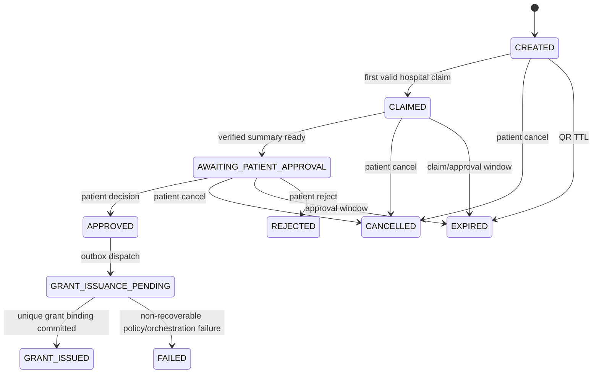

# MediQ QR Handoff Request State Model

| Field | Value |
|---|---|
| Document ID | MEDIQ-QR-STATE-001 |
| Document Title | QR Handoff Request State Model |
| Version | 0.1.0 |
| Status | PROPOSED — CAPSTONE-P1 Design Baseline |
| Owner | MediQ Architecture & Security |
| Related Documents | `QR-REQUEST-API-CONTRACT.md`, `QR-EXPIRY-AND-REPLAY-POLICY.md`, `QR-TRANSFER-GRANT-BINDING.md` |
| Last Updated | 2026-09-21 |

## 1. State separation

QR request state, Consent status, Transfer Grant status, Viewer Session status and Transfer Job status are separate state machines.

`GRANT_ISSUED` means the QR handoff completed. It does not mean that a Viewer was opened, DICOM was retrieved, STOW-RS succeeded or destination verification passed.

## 2. Canonical QR request states

| State | Meaning | Terminal |
|---|---|---:|
| `CREATED` | Patient request exists and may be displayed/scanned | No |
| `CLAIMED` | First valid hospital claim bound destination and actor | No |
| `AWAITING_PATIENT_APPROVAL` | Verified request summary is available to patient | No |
| `APPROVED` | Patient decision recorded; no Grant implied | No |
| `GRANT_ISSUANCE_PENDING` | Current policy revalidation and issuance queued/in progress | No |
| `GRANT_ISSUED` | Exactly one linked Grant issued; QR workflow complete | Yes |
| `REJECTED` | Patient explicitly rejected | Yes |
| `CANCELLED` | Patient cancelled before Grant issuance | Yes |
| `EXPIRED` | Relevant server-side time window elapsed | Yes |
| `FAILED` | Non-recoverable QR orchestration failure; no Grant issued | Yes |

`DISPLAYED` is a client UI event, not authoritative server state. `SCANNED` is an attempt/audit event; only a successful atomic claim changes state to `CLAIMED`. `COMPLETED` is not used because it would be confused with medical-image transfer completion. `REVOKED` belongs to Consent/Grant; the historical QR state remains `GRANT_ISSUED` after linked Grant revocation.

## 3. State diagram



## 4. Transition contract

| ID | Current | Actor/trigger | Guard and transaction | Next | API/audit |
|---|---|---|---|---|---|
| QR-TR-001 | none | Patient create | authenticated owner, valid Study/source/action, active-request limit | `CREATED` | create / `QR_REQUEST_CREATED` |
| QR-TR-002 | `CREATED` | Hospital claim | not expired; authenticated registered hospital; conditional update `status=CREATED` | `CLAIMED` | claim / `QR_CLAIM_SUCCEEDED` |
| QR-TR-003 | `CLAIMED` | Backend | destination-bound ExchangeSession and safe summary created | `AWAITING_PATIENT_APPROVAL` | internal / `QR_APPROVAL_REQUESTED` |
| QR-TR-004 | `AWAITING_PATIENT_APPROVAL` | Patient approve | owner, recent auth, matching active Consent, `If-Match`, not expired | `APPROVED` | approval / `QR_APPROVED` |
| QR-TR-005 | `APPROVED` | Backend outbox | immutable approval event persisted | `GRANT_ISSUANCE_PENDING` | internal / `QR_GRANT_ISSUANCE_REQUESTED` |
| QR-TR-006 | pending | Grant service | current ALLOW; exact binding; no existing binding | `GRANT_ISSUED` | internal / `GRANT_CREATED`, `QR_GRANT_ISSUED` |
| QR-TR-007 | pending | Grant service | permanent DENY or invariant failure | `FAILED` | internal / `GRANT_DENIED`, `QR_GRANT_FAILED` |
| QR-TR-008 | awaiting | Patient reject | owner, `If-Match`, not expired | `REJECTED` | rejection / `QR_REJECTED` |
| QR-TR-009 | created/claimed/awaiting | Patient cancel | owner, `If-Match`, no Grant binding | `CANCELLED` | cancellation / `QR_CANCELLED` |
| QR-TR-010 | eligible nonterminal | Server time | applicable deadline passed | `EXPIRED` | read/write sweep / `QR_EXPIRED` |

## 5. Concurrency rules

### 5.1 First scanner claim

The claim transaction uses a conditional state update or row lock:

```sql
UPDATE qr_handoff_requests
SET status = 'CLAIMED',
    destination_hospital_id = :server_hospital,
    destination_tenant_id = :server_tenant,
    claiming_actor_id = :server_actor,
    claimed_at = clock_timestamp(),
    approval_expires_at = clock_timestamp() + :approval_window,
    version = version + 1
WHERE request_ref_hash = :hash
  AND status = 'CREATED'
  AND qr_expires_at > clock_timestamp();
```

Exactly one transaction may update one row. Losers receive a safe conflict response with no patient or Study data.

### 5.2 Approval race with expiry/cancellation

Approval must conditionally update:

```text
status = AWAITING_PATIENT_APPROVAL
AND version = If-Match
AND approval_expires_at > server_now
AND cancelled_at IS NULL
```

If zero rows change, no approval evidence or Grant issuance event is created.

### 5.3 Response loss and retry

All command endpoints require `Idempotency-Key`. The server stores the authenticated actor, operation, target, canonical request hash and response. Retrying the same command returns the original result. Reuse with a different body returns `IDEMPOTENCY_CONFLICT`.

Grant issuance has a unique QR binding. A retry after response loss returns the existing Grant and does not create another.

## 6. Failure handling

| Situation | Required result |
|---|---|
| QR expires during camera scan | Claim conditional update fails; `EXPIRED`; no identity disclosure |
| Patient approves as window expires | Server serialization decides; either one valid approval or expiry, never both |
| Request cancelled during scan | Claim fails or cancellation loses according to committed order; no partial destination overwrite |
| Duplicate scan by same hospital | Idempotent replay returns existing claim to same actor/context; no new state |
| Scan by another hospital after claim | Generic conflict; no patient/Study details |
| Duplicate approval | Original decision returned for same key; different key receives terminal/conflict; no duplicate Grant |
| Grant service temporarily unavailable | Remain `GRANT_ISSUANCE_PENDING`, retry bounded by policy; do not report issued |
| Permanent policy denial after approval | `FAILED`, no Grant; show safe reason and require a new request after correction |
| Consent withdrawn after Grant | Linked Grant revoked/denied on use; QR history remains `GRANT_ISSUED` |

## 7. Transfer state relationship

```text
QR GRANT_ISSUED
      ↓
Existing action request
      ├── VIEW → ViewerSession lifecycle
      └── PACS_IMPORT → Transfer/Verification lifecycle
```

The QR request must never be updated to represent STOW-RS completion. Transfer Job state and existing ExchangeSession evidence remain authoritative.

