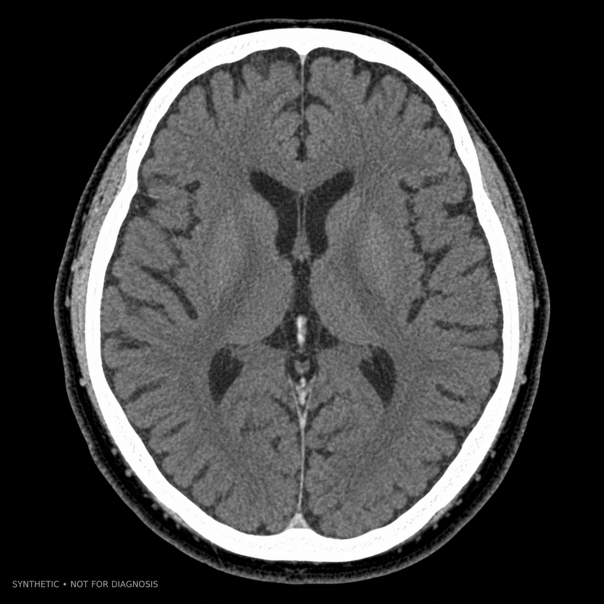
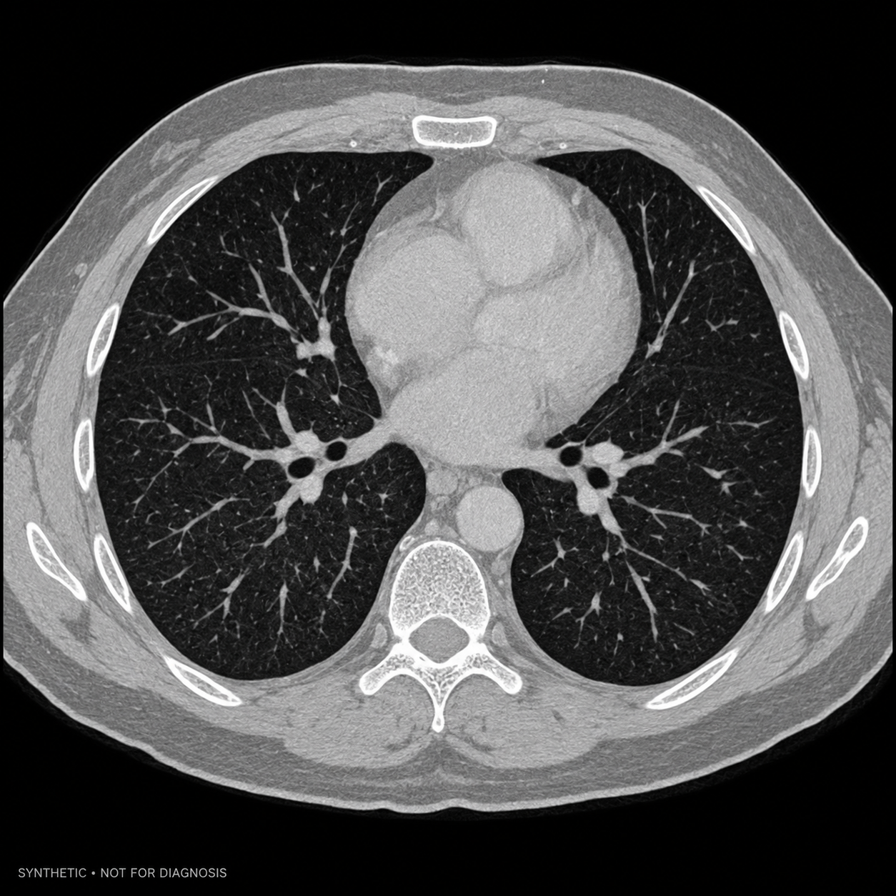
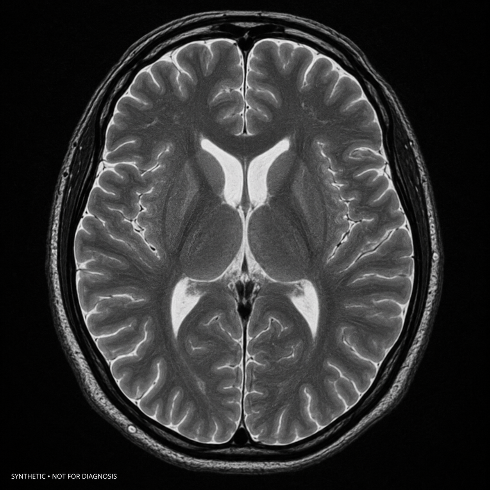

# MediQ Synthetic Medical Image Samples

MediQ Capstone 자료집, 화면설계, Viewer Mockup과 발표자료에서 사용할 수 있도록 생성한 합성 의료영상 샘플이다.

> **SYNTHETIC / NOT FOR DIAGNOSIS**  
> 아래 파일은 실제 환자 촬영자료가 아니며 진단, 판독, 알고리즘 검증 또는 DICOM 적합성 시험에 사용할 수 없다.

## Sample Set

| 파일 | Modality 표현 | View·Sequence | 용도 |
|---|---|---|---|
| `synthetic-head-ct-axial.png` | CT | 비조영 두부, axial, soft-tissue window 표현 | Patient Viewer, Study Detail, 자료집 |
| `synthetic-chest-ct-lung-window.png` | CT | 흉부, axial, lung window 표현 | PACS Viewer, 전송 시연, 자료집 |
| `synthetic-brain-mri-t2-axial.png` | MR | 뇌, axial, T2-weighted 표현 | Mobile Viewer, 비교 화면, 자료집 |

## Preview

### Synthetic Head CT



### Synthetic Chest CT



### Synthetic Brain MRI



## Usage Rules

- 화면에는 `SYNTHETIC`, `DEMO DATA` 또는 `NOT FOR DIAGNOSIS` 표시를 유지한다.
- 실제 환자 이름, 생년월일, MRN, Accession Number 또는 병원 식별자를 합성해 덧붙이지 않는다.
- 이 PNG를 실제 DICOM Instance처럼 주장하지 않는다.
- DICOMweb QIDO/WADO/STOW, Windowing, Pixel Spacing, Multi-frame, Transfer Syntax 또는 Metadata 검증에는 별도의 승인된 Sample/De-identified DICOM을 사용한다.
- 발표자료에서는 `AI-generated synthetic medical image for UI demonstration`으로 출처를 표기한다.

## Generation Specification

Built-in image generation을 사용했으며 다음 공통 조건을 적용했다.

```text
Use case: scientific-educational
Asset type: university capstone PACS/DICOM viewer and project booklet sample
Style: realistic grayscale clinical CT or MRI appearance
Subject: anatomically plausible adult anatomy without obvious pathology
Composition: one centered axial slice on a black background
Text: SYNTHETIC • NOT FOR DIAGNOSIS
Privacy: no patient, institution, accession or credential information
Avoid: diagnostic annotation, arrows, measurements, logo, color heatmap, cartoon rendering
```

개별 자산에는 각각 non-contrast head CT soft-tissue window, chest CT lung window, brain MRI T2-weighted 표현을 지정했다.

