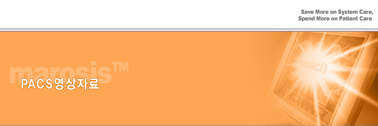

# MediQ 의료영상 CD 매체 구조 참고자료

**Project:** MediQ  
**Document Type:** Legacy DICOM Portable Media Reference  
**Version:** v1.0  
**Observation Date:** 2026-09-26  
**Status:** REFERENCE ONLY — NON-NORMATIVE / POSSIBLE PHI / DO NOT COMMIT SOURCE MEDIA  
**Source:** 사용자가 제공한 외부 이동매체의 읽기 전용 구조 조사

---

## 1. 목적

이 문서는 의료영상이 CD·DVD 같은 이동매체에 어떤 파일 구조로 기록되고, DICOM Viewer와 웹 미리보기가 어떤 방식으로 함께 제공되는지 이해하기 위한 참고자료다.

조사 대상 매체는 MediQ 구현용 Test Fixture나 승인된 Synthetic DICOM이 아니다. 실제 환자정보가 포함되어 있을 가능성이 있으므로 원본 DICOM, `DICOMDIR`, 환자 목록, 판독문 및 파생 JPEG를 저장소에 복사하지 않는다.

이 자료의 허용된 용도는 다음과 같다.

- 기존 CD 기반 의료영상 전달 방식의 구조 이해
- DICOMDIR, 원본 DICOM, 내장 Viewer, 웹 미리보기의 역할 구분
- MediQ의 디지털 Exchange 흐름과 기존 물리 매체 흐름 비교
- 향후 Synthetic/Test PDI Fixture를 새로 만들기 위한 요구사항 도출

이 자료만으로 해당 매체가 DICOM 또는 IHE PDI에 완전히 적합하다고 선언하지 않는다.

---

## 2. 취급 등급

| 항목 | 결정 |
|---|---|
| 자료 분류 | 외부 참고자료 |
| 개인정보 가능성 | 높음 — DICOMDIR, DICOM Header, Report, JPEG에 포함될 수 있음 |
| 저장소 반입 | 금지 — 원본 영상·메타데이터·환자 목록·판독문 |
| 실행 | 금지 — EXE, BAT, HTA, ActiveX, OCX, DLL을 실행하지 않음 |
| 허용 산출물 | 비식별 파일 수, 크기, 확장자, 구조, 구성요소 역할, 보안 위험 |
| MediQ Test Data 지위 | 미승인 — Synthetic/De-identified Fixture로 사용할 수 없음 |

첨부된 화면 이미지는 제품 구조 설명을 위한 비식별 UI 참고 이미지로만 저장했다.

---

## 3. 관찰된 매체 요약

읽기 전용 조사에서 다음 구조가 확인되었다.

| 구성요소 | 관찰 결과 | 역할 해석 |
|---|---|---|
| `DICOMDIR` | 396,760 bytes, `DICM` Prefix 확인 | 매체 내 DICOM 객체를 찾기 위한 디렉터리 인덱스 |
| `Storage/` | 1,461개 무확장자 파일, 1,260,176,256 bytes, 3단계 하위 디렉터리 | 원본 DICOM Part 10 객체 저장 영역으로 추정 |
| `IHE_PDI/` | 1,527개 파일, 102,522,641 bytes | 브라우저용 이미지·보고서·목록과 구형 웹 UI |
| `IHE_PDI/IMAGES/` | JPEG 중심 파생 영상 | 브라우저 미리보기용 파생본 |
| `IHE_PDI/REPORTS/` | HTML 기반 보고서 디렉터리 | 브라우저 판독문 표시 후보 |
| `IHE_PDI/WEBVIEW/` | JPEG/GIF UI 리소스 | 웹 미리보기 화면 자산 |
| `Viewer/` | 69개 파일, 51,874,750 bytes | Windows 전용 내장 DICOM Viewer와 런타임 |
| `manual/` | 28개 파일, 1,948,715 bytes | Viewer 사용 설명서 |
| 자동실행 파일 | `autorun.inf`, `autorun.bat`, `CDRun.exe`, `About.hta`, `About.htm` | CD 삽입 후 안내 화면과 Viewer 실행을 시도하는 레거시 체인 |

`DICOMDIR`에서 값 자체를 출력하지 않고 Directory Record Type 문자열만 집계한 결과는 다음과 같다.

| Record Type | 수량 |
|---|---:|
| PATIENT | 1 |
| STUDY | 30 |
| SERIES | 30 |
| IMAGE | 1,461 |

이 집계는 구조 파악용이며 환자명, 환자번호, 생년월일, Study/Series/SOP Instance UID는 수집하거나 문서화하지 않았다.

---

## 4. 매체 디렉터리 구조

실제 식별값이 될 수 있는 하위 경로명은 일반화했다.

```text
MEDIA_ROOT/
├─ DICOMDIR
├─ Storage/
│  └─ <group-1>/
│     └─ <group-2>/
│        └─ <group-3>/
│           └─ <extensionless-dicom-file>
├─ IHE_PDI/
│  ├─ IMAGES/
│  │  └─ <derived-jpeg-preview>
│  ├─ REPORTS/
│  │  └─ <browser-viewable-report>
│  ├─ WEBVIEW/
│  │  └─ <html-ui-assets>
│  ├─ PATINFO.LST
│  ├─ IMGSINFO.LST
│  ├─ PDIFRAME.HTM
│  ├─ STUDYLIST.HTM
│  ├─ DATAVIEW.HTM
│  └─ DATAVIEW.JS
├─ Viewer/
│  ├─ CDViewer.exe
│  ├─ CDLauncher.dll
│  ├─ Report.htm
│  ├─ *.dll / *.ocx
│  └─ *.mdb / runtime components
├─ manual/
├─ autorun.inf
├─ autorun.bat
├─ CDRun.exe
├─ About.hta
├─ About.htm
└─ README / icon / branding assets
```

핵심은 `DICOMDIR`과 `Storage/`다. 내장 Viewer, HTML, JPEG와 설명서는 편의 기능이며 원본 DICOM 객체를 대체하지 않는다.

---

## 5. 관찰된 조회 경로

### 5.1 표준 DICOM Media Reader 경로

```text
DICOMDIR 읽기
  → PATIENT / STUDY / SERIES / IMAGE Directory Record 탐색
  → Referenced File ID 해석
  → Storage 하위 DICOM Part 10 파일 열기
  → Viewer 표시 또는 PACS Import
```

이 경로에서는 내장 `CDViewer.exe`가 없어도 DICOMDIR와 원본 DICOM을 읽을 수 있는 호환 Viewer 또는 PACS Importer가 있으면 된다.

### 5.2 레거시 Windows 자동실행 경로

제공된 `ReadMe.txt`, `autorun.inf`, `autorun.bat`, `About.hta`, `About.htm`의 정적 분석 결과를 연결하면 다음 순서다.

```text
autorun.inf
  → CDRun.exe /autorun
  → About.hta
  → About.htm
  → ActiveX CDLauncher.CDViewer
  → Viewer/CDViewer.exe
```

수동 대체 경로는 `autorun.bat`에서 `CDRun.exe /autorun`을 호출하는 방식이다. 현대 Windows에서는 AutoRun, HTA, ActiveX, OCX 등록과 구형 런타임 의존성 때문에 정상 동작하지 않거나 보안정책에 의해 차단될 수 있다.

### 5.3 웹 미리보기 경로

정적 JavaScript 참조를 기준으로 다음 흐름이 확인된다.

```text
About.htm
  → IHE_PDI/PATINFO.LST
  → IHE_PDI/PDIFRAME.HTM
  → IHE_PDI/IMGSINFO.LST
  → IHE_PDI/IMAGES/<derived JPEG>
  └─ IHE_PDI/REPORTS/<browser report>
```

`DATAVIEW.JS`는 JPEG 미리보기, 페이지 레이아웃, 확대 창, 보고서 창과 `Storage/` 위치를 연결한다. 이 웹 경로는 편의용 파생 표현이며 진단 원본 또는 DICOM 무결성 검증 근거로 사용하면 안 된다.

---

## 6. 화면 참고자료

### 6.1 레거시 PACS CD 안내 배너



### 6.2 메뉴와 제조사 표시

| 제조사 표시 | 주의사항 메뉴 | 영상조회 메뉴 |
|---|---|---|
|  |  |  |

이 이미지는 레거시 Viewer 진입 화면의 시각 참고자료다. MediQ UI 기준선이나 브랜드 자산으로 사용하지 않는다.

---

## 7. DICOM·IHE PDI 관점의 해석

DICOM PS3.10은 이동매체에서 의료영상과 관련 정보를 교환하기 위한 DICOM File Format, File Service, DICOMDIR와 Media Storage Model을 정의한다. DICOMDIR는 매체 루트에서 File-set의 객체를 참조하는 디렉터리 역할을 한다.

IHE Radiology Portable Data for Imaging(PDI)은 DICOM 기반 이미지·진단보고서의 이동매체 교환, Web Content Option, Basic Viewer Option 및 수신 시스템의 Import·Display·Print 목적을 정의한다.

관찰된 매체는 다음 이유로 IHE PDI 계열 구조와 유사하다.

- 루트에 `DICOMDIR`가 있다.
- 원본 DICOM으로 추정되는 별도 `Storage/` 영역이 있다.
- DICOM에서 파생된 JPEG와 HTML 보고서를 제공하는 웹 콘텐츠 영역이 있다.
- PACS가 없는 PC에서도 열람하도록 Windows Viewer가 함께 들어 있다.

그러나 다음 검증이 없으므로 **IHE PDI 준수 매체라고 확정하지 않는다.**

- DICOM Conformance Statement 또는 IHE Integration Statement 미확인
- 전체 Referenced File ID와 실제 파일의 일치 검증 미수행
- Transfer Syntax, SOP Class, File Meta, 필수 Directory Key 검증 미수행
- Web Content Option과 Basic Viewer Option의 정식 적합성 시험 미수행
- 개인정보보호·암호화 Option 적용 여부 미확인

---

## 8. 보안 및 개인정보 위험

| 위험 | 설명 | MediQ 처리 원칙 |
|---|---|---|
| DICOM Header PHI | 환자명, 환자번호, 생년월일, 기관명 등이 포함될 수 있음 | 원본 반입 금지, 합성 Fixture 재생성 |
| DICOMDIR PHI | Directory Record에 환자·검사 메타데이터가 포함될 수 있음 | 식별값을 출력·문서화하지 않음 |
| 파생 JPEG 중복 | 영상 픽셀과 오버레이에 식별정보가 남을 수 있음 | 웹 미리보기 파일도 PHI 후보로 취급 |
| HTML Report PHI | 판독문과 환자정보가 포함될 수 있음 | REPORTS 내용 수집 금지 |
| 레거시 실행 파일 | AutoRun, HTA, ActiveX, OCX, bundled EXE/DLL은 공급망·호환성 위험 | 실행 금지, 정적 구조만 참고 |
| 암호화 불명 | 파일명과 구조만으로 암호화 적용 여부를 증명할 수 없음 | 보호됨이라고 주장하지 않음 |
| 무결성 불명 | 매체 전체 서명이나 Manifest가 관찰되지 않음 | Synthetic Fixture에 SHA-256 Manifest 추가 검토 |
| 목적 외 사용 | 실제 매체를 테스트 서버에 Import하면 PHI가 확산될 수 있음 | Test Orthanc 반입 금지 |

---

## 9. MediQ에 적용할 참고사항

이 매체는 MediQ가 대체하려는 기존 오프라인 흐름을 구체화하는 비교 기준으로 사용한다.

| 기존 CD 매체 | MediQ 대응 개념 |
|---|---|
| `DICOMDIR`에서 Study 탐색 | 승인된 QIDO-RS Study/Series 탐색 |
| `Storage/`에서 원본 파일 읽기 | Source PACS WADO-RS 온디맨드 검색 |
| 내장 Viewer로 로컬 표시 | Viewer Gateway + short-lived Viewer Session |
| CD를 Hospital B에 직접 운반 | 환자 승인 기반 Exchange와 Scoped Grant |
| Hospital B에서 수동 Import | Mandatory Preflight 후 STOW-RS Import |
| 수신 여부를 사람이 확인 | Destination QIDO-RS Verification |
| CD 분실·복제 위험 | Audit, provenance, expiry, tenant/action binding |

보존해야 할 업무 의미는 다음과 같다.

- 환자·Study 선택
- 목적지 병원 확인
- 원본 DICOM과 파생 미리보기 구분
- 수신기관 Import와 환자 식별자 조정
- 전달 완료 여부 확인

재사용하지 않을 구현 요소는 다음과 같다.

- AutoRun
- HTA와 ActiveX
- 서명 여부를 알 수 없는 EXE/DLL/OCX
- Microsoft Jet/MDB 기반 로컬 상태
- JPEG 파생본을 원본으로 취급하는 방식
- 실제 매체의 환자정보나 DICOM 객체

---

## 10. Synthetic PDI Fixture 권고안

MediQ에서 CD 구조를 시험해야 할 경우 기존 매체를 복제하지 않고 다음 Fixture를 새로 생성한다.

```text
TEST-PDI-001/
├─ DICOMDIR
├─ DICOM/
│  └─ TESTCT01 ... TESTCT10
├─ README.TXT
└─ MANIFEST.SHA256
```

최소 조건은 다음과 같다.

- Synthetic Patient 1명
- Classic single-frame CT Study 1건
- Series 1건
- Instance 10개 내외
- Explicit VR Little Endian
- 환자명과 ID는 `TEST-*` 규칙 사용
- 실제 기관명, 실제 Accession Number, 실제 UID 재사용 금지
- DICOMDIR의 모든 Referenced File ID 검증
- 파일별 SHA-256 Manifest 생성
- Test Orthanc Import 전 Header Allowlist 검사
- P0 DICOMweb Golden Path와 별도 시험으로 분리

이 Fixture는 `CAPSTONE-P1` 또는 별도 Interoperability Spike로 분류하는 것을 권고한다. MediQ P0의 핵심 성공조건은 CD Import가 아니라 Hospital A Test Orthanc에서 Hospital B Test Orthanc까지의 DICOMweb Golden Path다.

---

## 11. 결론

이 예시 매체는 다음 네 층으로 이해할 수 있다.

```text
1. Index       DICOMDIR
2. Source Data Storage의 원본 DICOM 객체
3. Convenience IHE_PDI의 JPEG/HTML/Report
4. Runtime     Viewer와 AutoRun 실행 구성요소
```

MediQ는 이 구조를 그대로 클라우드에 복제하지 않는다. `DICOMDIR + CD 운반 + 내장 Viewer`가 수행하던 업무 의미를 `QIDO-RS + WADO-RS + Viewer Session + STOW-RS + Destination Verification`으로 전환하는 데 참고한다.

---

## 12. 근거

### 12.1 로컬 정적 조사

- 외부 매체 루트 파일·폴더 목록
- `ReadMe.txt`, `autorun.inf`, `autorun.bat`, `About.hta`, `About.htm`
- `IHE_PDI` 및 `Viewer`의 파일 유형과 정적 참조
- `DICOMDIR`의 `DICM` Prefix 및 Directory Record Type 비식별 집계

### 12.2 공식 기술자료

- [DICOM PS3.10 — Media Storage and File Format for Media Interchange](https://dicom.nema.org/medical/dicom/current/output/html/part10.html)
- [IHE Radiology Technical Framework Volume 1 — Portable Data for Imaging](https://www.ihe.net/uploadedFiles/Documents/Radiology/IHE_RAD_TF_Vol1.pdf)

